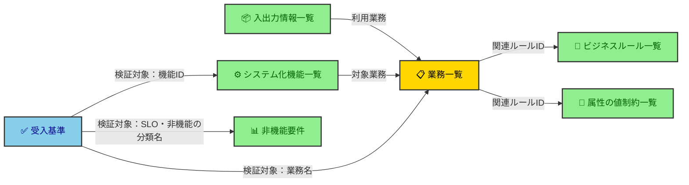

# 要件定義書の構成

良い要件定義書とは何か（What/How の切り分け・出所ラベル・オープンクエスチョンに書いてよいもの等の**立場**）は [requirements-doc-policy.md](../../docs/policy/requirements-doc-policy.md) が定める。ここでは、それを踏まえた**構成の書き方（How）**——必須項目・列定義・ID体系・詳細トグルの記法——だけを定める。

## 対象読者

AIエージェントが、要件定義書（`docs/requirements.md`）を書く・レビューし、含める項目・列の定義・ID体系・詳細トグルの記法に迷ったとき。

## 表は幅で潰さない（記法）

「詳細の置き場を詳細トグルに固定する」「表から出す項目を表ごとに名指しする」という立場は [requirements-doc-policy.md「表は幅で潰さない」](../../docs/policy/requirements-doc-policy.md#表は幅で潰さない)が定める。ここでは記法だけを定める。

### 詳細トグルの記法

記法は Rule document-writing-for-humans.md「トグルの記法」に従う。要件定義書はそこに次を上乗せする。

- `summary` は `ID 名前`。`ID` を持たない表では行の識別語（項目名・用語名）を書く。表には `ID`（または識別語）が残るので、読み手はそこから詳細を引ける。
- 詳細は表と同じ `ID` 順に並べる。

トグルは GitHub 等での閲覧を前提とする。要件定義書を PDF・印刷で渡す必要が生じたら、`
` を `
` へ一括置換して全開で出力する。

### 詳細トグルは2種類ある

どの行に詳細を作るかは、次のどちらの型かで決まる。**「長くなりそうか」を書き手に判定させない**——refined-engineer-judgment-principles の「判断軸は『既定値＋反転条件』で与える」のとおり、内心の評価を条件にしたゲートは働かないからである。だから型ごとに、既定値と、それが反転する外形的な条件を決める。

| 型         | 中身                                           | どの行に付くか                                                 | 例                             |
| ---------- | ---------------------------------------------- | -------------------------------------------------------------- | ------------------------------ |
| **本文型** | 表から外した必須項目。下表が表ごとに名指しする | その表の**全行**（例外なし）                                   | ビジネスルール一覧のルール本文 |
| **補足型** | 列に書けない根拠・補足                         | 既定は付けない。**列の記述だけでは読み取れない**行にだけ付ける | 属性の値制約一覧の値制約の根拠 |

1行に両方あるなら、1つのトグルにまとめる。

### どの表のどの項目を詳細へ出すか

- **業務一覧**：`区分の理由`
- **ビジネスルール一覧**：ルール本文
- **属性の値制約一覧**：なし（補足型だけを置く）
- **入出力情報一覧**：`内容`・`取扱量`・`頻度`・`利用目的`
- **システム化機能一覧**：`優先度の理由`
- **機能仕様**：`適用ルール`・`事後条件`・`主要な例外`

ここに無い表は本文型を持たない（列が少なく各セルも短いため）。補足型はどの表にも置いてよい。

**追跡列は本文型に選ばない。**「相互参照（トレーサビリティ）」が名指しする追跡列——業務一覧の `関連ルールID`、入出力情報一覧の `利用業務`、システム化機能一覧の `対象業務`、受入基準の `検証対象`——は、上の名指しから外す。表を索引として引くとき、どの業務・どのルールに紐づくかが表の上で完結している必要があるためである。

**属性の値制約一覧だけは列を外さない。** この表の各列は制約値そのもの（桁・形式・取りうる値）で短い。加えて1列1項目に割り当てておくと、書き手が全項目を1つずつ埋めることを強いられる（該当しなければ `なし` と書く）。1つのセルに畳むと、この強制が消えて考えなかった項目が自由文に埋もれる。

## 要件定義書の構成（必須項目と記述基準）

要件定義書（PRD）に含める項目と、各項目に何を書くかを定める。`/elicit-requirements` はこの構成に従って `docs/requirements.md` を書き、レビューはこの構成を基準に検証する。**構成の唯一の正典はこの節**であり、他の文書で再列挙しない。

版数・作成者・承認ステータスは本文に持たない。git 履歴と Issue で追跡する（documentation-policy：進捗・経過・状態は本文に書かない）。

各項目には区分を付す。

| 区分     | 意味                                                                 | 該当しないとき                     |
| -------- | -------------------------------------------------------------------- | ---------------------------------- |
| 必須     | 常に書く                                                             | —                                  |
| 条件付き | ある事実があるときだけ必須（例：外部連携があればエコシステムマップ） | 「該当なし・理由：〇〇」と明記する |
| 任意     | 書くかを書き手が判断する                                             | 書かなくてよい                     |

**条件付きの項目は、必須項目を書き終えたあとに該当有無を判定する。** 判定に使う入力——どの表のどの列を見るか——は各項目の節に書く。書き手の主観（重要そうか）で決めてはならない。必須項目を書き上げた時点で満足し、条件付きを黙って落とすからである。

### 項目一覧

| 項目                     | 区分                                                           | 何を書くか                                                                                                                                                |
| ------------------------ | -------------------------------------------------------------- | --------------------------------------------------------------------------------------------------------------------------------------------------------- |
| 概要                     | 必須                                                           | 何を作るのかを1文1行で、改行して3行以内に言い切る（1段落にまとめない）。なぜ作るのかは「目的」「解決する課題」に書く                                      |
| 目的                     | 必須                                                           | 達成したいことを一文で言い切る。最重要。一文に「〜と〜」が並ぶなら目的が割れているサイン——分割を疑う                                                      |
| 背景・入力元             | 必須                                                           | もとにした RFC 等への参照（何を根拠にしたか）                                                                                                             |
| 用語定義                 | 必須                                                           | この文書固有の用語だけ定義する。全社共通語は用語集（[../../docs/project-context/glossary.md](../../docs/project-context/glossary.md)）へリンクする（DRY） |
| ターゲットユーザー       | 必須                                                           | 開発対象を使う人を役割（職種・立場）で列挙し、役割ごとに何のために使うかを添える                                                                          |
| ステークホルダー／関係者 | 必須                                                           | 意思決定者・承認者・利用部門など。「使う人」と「決める人・責任を負う人」を区別する                                                                        |
| エコシステムマップ       | 条件付き：外部アクター・外部システムとの授受があるとき         | 開発対象を黒箱として置き、外部との関係と授受を1枚で俯瞰する概念図 → [詳細](#エコシステムマップ)                                                           |
| 解決する課題             | 必須                                                           | 「誰の」「どんな困りごと」を解くのか。具体的に書く                                                                                                        |
| 業務要件                 | 必須                                                           | 開発対象が支える業務を、システムに依存しない What として構造化する → [詳細](#業務要件)                                                                    |
| 機能要件                 | 必須                                                           | システムが担う機能と、その振る舞い → [詳細](#機能要件)                                                                                                    |
| 非機能要件               | 必須                                                           | 品質特性ごとの要求を What として書き、観測可能なものを指標にする → [詳細](#非機能要件)                                                                    |
| 優先順位                 | 必須                                                           | 各要件に優先度と、その理由を付ける → [詳細](#優先順位)                                                                                                    |
| 依存関係（Dependencies） | 条件付き：他システム・他チーム・外部サービスへの依存があるとき | 自分たちだけでは完了の可否・時期を決められない事項 → [詳細](#依存関係dependencies)                                                                        |
| 制約と前提               | 必須                                                           | 列は `制約内容` / `判定`（`真の制約` / `見直し可能` / `保留`）/ `判定理由`。制約を再判定した理由はここに書く                                              |
| スコープ外（Non-Goals）  | 必須                                                           | やらないことを、区分と出所ラベル付きで列挙する → [詳細](#スコープ外non-goals)                                                                             |
| 受入基準                 | 必須                                                           | 要件が満たせたと判断できる観測可能な条件 → [詳細](#受入基準)                                                                                              |
| リスクと対応             | 必須                                                           | 想定されるリスクと緩和策 → [詳細](#リスクと対応)                                                                                                          |
| オープンクエスチョン     | 必須                                                           | 未決事項と、その解決の相手・解消期限 → [詳細](#オープンクエスチョン)                                                                                      |

全項目に共通するルール：

- 図はすべて `/design-doc-mermaid` で作成する（自前で Mermaid を書き起こさない）。どの項目に図が要るかは各項目の区分に従う。
- 対話の経緯は本文に持ち込まない。要件そのものに紐づく根拠——制約を再判定した理由など——だけを「制約と前提」の判定理由に残す。

### 相互参照（トレーサビリティ）

要件定義書のどの表にも課す横断ルールである。

- 各表を孤立させない。ただし**独立した相互参照表は作らず、各表に追跡列を持たせて担保する**。列で追えるものを別表に再掲すると二重管理になるため。
- 追跡列：業務一覧に「関連ルールID」、入出力情報一覧に「利用業務」、システム化機能一覧に「対象業務（または業務維持／基盤）」、受入基準に「検証対象」。
- これにより要件から後工程（Issue・テスト・データモデル）まで一貫してたどれる。

### エコシステムマップ

開発対象を1つの黒箱として中央に置き、取り巻く外部アクター（ユーザー・関係組織・外部サービス）との関係と授受（データ・価値）を1枚で俯瞰する。スコープ境界の明確化・影響範囲のモレ防止・非エンジニアとの共通言語を担う。

**該当の判定**：入出力情報一覧の `送り手` / `受け手` 列を1行ずつ見る。開発対象システム以外の名前が1つでもあれば該当する。

- **黒箱を守る** — 外部との関係だけを描く。内部構造・製品名・技術名は描かない（描き始めたら How なので設計側の責務）。
- **凡例を必ず添える**
  - ノードの色等で「開発範囲（内）／外部（外）」を示し、スコープ境界を可視化する。
  - 線種（実線・点線）を使うなら意味を定義する（使わないなら統一する）。
  - 凡例は図の直下に Note（テキスト）で添える（Mermaid に凡例構文がないため）。図中に `subgraph 凡例` を置く方式でもよいが、本文 Note を既定とする。
- **粒度は関係レベルで止める** — 「誰と誰が何をやり取りするか」まで。プロセス→データストアへ分解しない（DFD 化すると非エンジニア可読性が崩れる）。
- **属性は持たせない** — ターゲットユーザー／ステークホルダー／依存関係の各リストが持つ属性とは重複させず、マップは関係と境界だけを持つ（同じ事実を二重管理しない）。

### 業務要件

- 必須：業務一覧、ビジネスルール一覧、属性の値制約一覧、入出力情報一覧
- 任意：業務フロー図

全サブ項目に共通する線引きは **How に降りないこと**。業務用語で書き、画面・テーブル・処理方式・製品名は書かない（それらは設計側の責務）。

#### 業務一覧

- 支える業務を大分類／中分類／小分類で洗い出す。
- 列：`大分類` / `中分類` / `小分類` / `概要` / `システム化区分`（システム化／手動／一部）/ `関連ルールID`。**`区分の理由` は列に持たず、詳細トグルに書く**（「表は幅で潰さない」）。
- 手動業務も残す。どこまでをシステム化し、どれを手動で残すかがスコープ境界を定義するため。
- 理由（なぜシステム化するか／なぜ手動で残すか）は、スコープの線引きが妥当かを後から検証する根拠になる（documentation-policy「なぜを書く」）。
- 粒度は「人がやること」。画面一覧に化けさせない。

#### ビジネスルール一覧

- 業務が従う判断・計算・定義のルールを、ID を振って列挙する。
- 列：`ID`（`BR-01` 形式）/ `ルール名` / `タイプ` / `関連ルール` / `出所`（「出所ラベル」節）。
- **ルール本文は表に置かない。** 表は索引として ID・名前・タイプ・関連・出所だけを持ち、本文は1ルール1つの詳細トグル（`
BR-01 付与率
`）に書く（「表は幅で潰さない」）。トグルは表の直後に、表と同じ ID 順で並べる。
- **属性の値制約はこの表に書かない。**[属性の値制約一覧](#属性の値制約一覧)が持つ。
- タイプは `行動`（人の行動を義務・禁止・条件づける）と `定義づけ`（分類方法・計算式を定める）に限る。
- タイプごとに、**ルール本文へ**書く項目が決まっている。下の項目が1つでも欠けていたら未完成とする。

`行動` の必須項目：

- **主体**：誰（またはどのシステム）の行動を縛るか
- **条件**：どんな場合に効くか
- **義務／禁止と対象行為**：何をしなければならない／してはならないか

`定義づけ` の必須項目（種類ごとに決まる）：

- **計算式**：式・端数処理・境界値（具体値まで）
- **分類・区分**：取りうる値の一覧／多重度（0個を許すか・上限は1つか複数か）／排他か重複可か
- **関係（AがBを持つ）**：多重度を両方向で（1対1／1対多／多対多）

- 具体値まで書くのは、そのままテスト・バリデーションの種になるため。
- **該当しない必須項目も省かず書き切る**（条件が無いなら「常に」、端数処理が生じないなら「なし」）。省くと、書き忘れたのか該当しないのかを読み手が区別できない。
- **多重度は、書かなくても文が成立してしまうので必ず名指しで確認する。** 「店舗は分類を持つ」は一読すると通ってしまうが、1つだけか複数かで作るものもテストも変わる。
- 違反したときの扱い（拒否・エラー返却・保留）はここに書かない。機能仕様の「主要な例外」が持つ（二重管理しない）。

**あるべきルールの不在の判定**：書かれたルールの不備と違い、**ルールが無いことは読んでも目に入らない**。書き手の「重要そうか」に任せず、[入出力情報一覧](#入出力情報一覧) の `内容` から次を1つずつ拾い、対応するルールを引く。無ければ違反。

| `内容` から拾うもの       | 引くルール       | 引く先             |
| ------------------------- | ---------------- | ------------------ |
| 属性                      | その属性の値制約 | 属性の値制約一覧   |
| 1件が別の情報を何件含むか | その関係の多重度 | ビジネスルール一覧 |

**制約が思いつかない属性も飛ばさない。** 必須/任意は必ず決まるので、ルールが1行も無い属性は「まだ検討していない」のと同じである。

#### 属性の値制約一覧

入出力情報一覧の `内容` に現れる属性1つにつき1行を立て、その値制約を書く。

- 列：`ID`（`AC-01` 形式）/ `属性名` / `取りうる値` / `必須・任意` / `桁` / `形式` / `関連ルール` / `出所`（「出所ラベル」節）。
- **必須項目を1列ずつに割り当てる。** 1つのセルに畳むと、行が属性の数だけ増えたときに読めなくなり、空欄＝書き忘れも自由文に埋もれて誰も検知できない。
- **該当しない列にも「なし」と書く**（桁の概念が無い区分値なら `なし`）。空欄にすると書き忘れと区別できない。
- `必須・任意` は「何1件につきいくつか」まで書く（例：`必須（購入確定1件につき1つ）`）。多重度は書かなくても文が成立してしまうため。
- ID は `AC-` 接頭辞で振り、ビジネスルール一覧の `BR-` と体系を分ける。表をまたいで採番を突き合わせずに済み、参照側は ID だけでどちらの表を引くか分かる。機能仕様の `適用ルール`・業務一覧の `関連ルールID` は、どちらの体系の ID も引ける。
- 業務・外部が課す制約だけを書く。カラム幅などの実装都合は書かない（設計側の責務）。
- 違反したときの扱いは書かない（ビジネスルール一覧と同じく、機能仕様の「主要な例外」が持つ）。
- **列に書けない補足は、表の直後の詳細トグルに書く。表に列を足してはならない。** 中身は根拠（なぜその値なのか）に限らない——他の属性との関係、外部仕様の引き写しであることなど、列の記述だけでは読み取れないことを書いてよい。補足型なので全属性には要らない（「表は幅で潰さない」）。

補足に場所を用意するのは、**用意しないと既存の列へ押し込まれる**からである。`取りうる値` に「〜だからこの上限にした」と理由が混ざると、列が横に伸びて表が読めなくなる。

なぜビジネスルール一覧と分けるか：この表の行数は**属性の数に比例して機械的に増える**（実案件では数百行）。判断・計算のルールと同居させると、人が読むべきルールが定型行の海に埋もれる。増え方の違う2つを1つの表に置かない。

#### 入出力情報一覧

- 業務が扱う情報を列挙する。列：`ID`（`IO-01` 形式）/ `情報名` / `入出力区分` / `送り手` / `受け手` / `利用業務` / `出所`（「出所ラベル」節）。`備考` は置かない——出所ラベルは `出所` 列が持ち、ほかに書くべきことは各列か詳細トグルが持つ。
- **`内容`・`取扱量`・`頻度`・`利用目的` は列に持たず、1情報1つの詳細トグルに書く**（「表は幅で潰さない」）。この4項目は情報1件あたりの記述量が最も膨らみ、列に置くと表が縦に潰れる。
- 入出力区分は開発対象システムを主語に判定する（システムが受け取る＝入力、システムが出す＝出力）。
- **送り手・受け手を必ず明記する**。区分だけでは主体が読み取れないため。
- `ID` は受入基準・機能仕様から参照する（トレーサビリティ）。
- 情報名は**業務用語**に留め、テーブル・カラム・物理名に降りない。
- **`内容` は属性名まで列挙する。**「購入情報」のような括りで止めない。ここが属性の唯一の入り口なので、粗く書くとビジネスルールの不在を誰も検知できなくなる。詳細トグルに置くので、属性が増えても表は潰れない。
- 属性の値制約（桁・型・取りうる値等）はカラム仕様として書かず、属性の値制約一覧へ回す。情報どうしの関係（1件が別の情報を何件含むか等）はビジネスルール一覧の `定義づけ` へ回し、多重度まで書く。
- 取扱量・頻度は数値で書く（「顧客の『要望』を『測定可能な前提条件』に翻訳して明記する」）。例外は、発生が事象に従属して読めないもの（障害通知・利用者の任意操作 等）だけで、このときは数値の代わりに発生契機（例：`異常時のみ`・`随時`）を書く。
- **例外は項目ごとに適用する。** 読める項目は数値で書き、読めない項目だけ発生契機にする（例：利用者の任意操作は件数が読めるので取扱量は数値、周期は読めないので頻度は `随時`）。両方をまとめて例外にすると、読める情報まで落として要件の測定可能性を下げる。
- 外部システムとの授受は、送り手／受け手にその相手を記すに留める。関係・境界はエコシステムマップ、外部依存の追跡は依存関係が持つ（二重管理しない）。
- **（可視化・推奨）** システム視点の IPO 図（入力→システム→出力）を添え、IO-ID で表と対応づける。表だけでは情報の流れが掴みにくいため。図＝流れ・表＝授受の相手・詳細トグル＝中身で分担し、エコシステムマップ（全体の関係・境界を放射状に描く）とは切り口を変えて同じ矢印を二重管理しない。

#### 業務フロー図

- 業務一覧だけでは流れが掴みにくいときに描く。
- 業務の流れ（誰が・何を判断し・次に何をするか）をアクター視点で描く。
- **システム内部の処理フロー／コンポーネント間シーケンスは描かない**（描いたら How）。

### 機能要件

**機能要件は表と図の両方で書く。** 機能要件はプロジェクト固有性が高く、読み手はそのシステムを知らない状態で読み始めるので、表だけでは頭に入らない。非機能要件はどのプロジェクトでも似た話なので表だけでよく、この決まりは機能要件にだけ効く。

表と図は役割を分ける。**表＝各機能の属性を正確に引く／図＝機能どうし・アクターとの関係を一目で掴む。** 同じ事実が両方に載ってよい（「メンテナンス性より理解しやすさを優先する」）。

サブ項目は次の順に並べる。**「誰が何をできるか」を、機能ごとの詳細より先に見せる**ためである。

1. システム化機能一覧（必須）
2. アクター×機能図（必須）
3. 機能仕様（ユースケース記述）（必須）
4. 機能×入出力×ルール図（必須）
5. 機能ごとのアクティビティ図（条件付き：分岐・ループ・並行を持つ機能があるとき）
6. 状態遷移（条件付き：対象エンティティにライフサイクルがあるとき）

#### システム化機能一覧

- システムが担う機能（capability）を列挙する。
- 列：`機能ID` / `機能名` / `対象業務` / `優先度`。**`優先度の理由`（「優先順位」節）は列に持たず、詳細トグルに書く**（「表は幅で潰さない」）。
- `機能ID` は機能仕様・受入基準から参照される識別子なので、他の列で代用しない。
- ユーザーが直接使う機能に加え、**直接は使わないが業務維持に必要な基盤機能（バックアップ・監視・データ連携など）も含める**。
- 各機能は、業務一覧のどの業務のためかを紐づける。
- 業務に1対1で紐づかない基盤機能は「業務維持／基盤」とし、対応する非機能要件（可用性・RPO/RTO 等）とセットにする。
- 機能名は capability に留め、製品名・実現方式は書かない（What/How の切り分け）。

#### アクター×機能図

**誰が何をできるか**を1枚で示す。機能仕様の表もアクター列を持つが、機能ごとに縦に並ぶので「このアクターは何ができるのか」を引けない。読み手が最初に知りたいのはそこなので、機能ごとの詳細に入る前にこの図を置く。

- アクターを外側、機能をシステム境界の内側に置き、線で結ぶ。
- **起動アクターと受益アクターを線種で区別する**。起動＝システムに要求を出す主体、受益＝結果を受け取る主体。区別しないと、外部システム（POS・EC）だけがアクターに見え、その裏にいる人間（会員など）が図から消える。
- 凡例を図の直下に Note で添える（線種の意味・システム境界の色）。
- 機能は ID と機能名で書く（`F-01 ポイント付与`）。振る舞いは書かない（表が持つ）。

#### 機能仕様（ユースケース記述）

- **システム化機能一覧の全機能について**、UI に依存しない振る舞いを書く。
- 重要な一部だけを抜き出さない。抜き出す基準は主観的でモレを生むため。機能ごとに変わるのは「アクティビティ図を添えるか否か」だけ。
- 列：`機能ID` / `アクター` / `トリガー`（ユーザー・他システム・スケジューラ）/ `入力` / `出力`。**`適用ルール`（その機能が従うビジネスルール）・`事後条件`・`主要な例外` は列に持たず、1機能1つの詳細トグルに書く**（「表は幅で潰さない」）。
- **「何を達成するか」を論理レベルで書き、画面・操作手順・帳票レイアウトは書かない**（How）。
- 入力／出力の中身は入出力情報一覧、判断／計算はビジネスルール一覧を ID で参照する。**`入力`・`出力` 列に書けるのは入出力情報一覧に実在する ID だけ**で、外部から来ない入力（内部データ・スケジューラ起動）も先に入出力情報一覧へ登録して ID を採る。一覧に載らない入力は、データ量・頻度・送り手／受け手が決まらないまま設計へ流れるためである。
- 画面のないシステム（バッチ・API）も同じ型で書ける（アクター＝スケジューラ／他システム、出力＝ファイル／レスポンス）。
- **表（＋詳細トグル）で書く**。機能一覧との対応・ID 参照を担うため、機能ごとに1行・1トグルを立てる。

#### 機能×入出力×ルール図

**何が入り、どのルールに従い、何が出るか**を1枚で示す。機能仕様は入力・適用ルール・出力を ID の羅列で持つため、ID を目で追わないと繋がりが見えない。その参照の網を図にする。

- 左＝入力（IO-ID）、中央＝機能（F-ID、`適用ルール` の ID を併記）、右＝出力（IO-ID）の3列に置く。
- 外部から来ない入力（内部データ・スケジューラ起動）も左端に置き、入力元を空欄にしない。
- 例外時の出力（異常通知など）も線を引く。機能仕様の「主要な例外」と対応させる。
- 入出力情報一覧の IPO 図とは切り口が違う（IPO 図＝システム全体の入出力、この図＝機能ごとの入出力とルール）。重なってよい。

#### 機能ごとのアクティビティ図

**該当の判定**：機能仕様を書き終えたら、「主要な例外」を1機能ずつ見て要否を判定する。

- 描く：分岐が2つ以上ある、再送・リトライ・繰り返しがある（ループ）、並行して進む処理がある
- 描かない：例外が1つだけ（正常系と例外の2分岐）

例外が1つだけなら「主要な例外」の文章で書き切れる。一直線の処理を箱に並べても、文章以上のことは分からない。逆に分岐が2つ以上あると、文章ではどの条件でどこへ進むか・どこへ戻るかが書けない。

- **図は1機能1つの詳細トグルに畳む**（`summary` は `F-01（ポイント付与）— 受付判定と付与` のように機能 ID と図の主題）。記法は「詳細トグルの記法」に従う。機能内部の手順は、その機能を追う読み手だけが要る詳細だからである。開いたまま全機能分を並べると、機能要件の他の記述が図に埋もれ、全体像を掴めなくなる。

#### 図に共通するルール

- **システム内部の構造に降りない**。描くのはアクター・機能・入出力・業務ルールという論理レベルまでで、コンポーネント・モジュール・テーブルは描かない（How）。
- シーケンス図を使う場合も論理アクター間に留める。

#### 状態遷移

**該当の判定**：機能仕様の `事後条件` を1機能ずつ見て、同じ対象（注文・会員など）の状態が2つ以上の機能で変わっているかを見る。変わっていれば、その対象にライフサイクルがあるので該当する。

- 状態と遷移条件を書く（例：注文＝受付→発送→完了）。

### 非機能要件

- 品質特性ごとの要求を What として書く。
- **[非機能要件の項目カタログ](../../docs/reference/non-functional-requirement-items.md)が挙げる分類を、IPA「非機能要求グレード」をたたき台にすべて項目（節）として立てる。要求が無い分類は「該当なし・理由：〇〇」と明記する（黙って省かない）。**
- 冒頭に「IPA 非機能要求グレードをもとに検討した」旨を一文で書く。
- 数行しかない非機能要件はレビューで不足扱いとする。非機能の抜けは本番で最も高くつくため。
- RPO/RTO・セキュリティ要件など、指標（SLI）にしないものもここに含める。
- 観測可能なサービスレベルは、SLI → SLO → SLA の順に指標化する。
- 全項目を最初から具体化しない。グレードを議論のたたき台に段階的に決める。埋まらない項目を黙って落とさない扱いは [requirements-doc-policy.md「オープンクエスチョンに書いてよいもの」](../../docs/policy/requirements-doc-policy.md#オープンクエスチョンに書いてよいもの)に従う。

#### SLI（指標）

要件定義段階では**計算式とそのソースだけ**を決める（目標値＝SLO はここでは決めない）。SLI の範囲（ユーザー視点の指標に限り、CPU・キュー長等の内部指標を含めない理由）は [requirements-doc-policy.md「要件で決めることと計装に回すこと」](../../docs/policy/requirements-doc-policy.md#要件で決めることと計装に回すこと)を参照。次の表の形で列挙する。

| 指標       | 計算式                                                                 | ソース                           |
| ---------- | ---------------------------------------------------------------------- | -------------------------------- |
| 可用性     | (エラーを返さなかった正常なリクエスト数) ÷ (全リクエスト数) × 100（%） | 例：ロードバランサのアクセスログ |
| レイテンシ | リクエスト処理時間の 95パーセンタイル値（ms）                          | 例：アプリメトリクス             |

カウントベースかタイムベースか（成功リクエスト数÷全数 か 正常時間÷全時間 か）は指標の意味を変えるので、計算式の一部として要件で確定する。

#### SLO（目標値＋評価期間）

- 列：`対象SLI` / `目標値` / `評価期間` / `ウィンドウ型`。
- 各 SLI に対する目標を**可能な限り定量化して決める**。
- 要件段階で顧客が目標値を握れないときの扱い（オープンクエスチョンへ保留してよい名指しの例外）は requirements-doc-policy.md「オープンクエスチョンに書いてよいもの」を参照。保留するときは**オープンクエスチョンを正とし、SLO 表の該当行には「未確定（OQ-n）」と参照だけを書く**（目標値そのものを両所に書かない＝二重管理しない）。
- 決めるときは**必ず評価期間（コンプライアンスウィンドウ）とセットにする**。目標値だけでは「何を分母にした値か」が未定義になるため。
- 評価期間は〈長さ〉と〈ウィンドウ型〉の両方を確定する（例：可用性 99.9% 以上／直近30日ローリング、レイテンシ p95 < 300ms／暦月）。型はエラーバジェットの挙動と SLA・請求の期間整合を変えるので、実装ではなく要件で決める。`ウィンドウ型` 列に書けるのは `ローリング` / `固定カレンダー` のどちらかだけである。

#### SLA（合意）

利用者との合意事項と、SLO 未達時の対応を書く。合意対象がなければ「なし」と明記する。

要件定義で扱うことと計装（実装）に回すことの境界は requirements-doc-policy.md「要件で決めることと計装に回すこと」を参照。

### 優先順位

- 機能・業務・非機能の各要件に、重要度／価値で優先度を付ける（例：MoSCoW＝Must / Should / Could / Won't、または 高／中／低）。
- **各優先度には理由を必ず添える**（価値・リスク・依存のどれに基づくか）。理由なき優先度はスコープ交渉の武器にならない（documentation-policy「なぜを書く」）。
- 優先度はスコープの取捨と段階リリースの根拠になる（BABOK `prioritized`）。
- 優先度は要件 ID 単位で付け、機能一覧・業務一覧の各行に列として持たせてもよい。
- **列に持たせた場合、優先順位セクションでは行ごとの優先度を再掲せず、優先度を分けた判断基準と全体方針だけを書く**（二重管理を避ける）。
- **いつリリースするか（時期・スケジュール）は書かない**。見積・契約の領域（「変動リスクのある『実現コスト』や『技術予測』は書かない」）。

### 依存関係（Dependencies）

**該当の判定**：下の場所を1つずつ当たり、1件でも当てはまれば該当する。

- **エコシステムマップの外部ノード**：その相手の予定・成果物が遅れると、要件が実現できなくなる
- **ステークホルダー／関係者**：開発チーム外の関係者が、成果物の提供・承認を担っている

- **要件の実現が、他システム・他チーム・外部サービスの予定や成果物に依存し、自分たちだけでは完了の可否・時期を決められない事項**を洗い出す。
- **なぜ書くか**：それが遅れる・変わると要件が実現できなくなるため、リスクとスケジュールの前提として早期に見える化する。
- 「動かせない枠＝制約」とは別物で、こちらは追跡して管理する外部要因。
- 授受するデータの量・頻度は入出力情報一覧に書き、ここは依存の有無・相手だけを追跡する（二重管理しない）。

### スコープ外（Non-Goals）

- 項目・除外理由に加え、**区分**（`延期候補` ／ `非対応`）と**出所ラベル**（「出所ラベル」節）を列に持たせる。
- 延期候補は次期以降の候補という位置づけに留め、時期・スケジュールを示唆する表現（「次回以降のリリースに回す」等）は書かない（「変動リスクのある『実現コスト』や『技術予測』は書かない」）。
- 機能一覧の Won't 注記はこの表への参照に留め、対象外の詳細情報はこの表に一本化する（二重管理しない）。

### 受入基準

- 要件が満たせたと判断できる観測可能な条件を書く。
- **機能一覧の Must・Should 機能を漏れなくカバーする**（機能仕様が全機能を扱うのと同じ理由——重要そうな一部だけを抜き出す基準は主観的でモレを生む）。
- **機能仕様の事後条件・非機能要件の SLO 目標値を再掲しない**。それらで判定できる基準は ID で参照する（二重管理しない）。
- `検証対象` に書ける値は、機能ID・業務名・SLO・非機能の分類名に限る。業務は ID を振らず**業務名**で参照する（業務一覧は大分類／中分類／小分類で識別するので、ID を足すと識別子が二重になる）。

### リスクと対応

- 想定されるリスクと緩和策を書く。
- オープンクエスチョン（まだ決まっていないこと）とは別に、決まってはいるが脅威になりうる事柄を扱う。
- 課金・収益・ランキングなど利害に直結するデータを扱う機能では、それを悪用する動機を持つアクターの観点（誰が・なぜ悪用するか）を必ず検討する。

### オープンクエスチョン

書いてよいもの・名指しの例外は requirements-doc-policy.md「オープンクエスチョンに書いてよいもの」を参照。ここでは列と書き方だけを定める。

- 各項目に**解決の相手**（誰に聞けば決まるか：顧客・外部の関係者・社内の意思決定者 等）と**解消期限**（`該当機能の設計前` ／ `リリース前`）を列に持たせ、出口の無い未決事項を残さない。
- 期限は**日付ではなく工程で書く**（「3月末まで」は見積・契約の領域＝「変動リスクのある『実現コスト』や『技術予測』は書かない」）。
