# Mermaid Diagram Reference Guide

This reference provides comprehensive guidance on creating effective Mermaid diagrams for design documents.

---

## Choosing a type

Choose the type in [diagram-type-selection.md](./diagram-type-selection.md), which maps the **shape of the information** to a type. This file provides the syntax once that choice is made.

---

## C4 Context Diagrams

**Purpose:** Show system boundaries, users, and external dependencies

**When to use:**

- System overview
- Stakeholder presentations
- Architecture documentation

**Syntax:**

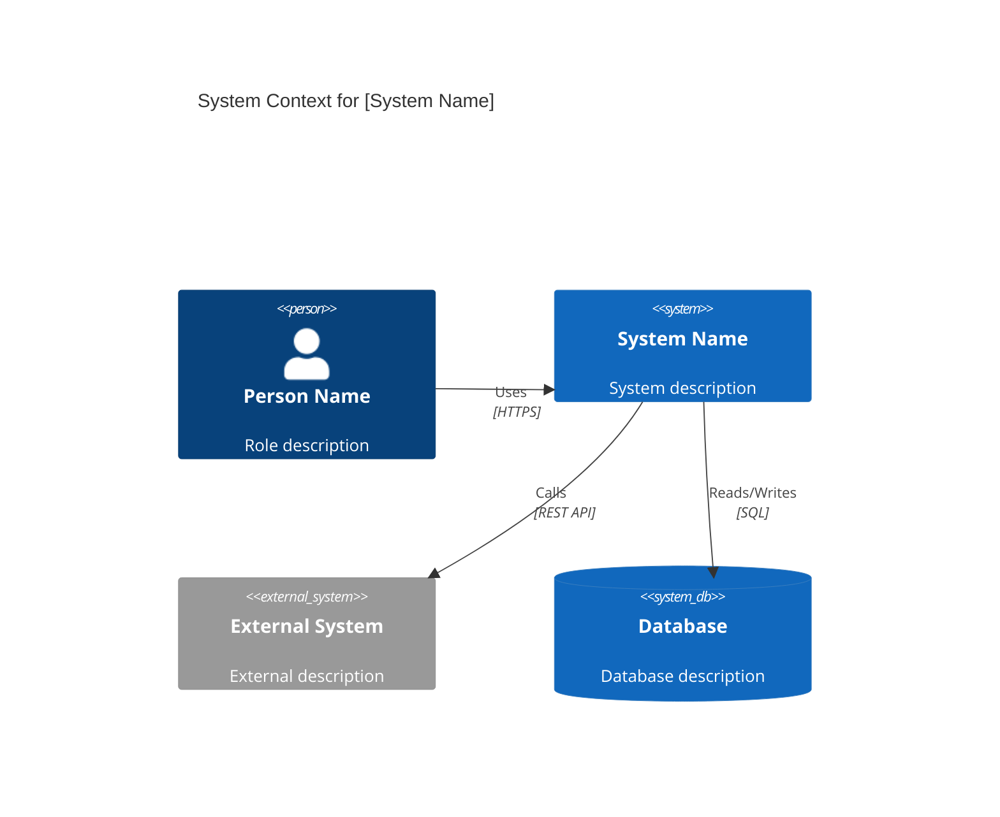
```mermaid
C4Context
    title System Context for [System Name]

    Person(personAlias, "Person Name", "Role description")
    System(systemAlias, "System Name", "System description")
    System_Ext(externalAlias, "External System", "External description")
    SystemDb(dbAlias, "Database", "Database description")

    Rel(personAlias, systemAlias, "Uses", "HTTPS")
    Rel(systemAlias, externalAlias, "Calls", "REST API")
    Rel(systemAlias, dbAlias, "Reads/Writes", "SQL")
```

**Best Practices:**

- Limit to 5-7 systems for clarity
- Focus on key external dependencies
- Use consistent naming (nouns for systems, verbs for relationships)
- Include protocol information in relationship labels

---

## Sequence Diagrams

**Purpose:** Show interactions between components over time

**When to use:**

- API documentation
- Request/response flows
- Authentication flows
- Error scenarios

**Syntax:**

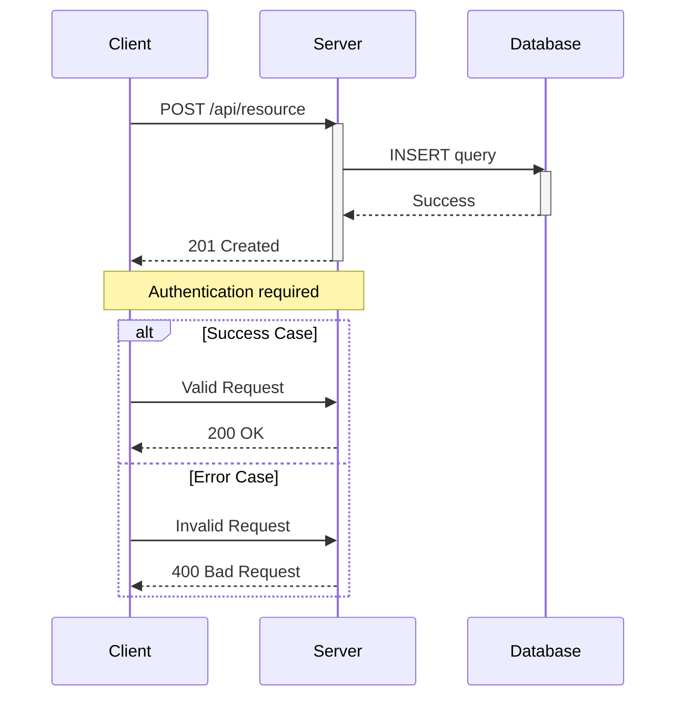
```mermaid
sequenceDiagram
    participant Client
    participant Server
    participant Database

    Client->>Server: POST /api/resource
    activate Server
    Server->>Database: INSERT query
    activate Database
    Database-->>Server: Success
    deactivate Database
    Server-->>Client: 201 Created
    deactivate Server

    Note over Client,Server: Authentication required

    alt Success Case
        Client->>Server: Valid Request
        Server-->>Client: 200 OK
    else Error Case
        Client->>Server: Invalid Request
        Server-->>Client: 400 Bad Request
    end
```

**Best Practices:**

- Order participants left-to-right by interaction flow
- Use activation boxes for processing time
- Include both happy path and error scenarios
- Add notes for important context
- Use alt/opt/loop for conditional logic

**Common Patterns:**

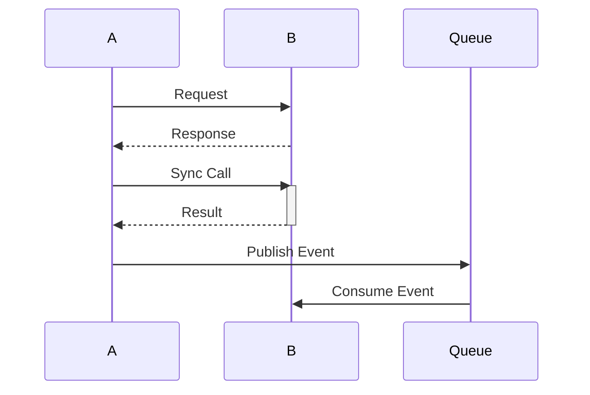
```mermaid
sequenceDiagram
    %% Request-Response
    A->>B: Request
    B-->>A: Response

    %% Synchronous
    A->>B: Sync Call
    activate B
    B-->>A: Result
    deactivate B

    %% Asynchronous
    A->>Queue: Publish Event
    Queue->>B: Consume Event
```

---

## Class Diagrams

**Purpose:** Model object-oriented structure and relationships

**When to use:**

- OOP design documentation
- Code architecture
- Domain model

**Syntax:**

```mermaid
classDiagram
    class Animal {
        +String name
        +int age
        +makeSound() void
        -metabolize() void
    }

    class Dog {
        +String breed
        +bark() void
    }

    class Cat {
        +String color
        +meow() void
    }

    Animal <|-- Dog : inherits
    Animal <|-- Cat : inherits
    Dog "1" --> "*" Toy : has
    Cat "1" --> "1" Owner : belongs to

    <<interface>> Flyable
    Bird ..|> Flyable : implements
```

**Relationships:**

- `<|--` : Inheritance
- `*--` : Composition
- `o--` : Aggregation
- `-->` : Association
- `..>` : Dependency
- `..|>` : Realization

**Visibility:**

- `+` : Public
- `-` : Private
- `#` : Protected
- `~` : Package/Internal

---

## ER Diagrams

**Purpose:** Model database schema and relationships

**When to use:**

- Database design
- Data architecture
- Schema documentation

**Syntax:**

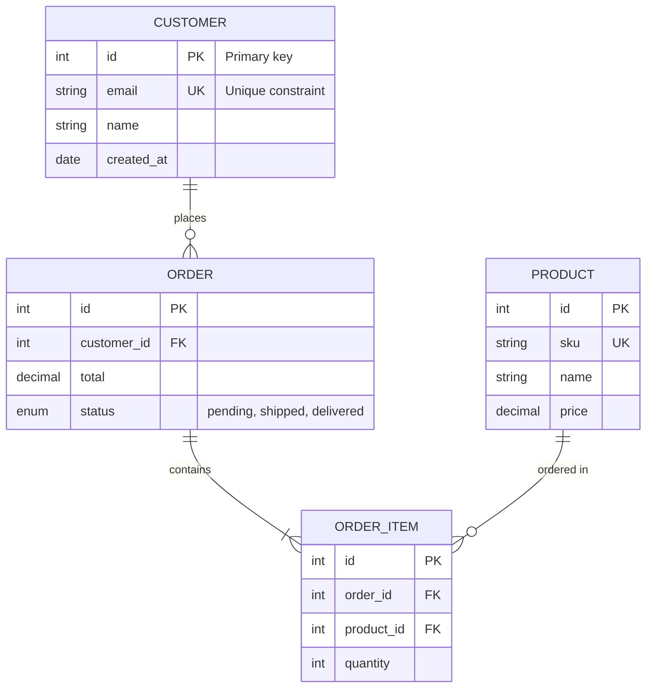
```mermaid
erDiagram
    CUSTOMER ||--o{ ORDER : places
    CUSTOMER {
        int id PK "Primary key"
        string email UK "Unique constraint"
        string name
        date created_at
    }

    ORDER ||--|{ ORDER_ITEM : contains
    ORDER {
        int id PK
        int customer_id FK
        decimal total
        enum status "pending, shipped, delivered"
    }

    PRODUCT ||--o{ ORDER_ITEM : "ordered in"
    PRODUCT {
        int id PK
        string sku UK
        string name
        decimal price
    }

    ORDER_ITEM {
        int id PK
        int order_id FK
        int product_id FK
        int quantity
    }
```

**Cardinality:**

- `||--||` : One to one
- `||--o{` : One to zero or more
- `||--|{` : One to one or more
- `}o--o{` : Zero or more to zero or more

**Best Practices:**

- Mark primary keys with "PK"
- Mark foreign keys with "FK"
- Mark unique constraints with "UK"
- Add field descriptions for clarity
- Include enum values in descriptions

---

## State Diagrams

**Purpose:** Model state transitions and lifecycles

**When to use:**

- Workflow documentation
- Status management
- Lifecycle modeling

**Syntax:**

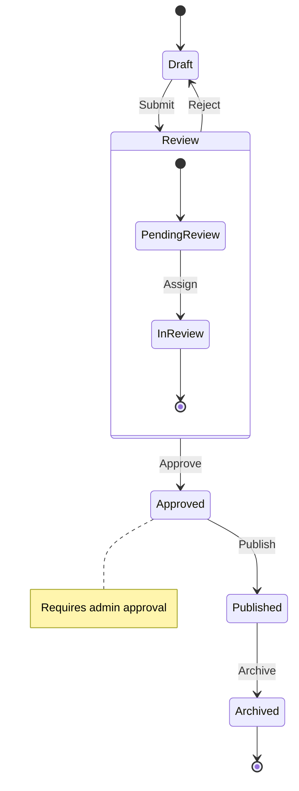
```mermaid
stateDiagram-v2
    [*] --> Draft
    Draft --> Review : Submit
    Review --> Approved : Approve
    Review --> Draft : Reject
    Approved --> Published : Publish
    Published --> Archived : Archive
    Archived --> [*]

    state Review {
        [*] --> PendingReview
        PendingReview --> InReview : Assign
        InReview --> [*]
    }

    note right of Approved
        Requires admin approval
    end note
```

**Best Practices:**

- Start with `[*]` for initial state
- End with `[*]` for final state
- Use nested states for complex workflows
- Add notes for important transitions
- Keep transitions labeled with trigger events

---

## Flowcharts

**Purpose:** Document processes, algorithms, and decision logic

**When to use:**

- Business logic documentation
- Process flows
- Algorithm explanation

**Syntax:**

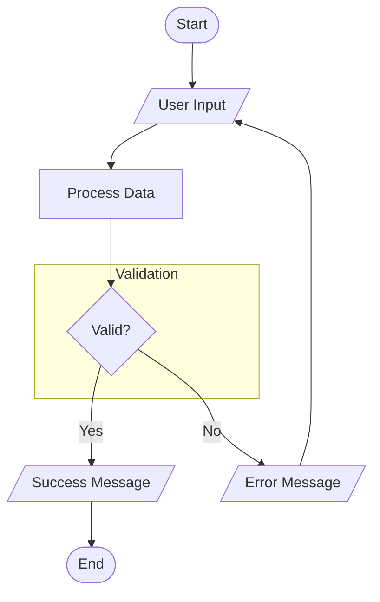
```mermaid
flowchart TD
    Start([Start])
    Input[/User Input/]
    Process[Process Data]
    Decision{Valid?}
    Success[/Success Message/]
    Error[/Error Message/]
    End([End])

    Start --> Input
    Input --> Process
    Process --> Decision
    Decision -->|Yes| Success
    Decision -->|No| Error
    Success --> End
    Error --> Input

    subgraph "Validation"
        Decision
    end
```

**Node Shapes:**

- `[Text]` : Rectangle (process)
- `([Text])` : Stadium (start/end)
- `{Text}` : Diamond (decision)
- `[/Text/]` : Parallelogram (input/output)
- `[(Text)]` : Cylinder (database)
- `((Text))` : Circle
- `>Text]` : Asymmetric (flag)

**Directions:**

- `TD` / `TB` : Top to bottom
- `BT` : Bottom to top
- `LR` : Left to right
- `RL` : Right to left

---

## Gantt Charts

**Purpose:** Project planning and timeline visualization

**When to use:**

- Project schedules
- Milestone tracking
- Roadmap planning

**Syntax:**

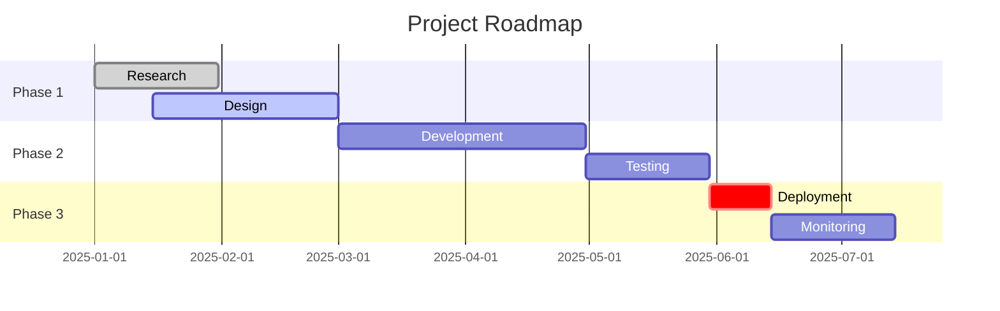
```mermaid
gantt
    title Project Roadmap
    dateFormat YYYY-MM-DD
    section Phase 1
    Research           :done, r1, 2025-01-01, 30d
    Design            :active, d1, 2025-01-15, 45d
    section Phase 2
    Development       :dev1, after d1, 60d
    Testing          :test1, after dev1, 30d
    section Phase 3
    Deployment       :crit, deploy1, after test1, 15d
    Monitoring       :monitor1, after deploy1, 30d
```

**Keywords:**

- `done` : Completed task
- `active` : Currently in progress
- `crit` : Critical path
- `after [id]` : Dependency

---

## User Journey Maps

**Purpose:** Document user experience and interactions

**When to use:**

- UX documentation
- User story mapping
- Experience design

**Syntax:**

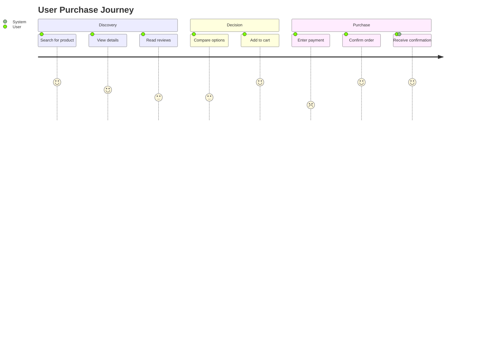
```mermaid
journey
    title User Purchase Journey
    section Discovery
      Search for product: 5: User
      View details: 4: User
      Read reviews: 3: User
    section Decision
      Compare options: 3: User
      Add to cart: 5: User
    section Purchase
      Enter payment: 2: User
      Confirm order: 5: User
      Receive confirmation: 5: User, System
```

**Satisfaction Scores:**

- 5: Very satisfied
- 4: Satisfied
- 3: Neutral
- 2: Unsatisfied
- 1: Very unsatisfied

---

## Venn Diagrams

**Purpose:** Show set overlap, shared scope, and mutual exclusivity

**When to use:**

- Comparing the coverage of two approaches or tools
- Showing which responsibilities are shared between components
- Clarifying what is inside and outside a boundary

**Syntax:**

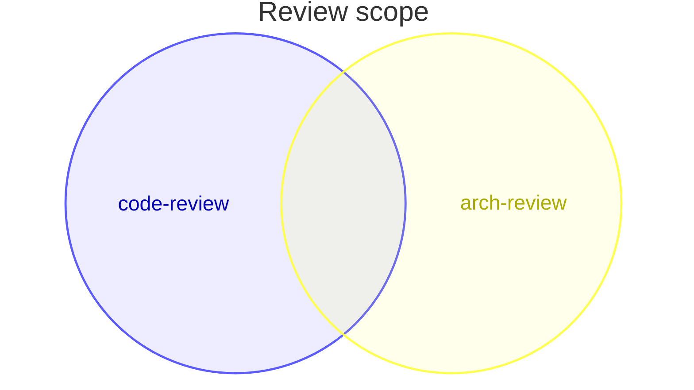
```mermaid
venn-beta
  title Review scope
  set code-review
  set arch-review
  union code-review,arch-review
```

**Best Practices:**

- Two or three sets only — more overlaps become unreadable
- Name the overlap in prose; the diagram shows that it exists, not what it is

---

## TreeView Diagrams

**Purpose:** Show a hierarchy as a file tree

**When to use:**

- Directory structure
- Nested configuration
- Any parent/child hierarchy where depth matters more than relationships

**Syntax:**

```mermaid
treeView-beta
    app/
        backend/
            handler.ts
        frontend/
            App.tsx
    infra/
        stack.ts
```

**Best Practices:**

- Mark directories with a trailing `/`
- Prefer this over a flowchart of boxes — depth reads instantly in a tree
- Trim to the levels that matter; a full tree is noise

---

## Treemap Diagrams

**Purpose:** Show hierarchy where each element also carries a quantity

**When to use:**

- Code size by directory
- Cost breakdown by service
- Test coverage distribution

**Syntax:**

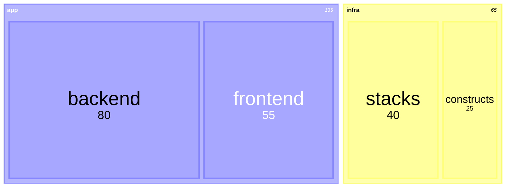
```mermaid
treemap-beta
"infra"
    "stacks": 40
    "constructs": 25
"app"
    "backend": 80
    "frontend": 55
```

**Best Practices:**

- Use when the _relative size_ is the point; if it is not, use `treeView-beta`
- Keep to two levels — deeper nesting produces unreadably small tiles

---

## Radar Diagrams

**Purpose:** Compare several subjects across the same set of axes

**When to use:**

- Comparing candidate technologies across evaluation criteria
- Showing a quality profile (performance, security, maintainability…)

**Syntax:**

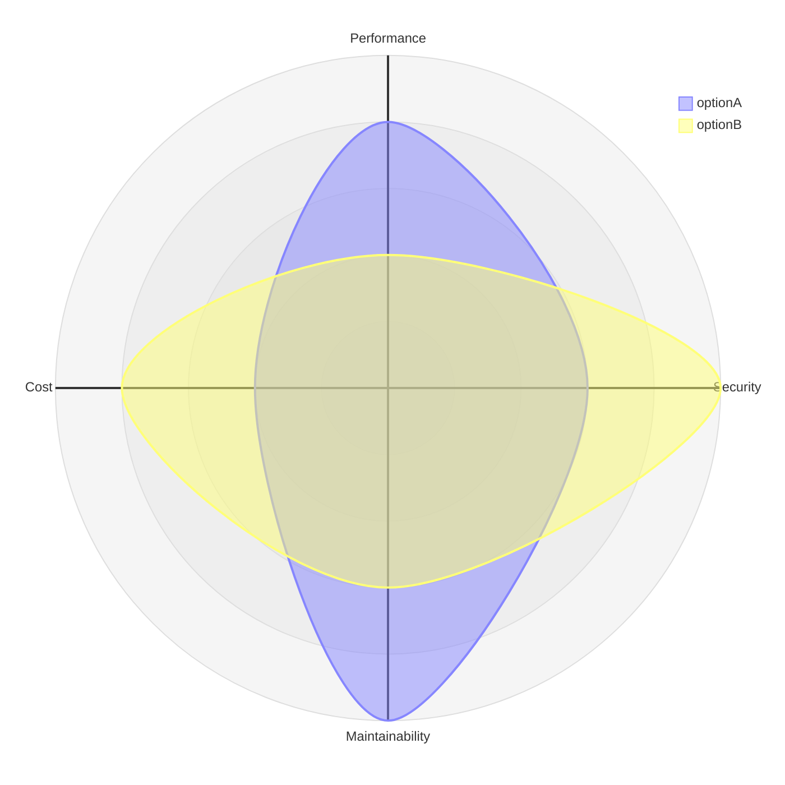
```mermaid
radar-beta
axis perf["Performance"], sec["Security"], maint["Maintainability"], cost["Cost"]
curve optionA{4, 3, 5, 2}
curve optionB{2, 5, 3, 4}
```

**Best Practices:**

- Use the same scale on every axis, or the shape lies
- Three to seven axes; beyond that the shape is unreadable
- Two or three curves at most

---

## XY Charts

**Purpose:** Show quantitative comparison or change over a numeric axis

**When to use:**

- Latency or throughput across releases
- Cost trend
- Any place where the magnitude of numbers is the message

**Syntax:**

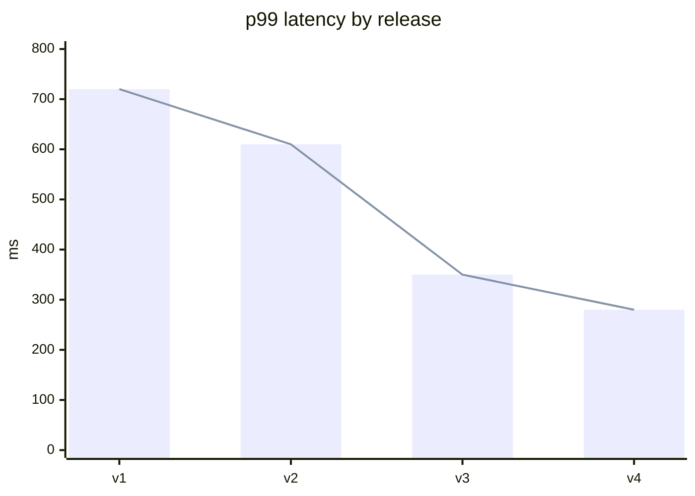
```mermaid
xychart
    title "p99 latency by release"
    x-axis [v1, v2, v3, v4]
    y-axis "ms" 0 --> 800
    bar [720, 610, 350, 280]
    line [720, 610, 350, 280]
```

**Best Practices:**

- Label the y-axis with its unit — an unlabeled number is not data
- Do not use a diagram when a two-column table is clearer; use this when the _trend_ matters

---

## Timeline Diagrams

**Purpose:** Place events along a chronological axis

**When to use:**

- Release history
- Incident timeline
- Project milestones without task durations (use `gantt` when durations matter)

**Syntax:**

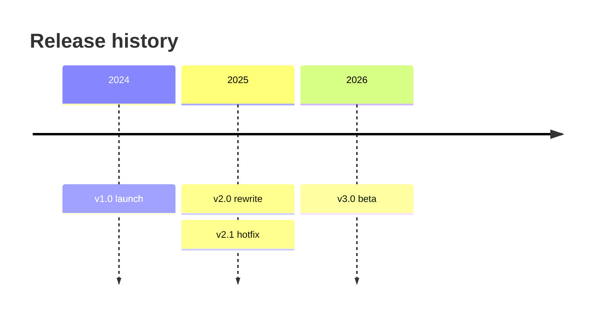
```mermaid
timeline
    title Release history
    2024 : v1.0 launch
    2025 : v2.0 rewrite : v2.1 hotfix
    2026 : v3.0 beta
```

---

## Mindmaps

**Purpose:** Decompose one concept into branches (divergent structure)

**When to use:**

- Breaking a topic into sub-topics
- Organizing findings during design exploration

**Syntax:**

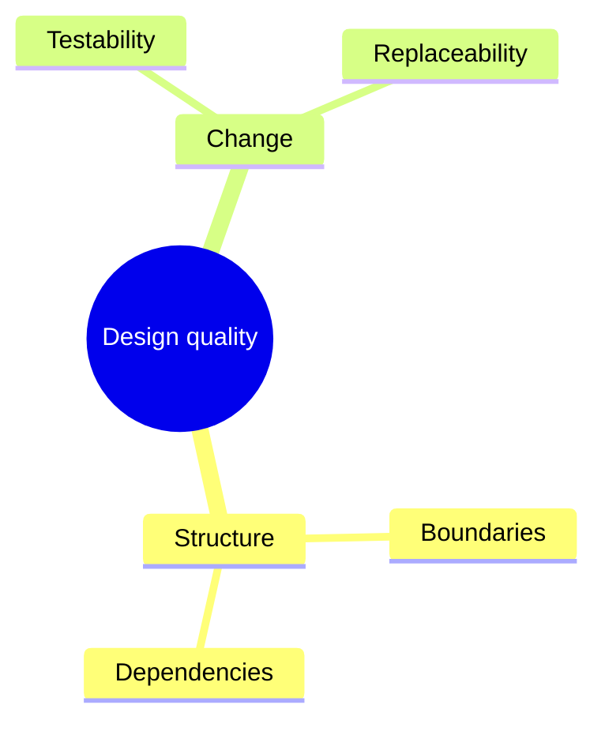
```mermaid
mindmap
  root((Design quality))
    Structure
      Boundaries
      Dependencies
    Change
      Testability
      Replaceability
```

**Best Practices:**

- One root only — a mindmap with two roots is really two diagrams
- Use when the structure radiates from a center, not when it flows in a direction

---

## Quadrant Charts

**Purpose:** Position items against two axes of evaluation

**When to use:**

- Effort vs impact prioritization
- Risk vs cost triage

**Syntax:**

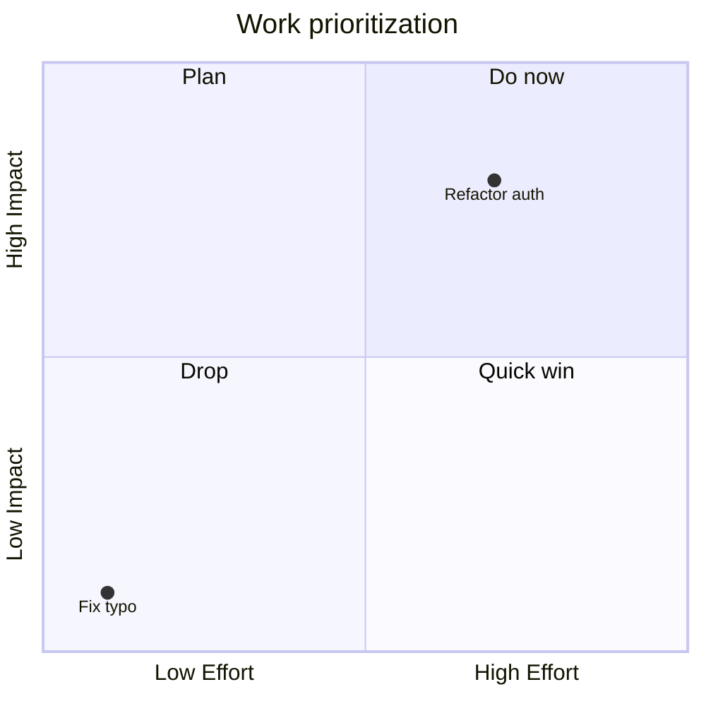
```mermaid
quadrantChart
    title Work prioritization
    x-axis Low Effort --> High Effort
    y-axis Low Impact --> High Impact
    quadrant-1 Do now
    quadrant-2 Plan
    quadrant-3 Drop
    quadrant-4 Quick win
    Refactor auth: [0.7, 0.8]
    Fix typo: [0.1, 0.1]
```

**Best Practices:**

- Name all four quadrants — an unnamed quadrant leaves the reader guessing the verdict
- Coordinates are 0–1

---

## Ishikawa (Fishbone) Diagrams

**Purpose:** Decompose a result into contributing causes

**When to use:**

- Root cause analysis in a postmortem
- Structuring the causes of a recurring defect

**Syntax:**

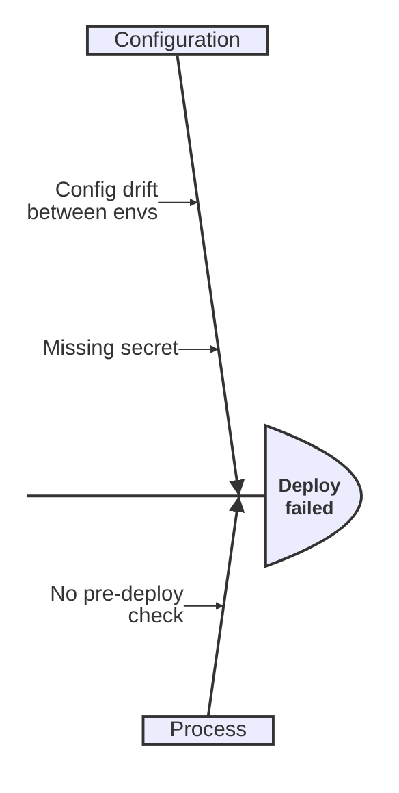
```mermaid
ishikawa
  Deploy failed
    Configuration
      Config drift between envs
      Missing secret
    Process
      No pre-deploy check
```

**Best Practices:**

- Group causes into categories; a flat list of causes is a bullet list, not a diagram
- Keep the head (the problem) specific and observable

---

## Kanban Boards

**Purpose:** Show work items grouped by status lane

**Syntax:**

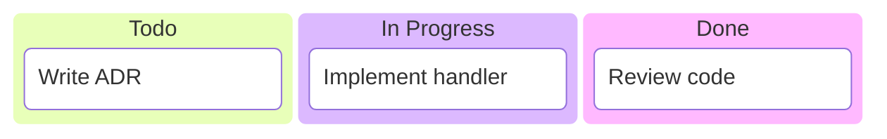
```mermaid
kanban
  todo[Todo]
    t1[Write ADR]
  doing[In Progress]
    t2[Implement handler]
  done[Done]
    t3[Review code]
```

---

## Sankey Diagrams

**Purpose:** Show flow where the quantity is conserved as it splits and merges

**When to use:**

- Traffic distribution across cache and origin
- Cost allocation across services
- Conversion funnel with drop-off

**Syntax:**

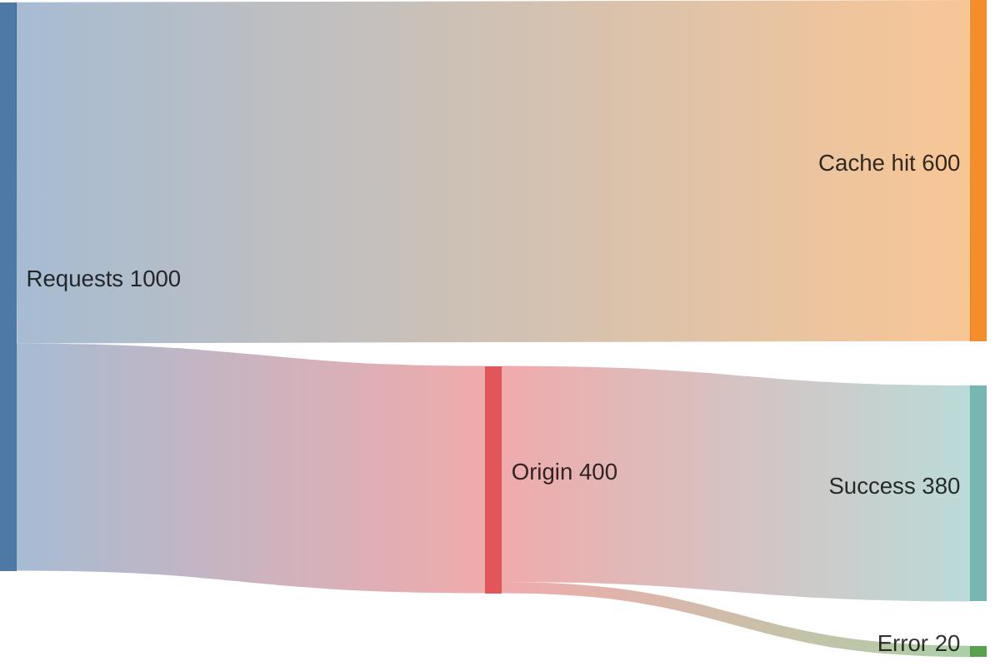
```mermaid
sankey-beta
Requests,Cache hit,600
Requests,Origin,400
Origin,Success,380
Origin,Error,20
```

**Best Practices:**

- Use only when the _volume_ matters; otherwise a flowchart is honest and simpler
- Make the numbers balance, or the widths mislead

---

## Architecture Diagrams

**Purpose:** Show infrastructure components and their connections with service icons

**Syntax:**

```mermaid
architecture-beta
    group api(cloud)[API]
    service gateway(internet)[Gateway] in api
    service lambda(server)[Handler] in api
    service db(database)[Aurora] in api
    gateway:R --> L:lambda
    lambda:R --> L:db
```

**Best Practices:**

- Prefer this over a flowchart for cloud topology — the icons carry meaning that box labels cannot

---

## Packet Diagrams

**Purpose:** Show bit-level layout of a protocol or memory structure

**Syntax:**

```mermaid
packet-beta
0-15: "Source Port"
16-31: "Destination Port"
32-63: "Sequence Number"
```

---

## Block Diagrams

**Purpose:** Place blocks in an explicit grid when the layout itself carries meaning

**Syntax:**

```mermaid
block-beta
    columns 3
    frontend["Frontend"] api["API"] db[("DB")]
```

**Best Practices:**

- Use when automatic flowchart layout fights the arrangement you need

---

## GitGraph Diagrams

**Purpose:** Show branch and merge history

**Syntax:**

```mermaid
gitGraph
    commit
    branch feature
    commit
    checkout main
    merge feature
    commit
```

---

## Requirement Diagrams

**Purpose:** Link requirements to the elements that verify them

**Syntax:**

```mermaid
requirementDiagram
    requirement auth {
        id: REQ-1
        text: users must authenticate
        risk: high
        verifymethod: test
    }
    element authTest {
        type: integration test
    }
    authTest - verifies -> auth
```

---

## Pie Charts

**Purpose:** Show proportions of a single whole

**Syntax:**

```mermaid
pie title Error budget consumption
    "Available" : 72
    "Consumed" : 28
```

**Best Practices:**

- Use for a single level of proportion only; for nested proportions use `treemap-beta`

---

## Common Styling Patterns

### Subgraphs for Organization

```mermaid
graph TB
    subgraph "Frontend"
        UI[User Interface]
        Components[Components]
    end

    subgraph "Backend"
        API[API Layer]
        Database[(Database)]
    end

    UI --> API
    API --> Database
```

### Color Coding with High Contrast

**CRITICAL**: All Mermaid diagram styles MUST use high-contrast colors for accessibility.

**Rule**: Light backgrounds require dark text, dark backgrounds require light text.

✅ **Correct - High Contrast**:

```mermaid
graph LR
    A[Normal]
    B[Success]
    C[Warning]
    D[Error]

    style A fill:#F0F0F0,stroke:#333,color:black
    style B fill:#90EE90,stroke:#333,color:darkgreen
    style C fill:#FFD700,stroke:#333,color:black
    style D fill:#FF6B6B,stroke:#8B0000,color:white
```

**Using classDef (Recommended for consistency)**:

```mermaid
graph LR
    A[Normal]
    B[Success]
    C[Warning]
    D[Error]

    classDef normalStyle fill:#F0F0F0,stroke:#333,stroke-width:2px,color:black
    classDef successStyle fill:#90EE90,stroke:#2E7D2E,stroke-width:2px,color:darkgreen
    classDef warningStyle fill:#FFD700,stroke:#B8860B,stroke-width:2px,color:black
    classDef errorStyle fill:#FFB6C1,stroke:#DC143C,stroke-width:2px,color:black

    class A normalStyle
    class B successStyle
    class C warningStyle
    class D errorStyle
```

❌ **Incorrect - Poor Contrast**:

```mermaid
graph LR
    %% Missing color property - may be unreadable
    style B fill:#90EE90
    style C fill:#FFD700
    style D fill:#FF6B6B
```

**High-Contrast Color Palette**:

| State   | Background Fill | Text Color        | Stroke    |
| ------- | --------------- | ----------------- | --------- |
| Normal  | `#F0F0F0`       | `color:black`     | `#333`    |
| Success | `#90EE90`       | `color:darkgreen` | `#2E7D2E` |
| Warning | `#FFD700`       | `color:black`     | `#B8860B` |
| Error   | `#FFB6C1`       | `color:black`     | `#DC143C` |
| Info    | `#87CEEB`       | `color:darkblue`  | `#4682B4` |
| Public  | `#FFE4B5`       | `color:black`     | `#FF8C00` |
| Private | `#E6E6FA`       | `color:darkblue`  | `#8A2BE2` |
| Dark    | `#2C3E50`       | `color:white`     | `#34495E` |

### Link Styles

```mermaid
graph LR
    A --> B
    A -.-> C
    A ==> D

    linkStyle 0 stroke:#00ff00,stroke-width:2px
    linkStyle 1 stroke:#0000ff,stroke-width:2px
    linkStyle 2 stroke:#ff0000,stroke-width:4px
```

---

## Best Practices for Design Docs

### 1. Choose the Right Diagram

**Don't use:**

- Class diagrams for infrastructure
- Sequence diagrams for data models
- ER diagrams for workflows

**Do use:**

- The diagram type that best communicates your intent
- Multiple diagram types for different aspects
- Simpler diagrams over complex ones

### 2. Keep Diagrams Focused

**Bad:** One giant diagram showing everything
**Good:** Multiple focused diagrams showing specific aspects

**Guidelines:**

- Max 10-12 nodes per diagram
- Max 3-4 levels of nesting
- Break complex diagrams into multiple views

### 3. Use Consistent Naming

**Bad:**

```mermaid
graph LR
    usr --> sys
    system --> db1
```

**Good:**

```mermaid
graph LR
    User --> System
    System --> Database
```

### 4. Add Context

```mermaid
sequenceDiagram
    Note over Client,Server: OAuth 2.0 Authentication Flow

    Client->>AuthServer: Request Access Token
    Note right of AuthServer: Validates client credentials
    AuthServer-->>Client: Access Token (JWT)
```

### 5. Document Technical Decisions

```mermaid
graph TB
    A[Option A: REST API]
    B[Option B: GraphQL]
    C[Decision: REST API]

    note1[Pros: Simple, cacheable]
    note2[Cons: Over-fetching]

    C --> note1
    B --> note2
```

### 6. CRITICAL - Ensure High-Contrast Accessibility

**MANDATORY for ALL diagrams**:

Every diagram with custom styling MUST use high-contrast colors:

```mermaid
graph LR
    A[Component A]
    B[Component B]
    C[Component C]

    classDef primary fill:#90EE90,stroke:#333,stroke-width:2px,color:darkgreen
    classDef secondary fill:#FFD700,stroke:#333,stroke-width:2px,color:black
    classDef accent fill:#87CEEB,stroke:#333,stroke-width:2px,color:darkblue

    class A primary
    class B secondary
    class C accent
```

**Quick Accessibility Test**:

1. Can you easily read the text on each background color?
2. Would the diagram be readable if printed in grayscale?
3. Does every `classDef` include a `color:` property?

If answer is NO to any → Fix the contrast!

**Common Mistakes to Avoid**:

- ❌ `classDef myStyle fill:#FFD700` (missing `color:`)
- ❌ `style A fill:#F0F0F0,color:#E0E0E0` (light on light)
- ❌ `style B fill:#333,color:#222` (dark on dark)

**Always Include**:

- ✅ Explicit `color:` property in all `classDef` statements
- ✅ Explicit `color:` property in all `style` statements
- ✅ High-contrast combinations (see Color Coding section above)

---

## Syntax Validation Checklist

Before including a diagram, verify:

- [ ] All node IDs are unique
- [ ] All relationships use valid syntax
- [ ] Quotes are balanced in labels
- [ ] Special characters are escaped
- [ ] Subgraph syntax is correct
- [ ] No trailing commas
- [ ] Direction is specified (for flowcharts)
- [ ] Date format matches (for Gantt)
- [ ] **All `classDef` statements include `color:` property for high contrast**
- [ ] **All `style` statements include `color:` property for high contrast**
- [ ] **Text is readable on all background colors (accessibility test)**

---

## Common Errors and Fixes

### Error: "Parse error on line X"

**Cause:** Syntax error in Mermaid code

**Fix:**

- Check for missing quotes
- Verify relationship syntax
- Ensure all braces/parentheses match
- Remove trailing commas

### Error: Diagram doesn't render

**Cause:** Invalid node IDs or special characters

**Fix:**

- Use alphanumeric IDs (avoid spaces)
- Escape special characters in labels
- Use quotes for multi-word labels

### Error: Arrows pointing wrong direction

**Cause:** Wrong relationship syntax

**Fix:**

- `A-->B` : A to B
- `B<--A` : A to B (same as above)
- `A<-->B` : Bidirectional

---

## Resources

- [Mermaid Official Docs](https://mermaid.js.org/)
- [Mermaid Live Editor](https://mermaid.live/)
- [C4 Model](https://c4model.com/)
