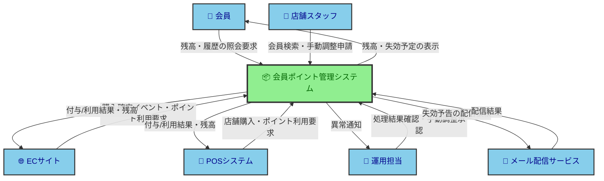
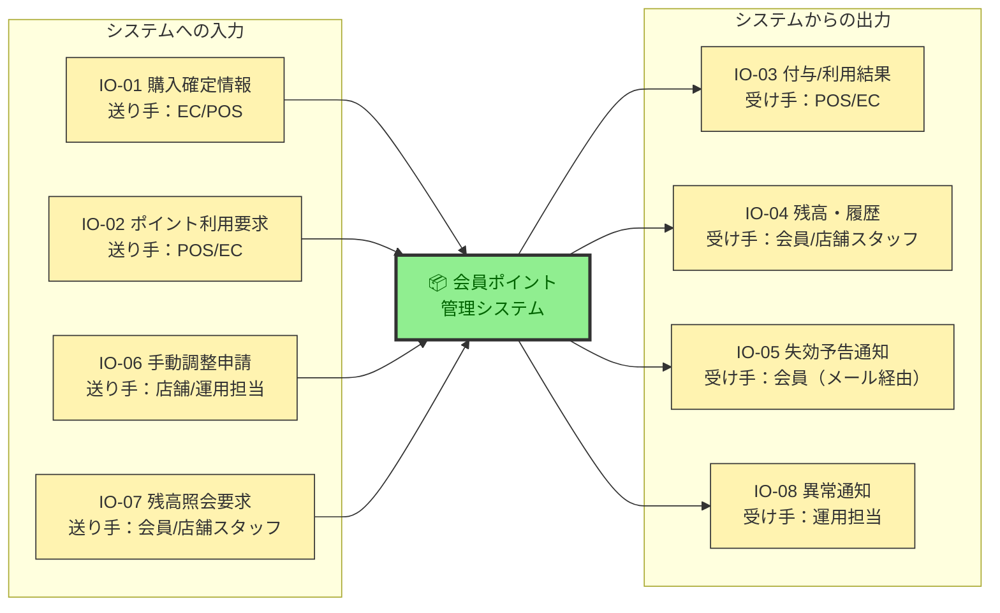
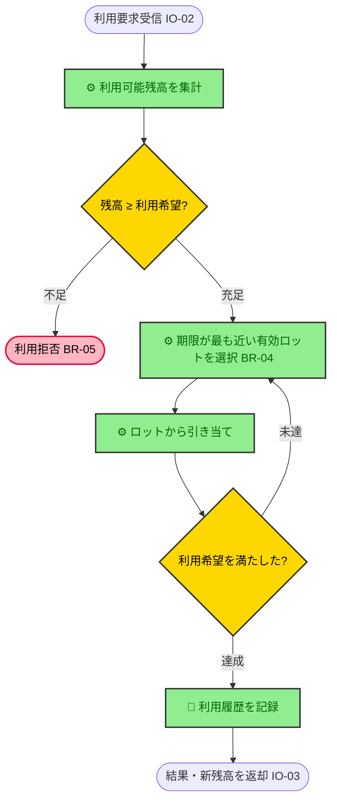
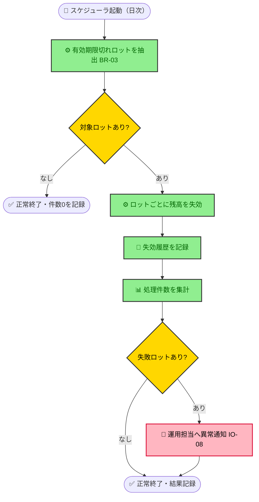
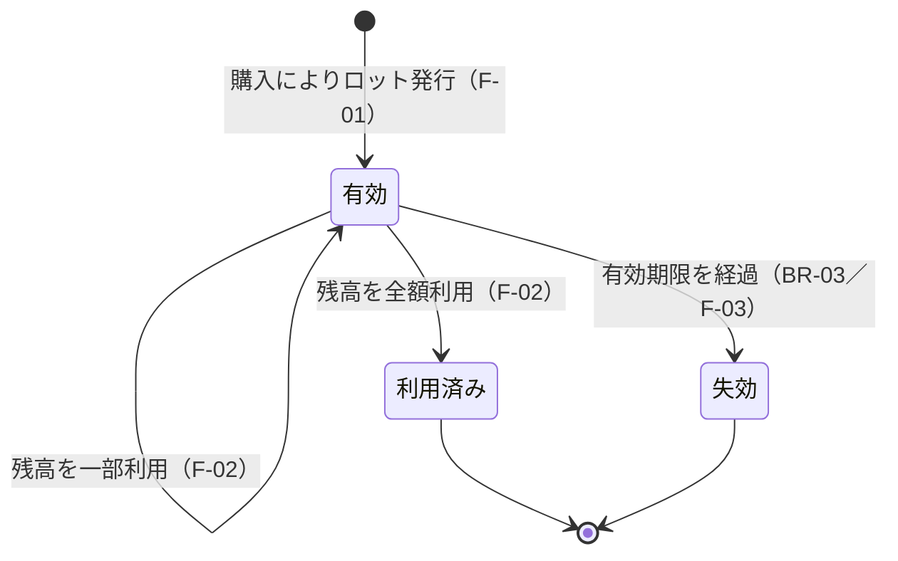

# 要件定義書：会員ポイント管理システム

> [!NOTE]
> 本書は `/elicit-requirements` が出力する `requirements.md` の**記述サンプル**である。題材は架空だが、[requirements-doc-policy.md](../../../docs/policy/requirements-doc-policy.md) の「要件定義書の構成」に完全準拠した粒度・密度の見本として使う。各項目に「何を・どこまで書くか」の具体像を与えるのが目的。
> （実運用の requirements.md には版数・作成者・承認状態を本文に書かない。git 履歴と Issue で追跡する。）

## 概要

小売事業者「サンプル物産」向けに、会員が店舗（POS）と EC で貯めたポイントを一元管理するシステム。購入に応じた付与、利用時の残高引き当て、有効期限切れの失効を扱う。会員は残高・履歴を照会でき、運用担当は失効処理の結果確認と手動調整を扱う。

## 目的

店舗と EC を横断してポイントを正しく貯め・使え・期限管理できる状態にし、会員の再来店・再購入を促す。

## 背景・入力元

| 入力元                                | 内容                                                |
| ------------------------------------- | --------------------------------------------------- |
| RFC「ポイント統合基盤 要求メモ v1.2」 | 顧客提供の一次要求（統合・失効自動化・EC/POS 連携） |
| 現行運用ヒアリング議事録              | 店舗別 Excel 台帳の月次失効作業の課題               |
| 個人情報取扱規程（顧客社内）          | 会員情報の格付け・保持のルール                      |

## 用語定義

この文書固有の用語のみ定義する。全社共通語は用語集（[../../../docs/reference/glossary.md](../../../docs/reference/glossary.md)）を参照。

| 用語           | 定義                                                                                        |
| -------------- | ------------------------------------------------------------------------------------------- |
| ポイントロット | 1回の付与で発生するポイントのかたまり。発行日と有効期限を持ち、失効判定・先入れ先出しの単位 |
| 失効           | 有効期限を過ぎたロットの残高を利用不能にすること                                            |
| 残高           | ある会員の、失効・利用済みを除いた利用可能ポイントの合計                                    |

## ターゲットユーザー

| ユーザー     | 想定シーンと前提                                                                                  |
| ------------ | ------------------------------------------------------------------------------------------------- |
| 会員         | 店舗・EC で購入しポイントを貯める/使う一般顧客。EC アカウントを持ち、スマホで残高を確認したいとき |
| 店舗スタッフ | レジで会員のポイント利用を代行操作し、残高問い合わせに答えるとき                                  |
| 運用担当     | 失効処理の結果確認や、クレーム対応での手動ポイント調整を行う社内オペレーター                      |

## ステークホルダー / 関係者

「使う人」と「決める人・責任を負う人」を区別する。

| 役割               | 立場                                           |
| ------------------ | ---------------------------------------------- |
| マーケティング部長 | 意思決定者（付与率・失効ルールの承認）         |
| 情報システム部     | 承認者（セキュリティ・EC/POS 連携仕様の合意）  |
| CS 部門長          | 利用部門責任者（問い合わせ対応フローの当事者） |
| 個人情報保護管理者 | 承認者（会員情報の取扱い・保持の適法性）       |

## エコシステムマップ

開発対象を黒箱として中央に置き、外部アクターとの授受のみを描く。

**凡例：** 🟩 緑＝開発範囲（内） ／ 🟦 青＝外部アクター・外部システム（外）。矢印は授受の向き（誰から誰へ渡るか）を表す。線種は1種類に統一（種別の区別はしない）。

## 解決する課題

| 誰の     | どんな困りごと                                                             |
| -------- | -------------------------------------------------------------------------- |
| 会員     | 店舗と EC でポイントが分断され合算して使えない。期限切れに気づけず失効する |
| 運用担当 | 失効処理が Excel 手作業で月末に数時間かかり、計算ミス・付与漏れが起きる    |
| CS 部門  | 残高問い合わせに即答できず、店舗台帳を都度確認している                     |

## 業務要件

システムに依存しない What として構造化する。業務用語で書き、画面・テーブル・製品名は書かない。

### 業務一覧

システム化区分と**その理由**を添え、スコープ境界と根拠を示す。関連ビジネスルールIDでトレーサビリティを担保する。

| 大分類       | 中分類     | 小分類       | 概要                               | システム化区分 | 区分の理由                                                               | 関連ルール                 |
| ------------ | ---------- | ------------ | ---------------------------------- | -------------- | ------------------------------------------------------------------------ | -------------------------- |
| ポイント管理 | 付与       | 購入時付与   | 購入金額に応じ付与                 | システム化     | 大量・高頻度で人手では不可能。金額計算の正確性が必須                     | BR-01, BR-02, BR-03, BR-08 |
| ポイント管理 | 付与       | 手動調整付与 | クレーム対応等で付与               | 一部           | 発生は稀で判断を伴うため申請・承認は人が行う。記録は証跡のためシステム化 | BR-07                      |
| ポイント管理 | 利用       | 店舗/EC 利用 | 残高を引き当て                     | システム化     | 決済と同時にリアルタイム引当が必要                                       | BR-04, BR-05               |
| ポイント管理 | 失効       | 期限失効     | 失効前の予告と期限切れロットの失効 | システム化     | 日次・大量で正確性が要る。Excel 手作業の置換が本件の主目的               | BR-03, BR-09               |
| 会員対応     | 照会       | 残高照会     | 残高・履歴を確認                   | システム化     | 会員のセルフ確認と CS の即答を可能にする                                 | —                          |
| 会員対応     | 問い合わせ | 苦情一次対応 | 会員の苦情を受付                   | 手動           | 対話・共感を要する非定型業務でシステム化の価値が薄い                     | —                          |

### ビジネスルール一覧

タイプは行動・定義づけの2分類。区別するのは、後工程での扱いが変わるから（`行動`はフロー／バリデーションに、`定義づけ`は計算・区分ロジックになる）。

| タイプ   | 意味                                               | 例                                                 |
| -------- | -------------------------------------------------- | -------------------------------------------------- |
| 行動     | 人（またはシステム）の行動を義務・禁止・条件づける | 「残高がマイナスになる利用は受け付けない」         |
| 定義づけ | 分類の仕方・計算式・値の定義を定める               | 「100円ごとに1ポイント」「有効期限＝発行日+365日」 |

計算式・境界値は具体値まで書く。入力資料（RFC）にない記述・入力資料から変えた記述にだけ `出所` を付ける（そのまま採用したものは「—」）。ここでは BR-07 だけが作成者の補完で、顧客と未合意である。

| ID    | ルール名       | 概要または例                                                         | タイプ   | 関連ルール | 出所         |
| ----- | -------------- | -------------------------------------------------------------------- | -------- | ---------- | ------------ |
| BR-01 | 付与率         | 税抜購入金額100円ごとに1ポイント付与（端数切り捨て）                 | 定義づけ | BR-02      | —            |
| BR-02 | 付与対象外     | ギフト券・送料・ポイント利用充当分は付与対象金額から除外             | 行動     | BR-01      | —            |
| BR-03 | 有効期限       | ロットの有効期限は発行日+365日（発行日を1日目として計算）            | 定義づけ | BR-04      | —            |
| BR-04 | 引当順序       | 利用時は有効期限が近いロットから引き当てる（先入れ先出し）           | 行動     | BR-03      | —            |
| BR-05 | 残高下限       | 残高がマイナスになる利用は受け付けない                               | 行動     | —          | —            |
| BR-06 | 会員番号形式   | 会員番号は EC が発番する10桁の数字（外部システムが課す制約）         | 定義づけ | —          | —            |
| BR-07 | 手動調整上限   | 1回の手動付与は上限10,000ポイント。超過は部長承認が必要              | 行動     | —          | 提案・叩き台 |
| BR-08 | 重複付与の禁止 | 同一の購入確定イベントを重複して受信しても、付与は1回だけ行う        | 行動     | BR-01      | —            |
| BR-09 | 失効予告の時期 | 毎月、翌月末までに有効期限が到来するロットを持つ会員へ失効予告を送る | 行動     | BR-03      | —            |

### 入出力情報一覧

`入出力区分`は開発対象システムを主語に判定する（システムが受け取る＝入力／出す＝出力）。`送り手`・`受け手`で「誰が出し誰が受けるか」を示す。`ID`は機能仕様・受入基準から参照する。値制約はビジネスルール一覧（`定義づけ`）へ回す。

まず入出力の流れを図で俯瞰する（**図＝流れ、下表＝属性**の分担。IO-ID で対応）。エコシステムマップが「全体の関係・境界」を放射状に描くのに対し、ここは**システム視点で入力／出力を左右に分けた IPO 図**にして切り口を変える（同じ矢印の二重管理を避ける）。

| ID    | 情報名           | 区分 | 送り手                | 受け手                         | 内容                                           | 取扱量          | 頻度         | 利用目的                    | 利用業務                |
| ----- | ---------------- | ---- | --------------------- | ------------------------------ | ---------------------------------------------- | --------------- | ------------ | --------------------------- | ----------------------- |
| IO-01 | 購入確定情報     | 入力 | EC/POS                | 本システム                     | 会員番号・税抜金額・購入日時                   | 通常時50万件/日 | リアルタイム | 付与額の算出                | 購入時付与              |
| IO-02 | ポイント利用要求 | 入力 | POS/EC                | 本システム                     | 会員番号・利用希望ポイント数                   | 通常時10万件/日 | リアルタイム | 残高の引き当て              | 店舗/EC利用             |
| IO-03 | 付与/利用結果    | 出力 | 本システム            | POS/EC                         | 付与/利用ポイント・確定後残高                  | 通常時60万件/日 | リアルタイム | レシート・画面表示への反映  | 購入時付与, 店舗/EC利用 |
| IO-04 | 残高・履歴       | 出力 | 本システム            | 会員/店舗スタッフ              | 利用可能残高・付与/利用/失効履歴・失効予定     | 想定5万件/日    | 随時         | 会員のセルフ確認・CS の即答 | 残高照会                |
| IO-05 | 失効予告通知     | 出力 | 本システム            | 会員（メール配信サービス経由） | 会員番号・失効予定ポイント・失効日             | 最大30万件/月   | 月次         | 失効前の利用促進            | 期限失効                |
| IO-06 | 手動調整申請     | 入力 | 店舗スタッフ/運用担当 | 本システム                     | 会員番号・調整ポイント・理由                   | 数十件/日       | 随時         | クレーム対応の記録と付与    | 手動調整付与            |
| IO-07 | 残高照会要求     | 入力 | 会員/店舗スタッフ     | 本システム                     | 会員番号                                       | 想定5万件/日    | 随時         | 照会対象の特定              | 残高照会                |
| IO-08 | 異常通知         | 出力 | 本システム            | 運用担当                       | 異常の内容（失効処理の失敗・連携断・SLI 逸脱） | 異常時のみ      | 随時         | 障害の検知と一次対応        | 業務維持／基盤          |

### 業務フロー図

（任意項目。本サンプルでは省略。省略理由：各業務は独立しており、業務一覧を超える分岐・並行がなく、逆変換テストで図の付加価値が出ないため。機能内部の分岐は機能仕様のアクティビティ図で扱う）

## 機能要件

### システム化機能一覧

システムが担う機能（capability）を列挙する。ユーザーが直接使う機能に加え、業務維持に必要な基盤機能も含める。優先度と理由・対象業務を各行に持たせる（優先順位セクションでは再掲しない）。

| ID   | 機能名           | 対象業務                                          | 優先度 | 優先度の理由                                                                     |
| ---- | ---------------- | ------------------------------------------------- | ------ | -------------------------------------------------------------------------------- |
| F-01 | ポイント付与     | 購入時付与                                        | Must   | ポイントが貯まらなければサービスが成立しない。金額計算の正確性が金銭的信頼に直結 |
| F-02 | ポイント利用     | 店舗/EC利用                                       | Must   | 貯めたポイントを使えることがサービスの根幹。残高引当の誤りは金銭事故             |
| F-03 | 失効処理         | 期限失効                                          | Must   | Excel 手作業の置換が本件の主目的。誤失効は会員資産の毀損                         |
| F-04 | 残高・履歴照会   | 残高照会                                          | Should | 会員価値は高いが、当面は CS 電話という代替手段があるため Must の次               |
| F-05 | 手動ポイント調整 | 手動調整付与                                      | Could  | 発生頻度が低く、当面は申請・承認の記録を残した個別運用で代替できる               |
| F-06 | 失効予告通知     | 期限失効                                          | Should | 失効前に使う機会を与え会員の不満を防ぐが、失効処理自体は予告がなくても成立する   |
| F-07 | 稼働監視         | 業務維持／基盤（C. 監視・SLO と対）               | Must   | 付与・利用・失効の異常を検知できなければ金銭事故に気づけない                     |
| F-08 | データ保全       | 業務維持／基盤（A. RPO/RTO・C. バックアップと対） | Must   | 残高データを失うと会員資産を毀損し回復できない                                   |

（Won't（今回のスコープ外）：会員ランク別の付与率変動。理由は「スコープ外」節参照）

### 機能仕様（ユースケース記述）

一覧の**全機能**について UI 非依存の振る舞いを書く。入力/出力は入出力情報を ID で、判断/計算はビジネスルールを ID で参照する。

| 機能ID | アクター           | トリガー                             | 入力                                           | 適用ルール                 | 出力                                              | 事後条件                                          | 主要な例外                                                                                 |
| ------ | ------------------ | ------------------------------------ | ---------------------------------------------- | -------------------------- | ------------------------------------------------- | ------------------------------------------------- | ------------------------------------------------------------------------------------------ |
| F-01   | EC/POS             | 購入確定イベント受信                 | IO-01                                          | BR-01, BR-02, BR-03, BR-08 | IO-03                                             | ロットが1件発行され残高が増える                   | 会員番号が BR-06 不適合→受付拒否・エラー返却／重複イベント→付与せず受領済みを返す（BR-08） |
| F-02   | POS/EC             | 利用要求受信                         | IO-02                                          | BR-04, BR-05               | IO-03                                             | 残高が減り利用履歴が残る                          | 残高不足（BR-05）→利用拒否                                                                 |
| F-03   | スケジューラ       | 日次起動（完了締切は B. 処理締切）   | 有効期限切れロット（内部データ）               | BR-03                      | 失効履歴（IO-04 に反映）                          | 対象ロットの残高が0になり失効履歴が残る           | 一部ロットの処理失敗→IO-08 で運用担当へ通知し残りは継続                                    |
| F-04   | 会員／店舗スタッフ | 照会要求受信                         | IO-07                                          | —                          | IO-04                                             | 参照のみ（状態を変えない）                        | 会員番号不明→該当なしを返す                                                                |
| F-05   | 運用担当           | 手動調整申請の承認                   | IO-06                                          | BR-07                      | 調整後の残高・履歴（IO-04 に反映）・監査証跡（E） | 調整ロットが発行/減算され、証跡が残る             | 上限超過（BR-07）→部長承認待ちで保留                                                       |
| F-06   | スケジューラ       | 月次起動                             | 翌月末までに期限が到来するロット（内部データ） | BR-09                      | IO-05                                             | 対象会員への予告が配信依頼される                  | 配信失敗→失効日までに再送、なお未達なら IO-08 で通知                                       |
| F-07   | システム           | 監視対象の異常発生（対象は C. 監視） | 稼働状況（内部データ）                         | —                          | IO-08                                             | 異常が運用担当に通知される                        | 通知手段の障害→未通知を検知できること（C. 監視）                                           |
| F-08   | システム           | 常時（A. RPO を満たす鮮度で）        | 残高・トランザクション（内部データ）           | —                          | 復旧可能な保全データ（C. バックアップ準拠）       | 障害時に RPO/RTO（A）内で復旧できる状態が保たれる | 保全の失敗→IO-08 で運用担当へ通知                                                          |

#### F-02（ポイント利用）— 先入れ先出しの引き当て

複数ロットを期限順に消費するループと残高不足の分岐があるため、逆変換テストによりアクティビティ図を併記する。

#### F-03（失効処理）— 抽出・失効・集計

分岐・ループを含むため、アクティビティ図を併記する。

（その他の機能は分岐が単一で、機能仕様の表と例外欄で情報が落ちないため図は付けない＝逆変換テストで不要と判断）

### 状態遷移

対象エンティティ「ポイントロット」にライフサイクルがあるため記述する。残高の多寡は属性として扱い、振る舞いが変わる境界（利用可能か・失効済みか）だけを状態にする。

## 非機能要件

**IPA「非機能要求グレード」をたたき台に**、[非機能要件の項目カタログ](../../../docs/reference/non-functional-requirement-items.md)の6大分類（可用性／性能・拡張性／運用・保守性／移行性／セキュリティ／システム環境）を検討した。**6分類はすべて項目として立て**、要求が無い分類は「該当なし・理由」を明記する（黙って省かない）。品質特性ごとの要求を What として書き、観測可能なサービスレベルは後段の SLI/SLO/SLA で指標化する。

### A. 可用性

| 項目             | 要求                                                                  |
| ---------------- | --------------------------------------------------------------------- |
| サービス提供時間 | 付与・利用・残高照会は24時間365日（失効処理の完了締切は B. 処理締切） |
| 稼働率           | SLO（可用性）で定量化（後段）。計画停止は稼働率から除外               |
| RTO              | 障害発生から4時間以内に復旧                                           |
| RPO              | データ損失は直近1時間まで許容（ポイント残高の消失は重大なため短め）   |
| 縮退運転         | 付与・利用が障害でも、残高照会は読み取り専用で継続できること          |
| 大規模災害       | データセンター全域の被災時も復旧を目指す。目標復旧時間は24時間以内    |

### B. 性能・拡張性

| 項目           | 要求                                                                                 |
| -------------- | ------------------------------------------------------------------------------------ |
| 通常時業務量   | 会員200万人・ピーク同時接続5,000（取引件数は入出力情報一覧の取扱量を正とする）       |
| ピーク時業務量 | 大型セール時に付与・利用が平常の5倍。年数回・数日間発生                              |
| 将来増加       | 3年で会員数2倍を見込む（容量計画の前提）                                             |
| 応答時間       | SLO（レイテンシ）で定量化（後段）                                                    |
| 処理締切       | 日次の失効処理は毎朝5:00までに完了する（実行時間帯は保留＝OQ-1、「制約と前提」参照） |

### C. 運用・保守性

| 項目           | 要求                                                                                                      |
| -------------- | --------------------------------------------------------------------------------------------------------- |
| 運用時間・体制 | 運用担当は平日9–18時。夜間障害はオンコールで一次対応                                                      |
| 監視           | SLI 逸脱・連携断・失効処理の失敗を検知し運用担当へ通知（指標は SLI、詳細は監視設計）                      |
| バックアップ   | ポイント残高・トランザクションを RPO（直近1時間）を満たして復旧できるよう保全する。保全データは14日分保持 |
| 計画停止       | 定期メンテのための停止を月1回・深夜2時間まで許容                                                          |
| パッチ/EOL     | 基盤の重大脆弱性は1か月以内に対処。EOL 品を残さない                                                       |
| ログ保持       | 操作・監査ログは1年、アクセスログは90日保持                                                               |
| 教育・手順書   | 運用担当向けに失効処理・手動調整の手順書を提供                                                            |

### D. 移行性

| 項目               | 要求                                                        |
| ------------------ | ----------------------------------------------------------- |
| 移行の要否・対象   | 現行 Excel 台帳の会員残高を初期データとして移行する         |
| 移行データ量       | 会員200万人分の残高・有効期限                               |
| 移行時期・許容停止 | 本番切替は1回。切替に許される停止は4時間以内                |
| 移行方式の制約     | 一括移行。EC/POS 連携の切替と同日に実施                     |
| 移行の受入基準     | 移行後の総残高が移行元と一致し、抽出10万件の突合で差異ゼロ  |
| リハーサル・切戻し | 本番前にリハーサルを1回以上。異常時は旧運用へ切り戻せること |

### E. セキュリティ

| 項目             | 要求                                                                                                                                                           |
| ---------------- | -------------------------------------------------------------------------------------------------------------------------------------------------------------- |
| 準拠法令・規程   | 個人情報保護法、顧客の個人情報取扱規程                                                                                                                         |
| 情報の格付け     | 会員番号・氏名・残高は「機密（個人情報）」。保護レベルは最上位                                                                                                 |
| 認証・認可       | 会員の本人確認は EC サイトの認証に依存する（本システム独自の会員認証は持たない）。運用担当は社内 IdP＋多要素認証。付与・利用・失効・手動調整・照会で権限を区分 |
| アクセス制限     | 運用機能は社内ネットワークからのみ利用可                                                                                                                       |
| データ保護       | 会員個人情報・残高は保存時・通信時とも暗号化する                                                                                                               |
| 追跡・監査ログ   | 手動調整（誰が・いつ・なぜ・いくら）を証跡として1年保持                                                                                                        |
| 攻撃対策         | 外部公開 API は不正アクセス・Web 攻撃への対策を施す（水準はガイドライン準拠）                                                                                  |
| インシデント対応 | 漏えい検知時は規程に従い対応・当局届出。目標検知48時間以内                                                                                                     |
| セキュリティ診断 | 本番リリース前および年次で脆弱性診断を実施                                                                                                                     |

### システム環境・エコロジー

該当なし・理由：クラウド利用を前提とし機材設置環境の要件はない。唯一関係する**データ保存リージョン**の制約（国内保持）は E. セキュリティおよび「制約と前提」に記載。

### SLI（指標）

要件段階では計算式とソースだけを決める（目標値＝SLO は後段）。ユーザーから見えるサービスレベルのみを対象とし、内部指標（CPU 等）は含めない。

| 指標                    | 計算式                                                                     | ソース                       |
| ----------------------- | -------------------------------------------------------------------------- | ---------------------------- |
| 可用性                  | (正常応答したリクエスト数) ÷ (全リクエスト数) × 100（%）                   | ロードバランサのアクセスログ |
| レイテンシ（付与/利用） | 付与・利用リクエスト処理時間の95パーセンタイル値（ms）                     | アプリメトリクス             |
| レイテンシ（照会）      | 照会リクエスト処理時間の95パーセンタイル値（ms）                           | アプリメトリクス             |
| 付与正確性              | (正しい付与額のトランザクション数) ÷ (全付与トランザクション数) × 100（%） | 付与トランザクションログ     |
| 失効処理完遂率          | (完了締切内に正常完了した実行日数) ÷ (実行予定日数) × 100（%）             | 失効処理の実行ログ           |

### SLO（目標値＋評価期間）

各 SLI に目標値と評価期間（ウィンドウ型）をセットで決める。握れない目標値はオープンクエスチョンを正とし、ここでは「未確定（OQ-n）」と参照だけを書く。

| 対象SLI                 | 目標値         | 評価期間       | ウィンドウ型   |
| ----------------------- | -------------- | -------------- | -------------- |
| 可用性                  | 99.9% 以上     | 直近30日       | ローリング     |
| レイテンシ（付与/利用） | p95 < 300ms    | 暦月           | 固定カレンダー |
| レイテンシ（照会）      | p95 < 500ms    | 暦月           | 固定カレンダー |
| 付与正確性              | 未確定（OQ-2） | 未確定（OQ-2） | 未確定（OQ-2） |
| 失効処理完遂率          | 99% 以上       | 暦月           | 固定カレンダー |

### SLA（合意）

現時点で利用者との対外的な稼働率合意はなし。将来キャンペーン提携先と結ぶ可能性があり OQ-3 で追跡する。

## 優先順位

優先度は機能一覧の各行に理由付きで持たせた（ここでは再掲しない）。優先度を分けた**判断基準**は次のとおり：

- **Must**：ポイントが「貯まる・使える・期限管理される」というサービスの根幹を成す機能と、その正確性を支える基盤機能。金銭的信頼に直結するため妥協しない。
- **Should**：会員価値は高いが、無くても根幹が成立し代替・後退の余地がある機能（例：照会は CS 電話で代替できる）。
- **Could**：発生頻度が低く、当面は人手の運用で凌げる機能。
- **Won't（今回）**：会員ランク制度など、目的（統合と失効自動化）に直結しない拡張。

（いつリリースするか＝時期・スケジュールは見積・契約の領域のため書かない）

## 依存関係（Dependencies）

**依存関係とは**、要件の実現が他システム・他チーム・外部サービスの予定や成果物に依存し、自分たちだけでは完了の可否・時期を決められない事項をいう。**なぜ書くか**：それが遅れる・変わると要件が実現できなくなるため、リスクとスケジュールの前提として早期に見える化する。制約（動かせない枠）とは別物で、こちらは「追跡して管理する外部要因」。授受データの量・頻度は入出力情報一覧に記載し、ここは依存の有無・相手だけを追跡する（二重管理しない）。

| 依存先             | 内容                                                      | 追跡理由                             |
| ------------------ | --------------------------------------------------------- | ------------------------------------ |
| EC サイト          | 購入確定イベントの連携・会員番号の採番（BR-06）・会員認証 | 相手側の連携仕様確定が着手の前提     |
| POS システム       | リアルタイム利用要求の送信                                | POS 改修スケジュールに実現時期が依存 |
| メール配信サービス | 失効予告の配信                                            | 外部 SaaS の可用性・送信上限に依存   |
| 社内 IdP           | 運用担当の多要素認証                                      | 認可要件（E）の前提                  |

## 制約と前提

各項目に判定を付す。制約を再判定した理由をここに残す。

| 制約内容                                 | 判定       | 判定理由                                                                         |
| ---------------------------------------- | ---------- | -------------------------------------------------------------------------------- |
| 会員番号は EC が発番する10桁（BR-06）    | 真の制約   | 外部システム仕様であり変更不能                                                   |
| 会員個人情報・残高は国内リージョンに保持 | 真の制約   | 顧客規程・データ主権上の要請で動かせない                                         |
| 既存 Excel 台帳を初期データとして移行    | 見直し可能 | 精度に懸念があり、移行対象・基準日は要協議                                       |
| 失効処理の実行時間帯                     | 保留       | POS の日次締め時刻との整合が未確認（OQ-1）。確定するまで時間帯を要件で固定しない |

## スコープ外（Non-Goals）

除外理由に加え、区分と出所を持たせる。延期候補は次期以降の候補という意味に留め、いつやるかは書かない。

| 項目                             | 除外理由                                                      | 区分     | 出所                           |
| -------------------------------- | ------------------------------------------------------------- | -------- | ------------------------------ |
| ポイントを使ったキャンペーン抽選 | 目的（統合・失効自動化）に直結せず、別施策として切り出す      | 非対応   | 合意済み〔マーケティング部長〕 |
| 会員ランク制度・ランク別付与率   | 付与ロジックが複雑化。まず統合を成立させることを優先（YAGNI） | 延期候補 | 合意済み〔マーケティング部長〕 |
| 他社ポイントとの相互交換         | 提携先未定で要件が固まらない                                  | 非対応   | 提案・叩き台                   |

## 受入基準

各基準は検証対象（機能ID／業務ID／SLO）に紐づけ、機能一覧の Must・Should 機能を漏れなくカバーする。事後条件・SLO 目標値は再掲せず ID で参照する。

| 受入基準                                                                                  | 検証対象  |
| ----------------------------------------------------------------------------------------- | --------- |
| 購入確定イベント（IO-01）に対し BR-01/BR-02 に従った付与が行われ残高が増える              | F-01      |
| 同一の購入確定イベントを重複受信しても付与が1回に保たれる（BR-08）                        | F-01      |
| 残高不足時に利用が拒否される（BR-05）                                                     | F-02      |
| 複数ロットが期限の近い順（BR-04）に引き当てられる                                         | F-02      |
| 有効期限切れロットが日次で失効し、失効履歴が照会（IO-04）へ反映される                     | F-03      |
| 会員・店舗スタッフが残高と履歴（IO-04）を照会でき、付与・利用・失効の結果が反映されている | F-04      |
| 翌月末までに失効するロットを持つ会員へ予告（IO-05）が届く（BR-09）                        | F-06      |
| 手動調整が上限（BR-07）を超えると承認待ちで保留される                                     | F-05      |
| 監視対象の異常（C. 監視）が運用担当へ通知（IO-08）される                                  | F-07      |
| 障害を想定した復旧で RPO/RTO（A）を満たす                                                 | F-08      |
| 可用性・レイテンシ・失効処理完遂率が SLO を満たす                                         | 各 SLO    |
| 移行の受入基準（D. 移行性）を満たす                                                       | D. 移行性 |

## リスクと対応

| リスク                                                      | 対応                                                                                         |
| ----------------------------------------------------------- | -------------------------------------------------------------------------------------------- |
| EC/POS からのイベント欠損・重複で付与漏れ・二重付与が起きる | 重複受信でも付与を1回に保つルール（BR-08）を要件化し、EC/POS と日次で件数を照合する          |
| 失効処理が完了締切（B. 処理締切）に間に合わない             | 締切を性能要件として明示し、想定データ量（入出力情報一覧）で達成できるかを設計段階で検証する |
| Excel 移行データの残高不整合                                | 移行前に突合し、差異は運用担当が確認・補正                                                   |
| メール配信サービスの送信上限超過で失効予告が届かない        | 予告時期に余裕を持たせ（BR-09）、未達を失効前に検知して再送する                              |

## オープンクエスチョン

各項目に解決の相手と解消期限を持たせ、出口の無い未決事項を残さない。解消期限は日付ではなく工程で書き、要件段階で決めるべき事項か・設計以降に送ってよい事項かを判別できるようにする。OQ-4 は要件そのもの（承認の業務ルール）が決まらないため、凍結前に潰す必要がある。

| ID   | 未決事項                                                 | 解決の相手                 | 解消期限                          |
| ---- | -------------------------------------------------------- | -------------------------- | --------------------------------- |
| OQ-1 | 失効処理の実行時間帯と POS 日次締め時刻の整合が未確認    | POS システム担当           | 該当機能（F-03 失効処理）の設計前 |
| OQ-2 | 付与正確性 SLO の目標値・評価期間を顧客が未確定          | マーケティング部長         | 該当機能（F-07 稼働監視）の設計前 |
| OQ-3 | キャンペーン提携先との SLA 合意の要否                    | キャンペーン提携先（未定） | リリース前                        |
| OQ-4 | 手動調整の承認フロー（部長承認の運用）を CS 部門と要確定 | CS 部門長                  | 要件凍結前                        |
