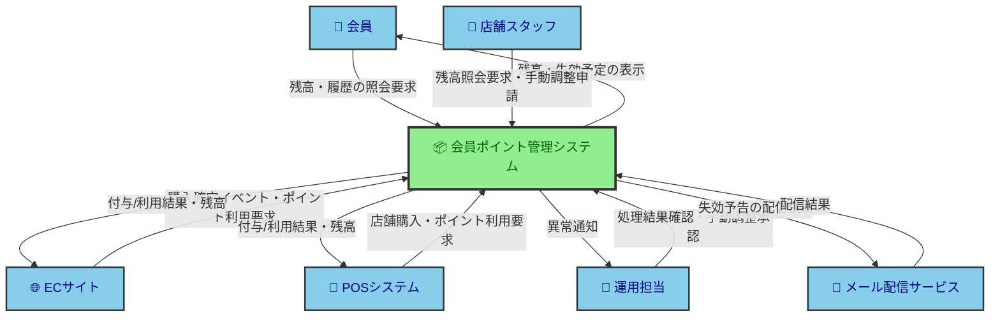
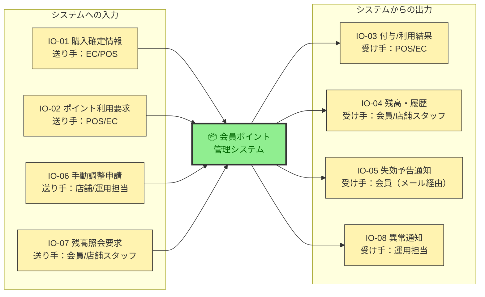
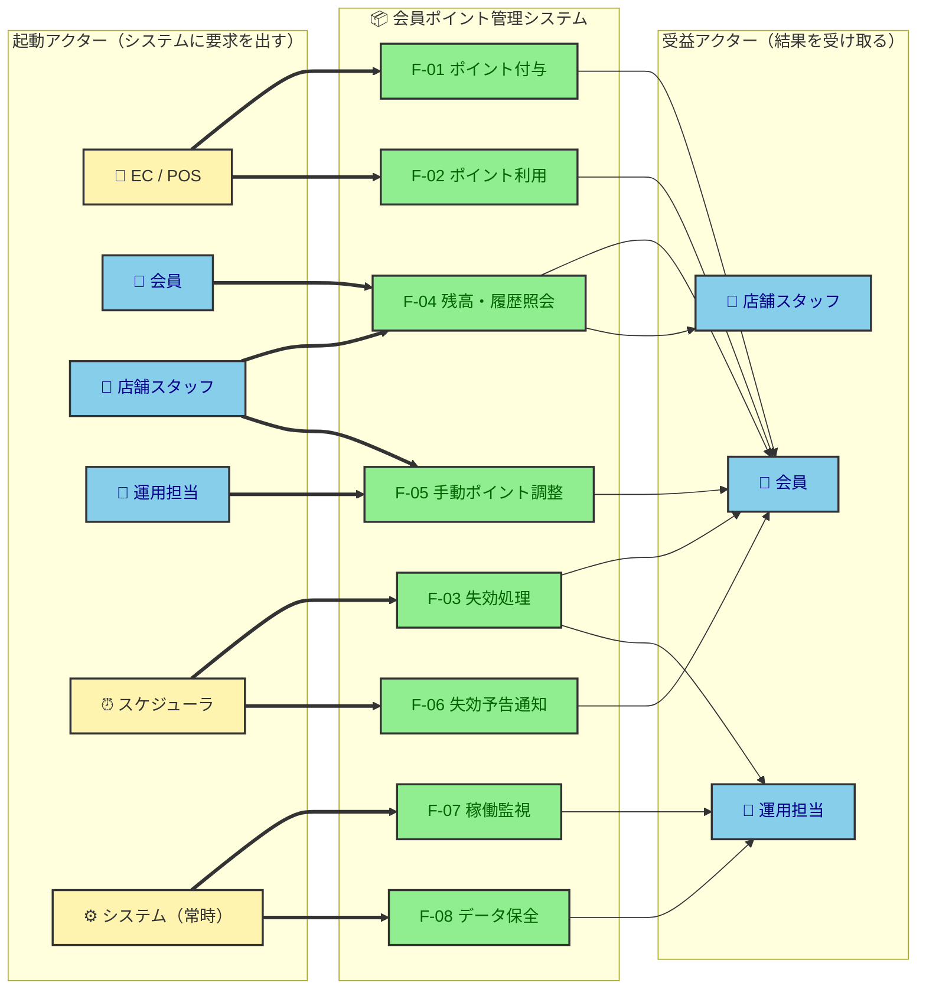
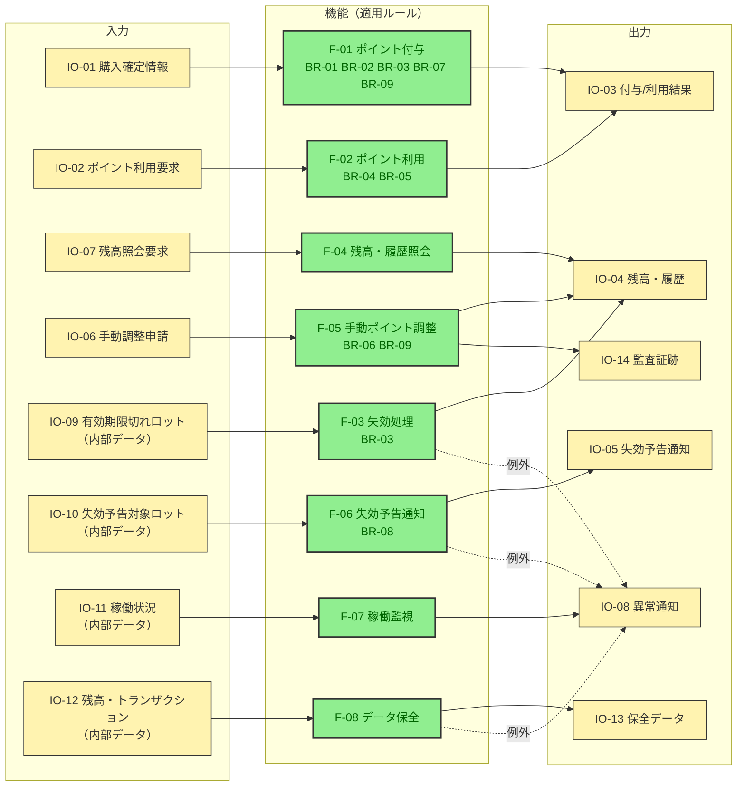
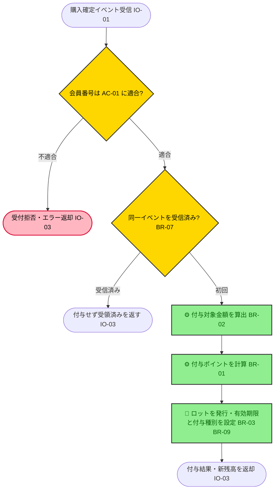
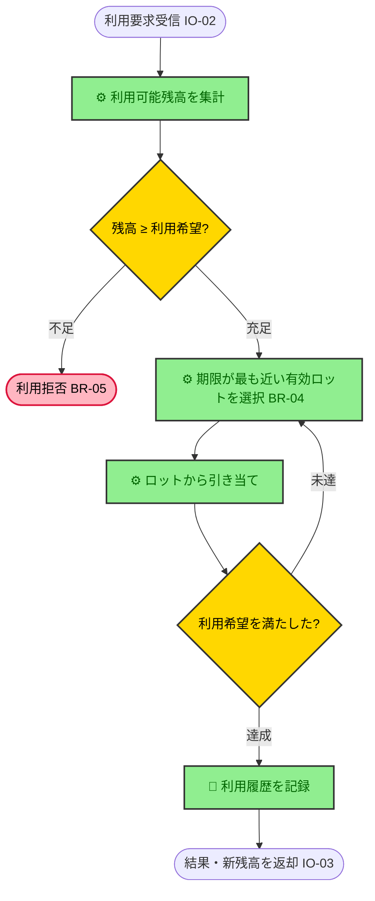
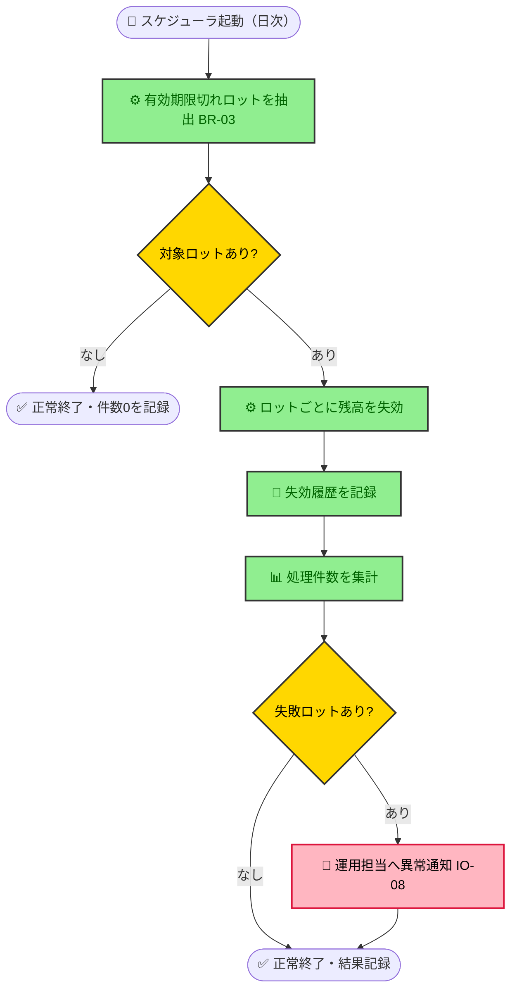
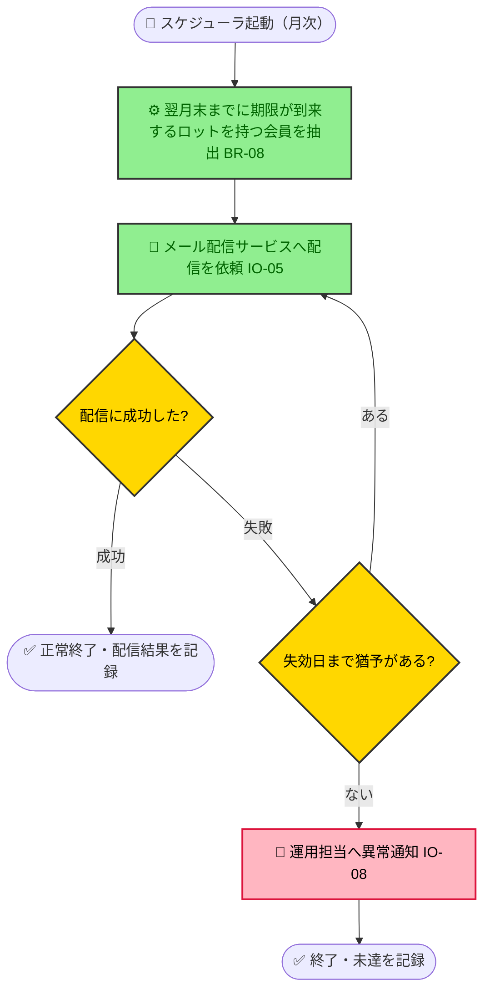
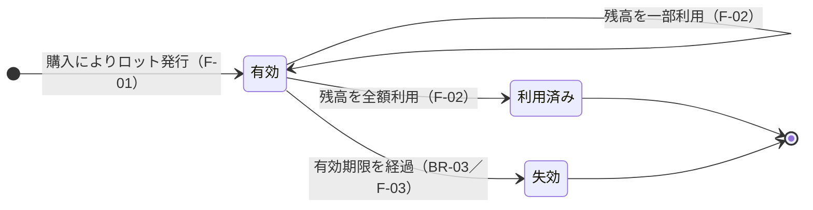

# 要件定義書：会員ポイント管理システム

> [!NOTE]
> 本書は `/elicit-requirements` が出力する `requirements.md` の**記述サンプル**である。題材は架空だが、[requirements-doc-policy.md](../../../docs/policy/requirements-doc-policy.md) に完全準拠した粒度・密度の見本として使う。各項目に「何を・どこまで書くか」の具体像を与えるのが目的。
> **必須項目・記述基準の正典は requirements-doc-policy.md であり、本書はそれを再掲しない。** 各節の前置きに置くのは、このサンプル固有の判断（なぜこの行がこう書かれているか・なぜこの項目を省いたか）だけである。

## 概要

小売事業者「サンプル物産」向けに、会員が店舗（POS）と EC で貯めたポイントを一元管理するシステム。購入に応じた付与、利用時の残高引き当て、有効期限切れの失効を扱う。会員は残高・履歴を照会でき、運用担当は失効処理の結果確認と手動調整を扱う。

## 目的

店舗と EC を横断してポイントを正しく貯め・使え・期限管理できる状態にし、会員の再来店・再購入を促す。

## 背景・入力元

| 入力元                                | 内容                                                |
| ------------------------------------- | --------------------------------------------------- |
| RFC「ポイント統合基盤 要求メモ v1.2」 | 顧客提供の一次要求（統合・失効自動化・EC/POS 連携） |
| 現行運用ヒアリング議事録              | 店舗別 Excel 台帳の月次失効作業の課題               |
| 個人情報取扱規程（顧客社内）          | 会員情報の格付け・保持のルール                      |

## 用語定義

全社共通語は用語集（[../../../docs/reference/glossary.md](../../../docs/reference/glossary.md)）を参照。

| 用語           | 定義                                                                                        |
| -------------- | ------------------------------------------------------------------------------------------- |
| ポイントロット | 1回の付与で発生するポイントのかたまり。発行日と有効期限を持ち、失効判定・先入れ先出しの単位 |
| 失効           | 有効期限を過ぎたロットの残高を利用不能にすること                                            |
| 残高           | ある会員の、失効・利用済みを除いた利用可能ポイントの合計                                    |

## ターゲットユーザー

| ユーザー     | 想定シーンと前提                                                                                  |
| ------------ | ------------------------------------------------------------------------------------------------- |
| 会員         | 店舗・EC で購入しポイントを貯める/使う一般顧客。EC アカウントを持ち、スマホで残高を確認したいとき |
| 店舗スタッフ | レジで会員のポイント利用を代行操作し、残高問い合わせに答えるとき                                  |
| 運用担当     | 失効処理の結果確認や、クレーム対応での手動ポイント調整を行う社内オペレーター                      |

## ステークホルダー／関係者

| 役割               | 立場                                           |
| ------------------ | ---------------------------------------------- |
| マーケティング部長 | 意思決定者（付与率・失効ルールの承認）         |
| 情報システム部     | 承認者（セキュリティ・EC/POS 連携仕様の合意）  |
| CS 部門長          | 利用部門責任者（問い合わせ対応フローの当事者） |
| 個人情報保護管理者 | 承認者（会員情報の取扱い・保持の適法性）       |

## エコシステムマップ

```mermaid
flowchart TB
    member[👤 会員]
    staff[👤 店舗スタッフ]
    ops[👤 運用担当]
    ec[🌐 ECサイト]
    pos[🏬 POSシステム]
    mail[📨 メール配信サービス]

    system[📦 会員ポイント管理システム]

    ec -->|購入確定イベント・ポイント利用要求| system
    system -->|付与/利用結果・残高| ec
    pos -->|店舗購入・ポイント利用要求| system
    system -->|付与/利用結果・残高| pos
    member -->|残高・履歴の照会要求| system
    system -->|残高・失効予定の表示| member
    staff -->|残高照会要求・手動調整申請| system
    ops -->|処理結果確認・手動調整承認| system
    system -->|異常通知| ops
    system -->|失効予告の配信依頼| mail
    mail -->|配信結果| system

    classDef internal fill:#90EE90,stroke:#333,stroke-width:3px,color:darkgreen
    classDef external fill:#87CEEB,stroke:#333,stroke-width:2px,color:darkblue
    class system internal
    class member,staff,ops,ec,pos,mail external
```

**凡例：** 🟩 緑＝開発範囲（内） ／ 🟦 青＝外部アクター・外部システム（外）。矢印は授受の向き（誰から誰へ渡るか）を表す。線種は1種類に統一（種別の区別はしない）。

## 解決する課題

| 誰の     | どんな困りごと                                                             |
| -------- | -------------------------------------------------------------------------- |
| 会員     | 店舗と EC でポイントが分断され合算して使えない。期限切れに気づけず失効する |
| 運用担当 | 失効処理が Excel 手作業で月末に数時間かかり、計算ミス・付与漏れが起きる    |
| CS 部門  | 残高問い合わせに即答できず、店舗台帳を都度確認している                     |

## 業務要件

### 業務一覧

| 大分類       | 中分類     | 小分類       | 概要                               | システム化区分 | 関連ルールID                                                  |
| ------------ | ---------- | ------------ | ---------------------------------- | -------------- | ------------------------------------------------------------- |
| ポイント管理 | 付与       | 購入時付与   | 購入金額に応じ付与                 | システム化     | BR-01, BR-02, BR-03, BR-07, BR-09, AC-02, AC-03, AC-05, AC-06 |
| ポイント管理 | 付与       | 手動調整付与 | クレーム対応等で付与               | 一部           | BR-06, BR-09, AC-10, AC-11, AC-15, AC-16                      |
| ポイント管理 | 利用       | 店舗/EC 利用 | 残高を引き当て                     | システム化     | BR-04, BR-05, AC-04, AC-05, AC-06                             |
| ポイント管理 | 失効       | 期限失効     | 失効前の予告と期限切れロットの失効 | システム化     | BR-03, BR-08, BR-10, AC-08, AC-09, AC-17, AC-18, AC-19        |
| 会員対応     | 照会       | 残高照会     | 残高・履歴を確認                   | システム化     | BR-10, AC-07, AC-17, AC-18, AC-19                             |
| 会員対応     | 問い合わせ | 苦情一次対応 | 会員の苦情を受付                   | 手動           | —                                                             |

購入時付与

**区分の理由**：大量・高頻度で人手では不可能。金額計算の正確性が必須。

手動調整付与

**区分の理由**：発生は稀で判断を伴うため、申請・承認は人が行う。記録は証跡のためシステム化する。

店舗/EC 利用

**区分の理由**：決済と同時にリアルタイム引当が必要。

期限失効

**区分の理由**：日次・大量で正確性が要る。Excel 手作業の置換が本件の主目的。

残高照会

**区分の理由**：会員のセルフ確認と CS の即答を可能にする。

苦情一次対応

**区分の理由**：対話・共感を要する非定型業務で、システム化の価値が薄い。

### ビジネスルール一覧

`定義づけ` の書き分けは種類ごとに見る——BR-01・BR-03 は計算式、BR-09 は分類・区分、BR-10 は関係（多重度）の例である。属性の値制約はこの表に置かず、属性の値制約一覧が持つ。`出所` が `提案・叩き台` の行は作成者の補完であり、顧客と未合意である。

| ID    | ルール名       | タイプ   | 関連ルール                 | 出所         |
| ----- | -------------- | -------- | -------------------------- | ------------ |
| BR-01 | 付与率         | 定義づけ | BR-02                      | —            |
| BR-02 | 付与対象外     | 行動     | BR-01                      | —            |
| BR-03 | 有効期限       | 定義づけ | BR-04                      | —            |
| BR-04 | 引当順序       | 行動     | BR-03                      | —            |
| BR-05 | 残高下限       | 行動     | —                          | —            |
| BR-06 | 手動調整上限   | 行動     | —                          | 提案・叩き台 |
| BR-07 | 重複付与の禁止 | 行動     | BR-01                      | —            |
| BR-08 | 失効予告の時期 | 行動     | BR-03                      | —            |
| BR-09 | 付与種別       | 定義づけ | BR-01, BR-06               | —            |
| BR-10 | 履歴の多重度   | 定義づけ | BR-03, AC-17, AC-18, AC-19 | 提案・叩き台 |

BR-01 付与率

付与ポイント＝税抜購入金額 ÷ 100 の整数部。端数は切り捨てる。境界値は、税抜99円以下が0ポイント、税抜100円が1ポイントである。

BR-02 付与対象外

本システムは、付与対象金額を算出するとき、ギフト券・送料・ポイント利用充当分を金額に含めてはならない。

BR-03 有効期限

ロットの有効期限日＝発行日を1日目と数えて365日目（＝発行日の364日後）。日単位で扱うため端数処理は生じない。境界値は、期限日の当日中は利用でき、その翌日から失効対象になる点である。

BR-04 引当順序

本システムは、ポイント利用を処理するとき、有効期限が近いロットから順に引き当てなければならない（先入れ先出し）。

BR-05 残高下限

本システムは、常に、引き当て後の残高がマイナスになる利用要求を受け付けてはならない。

BR-06 手動調整上限

運用担当は、1回の手動付与が10,000ポイントを超えるとき、部長の承認を得ずに付与してはならない。

BR-07 重複付与の禁止

本システムは、同一の購入確定イベントを2回目以降に受信したとき、付与を行ってはならない。

BR-08 失効予告の時期

本システムは、毎月、翌月末までに有効期限が到来するロットを持つ会員へ、失効予告を送らなければならない。

BR-09 付与種別

ロットは付与種別を必ず1つ持つ。取りうる値は `購入付与` と `手動調整付与` の2つで、多重度はロット1件につき1つ、両方を同時に持つことはできない（排他）。

BR-10 履歴の多重度

付与履歴・利用履歴・失効履歴は、会員1人につき0件以上（上限なし）。逆向きに見ると、履歴1件は必ず会員1人に属する。履歴1件は発生日時・種別・ポイント数をそれぞれ1つずつ必ず持つ。

### 属性の値制約一覧

入出力情報一覧の `内容` に並ぶ属性を1つずつ引き、1属性1行にしている。AC-17〜AC-19 は履歴1件が持つ属性で、履歴そのものの多重度（BR-10）とは行を分けた。`出所` が「—」の AC-01 だけが入力資料に根拠を持ち、残りは作成者の補完で顧客と未合意である。詳細トグルは補足型なので、列の記述だけでは読み取れない属性にだけ付けた。

| ID    | 属性名                     | 取りうる値                                                       | 必須・任意                                            | 桁                | 形式                                       | 関連ルール   | 出所         |
| ----- | -------------------------- | ---------------------------------------------------------------- | ----------------------------------------------------- | ----------------- | ------------------------------------------ | ------------ | ------------ |
| AC-01 | 会員番号                   | EC が発番する半角数字（0000000000〜9999999999。先頭0を含む）     | 必須（全会員が1つ）                                   | 10桁固定          | 半角数字のみ                               | —            | —            |
| AC-02 | 税抜金額                   | 0以上の整数（単位は円）。上限は999,999,999                       | 必須（購入確定1件につき1つ）                          | 最大9桁           | 半角数字のみ（小数・区切り記号を含まない） | BR-01        | 提案・叩き台 |
| AC-03 | 購入日時                   | 受信時点以前の日時（未来日時は不可）                             | 必須（購入確定1件につき1つ）                          | 秒まで固定14桁    | `YYYY-MM-DDThh:mm:ss`（JST）               | —            | 提案・叩き台 |
| AC-04 | 利用希望ポイント数         | 1以上の整数（上限は BR-05 が定める）                             | 必須（利用要求1件につき1つ）                          | 最大7桁           | 半角数字のみ                               | BR-05        | 提案・叩き台 |
| AC-05 | 付与ポイント・利用ポイント | 0以上の整数                                                      | 一方が必須（付与/利用結果1件につき。他方は0）         | 最大7桁           | 半角数字のみ                               | BR-01, BR-04 | 提案・叩き台 |
| AC-06 | 確定後残高                 | 0以上の整数（マイナス不可）                                      | 必須（付与/利用結果1件につき1つ）                     | 最大8桁           | 半角数字のみ                               | BR-05        | 提案・叩き台 |
| AC-07 | 利用可能残高               | 0以上の整数。有効期限内ロットの残高合計に一致する                | 必須（会員1人につき1つ）                              | 最大8桁           | 半角数字のみ                               | BR-03, BR-05 | 提案・叩き台 |
| AC-08 | 失効予定ポイント           | 0以上の整数                                                      | 必須（会員1人につき1つ。有効期限内ロットが無ければ0） | 最大7桁           | 半角数字のみ                               | BR-03, BR-08 | 提案・叩き台 |
| AC-09 | 失効日                     | BR-03 が定める有効期限日の翌日                                   | 必須（失効予告1件につき1つ）                          | 8桁               | `YYYY-MM-DD`（JST）                        | BR-03        | 提案・叩き台 |
| AC-10 | 調整ポイント               | 0を除く整数（マイナスは減算調整）                                | 必須（手動調整申請1件につき1つ）                      | 符号を除き最大5桁 | 先頭の符号と半角数字                       | BR-06        | 提案・叩き台 |
| AC-11 | 調整の理由                 | 自由記述（定型の選択肢は設けない）                               | 必須（手動調整申請1件につき1つ）                      | 全角200文字以内   | 改行を含まない文字列                       | BR-06        | 提案・叩き台 |
| AC-12 | 異常の内容                 | `失効処理の失敗` ／ `連携断` ／ `SLI 逸脱` のいずれか1つ（排他） | 必須（異常通知1件につき1つ）                          | なし              | 区分値                                     | —            | 提案・叩き台 |
| AC-13 | SLIの実測値                | 0以上の実数（率は0〜1、時間はミリ秒）                            | 必須（稼働状況の1指標につき1つ）                      | 小数第3位まで     | 半角数字                                   | —            | 提案・叩き台 |
| AC-14 | 連携の成否・失効処理の成否 | `成功` ／ `失敗` のいずれか1つ（排他）                           | 必須（実行1回につき1つ）                              | なし              | 区分値                                     | —            | 提案・叩き台 |
| AC-15 | 申請者・承認者             | 実在する運用担当者のID。申請者と承認者に同一人物は不可           | それぞれ必須（監査証跡1件につき1つ）                  | 8桁固定           | `U`＋半角数字7桁                           | BR-06        | 提案・叩き台 |
| AC-16 | 承認日時                   | 申請日時以降の日時                                               | 必須（監査証跡1件につき1つ）                          | 秒まで固定14桁    | `YYYY-MM-DDThh:mm:ss`（JST）               | BR-06        | 提案・叩き台 |
| AC-17 | 発生日時（履歴）           | 履歴が発生した時点の日時                                         | 必須（履歴1件につき1つ）                              | 秒まで固定14桁    | `YYYY-MM-DDThh:mm:ss`（JST）               | BR-10        | 提案・叩き台 |
| AC-18 | 種別（履歴）               | `付与` ／ `利用` ／ `失効` のいずれか1つ（排他）                 | 必須（履歴1件につき1つ）                              | なし              | 区分値                                     | BR-10        | 提案・叩き台 |
| AC-19 | ポイント数（履歴）         | 1以上の整数                                                      | 必須（履歴1件につき1つ）                              | 最大7桁           | 半角数字のみ                               | BR-10        | 提案・叩き台 |

AC-01 会員番号

先頭0を含むため、数値ではなく文字列として扱う必要がある。桁数は EC の発番仕様で、こちらでは動かせない（「制約と前提」で真の制約と判定済み）。

AC-02 税抜金額

上限は、POS が1取引で受け付ける金額に合わせた。これを超える購入は POS 側で分割されるため、本システムに届かない。

AC-03 購入日時

未来日時を弾くのは、POS 端末の時刻ずれによる誤付与を防ぐため。ずれた日時でロットを発行すると、有効期限（BR-03）も連動してずれる。

AC-11 調整の理由

上限は、監査証跡（IO-14）を1件1行で読める長さに収めるため。上限を設けないと、証跡の一覧が理由の本文で埋まる。

AC-15 申請者・承認者

申請者と承認者に同一人物を許さないのは、職務を分けるため。同一人物を許すと、手動調整の上限（BR-06）に承認を挟む意味が無くなる。

`U`＋7桁という形式は、社内 IdP が持つ運用担当者IDをそのまま借りたものである（本システムは採番しない）。同じ ID が監査証跡（IO-14）にも残るので、両者で表記を揃える。

### 入出力情報一覧

**図＝流れ、下表＝授受の相手、トグル＝中身**の分担で、IO-ID で対応づけている。内部データ・保全・証跡も行にしているのは、機能仕様の `入力`・`出力` に書けるのが実在する IO-ID だけだからである。図は外部との授受だけを描くので、これらの行は図に出てこない（機能ごとの流れは「機能×入出力×ルール図」が持つ）。入力資料に無い行と、作成者が数値へ翻訳した取扱量には `出所` に `提案・叩き台` を付けている。

```mermaid
flowchart LR
    subgraph IN["システムへの入力"]
      i1["IO-01 購入確定情報<br/>送り手：EC/POS"]
      i2["IO-02 ポイント利用要求<br/>送り手：POS/EC"]
      i6["IO-06 手動調整申請<br/>送り手：店舗/運用担当"]
      i7["IO-07 残高照会要求<br/>送り手：会員/店舗スタッフ"]
    end
    sys["📦 会員ポイント<br/>管理システム"]
    subgraph OUT["システムからの出力"]
      o3["IO-03 付与/利用結果<br/>受け手：POS/EC"]
      o4["IO-04 残高・履歴<br/>受け手：会員/店舗スタッフ"]
      o5["IO-05 失効予告通知<br/>受け手：会員（メール経由）"]
      o8["IO-08 異常通知<br/>受け手：運用担当"]
    end
    i1 --> sys
    i2 --> sys
    i6 --> sys
    i7 --> sys
    sys --> o3
    sys --> o4
    sys --> o5
    sys --> o8

    classDef internal fill:#90EE90,stroke:#333,stroke-width:3px,color:darkgreen
    classDef io fill:#FFF3B0,stroke:#333,stroke-width:1px,color:#333
    class sys internal
    class i1,i2,i6,i7,o3,o4,o5,o8 io
```

| ID    | 情報名                 | 入出力区分   | 送り手                | 受け手                                        | 利用業務                                     | 出所         |
| ----- | ---------------------- | ------------ | --------------------- | --------------------------------------------- | -------------------------------------------- | ------------ |
| IO-01 | 購入確定情報           | 入力         | EC/POS                | 本システム                                    | 購入時付与                                   | —            |
| IO-02 | ポイント利用要求       | 入力         | POS/EC                | 本システム                                    | 店舗/EC 利用                                 | —            |
| IO-03 | 付与/利用結果          | 出力         | 本システム            | POS/EC                                        | 購入時付与, 店舗/EC 利用                     | —            |
| IO-04 | 残高・履歴             | 出力         | 本システム            | 会員/店舗スタッフ                             | 残高照会                                     | —            |
| IO-05 | 失効予告通知           | 出力         | 本システム            | 会員（メール配信サービス経由）                | 期限失効                                     | —            |
| IO-06 | 手動調整申請           | 入力         | 店舗スタッフ/運用担当 | 本システム                                    | 手動調整付与                                 | 提案・叩き台 |
| IO-07 | 残高照会要求           | 入力         | 会員/店舗スタッフ     | 本システム                                    | 残高照会                                     | —            |
| IO-08 | 異常通知               | 出力         | 本システム            | 運用担当                                      | 購入時付与, 店舗/EC 利用, 期限失効, 残高照会 | —            |
| IO-09 | 有効期限切れロット     | 入力（内部） | 本システム            | 本システム                                    | 期限失効                                     | 提案・叩き台 |
| IO-10 | 失効予告対象ロット     | 入力（内部） | 本システム            | 本システム                                    | 期限失効                                     | 提案・叩き台 |
| IO-11 | 稼働状況               | 入力（内部） | 本システム            | 本システム                                    | 購入時付与, 店舗/EC 利用, 期限失効, 残高照会 | 提案・叩き台 |
| IO-12 | 残高・トランザクション | 入力（内部） | 本システム            | 本システム                                    | 業務維持／基盤                               | 提案・叩き台 |
| IO-13 | 保全データ             | 出力         | 本システム            | 保全先（C. 運用・保守性／バックアップの要求） | 業務維持／基盤                               | 提案・叩き台 |
| IO-14 | 監査証跡               | 出力         | 本システム            | 運用担当（監査時）                            | 手動調整付与                                 | 提案・叩き台 |

IO-01 購入確定情報

- **内容**：会員番号・税抜金額・購入日時
- **取扱量**：通常時50万件/日
- **頻度**：購入の都度
- **利用目的**：付与額の算出

IO-02 ポイント利用要求

- **内容**：会員番号・利用希望ポイント数
- **取扱量**：通常時10万件/日
- **頻度**：利用要求の都度
- **利用目的**：残高の引き当て

IO-03 付与/利用結果

- **内容**：付与/利用ポイント・確定後残高
- **取扱量**：通常時60万件/日
- **頻度**：付与・利用の都度
- **利用目的**：レシート・画面表示への反映

IO-04 残高・履歴

- **内容**：利用可能残高・付与/利用/失効履歴・失効予定
- **取扱量**：想定5万件/日
- **頻度**：随時
- **利用目的**：会員のセルフ確認・CS の即答

IO-05 失効予告通知

- **内容**：会員番号・失効予定ポイント・失効日
- **取扱量**：最大30万件/月
- **頻度**：1回/月
- **利用目的**：失効前の利用促進

IO-06 手動調整申請

- **内容**：会員番号・調整ポイント・理由
- **取扱量**：最大50件/日
- **頻度**：随時
- **利用目的**：クレーム対応の記録と付与

IO-07 残高照会要求

- **内容**：会員番号
- **取扱量**：想定5万件/日
- **頻度**：随時
- **利用目的**：照会対象の特定

IO-08 異常通知

- **内容**：異常の内容（失効処理の失敗・連携断・SLI 逸脱）
- **取扱量**：異常時のみ
- **頻度**：随時
- **利用目的**：障害の検知と一次対応

IO-09 有効期限切れロット

- **内容**：会員番号・ロットの有効期限・残高
- **取扱量**：最大50万件/日
- **頻度**：1回/日
- **利用目的**：失効対象の特定

IO-10 失効予告対象ロット

- **内容**：会員番号・失効予定ポイント・失効日
- **取扱量**：最大30万件/月
- **頻度**：1回/月
- **利用目的**：予告対象の抽出

IO-11 稼働状況

- **内容**：SLIの実測値・連携の成否・失効処理の成否
- **取扱量**：SLI は「SLI（指標）」が挙げる全指標・連携は EC/POS の2系統
- **頻度**：常時
- **利用目的**：異常の検知

IO-12 残高・トランザクション

- **内容**：会員番号・残高・付与/利用/失効履歴
- **取扱量**：会員200万人分・約60万件/日
- **頻度**：常時
- **利用目的**：保全対象の読み取り

IO-13 保全データ

- **内容**：会員番号・残高・付与/利用/失効履歴
- **取扱量**：会員200万人分
- **頻度**：1回/日
- **利用目的**：障害時の復旧

IO-14 監査証跡

- **内容**：申請者・承認者・承認日時・調整ポイント・理由
- **取扱量**：最大50件/日
- **頻度**：手動調整の都度
- **利用目的**：手動調整の妥当性の事後確認

### 業務フロー図

（任意項目。本サンプルでは省略。省略理由：各業務は独立しており、業務一覧を超える分岐・並行がなく、逆変換テストで図の付加価値が出ないため。機能内部の分岐は機能仕様のアクティビティ図で扱う）

## 機能要件

### システム化機能一覧

F-07・F-08 は会員も運用担当も直接は使わないが、業務維持に必要な基盤機能として立てている。

| 機能ID | 機能名           | 対象業務                                                                                  | 優先度 |
| ------ | ---------------- | ----------------------------------------------------------------------------------------- | ------ |
| F-01   | ポイント付与     | 購入時付与                                                                                | Must   |
| F-02   | ポイント利用     | 店舗/EC 利用                                                                              | Must   |
| F-03   | 失効処理         | 期限失効                                                                                  | Must   |
| F-04   | 残高・履歴照会   | 残高照会                                                                                  | Should |
| F-05   | 手動ポイント調整 | 手動調整付与                                                                              | Could  |
| F-06   | 失効予告通知     | 期限失効                                                                                  | Should |
| F-07   | 稼働監視         | 業務維持／基盤（C. 運用・保守性／監視の要求・SLO と対）                                   | Must   |
| F-08   | データ保全       | 業務維持／基盤（A. 可用性／目標復旧時点（RPO）・C. 運用・保守性／バックアップの要求と対） | Must   |

F-01 ポイント付与

**優先度の理由**：ポイントが貯まらなければサービスが成立しない。金額計算の正確性が金銭的信頼に直結する。

F-02 ポイント利用

**優先度の理由**：貯めたポイントを使えることがサービスの根幹。残高引当の誤りは金銭事故になる。

F-03 失効処理

**優先度の理由**：Excel 手作業の置換が本件の主目的。誤失効は会員資産の毀損になる。

F-04 残高・履歴照会

**優先度の理由**：会員価値は高いが、当面は CS 電話という代替手段があるため Must の次。

F-05 手動ポイント調整

**優先度の理由**：発生頻度が低く、当面は申請・承認の記録を残した個別運用で代替できる。

F-06 失効予告通知

**優先度の理由**：失効前に使う機会を与え会員の不満を防ぐが、失効処理自体は予告がなくても成立する。

F-07 稼働監視

**優先度の理由**：付与・利用・失効の異常を検知できなければ、金銭事故に気づけない。

F-08 データ保全

**優先度の理由**：残高データを失うと会員資産を毀損し、回復できない。

（Won't（今回のスコープ外）：会員ランク別の付与率変動。理由は「スコープ外」節参照）

### アクター×機能図

```mermaid
flowchart LR
    subgraph TRIGGER["起動アクター（システムに要求を出す）"]
        t_ecpos["🏬 EC / POS"]
        t_member["👤 会員"]
        t_staff["👤 店舗スタッフ"]
        t_ops["👤 運用担当"]
        t_sched["⏰ スケジューラ"]
        t_auto["⚙️ システム（常時）"]
    end

    subgraph SYS["📦 会員ポイント管理システム"]
        f1["F-01 ポイント付与"]
        f2["F-02 ポイント利用"]
        f4["F-04 残高・履歴照会"]
        f5["F-05 手動ポイント調整"]
        f3["F-03 失効処理"]
        f6["F-06 失効予告通知"]
        f7["F-07 稼働監視"]
        f8["F-08 データ保全"]
    end

    subgraph BENEFIT["受益アクター（結果を受け取る）"]
        b_member["👤 会員"]
        b_staff["👤 店舗スタッフ"]
        b_ops["👤 運用担当"]
    end

    t_ecpos ==> f1
    t_ecpos ==> f2
    t_member ==> f4
    t_staff ==> f4
    t_staff ==> f5
    t_ops ==> f5
    t_sched ==> f3
    t_sched ==> f6
    t_auto ==> f7
    t_auto ==> f8

    f1 --> b_member
    f2 --> b_member
    f4 --> b_member
    f4 --> b_staff
    f5 --> b_member
    f3 --> b_member
    f3 --> b_ops
    f6 --> b_member
    f7 --> b_ops
    f8 --> b_ops

    classDef human fill:#87CEEB,stroke:#333,stroke-width:2px,color:darkblue
    classDef ext fill:#FFF3B0,stroke:#333,stroke-width:2px,color:#333
    classDef func fill:#90EE90,stroke:#333,stroke-width:2px,color:darkgreen
    class t_member,t_staff,t_ops,b_member,b_staff,b_ops human
    class t_ecpos,t_sched,t_auto ext
    class f1,f2,f3,f4,f5,f6,f7,f8 func
```

**凡例：** 🟦 青＝人のアクター ／ 🟨 黄＝外部システム・自動起動 ／ 🟩 緑＝本システムの機能。太線＝起動（システムに要求を出す）、細線＝受益（結果を受け取る）。同じアクターが左右の両方に現れる（例：会員は F-04 を自分で起動し、F-01・F-02 の結果も受け取る）。会員は付与・利用を POS/EC 経由で行うため、起動側には現れず受益側に現れる。

### 機能仕様（ユースケース記述）

| 機能ID | アクター                               | トリガー                                                   | 入力  | 出力         |
| ------ | -------------------------------------- | ---------------------------------------------------------- | ----- | ------------ |
| F-01   | EC/POS                                 | 購入確定イベント受信                                       | IO-01 | IO-03        |
| F-02   | POS/EC                                 | 利用要求受信                                               | IO-02 | IO-03        |
| F-03   | スケジューラ                           | 日次起動（完了締切は B. 性能・拡張性／処理量・締切の目標） | IO-09 | IO-04        |
| F-04   | 会員／店舗スタッフ                     | 照会要求受信                                               | IO-07 | IO-04        |
| F-05   | 店舗スタッフ（申請）／運用担当（承認） | 手動調整申請の承認                                         | IO-06 | IO-04, IO-14 |
| F-06   | スケジューラ                           | 月次起動                                                   | IO-10 | IO-05        |
| F-07   | システム                               | 監視対象の異常発生（対象は C. 運用・保守性／監視の要求）   | IO-11 | IO-08        |
| F-08   | システム                               | 常時（A. 可用性／目標復旧時点（RPO）を満たす鮮度で）       | IO-12 | IO-13        |

F-01 ポイント付与

- **適用ルール**：BR-01, BR-02, BR-03, BR-07, BR-09, AC-02, AC-03, AC-05, AC-06
- **事後条件**：ロットが1件発行され、残高が増える
- **主要な例外**：会員番号が AC-01 不適合→受付拒否・エラー返却／重複イベント→付与せず受領済みを返す（BR-07）

F-02 ポイント利用

- **適用ルール**：BR-04, BR-05, AC-04, AC-05, AC-06
- **事後条件**：残高が減り、利用履歴が残る
- **主要な例外**：残高不足（BR-05）→利用拒否

F-03 失効処理

- **適用ルール**：BR-03, BR-10, AC-07, AC-17, AC-18, AC-19
- **事後条件**：対象ロットの残高が0になり、失効履歴が残る
- **主要な例外**：一部ロットの処理失敗→IO-08 で運用担当へ通知し、残りは継続

F-04 残高・履歴照会

- **適用ルール**：BR-10, AC-07, AC-08, AC-17, AC-18, AC-19
- **事後条件**：参照のみ（状態を変えない）
- **主要な例外**：会員番号不明→該当なしを返す

F-05 手動ポイント調整

- **適用ルール**：BR-06, BR-09, AC-10, AC-11, AC-15, AC-16
- **事後条件**：調整ロットが発行/減算され、証跡が残る
- **主要な例外**：上限超過（BR-06）→部長承認待ちで保留

F-06 失効予告通知

- **適用ルール**：BR-08, AC-08, AC-09
- **事後条件**：対象会員への予告が配信依頼される
- **主要な例外**：配信失敗→失効日までに再送、なお未達なら IO-08 で通知

F-07 稼働監視

- **適用ルール**：AC-12, AC-13, AC-14
- **事後条件**：異常が運用担当に通知される
- **主要な例外**：通知手段の障害→未通知を検知できること（C. 運用・保守性／監視の要求）

F-08 データ保全

- **適用ルール**：BR-10, AC-07, AC-17, AC-18, AC-19
- **事後条件**：障害時に A. 可用性／目標復旧時間（RTO）・目標復旧時点（RPO）の範囲で復旧できる状態が保たれる
- **主要な例外**：保全の失敗→IO-08 で運用担当へ通知

### 機能×入出力×ルール図

```mermaid
flowchart LR
    subgraph IN["入力"]
        io1["IO-01 購入確定情報"]
        io2["IO-02 ポイント利用要求"]
        io7["IO-07 残高照会要求"]
        io6["IO-06 手動調整申請"]
        d1["IO-09 有効期限切れロット<br/>（内部データ）"]
        d2["IO-10 失効予告対象ロット<br/>（内部データ）"]
        d3["IO-11 稼働状況<br/>（内部データ）"]
        d4["IO-12 残高・トランザクション<br/>（内部データ）"]
    end

    subgraph FUNC["機能（適用ルール）"]
        f1["F-01 ポイント付与<br/>BR-01 BR-02 BR-03 BR-07 BR-09"]
        f2["F-02 ポイント利用<br/>BR-04 BR-05"]
        f4["F-04 残高・履歴照会"]
        f5["F-05 手動ポイント調整<br/>BR-06 BR-09"]
        f3["F-03 失効処理<br/>BR-03"]
        f6["F-06 失効予告通知<br/>BR-08"]
        f7["F-07 稼働監視"]
        f8["F-08 データ保全"]
    end

    subgraph OUT["出力"]
        io3["IO-03 付与/利用結果"]
        io4["IO-04 残高・履歴"]
        io5["IO-05 失効予告通知"]
        io8["IO-08 異常通知"]
        io13["IO-13 保全データ"]
        io14["IO-14 監査証跡"]
    end

    io1 --> f1 --> io3
    io2 --> f2 --> io3
    io7 --> f4 --> io4
    io6 --> f5 --> io4
    f5 --> io14
    d1 --> f3 --> io4
    d2 --> f6 --> io5
    d3 --> f7 --> io8
    d4 --> f8 --> io13

    f3 -.->|例外| io8
    f6 -.->|例外| io8
    f8 -.->|例外| io8

    classDef io fill:#FFF3B0,stroke:#333,stroke-width:1px,color:#333
    classDef func fill:#90EE90,stroke:#333,stroke-width:2px,color:darkgreen
    class io1,io2,io6,io7,d1,d2,d3,d4,io3,io4,io5,io8,io13,io14 io
    class f1,f2,f3,f4,f5,f6,f7,f8 func
```

**凡例：** 🟩 緑＝機能（下段に適用ルールの ID を併記） ／ 🟨 黄＝入出力情報。実線＝正常時の流れ、点線＝例外時の流れ。

### 機能ごとのアクティビティ図

F-01（ポイント付与）— 受付判定と付与

会員番号の適合判定と重複イベント判定という独立した2つの分岐があるため、アクティビティ図を併記する。

```mermaid
flowchart TD
    start([購入確定イベント受信 IO-01]) --> valid{会員番号は AC-01 に適合?}
    valid -->|不適合| reject([受付拒否・エラー返却 IO-03])
    valid -->|適合| dup{同一イベントを受信済み? BR-07}
    dup -->|受信済み| ack([付与せず受領済みを返す IO-03])
    dup -->|初回| target[⚙️ 付与対象金額を算出 BR-02]
    target --> calc[⚙️ 付与ポイントを計算 BR-01]
    calc --> lot[💾 ロットを発行・有効期限と付与種別を設定 BR-03 BR-09]
    lot --> resp([付与結果・新残高を返却 IO-03])

    classDef step fill:#90EE90,stroke:#333,stroke-width:2px,color:darkgreen
    classDef decision fill:#FFD700,stroke:#333,stroke-width:2px,color:black
    classDef error fill:#FFB6C1,stroke:#DC143C,stroke-width:2px,color:black
    class target,calc,lot step
    class valid,dup decision
    class reject error
```

F-02（ポイント利用）— 先入れ先出しの引き当て

複数ロットを期限順に消費するループと残高不足の分岐があるため、アクティビティ図を併記する。

```mermaid
flowchart TD
    start([利用要求受信 IO-02]) --> sum[⚙️ 利用可能残高を集計]
    sum --> enough{残高 ≥ 利用希望?}
    enough -->|不足| reject([利用拒否 BR-05])
    enough -->|充足| pick[⚙️ 期限が最も近い有効ロットを選択 BR-04]
    pick --> apply[⚙️ ロットから引き当て]
    apply --> done{利用希望を満たした?}
    done -->|未達| pick
    done -->|達成| record[💾 利用履歴を記録]
    record --> resp([結果・新残高を返却 IO-03])

    classDef step fill:#90EE90,stroke:#333,stroke-width:2px,color:darkgreen
    classDef decision fill:#FFD700,stroke:#333,stroke-width:2px,color:black
    classDef error fill:#FFB6C1,stroke:#DC143C,stroke-width:2px,color:black
    class sum,pick,apply,record step
    class enough,done decision
    class reject error
```

F-03（失効処理）— 抽出・失効・集計

分岐・ループを含むため、アクティビティ図を併記する。

```mermaid
flowchart TD
    start([🚀 スケジューラ起動（日次）]) --> load[⚙️ 有効期限切れロットを抽出 BR-03]
    load --> check{対象ロットあり?}
    check -->|なし| done([✅ 正常終了・件数0を記録])
    check -->|あり| loop[⚙️ ロットごとに残高を失効]
    loop --> record[💾 失効履歴を記録]
    record --> agg[📊 処理件数を集計]
    agg --> errCheck{失敗ロットあり?}
    errCheck -->|あり| alert[🚨 運用担当へ異常通知 IO-08]
    errCheck -->|なし| done2([✅ 正常終了・結果記録])
    alert --> done2

    classDef step fill:#90EE90,stroke:#333,stroke-width:2px,color:darkgreen
    classDef decision fill:#FFD700,stroke:#333,stroke-width:2px,color:black
    classDef error fill:#FFB6C1,stroke:#DC143C,stroke-width:2px,color:black
    class load,loop,record,agg step
    class check,errCheck decision
    class alert error
```

F-06（失効予告通知）— 配信と再送

配信失敗時に失効日まで再送を繰り返すループがあるため、アクティビティ図を併記する。

```mermaid
flowchart TD
    start([🚀 スケジューラ起動（月次）]) --> load[⚙️ 翌月末までに期限が到来するロットを持つ会員を抽出 BR-08]
    load --> send[📨 メール配信サービスへ配信を依頼 IO-05]
    send --> result{配信に成功した?}
    result -->|成功| done([✅ 正常終了・配信結果を記録])
    result -->|失敗| grace{失効日まで猶予がある?}
    grace -->|ある| send
    grace -->|ない| alert[🚨 運用担当へ異常通知 IO-08]
    alert --> done2([✅ 終了・未達を記録])

    classDef step fill:#90EE90,stroke:#333,stroke-width:2px,color:darkgreen
    classDef decision fill:#FFD700,stroke:#333,stroke-width:2px,color:black
    classDef error fill:#FFB6C1,stroke:#DC143C,stroke-width:2px,color:black
    class load,send step
    class result,grace decision
    class alert error
```

（F-04・F-05・F-07・F-08 にはアクティビティ図を付けない）

### 状態遷移

対象エンティティ「ポイントロット」にライフサイクルがあるため記述する。残高の多寡は属性として扱い、振る舞いが変わる境界（利用可能か・失効済みか）だけを状態にする。

```mermaid
stateDiagram-v2
    direction LR
    [*] --> 有効: 購入によりロット発行（F-01）
    有効 --> 有効: 残高を一部利用（F-02）
    有効 --> 利用済み: 残高を全額利用（F-02）
    有効 --> 失効: 有効期限を経過（BR-03／F-03）
    利用済み --> [*]
    失効 --> [*]
```

## 非機能要件

**IPA「非機能要求グレード」をたたき台に**、[非機能要件の項目カタログ](../../../docs/reference/non-functional-requirement-items.md)の各分類を検討した。

### A. 可用性

| 項目                | 要求                                                                                          |
| ------------------- | --------------------------------------------------------------------------------------------- |
| サービス提供時間    | 付与・利用・残高照会は24時間365日（失効処理の完了締切は B. 性能・拡張性／処理量・締切の目標） |
| 稼働率の目標        | SLO（可用性）で定量化（後段）。計画停止は稼働率から除外                                       |
| 目標復旧時間（RTO） | 障害発生から4時間以内に復旧                                                                   |
| 目標復旧時点（RPO） | データ損失は直近1時間まで許容（ポイント残高の消失は重大なため短め）                           |
| 縮退運転の許容      | 付与・利用が障害でも、残高照会は読み取り専用で継続できること                                  |
| 大規模災害時の目標  | データセンター全域の被災時も復旧を目指す。災害時の目標復旧時間は24時間以内                    |

### B. 性能・拡張性

| 項目               | 要求                                                                           |
| ------------------ | ------------------------------------------------------------------------------ |
| 通常時の業務量     | 会員200万人・ピーク同時接続5,000（取引件数は入出力情報一覧の取扱量を正とする） |
| ピーク時の業務量   | 大型セール時に付与・利用が平常の5倍。年数回・数日間発生                        |
| 将来の増加見込み   | 3年で会員数2倍を見込む（容量計画の前提）                                       |
| 応答時間の目標     | SLO（レイテンシ）で定量化（後段）                                              |
| 処理量・締切の目標 | 日次の失効処理は毎朝5:00までに完了する（実行時間帯は保留＝OQ-1）               |

### C. 運用・保守性

| 項目                   | 要求                                                                                                                    |
| ---------------------- | ----------------------------------------------------------------------------------------------------------------------- |
| 運用時間・体制         | 運用担当は平日9–18時。夜間障害はオンコールで一次対応                                                                    |
| 監視の要求             | SLI 逸脱・連携断・失効処理の失敗を検知し運用担当へ通知（指標は SLI、詳細は監視設計）                                    |
| 保守・サポート契約     | 基盤ミドルウェアのベンダーサポートは平日9–18時。障害時の一次窓口は運用担当                                              |
| バックアップの要求     | ポイント残高・トランザクションを A. 可用性／目標復旧時点（RPO）を満たして復旧できるよう保全する。保全データは14日分保持 |
| 計画停止の許容         | 定期メンテのための停止を月1回・深夜2時間まで許容                                                                        |
| 更新（パッチ/EOL）方針 | 基盤の重大脆弱性は1か月以内に対処。EOL 品を残さない                                                                     |
| ログ保持の要求         | 操作・監査ログは1年、アクセスログは90日保持                                                                             |
| 教育・手順書の要求     | 運用担当向けに失効処理・手動調整の手順書を提供                                                                          |

### D. 移行性

| 項目                   | 要求                                                                 |
| ---------------------- | -------------------------------------------------------------------- |
| 移行の要否・対象       | 現行 Excel 台帳の会員残高を初期データとして移行する                  |
| 移行データ量           | 全会員分の残高・有効期限（会員数は B. 性能・拡張性／通常時の業務量） |
| 移行時期・許容停止     | 本番切替は1回。切替に許される停止は4時間以内                         |
| 移行方式の制約         | 一括移行。EC/POS 連携の切替と同日に実施                              |
| 移行の受入基準         | 移行後の総残高が移行元と一致し、抽出10万件の突合で差異ゼロ           |
| リハーサル・切戻し要求 | 本番前にリハーサルを1回以上。異常時は旧運用へ切り戻せること          |

### E. セキュリティ

| 項目                   | 要求                                                                                                                                                           |
| ---------------------- | -------------------------------------------------------------------------------------------------------------------------------------------------------------- |
| 準拠すべき規程・法令   | 個人情報保護法、顧客の個人情報取扱規程                                                                                                                         |
| 情報の格付け           | 会員番号・氏名・残高は「機密（個人情報）」。保護レベルは最上位                                                                                                 |
| 認証・認可の要求       | 会員の本人確認は EC サイトの認証に依存する（本システム独自の会員認証は持たない）。運用担当は社内 IdP＋多要素認証。付与・利用・失効・手動調整・照会で権限を区分 |
| アクセス制限の要求     | 運用機能は社内ネットワークからのみ利用可                                                                                                                       |
| データ保護の要求       | 会員個人情報・残高は保存時・通信時とも暗号化する                                                                                                               |
| 追跡・監査ログの要求   | 手動調整（誰が・いつ・なぜ・いくら）を証跡として残す（保持期間は C. 運用・保守性／ログ保持の要求）                                                             |
| 攻撃対策の要求         | 外部公開 API は不正アクセス・Web 攻撃への対策を施す（水準はガイドライン準拠）                                                                                  |
| インシデント対応の要求 | 漏えい検知時は規程に従い対応・当局届出。目標検知48時間以内                                                                                                     |
| セキュリティ診断の要求 | 本番リリース前および年次で脆弱性診断を実施                                                                                                                     |

### F. システム環境・エコロジー

| 項目                     | 要求                                                             |
| ------------------------ | ---------------------------------------------------------------- |
| データの所在に関する制約 | 会員個人情報・残高は国内リージョンに保持する                     |
| 機材設置環境の要求       | 該当なし・理由：クラウド利用のため                               |
| 環境負荷の要求           | 該当なし・理由：顧客から消費電力・CO2 排出の目標が示されていない |

### SLI（指標）

| 指標                    | 計算式                                                                     | ソース                       |
| ----------------------- | -------------------------------------------------------------------------- | ---------------------------- |
| 可用性                  | (エラーを返さなかった正常なリクエスト数) ÷ (全リクエスト数) × 100（%）     | ロードバランサのアクセスログ |
| レイテンシ（付与/利用） | 付与・利用リクエスト処理時間の95パーセンタイル値（ms）                     | アプリメトリクス             |
| レイテンシ（照会）      | 照会リクエスト処理時間の95パーセンタイル値（ms）                           | アプリメトリクス             |
| 付与正確性              | (正しい付与額のトランザクション数) ÷ (全付与トランザクション数) × 100（%） | 付与トランザクションログ     |
| 失効処理完遂率          | (完了締切内に正常完了した実行日数) ÷ (実行予定日数) × 100（%）             | 失効処理の実行ログ           |

### SLO（目標値＋評価期間）

付与正確性だけは顧客が目標値を握れておらず、OQ-2 への参照に留めている。

| 対象SLI                 | 目標値         | 評価期間       | ウィンドウ型   |
| ----------------------- | -------------- | -------------- | -------------- |
| 可用性                  | 99.9% 以上     | 直近30日       | ローリング     |
| レイテンシ（付与/利用） | p95 < 300ms    | 暦月           | 固定カレンダー |
| レイテンシ（照会）      | p95 < 500ms    | 暦月           | 固定カレンダー |
| 付与正確性              | 未確定（OQ-2） | 未確定（OQ-2） | 未確定（OQ-2） |
| 失効処理完遂率          | 99% 以上       | 暦月           | 固定カレンダー |

### SLA（合意）

利用者との対外的な稼働率合意はなし（合意済み）。

## 優先順位

優先度はシステム化機能一覧の各行に理由付きで持たせている。優先度を分けた**判断基準**は次のとおり：

- **Must**：ポイントが「貯まる・使える・期限管理される」というサービスの根幹を成す機能と、その正確性を支える基盤機能。金銭的信頼に直結するため妥協しない。
- **Should**：会員価値は高いが、無くても根幹が成立し代替・後退の余地がある機能（例：照会は CS 電話で代替できる）。
- **Could**：発生頻度が低く、当面は人手の運用で凌げる機能。
- **Won't（今回のスコープ外）**：やらないことと除外理由は「スコープ外（Non-Goals）」に一本化する。

## 依存関係（Dependencies）

| 依存先             | 内容                                                      | 追跡理由                                |
| ------------------ | --------------------------------------------------------- | --------------------------------------- |
| EC サイト          | 購入確定イベントの連携・会員番号の採番（AC-01）・会員認証 | 相手側の連携仕様確定が着手の前提        |
| POS システム       | リアルタイム利用要求の送信                                | POS 改修スケジュールに実現時期が依存    |
| メール配信サービス | 失効予告の配信                                            | 外部 SaaS の可用性・送信上限に依存      |
| 社内 IdP           | 運用担当の多要素認証                                      | E. セキュリティ／認証・認可の要求の前提 |

## 制約と前提

| 制約内容                                 | 判定       | 判定理由                                                |
| ---------------------------------------- | ---------- | ------------------------------------------------------- |
| 会員番号は EC が発番する10桁（AC-01）    | 真の制約   | 外部システム仕様であり変更不能                          |
| 会員個人情報・残高は国内リージョンに保持 | 真の制約   | 顧客規程・データ主権上の要請で動かせない                |
| 既存 Excel 台帳を初期データとして移行    | 見直し可能 | 精度に懸念があり、移行対象・基準日は要協議              |
| 失効処理の実行時間帯                     | 保留       | 保留の内容は OQ-1。確定するまで時間帯を要件で固定しない |

## スコープ外（Non-Goals）

| 項目                             | 除外理由                                                      | 区分     | 出所         |
| -------------------------------- | ------------------------------------------------------------- | -------- | ------------ |
| ポイントを使ったキャンペーン抽選 | 目的（統合・失効自動化）に直結せず、別施策として切り出す      | 非対応   | 合意済み     |
| 会員ランク制度・ランク別付与率   | 付与ロジックが複雑化。まず統合を成立させることを優先（YAGNI） | 延期候補 | 合意済み     |
| 他社ポイントとの相互交換         | 提携先未定で要件が固まらない                                  | 非対応   | 提案・叩き台 |

## 受入基準

F-05 は Could だが、上限超過時に保留されないと金銭事故になるため受入基準に含めている。

| 受入基準                                                                                  | 検証対象  |
| ----------------------------------------------------------------------------------------- | --------- |
| 購入確定イベント（IO-01）に対し BR-01/BR-02 に従った付与が行われ残高が増える              | F-01      |
| 同一の購入確定イベントを重複受信しても付与が1回に保たれる（BR-07）                        | F-01      |
| 残高不足時に利用が拒否される（BR-05）                                                     | F-02      |
| 複数ロットが期限の近い順（BR-04）に引き当てられる                                         | F-02      |
| 有効期限切れロットが日次で失効し、失効履歴が照会（IO-04）へ反映される                     | F-03      |
| 会員・店舗スタッフが残高と履歴（IO-04）を照会でき、付与・利用・失効の結果が反映されている | F-04      |
| 翌月末までに失効するロットを持つ会員へ予告（IO-05）が届く（BR-08）                        | F-06      |
| 手動調整が上限（BR-06）を超えると承認待ちで保留される                                     | F-05      |
| 監視対象の異常（C. 運用・保守性／監視の要求）が運用担当へ通知（IO-08）される              | F-07      |
| 障害を想定した復旧で A. 可用性／目標復旧時間（RTO）・目標復旧時点（RPO）を満たす          | F-08      |
| 可用性・レイテンシ・失効処理完遂率が SLO を満たす                                         | 各 SLO    |
| 移行の受入基準（D. 移行性）を満たす                                                       | D. 移行性 |

## リスクと対応

| リスク                                                                                               | 対応                                                                                                                                                                                                                                                         |
| ---------------------------------------------------------------------------------------------------- | ------------------------------------------------------------------------------------------------------------------------------------------------------------------------------------------------------------------------------------------------------------ |
| EC/POS からのイベント欠損・重複で付与漏れ・二重付与が起きる                                          | 重複受信でも付与を1回に保つルール（BR-07）を要件化し、EC/POS と日次で件数を照合する                                                                                                                                                                          |
| 失効処理が完了締切（B. 性能・拡張性／処理量・締切の目標）に間に合わない                              | 締切を性能要件として明示し、想定データ量（入出力情報一覧）で達成できるかを設計段階で検証する                                                                                                                                                                 |
| Excel 移行データの残高不整合                                                                         | 移行前に突合し、差異は運用担当が確認・補正                                                                                                                                                                                                                   |
| メール配信サービスの送信上限超過で失効予告が届かない                                                 | 予告時期に余裕を持たせ（BR-08）、未達を失効前に検知して再送する                                                                                                                                                                                              |
| ポイントが金銭価値を持つため、不正な付与で水増しを狙われる（手動調整の濫用・購入取消後も付与が残る） | 手動調整は申請と承認を分けて上限超過を保留し（BR-06）、誰が・いつ・なぜ・いくらを証跡に残す（E. セキュリティ／追跡・監査ログの要求）。購入取消分の付与残りは EC/POS との日次照合で検出し、付与正確性 SLI の逸脱として監視する（C. 運用・保守性／監視の要求） |

## オープンクエスチョン

OQ-2 は名指しの例外である SLO 目標値、OQ-1・OQ-3 は外部（POS・配信サービス）の仕様が分からないと決まらない未決事項である。

| ID   | 未決事項                                              | 解決の相手                       | 解消期限                              |
| ---- | ----------------------------------------------------- | -------------------------------- | ------------------------------------- |
| OQ-1 | 失効処理の実行時間帯と POS 日次締め時刻の整合が未確認 | POS システム担当                 | 該当機能（F-03 失効処理）の設計前     |
| OQ-2 | 付与正確性 SLO の目標値・評価期間を顧客が未確定       | マーケティング部長               | 該当機能（F-07 稼働監視）の設計前     |
| OQ-3 | メール配信サービスの一斉送信レート上限が未確認        | 配信サービス提供元のサポート窓口 | 該当機能（F-06 失効予告通知）の設計前 |
