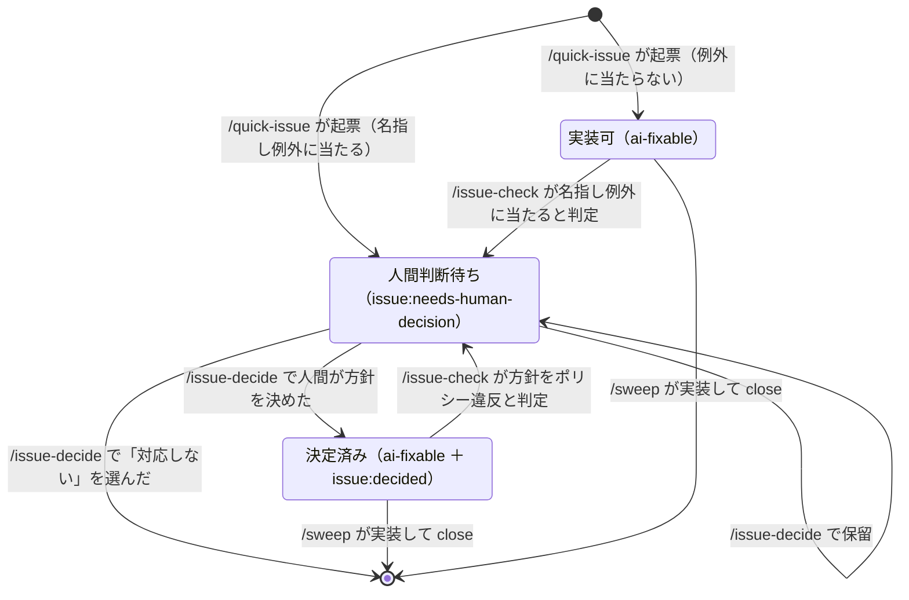

# /issue-decide

`issue:needs-human-decision` が付いた open Issue を古い順に1件ずつ取り上げ、論点を人間に示して方針を決め、決まった方針を本文へ書き戻して `ai-fixable` に変換する。**`/sweep` の前処理**として、人間が対話しながら打つ。

`/quick-issue` は[名指し例外](../quick-issue/SKILL.md)——不可逆・外部に出る／要件が変わる／ポリシー同士の衝突／実測が要る／恒久的に保守が要る資産の新設——に当たる Issue に `issue:needs-human-decision` を貼る。だがこのラベルが付いた Issue を前へ進める担当がいない——`/issue-check` は方針がポリシーに合うかを監査し、`/sweep` は `ai-fixable` を実装する。どちらも人間判断待ちの Issue を素通りする。**本スキルがその担当である。**



「決定済み」が名指し例外では押し戻されないのが要点である。人間が例外を承知で決めた方針を、同じ例外で戻さない。

## 前提

- **始めるタイミングは人間が握る。** 人間の応答を待ちながら進むので、いつ走らせるかは人間が決める。
- **リポジトリのファイルは変更しない。** 触るのは GitHub Issue（本文・ラベル・コメント・close）だけである。実装は `/sweep` の仕事である。
- **人間は Issue を読んでいない前提で書く。** 判断に要る材料は、こちらが本文から取り出して示す。
- **方針の監査はしない。** ラベルが名指し例外に本当に当たるか、対応方針がポリシーに合うかは `/issue-check` の責務である。ここで重ねると判定が2箇所に散る。

## Phase 1: 対象の決定

```bash
gh issue list --state open --limit 50 --search 'label:boy-scout label:"issue:needs-human-decision"' \
  --json number,title --jq 'sort_by(.number) | .[] | "\(.number)\t\(.title)"'
```

引数の解釈は次のとおり。

| 引数           | 対象                                      |
| -------------- | ----------------------------------------- |
| なし           | 一覧の全件                                |
| 数字1つ（≤20） | 一覧の古い順にその件数                    |
| Issue番号の列  | その Issue だけ（ラベルの有無を問わない） |

対象が0件なら、その旨を伝えて終了する。決めた対象リストを表示してから Phase 2 へ進む。

## Phase 2: 1件ずつ処理する

対象を**古い順に1件ずつ**、2-1 〜 2-6 を最後まで通してから次の Issue へ移る。

### 2-1. 本文を読む

後で差し替えるので、最初からファイルへ書き出す。

```bash
gh issue view <番号> --json body --jq .body > <スクラッチパッド>/issue-<番号>.md
```

### 2-2. 論点の裏取り

「現状」表の対象箇所を Read・Grep で開き、**実在するか**と、**本文の記述と現物がずれていないか**を見る。ポリシー照合はしない（`/issue-check` の責務）。

古い前提のまま人間に決めさせないためである。対象箇所が消えていれば論点も消えているので、2-4 の第一選択肢を「対応しない（close する）」にする。

### 2-3. ブリーフィングを出す

**本文の貼り付けにしてはならない。** 人間は Issue を読んでいないので、決めるのに要る分だけに畳む。全体で15行以内。

| 見出し               | 中身                                             |
| -------------------- | ------------------------------------------------ |
| 一言でいうと         | 何が困っているかを1文                            |
| なぜ人間に来たか     | 該当する名指し例外を1文                          |
| 論点                 | 何を決めるかを1文                                |
| 案                   | 表（案／利点／欠点／AI の見立て）                |
| 裏取り               | 対象箇所が実在するか、本文と現物がずれていないか |
| 決めないとどうなるか | 1文                                              |

本文の「どう気づいたか」は落とす。経緯は決定に要らない。

### 2-4. 方針が決まるまで対話する

**1問で終わらせない。** 1問ずつ出し、決着するまで問いを重ねる。

**決着の判定基準**：この会話を知らない別セッションが、方針を決め直さずに着手できるか。具体的には「対応方針」の**採る案・根拠・却下した案を、推測を混ぜずに書き切れる**状態になったら決着とする。書けない項目が残っているうちは、その項目を埋める問いを次に出す。

最初の問いは案の選択にする。

- 先頭は AI の見立てが有力な案に置き、ラベル末尾に「（推奨）」を付ける。
- **最後は必ず「対応しない（close する）」**を置く。
- 案が3つを超えるときは有力3案＋close にする。残りは 2-3 の表に出してあるので Other で選べる。
- **「保留」は最初の問いには入れない。** 決着を試す前に逃げ道を出すと、そちらへ流れる。Other に「保留」と書かれたら、本文もラベルも触らず次の Issue へ移る。
- label・description は**会話依存の指示語を使わず、対象を毎回名指しして書く**。選択肢は応答本文とは別のパネルに出るので、本文を読まずに選べる必要がある（CLAUDE.md）。

続く問いは、返ってきた答えの型で決める。

| 人間の返答                             | 次に出す問い                                                                  |
| -------------------------------------- | ----------------------------------------------------------------------------- |
| 案を選んだが、その案に未決の分岐が残る | 分岐を1つずつ潰す（例：足す先はどのファイルか）                               |
| 条件・懸念を付けて選んだ               | その条件を「対応方針」に書ける形へ翻訳し、解釈が合っているか確かめる          |
| どの案とも違う考えを述べた             | それを案として組み直し、却下する既存案と対にして示す                          |
| 判断材料が足りないと言われた           | **問い返さず自分で調べる。** 現物・ポリシーを読んで材料を出し、問いを立て直す |

3つ以上の具体的な選択肢に絞れる問いは `AskUserQuestion` を使う。絞れないなら会話文で1問だけ聞く。

決着したら、**決めた内容を1文にして人間に見せてから** 2-5 へ進む。取り違えたまま本文を書き換えると、誤りがそのまま `/sweep` の実装まで通る。

### 2-5. 決定を Issue へ反映する

`gh` を並列で叩かない。同じ Issue へ本文・ラベル・コメントが同時に飛ぶと、後から投げたほうが前の更新を消す。

| 人間の選択        | すること                                                 |
| ----------------- | -------------------------------------------------------- |
| 案を選んだ        | 本文差し替え → ラベル貼り替え → コメント                 |
| 対応しない        | 理由コメント付きで close                                 |
| Other（自由入力） | 入力を採る案として本文に書き、根拠に「人間の指示」と明記 |
| Other に「保留」  | 何もせず次の Issue へ                                    |

#### 割り込みが無かったことを確かめる

対話のあいだ時間が空くので、その間に別セッションが本文を変えていることがある。**反映の前に必ず確かめる。**

```bash
gh issue view <番号> --json body --jq .body | diff - <スクラッチパッド>/issue-<番号>.md
```

差分が出たら反映せず中断し、その事実を報告する。黙って上書きすると、他セッションの編集が消える。

#### 本文を差し替える

書き出したファイルを Read し、Edit で該当セクションだけを差し替える。本文全体を書き直してはならない。

1. **「人間に決めてほしいこと」を削除し、同じ位置に「対応方針」を書く。** `/quick-issue` はこの2セクションを排他と定めている（[quick-issue のテンプレート](../quick-issue/SKILL.md)）。書式もそこに従う（採る案・根拠・却下した案）。
2. 根拠に **「人間が決定（YYYY-MM-DD）」** を明記し、選ばれなかった案を「却下した案」へ移す。
3. **タスク一覧から「案を人間が決める」タスクを消し、決まった案に沿って書き直す。** 残すと `/sweep` が何を直すか決められず、離脱する。
4. 完了条件が案に依存していれば直す。

```bash
gh issue edit <番号> --body-file <スクラッチパッド>/issue-<番号>.md
```

#### ラベルを貼り替える

```bash
gh issue edit <番号> --add-label ai-fixable,issue:decided --remove-label issue:needs-human-decision
```

Issue 番号を直接指定して処理し、`issue:needs-human-decision` が付いていなかったときは `--remove-label` を省く。

`issue:decided` は「**人間が名指し例外を承知のうえで方針を決めた**」印である。これが無いと、`issue-auditor-agent` が同じ名指し例外を再判定し、`issue:needs-human-decision` へ押し戻す。名指し例外の多くは作業そのものの性質（不可逆である・新設である）で、方針が決まっても消えないからである。

#### 決定をコメントで残す

```bash
gh issue comment <番号> --body "<何を決めたか・なぜか・却下した案>"
```

本文だけでは「誰がいつ決めたか」が残らない。次に開いた人が方針を蒸し返さないために要る。

### 2-6. 反映できたか確かめる

次を全部満たしてから次の Issue へ移る。1つでも欠けると、**人間が決めたのに `/sweep` が動かない Issue** が残る。

- [ ] 決めた内容の1文を人間に見せた
- [ ] 「人間に決めてほしいこと」が消え、「対応方針」に採る案・根拠・却下した案が入っている
- [ ] タスク一覧から「案を人間が決める」タスクが消えている
- [ ] ラベルが `ai-fixable` ＋ `issue:decided` になっている
- [ ] 決定のコメントを残した

## Phase 3: 報告

処理した Issue を表にして報告する。

| Issue | タイトル | 決めたこと                            | 取った操作                     |
| ----- | -------- | ------------------------------------- | ------------------------------ |
| #271  | …        | 案1（中身は agent、呼び出しは Skill） | 本文差し替え＋ラベル＋コメント |
| #280  | …        | 対応しない                            | close                          |
| #281  | …        | 保留                                  | なし                           |

末尾に **`/sweep` へ渡せる Issue 番号の一覧**を出す。人間はこれを見て `/sweep` を打つ。

## エラーハンドリング

| ケース                                     | 対応                                                                                                                                                |
| ------------------------------------------ | --------------------------------------------------------------------------------------------------------------------------------------------------- |
| 本文に「人間に決めてほしいこと」が無い     | 本文から論点を組み立てて示す。案が無ければ2案作り、「AI が作った案」と明記する                                                                      |
| 対象箇所が実在しない                       | 第一選択肢を「対応しない（close する）」にする                                                                                                      |
| `issue:decided` が未作成で `gh` が失敗する | `gh label create "issue:decided" --description "人間が名指し例外を承知で方針を決めた Issue。名指し例外による差し戻しをしない"` を実行して再実行する |
| 別セッションの更新が入っている             | 上書きせず中断し、その事実を報告する                                                                                                                |
| 問いを2巡しても決着しない                  | そこで初めて保留の可否を聞き、保留なら次へ移る。何が分かれば決まるかをコメントで残す                                                                |
| 人間が応答を打ち切った                     | そこまでの反映は残る。残りの Issue を報告して終了する                                                                                               |

## 使用方法

```
/issue-decide          # issue:needs-human-decision の open Issue を全件
/issue-decide 3        # 古い順に3件だけ
/issue-decide 271 280  # 指定した Issue だけ
```

引数: $ARGUMENTS
