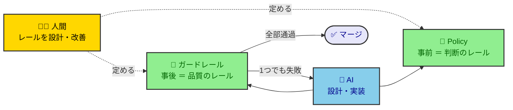
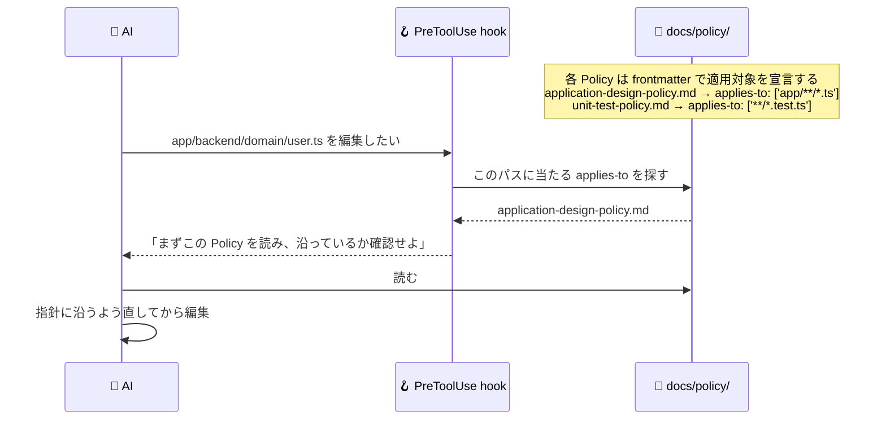

# ポリシー駆動開発テンプレート

AI が主体で開発を進めるためのリポジトリテンプレート。人間は成果物を1つずつ検品する代わりに、AI が走る**レール**を設計・改善する（Human-on-the-Loop）。

思想・開発フローの全体像は [AI 駆動開発フローガイド](https://kasiopeiya.github.io/claude-dev-template/) を参照（実体は `docs/guide/ai-driven-dev-flow.html`）。

## 2本のレール

AI は確率論的で、同じ指示でも出力が揺れる。その揺れを、**事前**に判断を揃える Policy と、**事後**に逸脱を機械的に止めるガードレールの2本で受け止める。



レールが充実するほど、人間が個別の成果物を見なくても品質が保たれる。レールへの投資が、品質を落とさずに AI への委譲度を上げる唯一の方法である。

## Policy — 判断のレール

判断が割れる事柄に「私たちの立場」を先に決めておく。AI はそれを読んで自分で決めるので、人間に確認が飛んでこない。
Policy を確実に読ませるため、hook で強制する仕組みを作っている。



適用対象を Policy 自身が持つので、Policy を増やしても hook 側は変更しなくてよい。判断の種類ごとにどんな Policy があるかは [docs/policy-hub.md](docs/policy-hub.md) に一覧がある。

## ガードレール — 品質のレール

AI の成果物はすべて関門を通る。**1つでも落ちたらマージ不可**——人間の検品を待たず AI へ差し戻して再挑戦させる。AI が確率論的だからこそ、関門は同じ入力に必ず同じ判定を返す決定論的なチェックで固める。

| 関門                        | 何を止めるか                                                                       | 定義の場所                                                                                          |
| --------------------------- | ---------------------------------------------------------------------------------- | --------------------------------------------------------------------------------------------------- |
| 静的解析（ESLint / 型検査） | 書き方の逸脱（`any`・import 順序・未使用変数・await 忘れ・型エラー など）          | `eslint.config.mjs`・各 `tsconfig.json`                                                             |
| コードメトリクス            | 複雑さ（循環的/認知的複雑度・関数の行数・引数の数・ネストの深さ）                  | しきい値は `.claude/rules/typescript.md`、適用は `eslint.config.mjs`                                |
| アーキテクチャテスト        | 構造の腐り（レイヤー依存の向き・循環依存・凝集度）                                 | `app/backend/test/`                                                                                 |
| 不要物・脆弱性              | 増えっぱなし（未使用の export・ファイル・依存、脆弱性のある依存）                  | `knip.jsonc`・`scripts/audit-dependencies.mjs`                                                      |
| テスト                      | 振る舞いの退行（単体テスト・CDK snapshot ＋ synth・dev 環境での結合テスト）        | 各ワークスペースの `*.test.ts`・`infra/test/`                                                       |
| CLAUDE.md 文字数検査        | 毎セッション消費する文脈の肥大（CLAUDE.md と `@` import 先の合計文字数が上限超過） | 上限は `docs/policy/policy-driven-development-policy.md`、判定は `scripts/check-claude-md-size.mjs` |

## 使い方

```bash
npm install          # 依存を導入（git hooks も設定される）
npm run check:static # 静的解析（ESLint・knip・型検査）
npm run format       # フォーマット
```

このテンプレートを使う手順:

1. `docs/` 配下を自分のプロジェクトの内容に書き換える（Policy はそのまま使える。要件定義・設計書は空の状態から書く）
2. 新規に立ち上げるなら [docs/guide/new-development-guide.md](docs/guide/new-development-guide.md) に従って要件定義 → Plan → 起点 Issue を作る
3. 以降は Claude Code に Issue 番号を渡すだけでよい。AI が Issue に書かれた開発フロー（設計書更新 → 実装 → レビュー → CI）を読み取り、対応するスラッシュコマンドを順に自分で実行する。各ステップの説明は [docs/guide/development-flow.md](docs/guide/development-flow.md) にある

## 変更してはならないパス

以下はハーネスで利用しており、リネーム・移動すると `.claude/hooks`・`.claude/skills`・CI・静的解析設定が壊れるパス。中身の編集や配下への新規ファイル追加は自由。

### docs/ 配下

| パス                                                                               | 固定である根拠                                                                                                                                                                      |
| ---------------------------------------------------------------------------------- | ----------------------------------------------------------------------------------------------------------------------------------------------------------------------------------- |
| `docs/policy-hub.md`                                                               | CLAUDE.md・ほぼ全スキルが起点として直接参照                                                                                                                                         |
| `docs/policy/`（ディレクトリ＋各ファイル名）                                       | `.claude/hooks/policy-loader.mjs` がこのパスを直接読み込み、front-matter `applies-to` で自動アタッチする。個々のファイル名も多数のスキルから SSOT として直接参照される              |
| `docs/design-hub.md`                                                               | CLAUDE.md・design/to-plan/check-plan/cdk-imp 等が起点として直接参照                                                                                                                 |
| `docs/design/`（ディレクトリ名）                                                   | `design-doc-policy.md` の `applies-to` が参照。中の個別設計書は自由に追加・更新可                                                                                                   |
| `docs/runbook/`（ディレクトリ名）                                                  | `runbook-policy.md` の `applies-to` が参照。中の個別手順書は自由に追加・更新可                                                                                                      |
| `docs/adr/`, `docs/adr/adr-template.md`, `docs/adr/adr-index.md`                   | create-adr/decide-tech-stack スキル・`.githooks/pre-commit` がファイル名までハードコード参照。一覧表は各 ADR の frontmatter から `npm run gen:adr-index` で生成する（手編集しない） |
| `docs/reference/glossary.md`, `docs/reference/non-functional-requirement-items.md` | to-plan・elicit-requirements・quick-issue 等が SSOT として直接参照                                                                                                                  |
| `docs/reference/test-terms.md`                                                     | `policy-hub.md` の一覧、`test-strategy-policy.md`・`unit-test-policy.md` がテストダブル定義の SSOT として直接参照                                                                   |
| `docs/guide/`（ディレクトリ名）＋ `docs/guide/development-flow.md`                 | decide-tech-stack・code-review スキルがディレクトリを直接参照。`development-flow.md` は CLAUDE.md・to-plan スキルがファイル名まで参照。他の個別ガイドは自由に追加・改名可           |
| `docs/requirements.md`                                                             | `requirements-doc-policy.md` の `applies-to`、elicit-requirements/decide-tech-stack/requirements-review スキルの既定パス                                                            |

### トップレベル

| パス                                    | 固定である根拠                                                                                                                                                                                                         |
| --------------------------------------- | ---------------------------------------------------------------------------------------------------------------------------------------------------------------------------------------------------------------------- |
| `infra/`                                | CI（`pipeline.yml`/`dev-destroy.yml`）の working-directory・変更検知、`knip.jsonc` の workspace キー、`eslint.config.mjs` のファイル glob、`cdk-design-policy.md` の `applies-to`、cdk-review スキルが直接ハードコード |
| `app/`, `app/backend/`, `app/frontend/` | 同様に CI・knip・eslint に加え `application-design-policy.md`/`application-logging-policy.md`（`app/**`）、`frontend-design-policy.md`（`app/frontend/**`）が `applies-to` でハードコード                              |
| `eslint-rules/`                         | `eslint.config.mjs` が直接 import、`knip.jsonc` の `project` glob が参照                                                                                                                                               |

`infra/`・`app/` は**場所（ディレクトリ名）だけ**固定で、中身（`parameter.ts` の値、`lib/` 配下のスタック/Lambda 実装、`app/backend/domain` 等のサンプルロジック）は自由に差し替えてよい。

### ルート静的解析ゲート設定

| パス                                | 固定である根拠                                           |
| ----------------------------------- | -------------------------------------------------------- |
| `eslint.config.mjs`                 | ESLint ルール定義・自作ルール import 元。CI もこれを実行 |
| `tsconfig.json`（ルート）           | ルートの型検査設定                                       |
| `.prettierrc.js`, `.prettierignore` | フォーマッタ設定                                         |
| `knip.jsonc`                        | 未使用コード検出の workspace 定義                        |
| `package.json`（ルート）            | `scripts`・devDependencies。CI がスクリプト名を直接実行  |

### ファイル名でポリシーが発火するもの

以下のポリシーは `applies-to` にファイル名のキーワードを含む。**キーワードを外れた名前を付けると、ポリシーが無言で適用されない。** 新規ファイルを作るときは、この表の名前に合わせる。

| ファイル名に含める語                            | 発火するポリシー              | 対象                                       |
| ----------------------------------------------- | ----------------------------- | ------------------------------------------ |
| `infra`（`docs/design/` 配下の `.md`）          | `iac-infra-design-doc-policy` | インフラ設計書                             |
| `monitoring` / `Monitoring` / `alarm` / `Alarm` | `monitoring-policy`           | 監視・アラームを定義する `.ts`             |
| `table` / `Table`                               | `database-design-policy`      | テーブル定義を扱う `.ts`                   |
| `config` / `parameter`                          | `configuration-policy`        | 構成値を扱う `.ts`・`config/` 配下・`.env` |

なお `.claude/`・`.github/` はこのセクションの対象外（ハーネス本体として別枠で扱う）。
