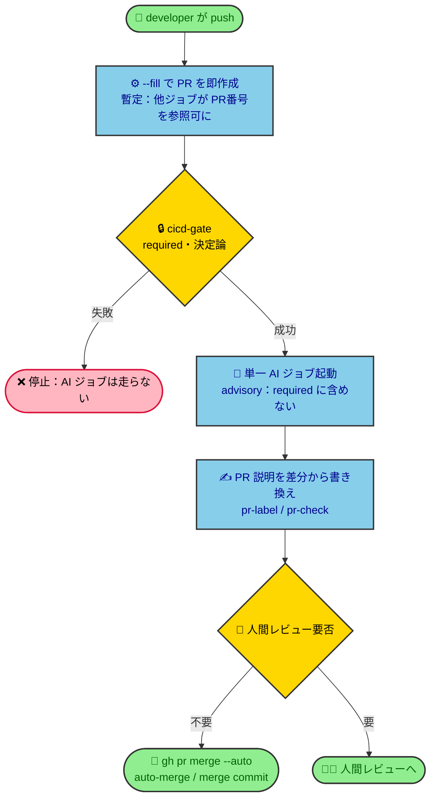

# ADR-001: CI/CD に AI（PR説明書き換え・pr-label・pr-check・auto-merge）を導入する

> [!IMPORTANT]
> **TL;DR（この決定の要点）**
>
> - PR説明の最終稿・レビュー要否判定・auto-merge を、cicd-gate 成功後の単一 AI ジョブに任せる（AI は required check には含めない advisory）
> - AI 実行は公式 `anthropics/claude-code-action` をサブスク OAuth 認証で使う。「サードパーティ Action を使わない」方針の唯一の例外として扱う

## コンテキスト（なぜ決めるのか）

旧設計では、PR説明は push 直後に `--fill`（commit メッセージの機械的な要約）で生成されるのみで、マージは常に人間の手動操作だった。変更種別の判定は自前実装のみで、サードパーティ製 GitHub Action は一切使わない方針を貫いていた（cicd-design「変更種別の判定を自前で書く」）。

#53 で、PR説明のAI書き換え・`/pr-label`・`/pr-check`・auto-merge を CI/CD に組み込むことが決まった。これは cicd-design の芯（マージ可否の required check は cicd-gate 1本＝決定論）に触れる変更であり、なぜ旧設計から変えたかを固定しないと、別セッションが意図を再構築できず容易に壊す。

## 決定（何を選んだか）

1. **PR説明の生成方式を二段にする**：push 直後は `--fill` で PR を即座に作成し（他ジョブが PR 番号を参照できるようにするための暫定）、cicd-gate 成功後に AI が差分全体を見て本文を書き換える。
2. **auto-merge を導入する**：cicd-gate 成功後の単一 AI ジョブが PR 説明書き換え・pr-label・pr-check の判定を advisory として行い、人間レビュー不要と判定した PR は GitHub ネイティブの `gh pr merge --auto`（merge commit）で自動マージする。AI の判定は required check には含めない。
3. **AI 実行方式に公式 `anthropics/claude-code-action` を採用する**：Claude サブスク OAuth 認証（secret `CLAUDE_CODE_OAUTH_TOKEN`）で動かし、API 従量課金は使わない。「サードパーティ製 Action を使わない」という既存方針の例外として扱う。

PR のライフサイクル（二段フローと advisory/required の分岐）：

## 採用理由（なぜこれを選んだか）

- 旧設計の `--fill` は commit メッセージの機械的要約に留まり、PR全体の差分を踏まえた説明を書けなかった。AI書き換えの導入でその不足を解消する。
- 旧設計はマージが常に人間の手動操作だった。AI を required check（cicd-gate）には入れず advisory に留めることで、cicd-design の芯である決定論を壊さずに auto-merge という新しい価値を追加できる。
- 旧設計はサードパーティ製 Action を一切使わない方針だった。AI 実行を自前実装するコスト・危険（プロンプトインジェクション対策・API管理）は、Anthropic 公式が保守する `claude-code-action` を使う利点を上回らないため、この1点に限り方針の例外を認めた。

現在の構成がなぜこの形で成り立つか（cicd-gate 後集約・required check の設計等）の詳細は [cicd-design.md](../design/cicd-design.md) の「採用理由」を参照。ここでは旧設計から変えた理由だけを記す。

## 検討した代替案（なぜ却下したか）

| 案                   | 内容                                                                                | 却下理由                                                                                                               |
| -------------------- | ----------------------------------------------------------------------------------- | ---------------------------------------------------------------------------------------------------------------------- |
| 旧設計のまま         | `--fill` を据え置き、AI 生成を導入しない                                            | 目的（PR説明の AI 自動生成）を満たせない                                                                               |
| 構成そのものの代替案 | AI を cicd-gate に入れる／自前の待機ワークフロー／PR説明の AI 生成のみ作成時実行 等 | 現在の構成に対する却下案であり [cicd-design.md](../design/cicd-design.md)「却下案」に集約（本 ADR と二重管理にしない） |

## トレードオフ・影響

| 受け入れる制約・リスク                         | 影響範囲                                                                | 緩和策                                                                                                          |
| ---------------------------------------------- | ----------------------------------------------------------------------- | --------------------------------------------------------------------------------------------------------------- |
| サードパーティ Action 不使用の原則に例外を作る | `claude-code-action` がリポジトリ権限を持って動く                       | 公式・サブスク認証という条件下のみ許容する限定例外。他 Action に前例を広げない                                  |
| secret 管理が新たに必要になる                  | `CLAUDE_CODE_OAUTH_TOKEN` の設定・失効管理が運用に加わる                | 欠落時は AI ジョブのみ失敗。advisory なので cicd-gate は赤くならない                                            |
| auto-merge 有効化の前提が増える                | GitHub 設定で `Allow auto-merge` 有効化・cicd-gate の required 化が前提 | 設定漏れがあると auto-merge が機能しないだけで、マージ自体は壊れない                                            |
| AI の非決定性                                  | AI の判定がブレうる                                                     | AI はマージ可否を決めず「人間レビュー要否」の advisory 判定に留める。ブレても最悪人間レビューに倒れ安全側に働く |

## 参照

- [cicd-design.md](../design/cicd-design.md) — 現在の設計の構造・採用理由・却下案
- [cicd-policy.md](../policy/cicd-policy.md) — ツールに依存しない CI/CD 方針
- [pr-review-policy.md](../policy/pr-review-policy.md) — AIセルフレビュー・レビュー前提条件
- Issue #53, #56
