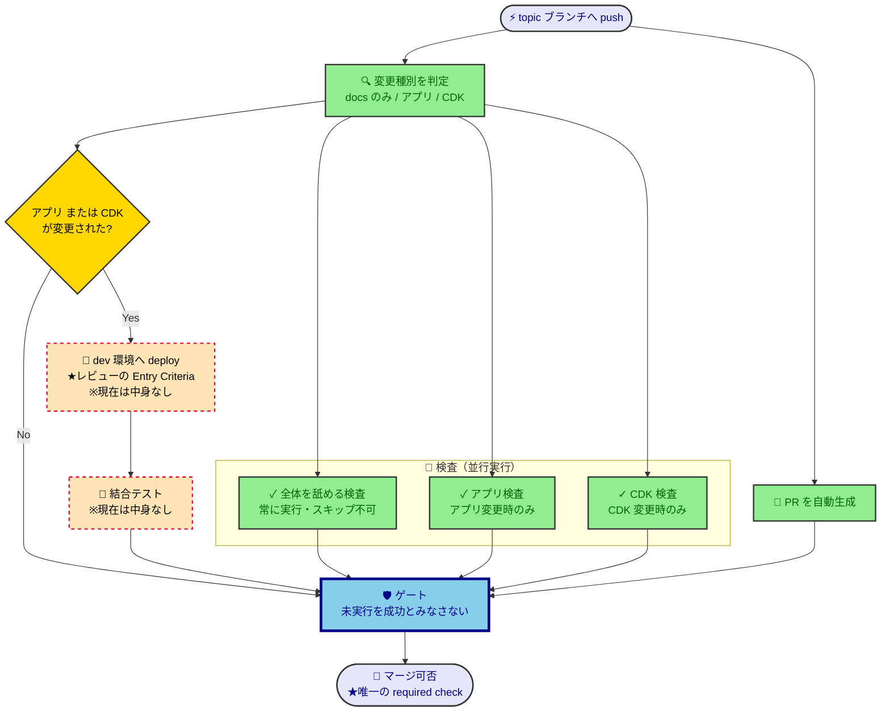

# CI/CD パイプライン設計

このリポジトリの CI/CD を変更・レビューする開発者／AIが、**なぜこの構成なのか**を知りたいときに参照する。ツールに依存しない方針は [cicd-policy](../policy/cicd-policy.md) が定める。実行される処理・条件・順序は `.github/` 配下の定義が SSOT であり、本書には転記しない。

> [!IMPORTANT]
> **TL;DR（この設計の決定事項）**
> - **PR マージ前に dev へ deploy し、その成功をレビューの Entry Criteria とする**（CDK は deploy しないと分からないエラーが多いため）
> - 検査は並行に走らせ、**マージ可否を決める required check はゲート1つだけ**にする
> - 環境は dev 1つ。ブランチ間で奪い合うが、開発環境なので上書きを許容する

## 設計の芯：deploy 成功がレビューの Entry Criteria である

**CDK は deploy しないと分からないエラーが多い。** IAM の制約・リソース名の衝突・サービス上限など、synth やスナップショットテストでは捕まらない実行時のエラーがある。

つまり未 deploy のコードをレビューに回すと、**そのレビューは無駄になりうる**。deploy して初めて落ちると、レビューのやり直しが発生する。だから deploy の成功を、レビューを始めてよい条件（Entry Criteria）に据える。

この設計の他の判断——マージ前に deploy すること・dev の奪い合いを許すこと・アプリ変更でも deploy すること——は、**すべてここから導かれている**。迷ったときは「deploy 成功を Entry Criteria として守れるか」で判断する。実行時間や環境の綺麗さは、これに従属する。

## パイプラインの全体像

赤い破線の枠は、**中身を持たないもの**（「既知の制約」参照）。

## なぜこの構造・方式を選んだか（採用理由）

| 判断 | なぜ |
|---|---|
| **マージ前**に dev へ deploy する | 設計の芯。マージ後 deploy では、レビュー時点で deploy 成功が保証されない |
| dev の上書き・奪い合いを許容する | 開発環境だから。Entry Criteria を守る対価として意識的に払う |
| ブランチを跨いで deploy を直列化する | 環境が1つしかないため。並行 deploy は互いの結果を壊し、Entry Criteria の証拠にならない |
| ブランチが最新の取り込み済みであることを要求する | 「検査したコード ≒ マージされるコード ≒ dev 環境の実体」を成立させる。これが崩れると Entry Criteria が意味を失う |
| 最新の取り込みを **merge commit** で行う（rebase しない） | [git-policy](../policy/git-policy.md) が rebase を禁じている（履歴の書き換えが `git bisect` を妨げるため） |
| 検査を「全体を舐めるもの／アプリ固有／CDK 固有」の3つに割る | 静的解析はルールを1箇所で定義しているので、走らせるには全階層の依存が要る。だからスキップできない。条件付きにできるのは固有の検査だけ |
| **アプリ変更でも** deploy する | アプリは CDK が deploy する。変更を反映するには deploy が要る |
| required check をゲート1つに集約する | ジョブを個別登録すると、required の一覧がリポジトリ設定（コード外）に住む。ジョブを増やしたときの登録漏れが静かに穴を開け、テンプレートとしてコピーされた先に設定は付いてこない |
| ゲートは上流の結果に関わらず必ず実行し、一つずつ成功を確認する | GitHub は「実行しなかった」を「成功」と同じものとして扱う。上流に繋ぐだけのゲートは、検査が丸ごと走らなかったときに——赤くならずに——静かに開く。**未実行は検証の不在であって、検証の成功ではない** |
| 変更種別の判定を自前で書く | サードパーティ製の Action は、このリポジトリの権限を持ったまま他人のコードを動かす。数行で書けるものと、その権限を引き換えにしない |

## どの代替案を、なぜ却下したか（却下案）

| 却下案 | 理由 |
|---|---|
| マージ後に deploy する（王道のトランクベース） | レビュー時点で deploy 成功が保証されない＝設計の芯を満たせない |
| PR ごとの使い捨て（ephemeral）環境を作る | 1アカウント1環境という前提を崩す。コストと複雑さも、テンプレートの初期足場として過剰 |
| マージ前 deploy に加えて、マージ後にも deploy する | deploy が2倍になり仕組みが重複する。最新の取り込みを要求していれば dev と main はほぼ一致する |
| PR 作成と検査を2つのフローに分ける | 検査対象がマージ結果になる利点はあるが、最新の取り込みを要求すれば差はほぼ消える。1つで全体の流れが読める方を採った |
| draft PR の間は deploy しない | 仕組みが増える。Entry Criteria は早く得たいので、作業途中でも deploy してよい |
| 検査を1つに統合する | 並行実行できなくなる |
| 静的解析のルールを階層ごとに分割する | CI の都合で「ルールを一元定義する」という静的解析の設計を壊す本末転倒 |
| ゲートを作らず、各検査を個別に required 登録する | required の一覧がコード外に住み、登録漏れが静かに穴を開ける（採用理由の表を参照） |
| 変更種別の判定にサードパーティ製の Action を使う | 他人のコードが、このリポジトリの権限を持ったまま動く（採用理由の表を参照） |

## 既知の制約

| 制約 | 内容 |
|---|---|
| ブランチ名の縛り | [git-policy](../policy/git-policy.md) の定めるプレフィックス以外のブランチは、検査が1つも走らず**無言でマージ不可**になる（エラーも出ない） |
| 待機の押し出し | deploy の直列化は「実行中1つ＋待機中1つ」しか保持しない。活発なブランチが、待機中だった別ブランチの実行を押し出してキャンセルする |

## レビューの前提条件との関係

[pr-review-policy](../policy/pr-review-policy.md) はレビューの最低条件として「CI の全成功」を定めている。文言は静的解析とテストの pass と読めるが、**本設計ではここに deploy の成功まで含む**。これが設計の芯そのものだからである。
