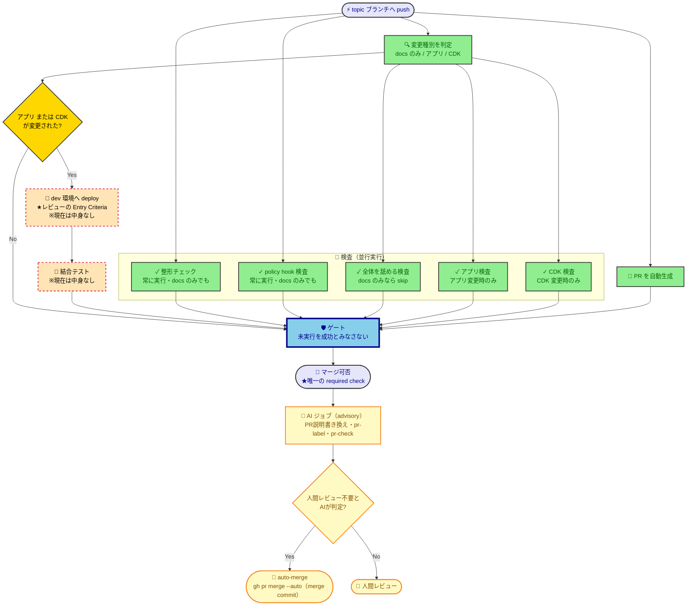

# CI/CD パイプライン設計

このリポジトリの CI/CD を変更・レビューする開発者／AIが、**なぜこの構成なのか**を知りたいときに参照する。ツールに依存しない方針は [cicd-policy](../policy/cicd-policy.md) が定める。実行される処理・条件・順序は `.github/` 配下の定義が SSOT であり、本書には転記しない。

> [!IMPORTANT]
> **TL;DR（この設計の決定事項）**
>
> - **PR マージ前に dev へ deploy し、その成功をレビューの Entry Criteria とする**（CDK は deploy しないと分からないエラーが多いため）
> - 検査は並行に走らせ、**マージ可否を決める required check は cicd-gate 1つだけ**にする（AI は advisory でこの決定論には含めない）
> - 環境は dev 1つ。ブランチ間で奪い合うが、開発環境なので上書きを許容する

## 設計の芯：deploy 成功がレビューの Entry Criteria である

**CDK は deploy しないと分からないエラーが多い。** IAM の制約・リソース名の衝突・サービス上限など、synth やスナップショットテストでは捕まらない実行時のエラーがある。

つまり未 deploy のコードをレビューに回すと、**そのレビューは無駄になりうる**。deploy して初めて落ちると、レビューのやり直しが発生する。だから deploy の成功を、レビューを始めてよい条件（Entry Criteria）に据える。

この設計の他の判断——マージ前に deploy すること・dev の奪い合いを許すこと・アプリ変更でも deploy すること——は、**すべてここから導かれている**。迷ったときは「deploy 成功を Entry Criteria として守れるか」で判断する。実行時間や環境の綺麗さは、これに従属する。

## パイプラインの全体像

赤い破線の枠は、**中身を持たないもの**（「スコープ外」参照）。黄色の枠は、**required check（マージ可否）とは別系統の advisory 処理**（AIの非決定性をブロッキングのゲートに持ち込まないため）。

## なぜこの構造・方式を選んだか（採用理由）

| 判断                                                              | なぜ                                                                                                                                                                                                                                                                                                                     |
| ----------------------------------------------------------------- | ------------------------------------------------------------------------------------------------------------------------------------------------------------------------------------------------------------------------------------------------------------------------------------------------------------------------ |
| **マージ前**に dev へ deploy する                                 | 設計の芯。マージ後 deploy では、レビュー時点で deploy 成功が保証されない                                                                                                                                                                                                                                                 |
| dev の上書き・奪い合いを許容する                                  | 開発環境だから。Entry Criteria を守る対価として意識的に払う                                                                                                                                                                                                                                                              |
| ブランチを跨いで deploy を直列化する                              | 環境が1つしかないため。並行 deploy は互いの結果を壊し、Entry Criteria の証拠にならない                                                                                                                                                                                                                                   |
| ブランチが最新の取り込み済みであることを要求する                  | 「検査したコード ≒ マージされるコード ≒ dev 環境の実体」を成立させる。これが崩れると Entry Criteria が意味を失う                                                                                                                                                                                                         |
| 最新の取り込みを **merge commit** で行う（rebase しない）         | [git-policy](../policy/git-policy.md) が rebase を禁じている（履歴の書き換えが `git bisect` を妨げるため）                                                                                                                                                                                                               |
| 検査を「整形／全体を舐めるもの／アプリ固有／CDK 固有」の4つに割る | 静的解析はルールを1箇所で定義しているので、走らせるには全階層の依存が要る。だからスキップできない。条件付きにできるのは固有の検査だけ                                                                                                                                                                                    |
| 整形チェックだけは切り出して**変更種別に関わらず常に実行**する    | prettier は `.md` も検査対象にしている以上、「docs だから検査不要」は事実に反する。docs のみの PR で飛ばすと、整形の崩れた `.md` がゲートを緑のまま通り、**被害は後続の無関係な PR に出る**（自分が触っていない `.md` で落ちる）。root の依存だけで完結し型情報を要らないため、3階層分の依存が要る全体検査から切り離せる |
| policy hook の検査も切り出して**変更種別に関わらず常に実行**する  | ポリシーの発火対象は `docs/policy/*.md` の frontmatter が宣言する。それだけを直す PR は docs のみの変更と判定され全体検査がスキップされるため、hook の検査を全体検査に含めると**hook を壊す変更でこそ走らない**。整形チェックと同型の判断で、独立ジョブとして常に走らせる（root の依存だけで完結し軽量）                 |
| **アプリ変更でも** deploy する                                    | アプリは CDK が deploy する。変更を反映するには deploy が要る                                                                                                                                                                                                                                                            |
| required check をゲート1つに集約する                              | ジョブを個別登録すると、required の一覧がリポジトリ設定（コード外）に住む。ジョブを増やしたときの登録漏れが静かに穴を開け、テンプレートとしてコピーされた先に設定は付いてこない                                                                                                                                          |
| ゲートは上流の結果に関わらず必ず実行し、一つずつ成功を確認する    | GitHub は「実行しなかった」を「成功」と同じものとして扱う。上流に繋ぐだけのゲートは、検査が丸ごと走らなかったときに——赤くならずに——静かに開く。**未実行は検証の不在であって、検証の成功ではない**                                                                                                                        |
| 変更種別の判定を自前で書く                                        | サードパーティ製の Action は、このリポジトリの権限を持ったまま他人のコードを動かす。数行で書けるものと、その権限を引き換えにしない                                                                                                                                                                                       |
| npm 依存の脆弱性を、階層ごとに分けず**全体を舐める検査**で見る    | Dependabot が npm を見ない穴を塞ぐもの。脆弱性は「どこを変更したか」ではなく「このリポジトリが危ういか」の事実なので、変更箇所に紐づけて条件実行すると、CDK に新規開示された脆弱性がアプリだけの PR から見えなくなる                                                                                                     |
| 脆弱性で落とす閾値を設け、それ未満は落とさない                    | どこまでを受容するかは判断であり、機械に委ねてよいのは正解が一意に決まる作業だけ（[cicd-policy](../policy/cicd-policy.md)）                                                                                                                                                                                              |
| dev をスケジュールで destroy する                                 | コスト節約。この設計では push すれば dev が作り直されるため、消しっぱなしでも困らない                                                                                                                                                                                                                                    |
| PR 説明の最終稿は AI が書き換える（push 直後の `--fill` は暫定にとどめる） | commit メッセージの機械的な要約（`--fill`）は「何を・なぜ変えたか」を人間の言葉で語れない。cicd-gate 通過後に AI が差分全体を見て本文を書き直すことで、pr-review-policy が求める「PR説明の記載」の質を上げる。push 直後は差分がまだ変わりうるため、他ジョブが PR 番号を参照できるよう `--fill` で即座に PR を存在させておく |
| AI 実行方式に公式 `anthropics/claude-code-action` を Claude サブスク OAuth 認証（`CLAUDE_CODE_OAUTH_TOKEN`）で採用する | 「サードパーティ製 Action を使わない」方針（本表参照）の例外。AI 実行の自前実装（プロンプトインジェクション対応・API 管理）のコストは、Anthropic 公式が保守する Action を使う利点を上回らない。サブスク認証にすることで API 従量課金も避けられる                                                                       |
| AI は **advisory**（マージ可否の required check には含めない）    | AI の判断は非決定的（同じ差分でも出力が揺れうる）。cicd-gate の芯は決定論——required check は一意に決まる作業の結果でなければならない（[cicd-policy](../policy/cicd-policy.md)）。AI を cicd-gate に入れると、Claude の障害やブレでマージが止まる                                                                            |
| AI ジョブ（PR説明書き換え・pr-label・pr-check）を **cicd-gate 成功後の単一ジョブに集約**する | 別ジョブに分けると AI ロジックが複数箇所に散り、サブスク枠の消費と pr-check コメントの重複騒音が増える（却下案参照）。cicd-gate を通過した PR にだけ AI を回せば、枠と騒音を最小化できる                                                                                                                                     |
| auto-merge は GitHub ネイティブ機能（`gh pr merge --auto`）・merge commit を使う | 「cicd-gate 成功待ち」を自前のワークフローで再実装すると、コード量と落とし穴が増える（却下案参照）。GitHub に待機を委ねれば、cicd-gate が required check である限り自動的に守られる。merge commit を選ぶのは、[git-policy](../policy/git-policy.md) が rebase を禁じているのと同じ理由（履歴の書き換えを避ける）           |
| AI セルフレビュー（pr-review-policy）を auto-merge 経路に重ねて実施しない | pr-review-policy が求める AI セルフレビューは、実装フローの各 Skill（`/code-dev`・`/cdk-dev` 等）が実装時点で既に実施済み。auto-merge 経路で再度回すのは二重実施であり、advisory ジョブの実行時間とサブスク枠を消費するだけで新たな検出価値がない                                                                       |
| merge に要る `contents: write` は AI ジョブから剥がし、auto-merge を別ジョブに分離して閉じ込める | GitHub Actions の権限は job 単位。AI ジョブは差分（ブランチ作者が書ける文字列）を読むため、プロンプトインジェクションが通った場合を前提に設計する。merge 権限を同居させると injection → `git push` で main を改ざんする経路が構造的に開く。AI ジョブの `contents` を read に固定し、決定論の auto-merge だけを別ジョブ（`contents: write`）へ切り出して塞ぐ |
| AI ジョブの `allowedTools` の Bash を無制限にせず、skill が使う gh サブコマンドだけに限定する | 同じ injection 前提。`Bash` 無制限だと injection が `env`+`curl` で secret を外部送信する経路まで届く（blast radius が最大）。pr-label / pr-check / 本文書き換えが実際に使う `gh pr diff`・`gh pr edit`・`gh pr view`・`gh pr comment`・`gh label list`・`gh label create` だけを許可し、それ以外を構造的に弾く |

## どの代替案を、なぜ却下したか（却下案）

| 却下案                                             | 理由                                                                                                                |
| -------------------------------------------------- | ------------------------------------------------------------------------------------------------------------------- |
| マージ後に deploy する（王道のトランクベース）     | レビュー時点で deploy 成功が保証されない＝設計の芯を満たせない                                                      |
| PR ごとの使い捨て（ephemeral）環境を作る           | 1アカウント1環境という前提を崩す。コストと複雑さも、テンプレートの初期足場として過剰                                |
| マージ前 deploy に加えて、マージ後にも deploy する | deploy が2倍になり仕組みが重複する。最新の取り込みを要求していれば dev と main はほぼ一致する                       |
| PR 作成と検査を2つのフローに分ける                 | 検査対象がマージ結果になる利点はあるが、最新の取り込みを要求すれば差はほぼ消える。1つで全体の流れが読める方を採った |
| draft PR の間は deploy しない                      | 仕組みが増える。Entry Criteria は早く得たいので、作業途中でも deploy してよい                                       |
| 検査を1つに統合する                                | 並行実行できなくなる                                                                                                |
| 静的解析のルールを階層ごとに分割する               | CI の都合で「ルールを一元定義する」という静的解析の設計を壊す本末転倒                                               |
| ゲートを作らず、各検査を個別に required 登録する   | required の一覧がコード外に住み、登録漏れが静かに穴を開ける（採用理由の表を参照）                                   |
| 変更種別の判定にサードパーティ製の Action を使う   | 他人のコードが、このリポジトリの権限を持ったまま動く（採用理由の表を参照）                                          |
| `--fill` を据え置き、PR 説明を AI 生成しない | issue の目的（PR説明のAI自動生成）を満たせない |
| API キー従量課金で AI を動かす | サブスク OAuth 認証（`CLAUDE_CODE_OAUTH_TOKEN`）で足りる用途に、従量課金の管理コストを負う理由がない |
| AI を cicd-gate に入れてブロックする | 非決定性を required check に持ち込み、cicd-gate の決定論を壊す |
| cicd-gate 成功待ちを自前の待機ワークフローで実装する | コード量と落とし穴が増える。「PR 作成と検査を2つのフローに分ける」案（本表）を既に却下しており、同じ理由が再発する |
| PR 説明の AI 生成のみを PR 作成時点で実行する（label・check は別途 cicd-gate 後） | AI ロジックが作成時ジョブと cicd-gate 後ジョブの2箇所に散る |
| AI ジョブを毎 push 並行実行する | サブスク枠の消費と pr-check コメントの重複騒音が増える |
| auto-merge 経路に `/code-review` を必須化する・pr-review-policy を改訂する | 実装フローの各 Skill が実装時点で AI セルフレビューを実施済みであり、重複対応になる |

## どこまで変えてよく、何が不変の前提か（変更可能境界）

| 不変の前提                                                                                    | 壊すとどうなるか                                                                                                                                                                                                                                            | 越えるなら何が要るか                                            |
| --------------------------------------------------------------------------------------------- | ----------------------------------------------------------------------------------------------------------------------------------------------------------------------------------------------------------------------------------------------------------- | --------------------------------------------------------------- |
| **Dependabot が見るのは GitHub Actions だけ**（npm を足さない）                               | GitHub は Dependabot の実行に secrets を渡さない。npm を足すと更新 PR が deploy を起動し、AWS 認証が落ちてゲートが赤くなる——**その PR は永久にマージできない**。npm 依存は代わりに検査側で見る（採用理由の表を参照）ため、この前提は npm を無防備にはしない | Dependabot 用の secrets の設定か、deploy を起動する条件の見直し |
| **dev を触るものは、スケジュールでの destroy も含めて deploy と同じ直列化のグループに入れる** | dev は1環境しかない。別のグループに分けると destroy と deploy が並行し、CloudFormation スタックが壊れる                                                                                                                                                     | —                                                               |
| **AI ジョブの実行に `CLAUDE_CODE_OAUTH_TOKEN`（Claude サブスク OAuth トークン）が secret として設定されている** | secret が欠落・失効すると AI ジョブ（PR説明書き換え・pr-label・pr-check）が失敗する。advisory なので cicd-gate 自体は赤くならないが、AI 機能は動かない | secret の再発行・再設定 |
| **cicd-gate がリポジトリ設定で required check として登録されている** | required 化していないと「マージ可否を cicd-gate 1つに集約する」という設計の芯（TL;DR）が保証されない | GitHub リポジトリ設定で required check を再登録 |
| **リポジトリで Allow auto-merge が有効化されている** | 無効なままだと `gh pr merge --auto` が失敗し、AI が「人間レビュー不要」と判定した PR も自動マージされず人手待ちのまま滞留する | GitHub リポジトリ設定で Allow auto-merge を有効化 |

## 何を意図的に対象外としたか（スコープ外）

| 対象                               | なぜ対象外か                                                                                             |
| ---------------------------------- | -------------------------------------------------------------------------------------------------------- |
| stg・prd への deploy               | 環境は dev 1つだけが前提（TL;DR）。stg・prd を持つ構成になった時点で改めて設計する                       |
| Dependabot の npm エコシステム対応 | npm を対象にすると更新 PR が deploy を起動し、AWS 認証が落ちてゲートが赤くなる（変更可能境界の表を参照） |
| deploy・結合テストの中身           | #31（OIDC ロール構築）の完了が前提。現在は器のみで、図の破線枠がそれを示す                               |
| auto-merge 時の `/code-review` 再実行 | 実装フローの各 Skill が実装時点で AI セルフレビューを実施済みのため（採用理由の表を参照） |

## 既知の制約

| 制約             | 内容                                                                                                                                                                                                                                              |
| ---------------- | ------------------------------------------------------------------------------------------------------------------------------------------------------------------------------------------------------------------------------------------------- |
| ブランチ名の縛り | [git-policy](../policy/git-policy.md) の定めるプレフィックス以外のブランチは、検査が1つも走らず**無言でマージ不可**になる（エラーも出ない）                                                                                                       |
| 待機の押し出し   | dev の直列化は「実行中1つ＋待機中1つ」しか保持しない。活発なブランチが、待機中だった別ブランチの実行を押し出してキャンセルする。destroy も同じグループにいるため、待機中の destroy が押し出されるとその回の削除は飛ぶ（次のスケジュールで消える） |

## レビューの前提条件との関係

[pr-review-policy](../policy/pr-review-policy.md) はレビューの最低条件として「CI の全成功」を定めている。文言は静的解析とテストの pass と読めるが、**本設計ではここに deploy の成功まで含む**。これが設計の芯そのものだからである。
