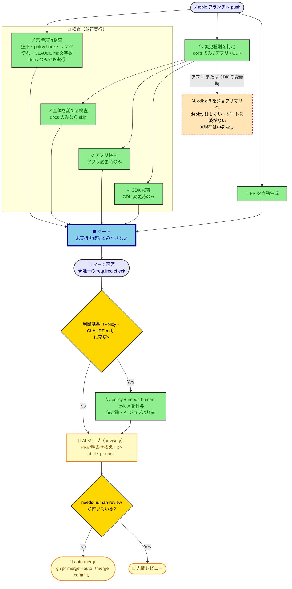
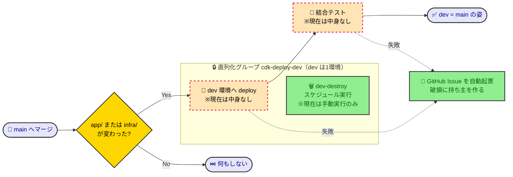

# CI/CD パイプライン設計

このリポジトリの CI/CD を変更・レビューする開発者／AIが、**なぜこの構成なのか**を知りたいときに参照する。実行される処理・条件・順序は `.github/` 配下の定義が SSOT であり、本書には転記しない。

> [!IMPORTANT]
> **TL;DR（この設計の決定事項）**
>
> - **マージ可否の判定から、実環境（AWS）への依存を外す**。deploy は main へマージした後に行う
> - 検査は並行に走らせ、**マージ可否を決める required check は cicd-gate 1つだけ**にする（AI と cdk diff は advisory でこの決定論には含めない）
> - 環境は dev 1つ。deploy する経路は main だけなので、dev にスタックがあるときは必ず main の姿になる（destroy 後は空）

## 設計の芯：マージ可否の判定から、実環境への依存を外す

マージまでの経路には、**実 AWS 環境に触れずに答えが出るものだけを置く**。deploy と結合テストは、main へマージした後に回す。

理由は速さである。トランクベース開発は小さい変更を頻繁に main へ入れることで成り立つ。マージの手前に deploy を置くと、変更が小さいほど待ち時間の割合が大きくなり、頻繁にマージする動機が削られる。

この設計の他の判断——deploy を main の後ろへ置くこと・dev へ入る経路を main だけにすること・cdk diff をゲートに繋がないこと——は、**すべてここから導かれている**。迷ったときは「マージ可否が実環境に依存していないか」で判断する。

対価は、**PR レビューの時点で deploy 成功が確かめられていない**ことである。CDK は deploy しないと分からないエラーが多い（IAM の制約・リソース名の衝突・サービス上限など）。それらは main へ入った後に初めて分かる。この対価は意識して払う。払いっぱなしにしないため、失敗した deploy は GitHub Issue として起票し、壊れた main に持ち主を作る。

## パイプラインの全体像

### マージまで（pipeline）

```mermaid
flowchart TD
    Push([⚡ topic ブランチへ push]) --> PR[📝 PR を自動生成]
    Push --> Detect[🔍 変更種別を判定<br/>docs のみ / アプリ / CDK]
    Push --> AlwaysChecks

    subgraph Checks["🔀 検査（並行実行）"]
        direction TB
        AlwaysChecks["✓ 常時実行検査<br/>整形・policy hook・リンク切れ・CLAUDE.md文字数<br/>docs のみでも実行"]
        Common[✓ 全体を舐める検査<br/>docs のみなら skip]
        App[✓ アプリ検査<br/>アプリ変更時のみ]
        Cdk[✓ CDK 検査<br/>CDK 変更時のみ]
        AlwaysChecks ~~~ Common ~~~ App ~~~ Cdk
    end

    Detect --> Common
    Detect --> App
    Detect --> Cdk

    Detect -->|アプリ または CDK の変更時| Diff["🔍 cdk diff をジョブサマリへ<br/>deploy はしない・ゲートに繋がない<br/>※現在は中身なし"]

    Gate["🛡️ ゲート<br/>未実行を成功とみなさない"]

    AlwaysChecks --> Gate
    Common --> Gate
    App --> Gate
    Cdk --> Gate
    PR --> Gate

    Gate --> Merge([🎯 マージ可否<br/>★唯一の required check])

    Merge --> PolicyCheck{判断基準（Policy・CLAUDE.md）<br/>に変更?}
    PolicyCheck -->|Yes| PolicyLabel["🏷️ policy + needs-human-review を付与<br/>決定論・AI ジョブより前"]
    PolicyCheck -->|No| AiJob
    PolicyLabel --> AiJob

    AiJob["🤖 AI ジョブ（advisory）<br/>PR説明書き換え・pr-label・pr-check"]
    AiJob --> AutoMergeCheck{needs-human-review<br/>が付いている?}
    AutoMergeCheck -->|No| AutoMerge(["🔀 auto-merge<br/>gh pr merge --auto（merge commit）"])
    AutoMergeCheck -->|Yes| HumanReview(["👤 人間レビュー"])

    classDef startEnd fill:#E6E6FA,stroke:#333,stroke-width:2px,color:darkblue
    classDef process fill:#90EE90,stroke:#333,stroke-width:2px,color:darkgreen
    classDef decision fill:#FFD700,stroke:#333,stroke-width:2px,color:black
    classDef gate fill:#87CEEB,stroke:#00008B,stroke-width:4px,color:darkblue
    classDef hollow fill:#FFE4B5,stroke:#DC143C,stroke-width:2px,stroke-dasharray: 5 5,color:black
    classDef advisory fill:#FFF9C4,stroke:#F57F17,stroke-width:2px,color:#7f4f00

    class Push,Merge startEnd
    class PR,Detect,AlwaysChecks,Common,App,Cdk,PolicyLabel process
    class PolicyCheck,AutoMergeCheck decision
    class Diff hollow
    class Gate gate
    class AiJob,AutoMerge,HumanReview advisory
```

赤い破線の枠は、**中身を持たないもの**（「スコープ外」参照）。黄色の枠は、**required check（マージ可否）とは別系統の advisory 処理**（AI の非決定性をブロッキングのゲートに持ち込まないため）。cdk diff がゲートに繋がっていないことが、設計の芯の図での現れである。

### マージ後（deploy-dev）

```mermaid
flowchart LR
    Merged([🎯 main へマージ]) --> PathCheck{app/ または infra/<br/>が変わった?}
    PathCheck -->|No| Skip([⏭️ 何もしない])
    PathCheck -->|Yes| Deploy

    subgraph Serial["🔒 直列化グループ cdk-deploy-dev（dev は1環境）"]
        direction TB
        Deploy["🚀 dev 環境へ deploy<br/>※現在は中身なし"]
        Destroy["🗑️ dev-destroy<br/>スケジュール実行<br/>※現在は手動実行のみ"]
        Deploy ~~~ Destroy
    end

    Deploy --> IT["🧪 結合テスト<br/>※現在は中身なし"]
    IT --> Done([✅ dev = main の姿])
    Deploy -. 失敗 .-> Issue
    IT -. 失敗 .-> Issue["📌 GitHub Issue を自動起票<br/>破損に持ち主を作る"]

    classDef startEnd fill:#E6E6FA,stroke:#333,stroke-width:2px,color:darkblue
    classDef process fill:#90EE90,stroke:#333,stroke-width:2px,color:darkgreen
    classDef decision fill:#FFD700,stroke:#333,stroke-width:2px,color:black
    classDef hollow fill:#FFE4B5,stroke:#DC143C,stroke-width:2px,stroke-dasharray: 5 5,color:black

    class Merged,Skip,Done startEnd
    class Issue,Destroy process
    class PathCheck decision
    class Deploy,IT hollow
```

dev へ入る経路はここ1本だけになる。dev を触るものはスケジュール実行の destroy も含めて同じ直列化グループに入れる（「変更可能境界」参照）。

## なぜこの構造・方式を選んだか（採用理由）

| 判断                                                                                                                   | なぜ                                                                                                                                                                                                                                                                                                                                                                                                                                                                                                                                                                                                        |
| ---------------------------------------------------------------------------------------------------------------------- | ----------------------------------------------------------------------------------------------------------------------------------------------------------------------------------------------------------------------------------------------------------------------------------------------------------------------------------------------------------------------------------------------------------------------------------------------------------------------------------------------------------------------------------------------------------------------------------------------------------- |
| deploy を **main へのマージ後**に行う                                                                                  | 設計の芯（本書冒頭の理由による）                                                                                                                                                                                                                                                                                                                                                                                                                                                                                                                                                                            |
| deploy-dev は `paths` で対象を絞る                                                                                     | required check ではないため、スキップしてもマージ判定が pending のまま残らない（pipeline が workflow レベルの paths を使えないのと対照的）                                                                                                                                                                                                                                                                                                                                                                                                                                                                  |
| dev へ deploy する経路を **main だけ**にする                                                                           | 経路が2つあると「dev にいま何があるか」が一意に決まらない。トピックブランチからの手動 deploy も用意しない                                                                                                                                                                                                                                                                                                                                                                                                                                                                                                   |
| dev を触るものを直列化する                                                                                             | 環境が1つしかない。main への連続 push と、スケジュール実行の destroy が並行すると CloudFormation スタックが壊れる                                                                                                                                                                                                                                                                                                                                                                                                                                                                                           |
| ブランチが最新の取り込み済みであることを要求する                                                                       | 「検査したコード ≒ マージされるコード」を成立させる。これが崩れると、検査を通ったはずの組み合わせが main で初めて壊れる                                                                                                                                                                                                                                                                                                                                                                                                                                                                                     |
| 最新の取り込みを **merge commit** で行う（rebase しない）                                                              | [git-policy](../policy/git-policy.md) が rebase を禁じている（履歴の書き換えが `git bisect` を妨げるため）                                                                                                                                                                                                                                                                                                                                                                                                                                                                                                  |
| 検査を「整形／全体を舐めるもの／アプリ固有／CDK 固有」の4つに割る                                                      | 静的解析はルールを1箇所で定義しているので、走らせるには全階層の依存が要る。だからスキップできない。条件付きにできるのは固有の検査だけ                                                                                                                                                                                                                                                                                                                                                                                                                                                                       |
| docs のみの PR でも落ちうる検査は、全体検査から切り出して**変更種別に関わらず常に実行**する                            | 全体検査は docs のみの PR でスキップされる。docs を直すことで壊れる検査をそこに入れると、**その検査が最も要る場面でこそ走らない**（下表参照）。しかも被害は後続の無関係な PR に出る。切り出せるのは、いずれも root の依存だけで完結し型情報を要らないため（3階層分の依存が要る全体検査と違い軽い）                                                                                                                                                                                                                                                                                                          |
| **アプリ変更でも** deploy する                                                                                         | アプリは CDK が deploy する。変更を反映するには deploy が要る（deploy-dev の paths が `app/` を含む理由）                                                                                                                                                                                                                                                                                                                                                                                                                                                                                                   |
| PR の時点では deploy せず、**cdk diff だけをジョブサマリに出す**                                                       | deploy 成功は得られないが、意図しない置換・削除はレビューで見える。read-only なので dev を奪わず、直列化の待ちも作らない                                                                                                                                                                                                                                                                                                                                                                                                                                                                                    |
| cdk diff を **cicd-gate に繋がない**                                                                                   | 設計の芯。実環境への疎通をマージ可否に持ち込むと、AWS 側の一時障害でマージが止まる。diff は判断材料であって合否ではない                                                                                                                                                                                                                                                                                                                                                                                                                                                                                     |
| main への deploy が失敗したら **GitHub Issue を自動起票する**                                                          | 失敗が required check の外側で起きるため、赤いランは誰の担当にもならない。壊れた main は最新の取り込み要求を通じて全ブランチへ配られるので、持ち主を機械が作る                                                                                                                                                                                                                                                                                                                                                                                                                                              |
| required check をゲート1つに集約する                                                                                   | ジョブを個別登録すると、required の一覧がリポジトリ設定（コード外）に住む。ジョブを増やしたときの登録漏れが静かに穴を開け、テンプレートとしてコピーされた先に設定は付いてこない                                                                                                                                                                                                                                                                                                                                                                                                                             |
| ゲートは上流の結果に関わらず必ず実行し、一つずつ成功を確認する                                                         | GitHub は「実行しなかった」を「成功」と同じものとして扱う。上流に繋ぐだけのゲートは、検査が丸ごと走らなかったときに——赤くならずに——静かに開く。**未実行は検証の不在であって、検証の成功ではない**                                                                                                                                                                                                                                                                                                                                                                                                           |
| 変更種別の判定を自前で書く                                                                                             | サードパーティ製の Action は、このリポジトリの権限を持ったまま他人のコードを動かす。数行で書けるものと、その権限を引き換えにしない                                                                                                                                                                                                                                                                                                                                                                                                                                                                          |
| npm 依存の脆弱性を、階層ごとに分けず**全体を舐める検査**で見る                                                         | Dependabot が npm を見ない穴を塞ぐもの。脆弱性は「どこを変更したか」ではなく「このリポジトリが危ういか」の事実なので、変更箇所に紐づけて条件実行すると、CDK に新規開示された脆弱性がアプリだけの PR から見えなくなる                                                                                                                                                                                                                                                                                                                                                                                        |
| 脆弱性で落とす閾値を設け、それ未満は落とさない                                                                         | どこまでを受容するかは判断であり、機械に委ねてよいのは正解が一意に決まる作業だけ                                                                                                                                                                                                                                                                                                                                                                                                                                                                                                                            |
| **上流が同梱していて手元で直せない**脆弱性だけを、根拠と混入経路を添えて許容する                                       | 上流が脆弱な版を `bundledDependencies` として同梱していると、`overrides` も `npm audit fix` も届かない。落とし続けるか検査ごと外すかの二択はどちらも代償が大きい（却下案の表を参照）ので、許容を経路（`node_modules/<上流>/…`）で1つに縛る。同じ脆弱性でも別経路で入ってきたものは落ちる                                                                                                                                                                                                                                                                                                                    |
| 使われなくなった許容エントリは、逆に**ゲートを落とす**                                                                 | 例外は腐る——上流が直しても例外だけが残り、次に同じ経路で脆弱性が入ったとき静かに通してしまう。「当たらなくなった＝上流が直った」を検知して赤にすれば、例外の寿命を人間の記憶ではなく機械が管理する                                                                                                                                                                                                                                                                                                                                                                                                          |
| dev をスケジュールで destroy する                                                                                      | コスト節約。この設計では main へマージすれば dev が作り直されるため、消しっぱなしでも困らない                                                                                                                                                                                                                                                                                                                                                                                                                                                                                                               |
| PR 説明の最終稿は AI が書き換える（push 直後の `--fill` は暫定にとどめる）                                             | commit メッセージの機械的な要約（`--fill`）は「何を・なぜ変えたか」を人間の言葉で語れない。cicd-gate 通過後に AI が差分全体を見て本文を書き直すことで、pr-review-policy が求める「PR説明の記載」の質を上げる。push 直後は差分がまだ変わりうるため、他ジョブが PR 番号を参照できるよう `--fill` で即座に PR を存在させておく                                                                                                                                                                                                                                                                                 |
| AI 実行方式に公式 `anthropics/claude-code-action` を Claude サブスク OAuth 認証（`CLAUDE_CODE_OAUTH_TOKEN`）で採用する | 「サードパーティ製 Action を使わない」方針（本表参照）の例外。AI 実行の自前実装（プロンプトインジェクション対応・API 管理）のコストは、Anthropic 公式が保守する Action を使う利点を上回らない。サブスク認証にすることで API 従量課金も避けられる                                                                                                                                                                                                                                                                                                                                                            |
| AI は **advisory**（マージ可否の required check には含めない）                                                         | AI の判断は非決定的（同じ差分でも出力が揺れうる）。cicd-gate の芯は決定論——required check は一意に決まる作業の結果でなければならない。AI を cicd-gate に入れると、Claude の障害やブレでマージが止まる                                                                                                                                                                                                                                                                                                                                                                                                       |
| `policy` ラベルの付与を AI に預けず、AI ステップより前の決定論ステップで行う                                           | 判断基準（Policy・CLAUDE.md）が壊れると、以後すべての AI 判断が静かに歪む。対象かどうかはパスだけで決まる決定論的な判定なので、AI の見落としに賭けず機械に落とす。対象パスの正は pr-review-policy の policy 行で、ワークフローの grep はその写し。AI 側（pr-label）にも同じ判定を残すのは、手元で単体実行したときにも再現するため                                                                                                                                                                                                                                                                           |
| AI ジョブ（PR説明書き換え・pr-label・pr-check）を **cicd-gate 成功後の単一ジョブに集約**する                           | 別ジョブに分けると AI ロジックが複数箇所に散り、サブスク枠の消費と pr-check コメントの重複騒音が増える（却下案参照）。cicd-gate を通過した PR にだけ AI を回せば、枠と騒音を最小化できる                                                                                                                                                                                                                                                                                                                                                                                                                    |
| AI・auto-merge を pipeline とは別の **workflow_run ワークフロー**に置く                                                | `claude-code-action` は push イベントを非対応（`Unsupported event type: push`）。pipeline は push トリガーのため AI ジョブを同居できない。pipeline 完了を workflow_run で受ければ、①gate 成功後という順序 ②push＝信頼済み push 権限者のみが起点（fork PR は起点になれない）③ワークフロー定義は main 固定で PR から AI 実行手順を改変されない、を同時に満たす                                                                                                                                                                                                                                                |
| auto-merge は GitHub ネイティブ機能（`gh pr merge --auto`）・merge commit を使う                                       | 「cicd-gate 成功待ち」を自前のワークフローで再実装すると、コード量と落とし穴が増える（却下案参照）。GitHub に待機を委ねれば、cicd-gate が required check である限り自動的に守られる。merge commit を選ぶのは、git-policy が rebase を禁じているのと同じ理由（履歴の書き換えを避ける）                                                                                                                                                                                                                                                                                                                       |
| AI セルフレビュー（pr-review-policy）を auto-merge 経路に重ねて実施しない                                              | pr-review-policy が求める AI セルフレビューは、実装フローの各 Skill（`/code-dev`・`/cdk-dev` 等）が実装時点で既に実施済み。auto-merge 経路で再度回すのは二重実施であり、advisory ジョブの実行時間とサブスク枠を消費するだけで新たな検出価値がない                                                                                                                                                                                                                                                                                                                                                           |
| merge に要る `contents: write` は AI ジョブから剥がし、auto-merge を別ジョブに分離して閉じ込める                       | GitHub Actions の権限は job 単位。AI ジョブは差分（ブランチ作者が書ける文字列）を読むため、プロンプトインジェクションが通った場合を前提に設計する。merge 権限を同居させると injection → `git push` で main を改ざんする経路が構造的に開く。AI ジョブの `contents` を read に固定し、決定論の auto-merge だけを別ジョブ（`contents: write`）へ切り出して塞ぐ                                                                                                                                                                                                                                                 |
| AI ジョブの `allowedTools` の Bash を無制限にせず、skill が使う gh サブコマンドだけに限定する                          | 同じ injection 前提。`Bash` 無制限だと injection が `env`+`curl` で secret を外部送信する経路まで届く（blast radius が最大）。pr-label / pr-check / 本文書き換えが実際に使う `gh pr diff`・`gh pr edit`・`gh pr view`・`gh pr comment`・`gh label list`・`gh label create` だけを許可し、それ以外を構造的に弾く                                                                                                                                                                                                                                                                                             |
| advisory の可観測性を、`show_full_output`／`display_report` ではなく実行ログ JSON を後処理する決定論ステップで付ける   | advisory ジョブは PR コメントを残さず終わる経路（該当ラベルなし・書き換え不要など）があり、ジョブ自体がスキップ／失敗したのか、実行した上で何もしなかったのか後から区別できない。ログに痕跡が要る。ただし全メッセージを公開する `show_full_output`／`display_report` は tool 実行結果ごと晒し secret 混入リスクを負う（allowedTools 限定と同じ injection 前提に反する）。AI が末尾に出す実行サマリ（`.result`）と拒否コマンド（`.permission_denials`）**だけ**を `execution_file` から抽出してラン サマリに残し、露出を最小化する。拒否コマンドの可視化は `allowedTools` の過不足を継続点検する材料も兼ねる |

### 常に実行する検査と、条件実行だと取り逃す場面

| 検査                 | docs のみの PR でも壊れる理由                           |
| -------------------- | ------------------------------------------------------- |
| 整形チェック         | prettier は `.md` も検査対象にしている                  |
| policy hook 検査     | 発火対象は `docs/policy/*.md` の frontmatter が宣言する |
| リンク切れ検査       | 相対リンクは参照先の移動・改名や書き間違いで壊れる      |
| CLAUDE.md 文字数検査 | CLAUDE.md 自体が docs と判定される                      |

## どの代替案を、なぜ却下したか（却下案）

| 却下案                                                                                | 理由                                                                                                                                                                                                                                                            |
| ------------------------------------------------------------------------------------- | --------------------------------------------------------------------------------------------------------------------------------------------------------------------------------------------------------------------------------------------------------------- |
| マージ**前**に dev へ deploy し、その成功をレビューの Entry Criteria とする（旧設計） | CDK は deploy しないと分からないエラーが多く、レビューのやり直しを防げる利点はある。だがマージの手前に最も遅い工程が居座り、変更が小さいほど待ち時間の割合が大きくなる。却下によって失う利点（deploy 成功の事前確認）は「既知の制約」に記載した                 |
| マージ前 deploy を残したまま、cicd-gate の needs から外して advisory にする           | deploy 結果が誰の判断にも使われないまま dev を奪い合い続ける。待ち時間だけが残る                                                                                                                                                                                |
| トピックブランチを dev へ手動 deploy できる `workflow_dispatch` を残す                | dev へ入る経路が2つになり、「dev にいま何があるか」が一意に決まらなくなる                                                                                                                                                                                       |
| cdk diff を cicd-gate の needs に入れる                                               | 実環境への疎通がマージ可否に混ざり、設計の芯が崩れる。AWS 側の一時障害でマージが止まる                                                                                                                                                                          |
| main への deploy が失敗したら revert PR を自動生成する                                | 失敗の原因がコード側にないとき（AWS 側の一時障害など）に、余計な差し戻しが起きる。まず人が原因を見る                                                                                                                                                            |
| PR ごとの使い捨て（ephemeral）環境を作る                                              | 1アカウント1環境という前提を崩す。コストと複雑さも、テンプレートの初期足場として過剰                                                                                                                                                                            |
| PR 作成と検査を2つのフローに分ける                                                    | 検査対象がマージ結果になる利点はあるが、最新の取り込みを要求すれば差はほぼ消える。1つで全体の流れが読める方を採った                                                                                                                                             |
| 検査を1つに統合する                                                                   | 並行実行できなくなる                                                                                                                                                                                                                                            |
| 静的解析のルールを階層ごとに分割する                                                  | CI の都合で「ルールを一元定義する」という静的解析の設計を壊す本末転倒                                                                                                                                                                                           |
| ゲートを作らず、各検査を個別に required 登録する                                      | required の一覧がコード外に住み、登録漏れが静かに穴を開ける（採用理由の表を参照）                                                                                                                                                                               |
| 変更種別の判定にサードパーティ製の Action を使う                                      | 他人のコードが、このリポジトリの権限を持ったまま動く（採用理由の表を参照）                                                                                                                                                                                      |
| `--fill` を据え置き、PR 説明を AI 生成しない                                          | issue の目的（PR説明のAI自動生成）を満たせない                                                                                                                                                                                                                  |
| API キー従量課金で AI を動かす                                                        | サブスク OAuth 認証（`CLAUDE_CODE_OAUTH_TOKEN`）で足りる用途に、従量課金の管理コストを負う理由がない                                                                                                                                                            |
| AI を cicd-gate に入れてブロックする                                                  | 非決定性を required check に持ち込み、cicd-gate の決定論を壊す                                                                                                                                                                                                  |
| cicd-gate 成功待ちを自前の待機ワークフローで実装する                                  | コード量と落とし穴が増える。「PR 作成と検査を2つのフローに分ける」案（本表）を既に却下しており、同じ理由が再発する                                                                                                                                              |
| PR 説明の AI 生成のみを PR 作成時点で実行する（label・check は別途 cicd-gate 後）     | AI ロジックが作成時ジョブと cicd-gate 後ジョブの2箇所に散る                                                                                                                                                                                                     |
| AI ジョブを push トリガーの pipeline 内に同居させる                                   | `claude-code-action` が push を非対応（`Unsupported event type: push`）。同一ワークフローでは AI ジョブだけ別イベントにできない                                                                                                                                 |
| AI ジョブを毎 push 並行実行する                                                       | サブスク枠の消費と pr-check コメントの重複騒音が増える                                                                                                                                                                                                          |
| リンク切れ検査に既存の npm パッケージを使う                                           | 数行の除外規則で足りるものに依存を負わない（dependency-policy）。使わないと決めた機能まで抱え、偽陽性を抑える設定ファイルの保守が増える                                                                                                                         |
| リンク切れ検査にサードパーティ Action を使う                                          | 一般方針は「変更種別の判定を自前で書く」と同じ（採用理由の表を参照）。加えて、ローカルで同じ検査を再現できなくなる                                                                                                                                              |
| リンク切れ検査でアンカー（見出し）・外部URLまで見る                                   | アンカーは見出しの slug 化を自前で再現する必要があり、ずれれば偽陽性になる。外部URLは相手側の停止・rate limit で、自分の変更と無関係にゲートが赤くなる                                                                                                          |
| リンク切れ検査に無視コメント・除外パスリストを用意する                                | 逃げ道は本物のリンク切れも黙らせる。実在しないファイルを指す記述はリンクではなく例示なので、除外機構を足さず**バッククォートで囲む書き方に直す**（検査の失敗メッセージがその道案内を兼ねる）                                                                    |
| リンク切れ検査を pre-commit に置く（CI との併用を含む）                               | 今の pre-commit は自動で整形して再ステージする＝人を止めない設計で、落ちる検査は性格が違う。`--no-verify` が習慣化するとフック全体が無力化する。pre-commit だけに置く案は、フック未設定の環境で素通りするため論外——**マージを止められない検査はゲートではない** |
| CLAUDE.md の文字数検査を CI だけに置き、hook を作らない                               | CI だけだと、AI が CLAUDE.md に書いた直後ではなく push 後まで気づけない。その場で差し戻せば手戻りが最小になる（シフトレフト）                                                                                                                                   |
| CLAUDE.md の文字数検査を hook だけに任せ、CI に置かない                               | hook が効くのは Claude Code 経由の編集だけで、人間がエディタで直接 CLAUDE.md を書き換えると素通りする。**マージを止められない検査はゲートではない**（リンク切れ検査を pre-commit だけに置く案と同じ理由）                                                       |
| auto-merge 経路に `/code-review` を必須化する・pr-review-policy を改訂する            | 実装フローの各 Skill が実装時点で AI セルフレビューを実施済みであり、重複対応になる                                                                                                                                                                             |
| 直せない脆弱性がある階層だけ、脆弱性検査の対象から外す                                | その階層の**他の**脆弱性まで見えなくなる。1件を通すために監視ごと捨てる取引になっている                                                                                                                                                                         |
| 直せない脆弱性は、上流が直すまでゲートを赤いまま放置する                              | 脆弱性検査は required check なので、赤が続く限りデプロイが止まる。上流の修正時期は自分たちで決められない                                                                                                                                                        |
| 許容を無期限にせず、日付での有効期限を持たせる                                        | 期限切れは「上流が直った」ではなく「時間が経った」を意味するだけで、赤くなっても打つ手がない。当たらなくなったことを検知する方が、失効の理由と対処が一致する                                                                                                    |

## どこまで変えてよく、何が不変の前提か（変更可能境界）

| 不変の前提                                                                                                      | 壊すとどうなるか                                                                                                                                                                                                                                                                          | 越えるなら何が要るか                                                                         |
| --------------------------------------------------------------------------------------------------------------- | ----------------------------------------------------------------------------------------------------------------------------------------------------------------------------------------------------------------------------------------------------------------------------------------- | -------------------------------------------------------------------------------------------- |
| **Dependabot が見るのは GitHub Actions だけ**（npm を足さない）                                                 | GitHub は Dependabot の実行に secrets を渡さない。npm を足すと更新 PR の cdk diff が AWS 認証で落ちる。deploy がマージ後へ移ったため**ゲートは赤くならない**が、毎回失敗する advisory ジョブは誰も見なくなる。npm 依存は代わりに検査側で見る（採用理由の表を参照）                        | Dependabot 用の secrets の設定                                                               |
| **dev を触るものは、スケジュールでの destroy も含めて deploy と同じ直列化のグループに入れる**                   | dev は1環境しかない。別のグループに分けると destroy と deploy が並行し、CloudFormation スタックが壊れる                                                                                                                                                                                   | —                                                                                            |
| **AI ジョブの実行に `CLAUDE_CODE_OAUTH_TOKEN`（Claude サブスク OAuth トークン）が secret として設定されている** | secret が欠落・失効すると AI ジョブ（PR説明書き換え・pr-label・pr-check）が失敗する。advisory なので cicd-gate 自体は赤くならないが、AI 機能は動かない                                                                                                                                    | secret の再発行・再設定                                                                      |
| **リポジトリ設定でブランチの最新取り込みが required になっている**（Require branches to be up to date）         | 検査したコードとマージされるコードがずれる。deploy がマージの後ろへ移った本設計では、マージ前に main の破損を防ぐのはこの設定だけになっている                                                                                                                                             | GitHub リポジトリ設定で再登録                                                                |
| **cicd-gate がリポジトリ設定で required check として登録されている**                                            | required 化していないと「マージ可否を cicd-gate 1つに集約する」という設計の芯（TL;DR）が保証されない                                                                                                                                                                                      | GitHub リポジトリ設定で required check を再登録                                              |
| **リポジトリで Allow auto-merge が有効化されている**                                                            | 無効なままだと `gh pr merge --auto` が失敗し、AI が「人間レビュー不要」と判定した PR も自動マージされず人手待ちのまま滞留する                                                                                                                                                             | GitHub リポジトリ設定で Allow auto-merge を有効化                                            |
| **リポジトリで `delete_branch_on_merge` が有効化されている**                                                    | 無効だとマージ済みの topic ブランチが削除されず溜まり続ける。マージ後のブランチ削除は `--auto` 経路では扱えない（`--auto` はマージを予約して即返るため、その場では未マージで消せない）。GitHub ネイティブのこの設定に委ね、auto-merge・手動マージ問わずマージ完了後に head ブランチを消す | GitHub リポジトリ設定で Allow deletion of head branches を有効化（`delete_branch_on_merge`） |

## 何を意図的に対象外としたか（スコープ外）

| 対象                                  | なぜ対象外か                                                                              |
| ------------------------------------- | ----------------------------------------------------------------------------------------- |
| stg・prd への deploy                  | 環境は dev 1つだけが前提（TL;DR）。stg・prd を持つ構成になった時点で改めて設計する        |
| Dependabot の npm エコシステム対応    | 更新 PR の advisory ジョブが毎回失敗し、誰も見なくなる（変更可能境界の表を参照）          |
| deploy・結合テスト・cdk diff の中身   | #31（OIDC ロール構築）の完了が前提。現在は器のみで、図の破線枠がそれを示す                |
| auto-merge 時の `/code-review` 再実行 | 実装フローの各 Skill が実装時点で AI セルフレビューを実施済みのため（採用理由の表を参照） |

## 既知の制約

| 制約                               | 内容                                                                                                                                                                                                                                                                                                                                                                                                                                      |
| ---------------------------------- | ----------------------------------------------------------------------------------------------------------------------------------------------------------------------------------------------------------------------------------------------------------------------------------------------------------------------------------------------------------------------------------------------------------------------------------------- |
| ブランチ名の縛り                   | git-policy の定めるプレフィックス以外のブランチは、検査が1つも走らず**無言でマージ不可**になる（エラーも出ない）                                                                                                                                                                                                                                                                                                                          |
| 大文字小文字の非対称               | リンク切れ検査は CI（Linux）を正とする。macOS のローカル実行はファイル名の大文字小文字差を見逃すため、**手元で通ったのに CI で落ちる**ことがある                                                                                                                                                                                                                                                                                          |
| 実装不在時の休眠                   | 変更検知が `^app/`・`^infra/` のため、`app/`・`infra/` が空の間は `ci-app`・`ci-cdk`・`cdk-diff` が常にスキップされ、`deploy-dev` も `app/`・`infra/` の変更では発火しない。参照実装（`samples/`）の型検査・単体テスト・アーキテクチャテスト・CDK スナップショットは CI では走らず、手元の `npm run check:static` と各ワークスペースの `npm run test` が受け持つ。`ci-common`（lint・knip・依存監査）だけは `samples/` を見るため常時有効 |
| 待機の押し出し                     | dev の直列化は「実行中1つ＋待機中1つ」しか保持しない。main への push が続くと、待機中だった1つ前の deploy が押し出されてキャンセルされる（最新が deploy されるので実害は無い）。destroy も同じグループにいるため、待機中の destroy が押し出されるとその回の削除は飛ぶ（次の destroy 実行で消える）                                                                                                                                        |
| レビュー時点で deploy が未検証     | 設計の芯の対価。CDK は deploy しないと分からないエラーが多いが、PR の時点では cdk diff までしか見えない。IAM の制約・リソース名の衝突・サービス上限は main へ入った後に初めて分かる                                                                                                                                                                                                                                                       |
| 実環境を通らない変更が main に入る | 人間レビューの要否はラベルで決まり（pr-review-policy）、`infra/` の変更だけでは `needs-human-review` は付かない。CDK の変更が人間にも実環境にも通らずに auto-merge されうる。これはレビュー方針としての選択であり、壊れた結果は deploy 失敗の Issue で拾う                                                                                                                                                                                |

## レビューの前提条件との関係

[pr-review-policy](../policy/pr-review-policy.md) はレビューの最低条件として「CI の全成功」を定めている。本設計でこれが指すのは **cicd-gate の成功**であり、静的解析とテストの pass までである。deploy はマージの後ろにあるため、この条件には含まれない。

deploy の成功をレビューの前提に据えないと決めたことの対価は「既知の制約」に書いた。レビュワーは、その分だけ CDK の実行時エラーを見つけられない前提でレビューする。
