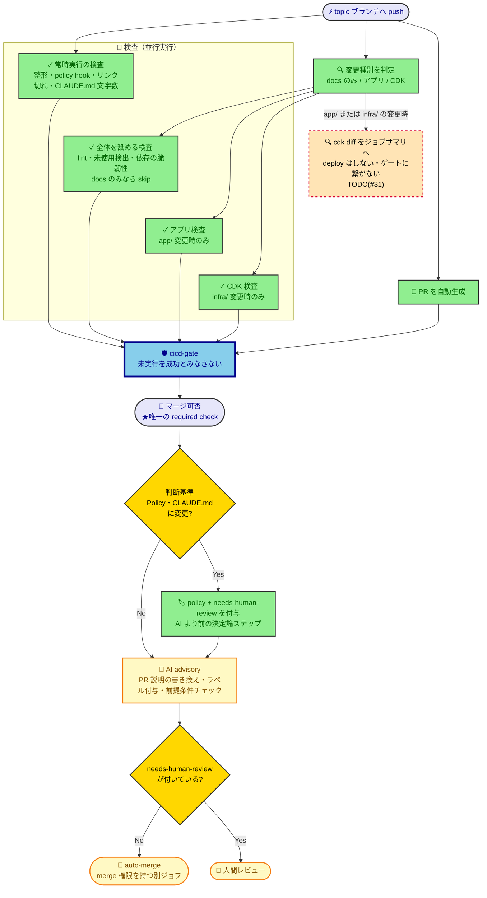
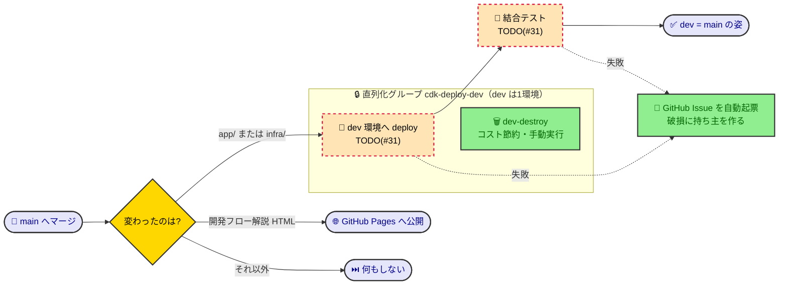

# CI/CD パイプライン設計

このリポジトリの CI/CD を変更・レビューする開発者／AI が、**なぜこの構成なのか**を知りたいときに参照する。何がどの条件で実行されるかは `.github/` 配下のワークフロー定義が正であり、本書はそこから読み取れない全体像と理由だけを書く。

## 基本方針：トランクベース開発を速く回す

**小さい変更を頻繁に main へ入れられること**を何よりも優先し、それが成り立つように CI/CD を組んだ。この方針を実現するために答えた問いと、その答えは次のとおり。

| 設計ポイント                                                       | 方針                                                                                                                                                                                                                      | なぜ                                                                                                                                                                                                                       |
| ------------------------------------------------------------------ | ------------------------------------------------------------------------------------------------------------------------------------------------------------------------------------------------------------------------- | -------------------------------------------------------------------------------------------------------------------------------------------------------------------------------------------------------------------------- |
| 実環境へのデプロイをいつやるか                                     | 最も時間のかかる AWS 環境へのデプロイ工程——deploy と結合テスト——を、main へマージした**後**に回す（[ADR-001](../adr/001-post-merge-dev-deploy.md)）                                                                       | マージまでの経路から最も遅い工程が消え、main に入れるまでのサイクルが大きく縮む。デプロイ失敗が起きても、修正の PR を即座に出せる                                                                                          |
| CI を充実させつつ、実行時間をどう短くするか                        | job の並列実行と、変更種別判定（変更されたファイルの種別に応じた job 実行。例：docs のみの変更）で両立を図る                                                                                                              | AI 駆動開発では静的解析やテストを充実させ、機械的な仕組みで品質を担保することが重要である。一方でこれらの増加は、開発スピードを重視するトランクベース開発の思想と衝突してしまう                                            |
| コーディングエージェント開発のレビューボトルネックにどう対応するか | 2つ打つ。PR の変更行数に上限を定めて超えたらレビューを拒否できるようにし、人間がレビューすべき PR と AI レビューのみで通す PR を AI に仕分けさせる（判定方針は [pr-review-policy](../policy/pr-review-policy.md) に準拠） | AI は大量の変更を高速にできるが、AI 成果物の認知負荷は高く、レビュー者に負担が集中してボトルネックになる。変更行数の多い PR はレビュー精度も落ち、時間もかかる。すべてのコードを人間がレビューするのは、もう現実的ではない |
| 高速開発と安全性をどう両立するか                                   | 人間が手動で操作する工程を可能な限り排除する（PR 作成の自動化でマージ先の指定ミスを防ぎ、status check で CI がエラーのコードをマージできなくする）。マージ可否は1つのゲートに集約する                                     | 安全に高速開発するには、ヒューマンエラーを防止する仕組み作りが要る。人の注意力に頼ると、速く回すほど事故の機会が増え、手戻りが速さを打ち消す                                                                               |

## パイプラインの全体像

### マージまで

```mermaid
flowchart TD
    Push([⚡ topic ブランチへ push]) --> PR[📝 PR を自動生成]
    Push --> Detect[🔍 変更種別を判定<br/>docs のみ / アプリ / CDK]
    Push --> Always

    subgraph Checks["🔀 検査（並行実行）"]
        direction TB
        Always["✓ 常時実行の検査<br/>整形・policy hook・リンク切れ・CLAUDE.md 文字数"]
        Common["✓ 全体を舐める検査<br/>lint・未使用検出・依存の脆弱性<br/>docs のみなら skip"]
        App["✓ アプリ検査<br/>app/ 変更時のみ"]
        Cdk["✓ CDK 検査<br/>infra/ 変更時のみ"]
        Always ~~~ Common ~~~ App ~~~ Cdk
    end

    Detect --> Common
    Detect --> App
    Detect --> Cdk
    Detect -->|app/ または infra/ の変更時| Diff["🔍 cdk diff をジョブサマリへ<br/>deploy はしない・ゲートに繋がない<br/>TODO(#31)"]

    Always --> Gate
    Common --> Gate
    App --> Gate
    Cdk --> Gate
    PR --> Gate

    Gate["🛡️ cicd-gate<br/>未実行を成功とみなさない"]
    Gate --> Merge([🎯 マージ可否<br/>★唯一の required check])

    Merge --> PolicyCheck{判断基準<br/>Policy・CLAUDE.md<br/>に変更?}
    PolicyCheck -->|Yes| PolicyLabel["🏷️ policy + needs-human-review を付与<br/>AI より前の決定論ステップ"]
    PolicyCheck -->|No| AiJob
    PolicyLabel --> AiJob

    AiJob["🤖 AI advisory<br/>PR 説明の書き換え・ラベル付与・前提条件チェック"]
    AiJob --> AutoMergeCheck{needs-human-review<br/>が付いている?}
    AutoMergeCheck -->|No| AutoMerge(["🔀 auto-merge<br/>merge 権限を持つ別ジョブ"])
    AutoMergeCheck -->|Yes| HumanReview(["👤 人間レビュー"])

    classDef startEnd fill:#E6E6FA,stroke:#333,stroke-width:2px,color:darkblue
    classDef process fill:#90EE90,stroke:#333,stroke-width:2px,color:darkgreen
    classDef decision fill:#FFD700,stroke:#333,stroke-width:2px,color:black
    classDef gate fill:#87CEEB,stroke:#00008B,stroke-width:4px,color:darkblue
    classDef hollow fill:#FFE4B5,stroke:#DC143C,stroke-width:2px,stroke-dasharray: 5 5,color:black
    classDef advisory fill:#FFF9C4,stroke:#F57F17,stroke-width:2px,color:#7f4f00

    class Push,Merge startEnd
    class PR,Detect,Always,Common,App,Cdk,PolicyLabel process
    class PolicyCheck,AutoMergeCheck decision
    class Diff hollow
    class Gate gate
    class AiJob,AutoMerge,HumanReview advisory
```

### マージ後

```mermaid
flowchart LR
    Merged([🎯 main へマージ]) --> PathCheck{変わったのは?}
    PathCheck -->|app/ または infra/| Deploy
    PathCheck -->|開発フロー解説 HTML| Pages(["🌐 GitHub Pages へ公開"])
    PathCheck -->|それ以外| Skip([⏭️ 何もしない])

    subgraph Serial["🔒 直列化グループ cdk-deploy-dev（dev は1環境）"]
        direction TB
        Deploy["🚀 dev 環境へ deploy<br/>TODO(#31)"]
        Destroy["🗑️ dev-destroy<br/>コスト節約・手動実行"]
        Deploy ~~~ Destroy
    end

    Deploy --> IT["🧪 結合テスト<br/>TODO(#31)"]
    IT --> Done([✅ dev = main の姿])
    Deploy -. 失敗 .-> Issue
    IT -. 失敗 .-> Issue["📌 GitHub Issue を自動起票<br/>破損に持ち主を作る"]

    classDef startEnd fill:#E6E6FA,stroke:#333,stroke-width:2px,color:darkblue
    classDef process fill:#90EE90,stroke:#333,stroke-width:2px,color:darkgreen
    classDef decision fill:#FFD700,stroke:#333,stroke-width:2px,color:black
    classDef hollow fill:#FFE4B5,stroke:#DC143C,stroke-width:2px,stroke-dasharray: 5 5,color:black

    class Merged,Skip,Done,Pages startEnd
    class Issue,Destroy process
    class PathCheck decision
    class Deploy,IT hollow
```

## 重要なポイント

| ポイント                                                             | なぜ                                                                                                                                                                                                                          |
| -------------------------------------------------------------------- | ----------------------------------------------------------------------------------------------------------------------------------------------------------------------------------------------------------------------------- |
| マージ可否は `cicd-gate` 1つだけで決める                             | 検査を個別に required 登録すると、その一覧がリポジトリ設定（コード外）に住む。検査を増やしたときの登録漏れが静かに穴を開け、テンプレートとしてコピーされた先に設定は付いてこない                                              |
| ゲートは上流が落ちても必ず実行し、上流の結果を1つずつ確かめる        | GitHub は「実行しなかった」を「成功」と同じものとして扱う。上流に繋ぐだけのゲートは、検査が丸ごと走らなかったときに——赤くならずに——静かに開く。**未実行は検証の不在であって、検証の成功ではない**                             |
| 検査を「常時実行・全体・アプリ・CDK」に割る                          | 静的解析はルールを1箇所で定義しているため、走らせるには全階層の依存が要る。だからスキップできない。条件で絞れるのは、対象の階層に閉じた検査だけ                                                                               |
| docs だけの変更でも落ちうる検査は、種別判定を通さず常に走らせる      | 全体検査は docs のみの PR でスキップされる。そこに置くと**その検査が最も要る場面でこそ走らない**（下表）。しかも被害は後続の無関係な PR に出る                                                                                |
| dev へ入る経路を main の1本だけにする                                | 経路が2つあると「dev にいま何があるか」が一意に決まらない。dev にスタックがあるときは必ず main の姿になる                                                                                                                     |
| dev を触るものは、削除も含めて同じ直列化グループに入れる             | dev は1環境しかない。main への連続 push と dev の削除が並行すると CloudFormation スタックが壊れる                                                                                                                             |
| PR の時点では deploy せず、`cdk diff` だけを出してゲートには繋がない | deploy 成功は得られないが、意図しない置換・削除はレビューで見える。read-only なので dev を奪わない。実環境への疎通をマージ可否に混ぜると、AWS 側の一時障害でマージが止まる                                                    |
| main への deploy が失敗したら GitHub Issue を自動起票する            | 失敗が required check の外側で起きるため、赤いランは誰の担当にもならない。壊れた main はブランチ最新化の要求を通じて全ブランチへ配られるので、持ち主を機械が作る                                                              |
| AI の判断は advisory に閉じ、決定論の判定と混ぜない                  | AI の出力は同じ差分でも揺れる。required check は一意に決まるものの結果でなければならない。判断基準（Policy・CLAUDE.md）への変更ラベルも、対象かどうかはパスだけで決まるので AI より前の決定論ステップで付ける                 |
| AI に merge 権限を渡さず、実行できるコマンドを必要な `gh` だけに絞る | AI が読む PR 差分はブランチ作者が書ける文字列なので、プロンプトインジェクションが通った場合を前提に置く。merge 権限を同居させれば main 改ざんの経路が開き、無制限のシェルは secret 送信の経路になる。マージは別ジョブに閉じる |

### docs だけの変更でも落ちうる検査

| 検査                 | docs のみの PR でも壊れる理由                           |
| -------------------- | ------------------------------------------------------- |
| 整形チェック         | prettier は `.md` も検査対象にしている                  |
| policy hook 検査     | 発火対象は `docs/policy/*.md` の frontmatter が宣言する |
| リンク切れ検査       | 相対リンクは参照先の移動・改名や書き間違いで壊れる      |
| CLAUDE.md 文字数検査 | CLAUDE.md 自体が docs と判定される                      |

## 前提と制約

### 触ると壊れる前提（リポジトリ設定・secret）

| 前提                                                                      | 壊すとどうなる                                                                                                                              |
| ------------------------------------------------------------------------- | ------------------------------------------------------------------------------------------------------------------------------------------- |
| `cicd-gate` が required check として登録されている                        | マージ可否をゲート1つに集約した決定が効かなくなり、検査を通っていない PR がマージできる                                                     |
| ブランチの最新取り込みが required になっている                            | 検査したコードとマージされるコードがずれる。deploy がマージの後ろにある本設計では、マージ前に main の破損を防ぐのはこの設定だけになっている |
| auto-merge が有効になっている                                             | 「人間レビュー不要」と判定された PR も自動マージされず、人手待ちで滞留する                                                                  |
| マージ済みブランチの自動削除が有効になっている                            | topic ブランチが溜まり続ける。auto-merge はマージを予約して即返るため、ワークフロー側では消せない                                           |
| AI 実行用の OAuth トークンが secret に設定されている                      | AI ジョブが失敗する（advisory なのでゲートは赤くならず、AI 機能だけが静かに止まる）                                                         |
| ブランチ名が [git-policy](../policy/git-policy.md) のプレフィックスに従う | 検査が1つも走らず、エラーも出ないまま**無言でマージ不可**になる                                                                             |

### 意図的にやらないこと

| やらないこと                                      | なぜ                                                                                                                            |
| ------------------------------------------------- | ------------------------------------------------------------------------------------------------------------------------------- |
| stg・prd 環境を持つ                               | 環境は dev 1つだけを前提にしている。持つ構成になった時点で改めて設計する                                                        |
| トピックブランチからの手動 deploy 経路を用意する  | dev へ入る経路が2つになり、「dev にいま何があるか」が一意に決まらなくなる                                                       |
| Dependabot に npm を足す                          | GitHub は Dependabot の実行に secrets を渡さないため、更新 PR の AWS 認証が必ず落ちる。npm 依存は全体検査の脆弱性チェックで見る |
| auto-merge の経路で AI セルフレビューを再実行する | 実装フローの各 Skill が実装時点で実施済み。二重実施は実行時間と AI の利用枠を使うだけで、新たな検出価値がない                   |

### 受け入れた不便

| 不便                                              | 内容                                                                                                                                                              |
| ------------------------------------------------- | ----------------------------------------------------------------------------------------------------------------------------------------------------------------- |
| レビュー時点で deploy が未検証                    | CDK は deploy しないと分からないエラーが多い。IAM の制約・リソース名の衝突・サービス上限は、main へ入った後に初めて分かる                                         |
| 実環境も人間も通らない CDK 変更が main に入りうる | 人間レビューの要否はラベルで決まり（[pr-review-policy](../policy/pr-review-policy.md)）、`infra/` の変更だけでは付かない。壊れた結果は deploy 失敗の Issue で拾う |
| 待機中の実行が押し出される                        | dev の直列化は「実行中1つ＋待機中1つ」しか保持しない。main への push が続くと待機中の deploy がキャンセルされる（最新が deploy されるので実害は無い）             |
| 参照実装は CI で検査されない                      | 変更検知は `app/`・`infra/` を見るため、参照実装（`samples/`）の型検査・単体テストは CI では走らない。手元の検査コマンドが受け持つ                                |
| 手元で通っても CI で落ちうる                      | リンク切れ検査は CI（Linux）を正とする。macOS のローカル実行はファイル名の大文字小文字差を見逃す                                                                  |
