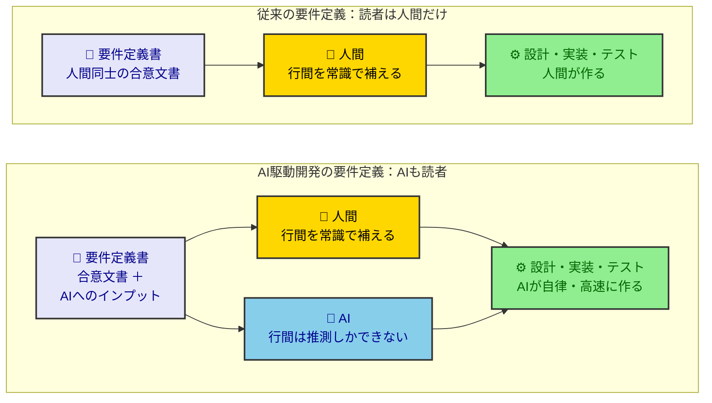
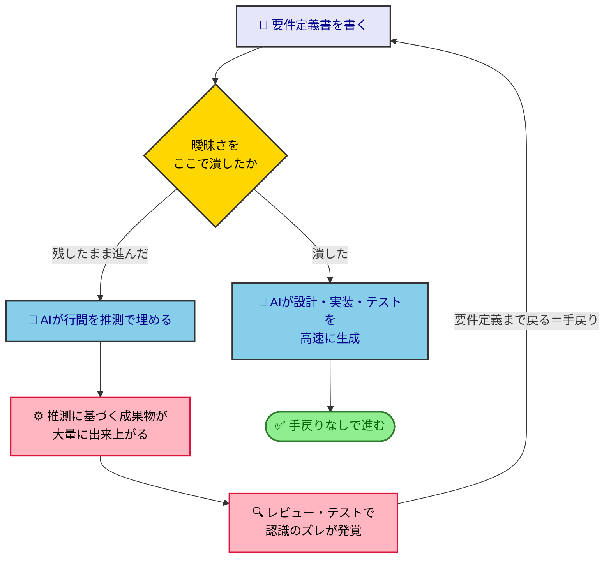
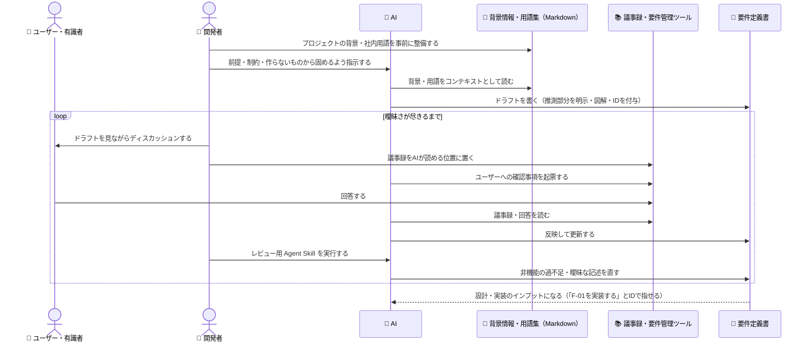

# AI要件定義ガイド

## AI要件定義の特徴

従来のAIを使わない要件定義と比べて以下の特徴がある

### 要件定義書はAIへのインプットである

- これまでユーザーとベンダー間で認識を合わせるために要件定義書を作っていた
- つまり、対象読者は人間だけであった
- しかしAI駆動開発においてはAIも重要な読者である
- 読者が変われば記載する内容も変わってくる

### より曖昧さを排除する必要がある

- AIは行間を正しく推測することができない
- 人間が要件定義書を作る場合、人間には当然に思える常識は、明示的に書かれないことが多い
- しかし、AIが正確に開発するためには、これまで以上に曖昧さを排除していく必要がある。

### 要件定義書の質がその後の開発効率を決める

- AI駆動開発では設計・実装・テストをAIが自律的に高速に開発する
- 従来は設計しながら決まっていたことも、要件定義の段階で明確に決めておく必要がある
- そのため、従来の要件定義よりも手間がかかる、というよりも「手間をかけるべき」と思った方が良い
- 要件定義書の質がその後の開発効率を決める

## 事前に準備しておくこと

### コンテキスト整備

#### ・プロジェクトの背景情報や社内用語集を事前に整備しておく

- AIにプロジェクトの情報や社内用語をコンテキストとして与えるために、Markdownで情報を整理しておく
- これを元にAIが要件定義書のドラフトを作る

#### ・AIが議事録を参照できるようにしておく

- 要件はAIが書いたドラフトを見ながらのディスカッションで決まっていく
- そのため議事録の取得とそれをAIが読める位置に配置し参照させることが重要

### AIに要件管理させる

- ユーザーへの確認事項などを要件管理ツールで管理するが、AIが起票し、読み取れる環境を整備しておく

### AIレビュー用のAgent Skillsを用意する

- 要件（特に非機能）の過不足などをチェックさせる
- あいまいな記述を明確化する必要性を記載し、徹底させる

## 要件定義書作成時のポイント

### 推論と事実を分離する

- AIは文脈から理由・背景・出所などを推測で書くことが多い
- 推測した部分を明示させるように指示しておくことが重要

### 要件定義書は段階的に作る

- 最初に前提・制約、作らないものを明確にすることで、AIが余計な可能性を思考する必要がなくなり効率的

### 積極的に図解する

- 人間がUML図などを作ろうとすると時間がかかるが、AIはmermaid記法などで瞬時に図解することができる
- 図解は人間同士の認識を合わせる上で重要であり、今まで以上に積極的に図解することが重要である

### 要件の決定事項には一意のIDを付与する

- 業務一覧・機能一覧・ビジネスルール一覧などに一意のIDを付与する
- そうすることで、AIピンポイントで確実に参照（特定）できるようになる
- 例えばissueに「F-01を実装する」「BR-01を使用して実装する」など、短く確実に対象を記載できるようになる

## AI要件定義の流れ

