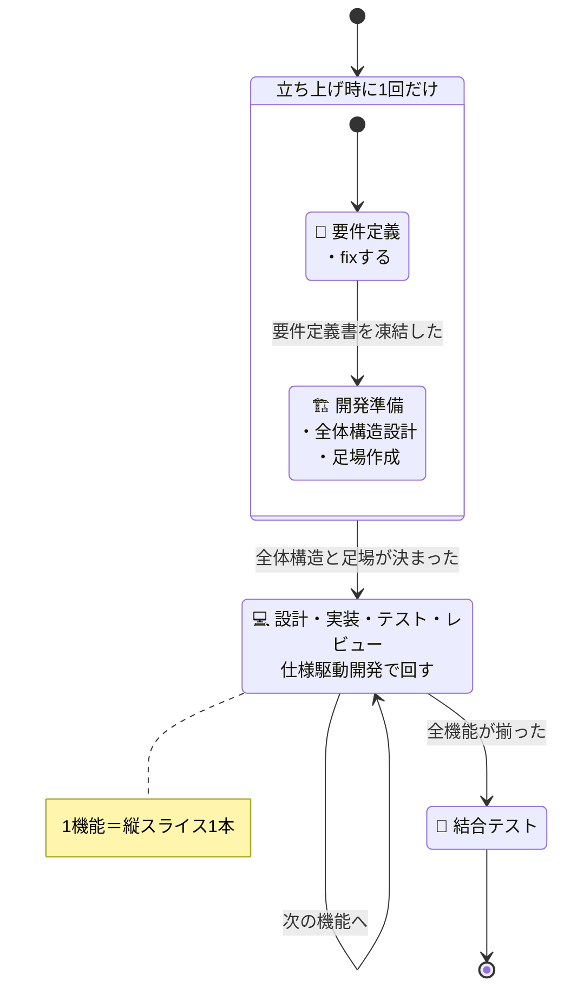

# 開発フローガイド

このリポジトリで開発する人 / AI が、開発全体の進め方を掴み、1つの Issue をどのスラッシュコマンド・どのモデルで回すか確かめたいときに読む。

## 開発フローの全体像

## この開発の考え方

- **開発プロセス**：インクリメンタル（縦スライスを1本ずつ）
- **要件の扱い**：凍結する（着手後は変えない）
- **開発アプローチ**：仕様駆動（文書で先に固める）
- **開発主体**：AI（人間は Human-on-the-Loop）= AI駆動開発

- **アジャイルではない**——凍結後に仕様を足したくなっても、その場で変えずIssueに起こす。
- **ウォーターフォールでもない**——全機能ぶんの設計書を書き上げてから実装に入ることはしない。

### ポリシー駆動開発（この template 独自）

AI に任せて開発スピードを上げるほど、判断はぶれ、品質は人間のレビューだけが頼りになる。速さと品質を両立させるために、**判断の基準を Policy に、品質の合否をガードレール（静的解析・テスト・メトリクス）に**先に固める——これがこの template 独自のポリシー駆動開発である。仕組みの全体像は [AI 駆動開発フローガイド](https://kasiopeiya.github.io/claude-dev-template/) にある。

## 1つのIssueは0〜12の順で回す

0. **起点Issue起票（人間/AI）**：要望・課題の起点となるIssueをGitHub Issuesに起票（スキップする場合もある）
1. **仕様の相談（人間＋AI）**：`/grill-me` — 対話で仕様・設計を詰める（必要ない場合はスキップ）。最初に「どうなったら終わりか」を一文で合意し、その一文の外側は聞かず「やらないこと」として残す。`/grill-me --small` を付けると、合意する一文が最初に通す薄い一本道（曳光弾）に限定される
2. **Plan作成＋チェック（人間＋AI）**：Planモードでの事前調査、または `/grill-me` の議論を `/to-plan` でPlanファイル化。`/to-plan` は続けて `/check-plan` を自動実行し、必須セクションの充足とコードベース・ドキュメントの影響範囲の網羅を早期にチェックする（シフトレフト）。`/check-plan` は単体でも実行できる。
   - 必須：「設計書への影響」セクション（更新不要なら「更新不要・理由：〇〇」と明記）
   - 必須：タスク一覧に設計書更新タスクを含める（更新不要な場合を除く）
3. **Issue作成（AI）**：`/to-issues` — Planを実装Issueに分割してGitHub Issuesに登録
4. **設計書更新（AI）**：`/design <Issue番号>` — 設計書更新→レビュー→修正までを自律実行
5. **アプリ実装（AI）**：`/code-dev <Issue番号>` — TDD実装→コードレビュー→静的解析/単体テスト→設計書整合性チェックまでを自律実行
6. **CDK実装（AI）**：`/cdk-dev <Issue番号>` — 実装→レビュー→静的解析/snapshotテスト/cdk synth までを自律実行（※CDKはTDD対象外）
7. **コードレビュー（人間/AI）**：開発エディタ上で実装差分（アプリ・CDK）を確認
8. **コミット（人間/AI）**：`/git-commit` でコミット
9. **push・CI（人間/AI→CI自動）**：リモートブランチに push すると CI が検査を回し、PR を自動生成する。AI の範囲はトピックブランチの作成と push までで、`gh pr create` は使わない（hook が拒否する）。AI が push したときは、続けて `/pr-body <Issue番号>` で PR のタイトルと本文を差し替える。人間が push したときは、マージで Issue を閉じたいときなど本文が要るときだけでよい。dev への cdk deploy と結合テストは main へマージした後に自動実行される
10. **Pull Requestのチェック（AI）**：`/pr-label` で変更種別と人間レビュー要否のラベルを付け、`/pr-check` でレビューを受け付けてよい前提条件（サイズ）を満たすか判定する（結果を PR にコメント）
11. **Pull Requestのレビュー（人間）**：10 でレビューが必要と判定された場合のみ、PR の実装差分を確認する
12. **PRR（AI＋人間）**：`/sre-prr [対象]` で本番投入レディネスを SRE 観点で審査し、**go / 条件付きgo / no-go** を助言する。実行は任意（本番リリース直前など条件による）

このフローで Issue を起票したら、[Issueの階層ガイド](../reference/issue-hierarchy.md)に従って親の sub-issue にする。

## 週次の docs 整合性チェック Issue が届く

`doc-consistency-weekly` ワークフローが週1回、`/doc-consistency`（文書間の重複・矛盾を横断的に探す Skill）の実行を依頼する Issue を自動起票する（ラベル：`doc-consistency-weekly` と `ai-fixable`）。差分レビューでは変更行しか見ないため、既にある重複・矛盾はこの週次チェックでしか拾えない。

届いたら次のどちらかで捌く。

- **「issue N 対応して」と直接指示する**：その場で `/doc-consistency` を実行させる
- **ボードで Ready に動かし、Auto Programmer に拾わせる**（手順は次節）

open な週次 Issue が残っている間は、次の週のワークフローは新しく起票しない（未処理が積み上がるのを防ぐため）。実行そのものを GitHub Actions が行わない理由と合わせて、[ADR-005](../adr/005-doc-consistency-weekly-issue-only.md)・[ADR-006](../adr/006-skip-weekly-issue-when-open.md)・[ADR-007](../adr/007-doc-consistency-excluded-from-normal-dev-flow.md) を参照。

## ボードに積んだ Issue を無人で PR にする（Auto Programmer）

Issue 番号を人間が渡して 4〜9 を回す代わりに、ボードに積んだ Issue を AI に無人で PR まで進めさせることもできる。

1. **カードを Ready へ動かし、担当者を付ける（人間）**：対象は `ai-fixable` が付いた open な Issue。拾うのは担当者のマシンの auto-programmer だけなので、担当者の無い Issue は誰にも拾われない。本文の「ブロッカー」に並ぶ Issue が全部 closed になるまでは拾われない
2. **起動する（人間）**：`npm run auto-programmer` を打つ。1件終えると次の1件へ進み、Ctrl+C で止めるまで回り続ける。AI のセッションからは起動できない
3. **実装して push する（AI）**：スクリプトが AI 専用 clone にブランチを切り、`/auto-dev <Issue番号>` を起動する。`/auto-dev` は Issue の「実装フロー（使用するSkill）」に並ぶ Skill で実装し、検証・コミット・push と、`/pr-body` による PR 本文の差し替えまで確認なしで進める。リポジトリの差分が出ない Issue（GitHub 上の操作だけで完了するもの）は、PR を作らずに `/auto-dev` が閉じる
4. **CI が通るまで直す（AI）**：スクリプトが push 後の CI を待ち、落ちていれば `/auto-fix-ci` に直させる。CI が通ればカードを In Review へ動かす。CI の結果が出てから次の1件へ進む
5. **PR 以降は 10〜11 と同じ**：In Review のカードの PR をレビューする。Issue は PR のマージで閉じる

`/auto-dev`・`/auto-fix-ci` が進めないと判断した Issue と、上限まで直させても CI が通らなかった Issue は、カードが In progress のまま残り、コメントと `issue:needs-clean-session` ラベルが付く。コメントを読み、専用のセッションでその Issue に着手する。

AI は AI 専用 clone の中だけで作業するので、人間が作業中でも走らせておける。設定と、止まったときの対処は [scripts/auto-programmer/README.md](../../scripts/auto-programmer/README.md) にある。

## フェーズごとにどのモデルで回すか

仕様を決める段階は最も性能の良いモデルで回し、Issue を実行する段階は Sonnet / high に落とす。判断の重さと、後戻りしたときの損の大きさが段階で違うためである。

| 段階                                                                   | モデル・effort                              | なぜ                                                                                                                                         |
| ---------------------------------------------------------------------- | ------------------------------------------- | -------------------------------------------------------------------------------------------------------------------------------------------- |
| 立ち上げ（要件定義・基盤技術の決定・起点Issue の起票）                 | 使える中で最も性能の良いモデル・effort 最大 | ここでの切り分けが以降すべての Issue の土台になり、誤ると Issue が丸ごと作り直しになる                                                       |
| 仕様を詰める（1〜4：`/grill-me`・`/to-plan`・`/to-issues`・`/design`） | 使える中で最も性能の良いモデル・effort 最大 | 仕様と設計の判断はここで確定し、間違えたまま進むと実装ごと捨てることになる                                                                   |
| Issue を実行する（5〜12：実装・レビュー・コミット・PR）                | Sonnet / high                               | 仕様は Issue に書き下された後なので、実装品質を保ちながら時間とトークンを節約できる。effort を medium に落とすと多段の手順で取りこぼしが出る |

モデルの切り替えは人間が `/model` で行う。Skill の `model` に書くと切り替えのたびに会話を読み直すことになり、軽い Skill ほど遅くなる。

## （任意）アーキテクチャ品質レビュー

変更がマクロ構造・境界（UI/DB/外部サービス/言語の差し替え可能性・依存方向・レイヤー構成）に影響するとき、`/arch-review [対象]` で設計・アーキテクチャの「質」をレビューできる（ペルソナ：世界一流アーキテクト）。開発フローの常設ステップではなく**必要なタイミングで任意に実行**する。

Plan 段階で影響が見込まれるときは AI が実行を推奨し、`/to-plan` の「実装フロー」に記載されれば issue 追従で事後にも自動実行される。文書品質（`/doc-review`）・コード品質（`/code-review`）・整合性（`/validate-design`）とは責務が異なる。
