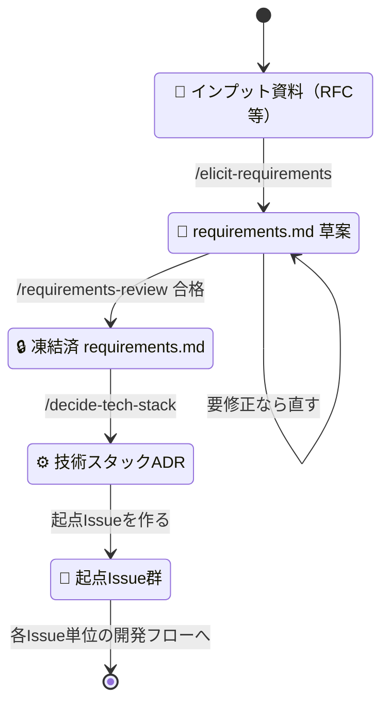

# 新規開発ガイド（グリーンフィールドの立ち上げ手順）

## 対象読者

新しいシステム・モジュールを 0 から立ち上げる人 / AIエージェントが、最初の `requirements.md` から起点Issue までを**どの順で・どのスキルで**作るか知りたいとき。

## 目的

立ち上げフェーズ（input資料 → 起点Issue）の手順を、使用スキルとともに一本の流れで示す。

進め方は次の立場に倒す。入口から出口まで動く薄い縦スライス（曳光弾）を最初に1本、本番品質で通す。着手はドメイン／コアからで、FW・DBスキーマ・画面から書き始めない。器そのもの（境界をどこに置くか＝アプリアーキテクチャとディレクトリ構成）だけは、後から変えるほど高くつくため立ち上げ時に先を見越して決める。根拠と例外は [new-development-policy](../policy/new-development-policy.md) にある。

決定そのもの（何を選びなぜそうしたか）は **ADR（`docs/adr/`）＋プロジェクト設計書** に記録する。

> [!IMPORTANT]
> **（AI・必須）** 各スキルの教科書的な使い方の書き写しはしない（限界費用が高く負債になる）。本ガイドは「立ち上げの段取りを一本に通す」ことに絞る。

## 立ち上げの流れ

プロジェクト開始時に1回だけ、上から順に**手動で**実行する（オーケストレーションSkillは無い）。各ステップの output が次の input になる。



| #   | ステップ                 | input                              | output                                     | プロンプト例                                                     |
| --- | ------------------------ | ---------------------------------- | ------------------------------------------ | ---------------------------------------------------------------- |
| 1   | 要求を引き出す           | 顧客からのインプット資料（RFC等）  | `requirements.md`（PRD）                   | `/elicit-requirements input.md`                                  |
| 2   | 要件定義書をレビューする | `requirements.md`                  | 合否判定（凍結可 / 要修正）                | `/requirements-review`                                           |
| 3   | 基盤技術を決める         | `requirements.md`                  | 初期技術スタックADR（`docs/adr/NNN-*.md`） | `/decide-tech-stack docs/requirements.md`                        |
| 4   | 起点Issue を作る         | `requirements.md`＋技術スタックADR | 起点Issue群（GitHub・依存順つき）          | `新規開発ガイドの「起票する起点Issue」に従って起点Issueを作って` |

- **レビューで要修正なら**：要求の引き出しに戻って `requirements.md` を直し、凍結可になってから基盤技術の決定へ進む（判定基準は [requirements-doc-policy](../policy/requirements-doc-policy.md)）。
- **基盤技術を決める／保留する判定基準**：「決めないと足場（静的解析・CI・デプロイ）と最初の曳光弾が組めないか」で決める/保留を分ける。足場に効くもの（言語・クラウド・IaC・CI/CD 等）は決め、曳光弾でスタブできる詳細（FW・ORM・DBスキーマ・外部サービス）はあえて保留する——コアから着手し、詳細は境界の外に置いて決定を遅らせるためである。決める基盤項目の全リストは `/decide-tech-stack` が網羅する。決定は ADR（＝設計書の一種）に一本化。**境界の置き方（アプリアーキテクチャ・ディレクトリ構成）はここでは決めない**——[全体構造設計Issue](#全体構造設計issue)が持つ。
- **実装の置き場**：`app/`・`infra/` は空の状態から始める。構造・命名・テストの粒度は [`samples/`](../../samples/README.md) の参照実装を手本にする（構成そのものの方針は directory-structure-guide が定める）。
- **起点Issue はモデルを最大にして作る**：使用可能な最も性能の良いモデルを選び、effort も最大にして実行する。ここでの切り分けが以降のすべてのIssueの土台になり、誤ると作った Issue が丸ごと作り直しになるからである。

## 起票する起点Issue

ステップ4は、要件定義書と技術スタックADRを読み、**曳光弾の経路を選んだうえで、下表のIssueを依存順に一度で起票する**。Issue化と経路選定を分けると「機能のIssueは立っているが曳光弾のIssueがまだ無い」状態が生まれ、その隙にissue追従で機能を1つずつ完成させる水平な積み上げが始まる。

> [!IMPORTANT]
> **（AI・必須）** 起点Issueは着手単位ではない。`/grill-me` で仕様を詰め、sub-issue（縦スライス）に割ってから実装する**親Issue**である。

| 種別                 | 何を1本にするか                                                                     | 要件定義書のどこから                   | 親にするフェーズ |
| -------------------- | ----------------------------------------------------------------------------------- | -------------------------------------- | ---------------- |
| 全体構造設計         | 境界の置き方（[全体構造設計Issue](#全体構造設計issue)）。sub-issue まで起票時に作る | 由来しない（機能ではないため行が無い） | 開発準備         |
| 足場                 | 決めた構成でのディレクトリ用意・CI・デプロイ経路                                    | 由来しない（機能ではないため行が無い） | 開発準備         |
| 曳光弾               | 経路が触れる機能をまとめて1本。ドメインの核を含む                                   | 経路が触れる機能ID                     | 設計・実装       |
| 機能                 | システム化機能一覧の1行（曳光弾に入れた機能を除く）                                 | 機能ID                                 | 設計・実装       |
| 非機能               | 非機能要件の1分類。分類内の行はタスク一覧に全部並べる                               | 分類名                                 | 設計・実装       |
| スタブ追跡           | 曳光弾でスタブにした詳細の一覧                                                      | 由来しない（曳光弾の副産物）           | 設計・実装       |
| オープンクエスチョン | 未決事項1件。解決の相手・解消期限を転記する                                         | オープンクエスチョンの識別子           | 要件定義         |
| リスク               | 他のIssueに収まらない緩和策1件                                                      | リスクと対応の1行                      | 設計・実装       |

**曳光弾のIssueは追加で1本立てるのではなく、経路が触れる機能のIssueをそのまま曳光弾のIssueにする。** 複数の機能にまたがるなら1本にまとめ、タイトルに機能IDを並べて曳光弾と分かるようにする（例：`F-01 F-02 曳光弾`）。別に立てると、その機能のIssueとの間で「どこまで先取り済みか」を二重に管理することになる。着手したら最初のsub-issueを薄い1経路にし、残りのルール・例外はその後のsub-issueで肉付けする。

**着手の段を分析し、段番号をタイトルの先頭に入れる**（例：`3. F-02 ポイント利用`）。Issueを開かないと順番が分からない状態にしないためである。同じ段のIssueは互いに依存せず、並行して着手できる。

段は次の順で決める。

| 段       | 何を置くか                                                                                                                                             |
| -------- | ------------------------------------------------------------------------------------------------------------------------------------------------------ |
| 1        | 全体構造設計                                                                                                                                           |
| 2        | 足場と、後から入れるとやり直しになる非機能（暗号化・認証認可・データの所在）                                                                           |
| 3        | 曳光弾                                                                                                                                                 |
| 4以降    | 前の段の機能が作る情報を入力にする機能。機能仕様の入力・出力（入出力情報一覧のID）を突き合わせて判定し、**入力（内部）区分は、それを生む機能まで辿る** |
| 機能以外 | 残りの非機能・スタブ追跡・リスクは関わる機能と同じ段。オープンクエスチョンは解消期限が指す機能の1つ前の段                                              |

**2段目の非機能だけ、依存ではなくやり直しコストで段を決める。** 暗号化・認証認可・データの所在は関わる機能が全機能に及ぶので、依存で決めると最後の段に落ちる。だが後から入れるとデータ移行と権限設計をやり直すことになるため、先に置く。

**入力（内部）区分を辿るのは、内部データがどの機能の出力欄にも現れないからである。** 表を突き合わせるだけでは、その内部データを生んだ機能への依存が見えない。

辿っても出力に持つ機能がいなければ、**それを入力にする機能が自分で作る**ものとし、その機能のIssueに含める。作る側と使う側が同じなので、ここから段の依存は生まれない——段は、その内部データの元になるデータを作る機能で判定する（有効期限切れロットを抽出するのは失効処理だが、ロット自体を作るのは付与なので、失効処理は付与の後の段になる）。

優先度（Must / Should / Could）は**価値**の順であって依存の順ではないので、段の根拠に使わない。要件定義書の「依存関係」節も外部システム・他チームへの依存であって機能間の前後関係ではないので、同じく根拠にならない。

二重起票を避ける規則：機能一覧の基盤機能（対象業務の欄に非機能要件との対応が書かれている行）でカバーされる非機能の行は、その機能のIssueに寄せ、非機能のIssueでは起票しない。受入基準は対応する機能Issueの「完了条件」へ、スコープ外は各Issueの「今回作らないこと」へ転記する。

**リスクは最後に起票する。** 緩和策は、すでに立てた機能・非機能のIssueのタスクに収まることが多いからである。緩和策の文がID（ビジネスルール・機能ID・非機能の分類名）を名指ししていればそのIssueへ寄せ、名指しが無ければ作業の中身で照合する。どこにも収まらない緩和策だけをリスクのIssueにする。1件のリスクの緩和策が複数の作業に分かれるなら、作業ごとに振り分ける。

本文の節は次の順に並べる（重要なものが上）。親Issueへの参照は本文に書かない（sub-issue の紐付けで見えるため）。

| 節（見出し）                     | 省略                                              | 書くこと                                                                                                                                                                                                                                                          |
| -------------------------------- | ------------------------------------------------- | ----------------------------------------------------------------------------------------------------------------------------------------------------------------------------------------------------------------------------------------------------------------- |
| この変更が必要な理由             | 必須                                              | 1文1行で3行。①何が無くて誰が困るか ②要件定義書・ADR にある根拠1つ（IDで名指し）③放置するとどう損するか                                                                                                                                                            |
| 作るもの                         | 必須                                              | エンドツーエンドの振る舞いを1文1行・4行以内。レイヤーごとの実装手順・ファイルパスは書かない                                                                                                                                                                       |
| タスク一覧                       | 必須                                              | チェックボックス形式。非機能Issueは分類内の行を全部並べる                                                                                                                                                                                                         |
| 完了条件                         | 必須                                              | 受入基準の該当行を転記し、外から観測できる状態で書く                                                                                                                                                                                                              |
| 確定済みの決定                   | 条件付き：決定が無ければ省く                      | `/grill-me` 以外の出典（ADR・要件定義書）で確定済み・意図的に保留した決定だけを「決定／根拠（出典）／却下した案（理由）」の表で書く。未確定の仕様は `/grill-me` で詰めるので書かない。曳光弾Issueは、経路をなぜそれにしたか・どの経路を却下したかを必ずここに残す |
| 人間に決めてほしいこと           | 条件付き：`issue:needs-human-decision` のときだけ | 該当する名指し例外・論点1文・案の比較表を、`/quick-issue` テンプレートの同名節と同じ型で書く                                                                                                                                                                      |
| 今回作らないこと（と、作る条件） | 必須                                              | スコープ外・ビジネスルールからこのIssueに関わる行を「作らないもの／何が起きたら作るか」で転記する。無ければ「なし」と書く。実装者の「ついで」を止める節                                                                                                           |
| 実装フロー（使用するSkill）      | 必須                                              | `/grill-me` → `/to-plan` → `/to-issues`。実装Skill（`/code-dev` 等）は sub-issue 側に書く                                                                                                                                                                         |
| ブロッカー                       | 必須                                              | 前提にする成果物を作るIssueだけを名指しする。無ければ「なし（すぐ着手できる）」と書く。全体の順序は段番号が示すので、前の段のIssueを機械的に全部並べない                                                                                                          |
| トレース（要件定義書との対応）   | 必須                                              | 根拠となる機能ID（非機能なら分類名）と、関連する BR・IO・AC。要件からIssueへ辿れなくなると、要件定義書から後工程までの追跡が切れる                                                                                                                                |

スタブ追跡Issueは残っているスタブの一覧だけを持ち、本物に置き換える作業そのものは対応する機能Issueのタスクにする（同じ作業を2箇所で管理しないため）。

**`issue:needs-human-decision` を付ける。** `ai-fixable` は中身を見ずにAIが直せるという意味であり、仕様を詰めるところから始まる起点Issueは当たらない（`/quick-issue` の名指し例外「着手前に仕様を詰める対話が要る」）。

作った起点Issueは、[Issueの階層ガイド](issue-hierarchy.md)に従って上表のフェーズIssueにぶら下げ、以降は [開発フローガイド](development-flow.md) に沿って**各Issue単位**で回す。

## 全体構造設計Issue

**境界をどこに置くかを、曳光弾の実装が始まる前に決める。** 曳光弾のコードはその境界の中に書かれるので、後から引き直すと書いたものを移す作業になる。

**このIssueだけは、起票の時点で sub-issue まで作る。** 他の起点Issueは `/grill-me` で詰めてから割るが、ここで決めることは要件定義書から導き出すのではなく最初から下表の6つに決まっており、割る対話が要らない。

```text
開発準備（フェーズIssue）
└ 全体構造設計（起点Issue・段1）
  ├ 1. 外部インターフェース仕様
  ├ 2. DB概念モデル
  ├ 3. アプリアーキテクチャ１：配置のトポロジー
  ├ 4. アプリアーキテクチャ２：コードの内部構造
  ├ 5. ディレクトリ構成方針
  └ 6. インフラ構成図
```

| 順  | 項目                                                   | 性格   | ブロッカー | 実装フロー                  |
| --- | ------------------------------------------------------ | ------ | ---------- | --------------------------- |
| 1   | 外部インターフェース仕様（合意する相手がいるものだけ） | 決める | なし       | `/design`                   |
| 2   | DB概念モデル（エンティティ・関係・一意性の業務ルール） | 描く   | なし       | `/design`                   |
| 3   | アプリアーキテクチャ１：配置のトポロジー               | 決める | 2          | `/grill-me` → `/create-adr` |
| 4   | アプリアーキテクチャ２：コードの内部構造               | 決める | 3          | `/grill-me` → `/create-adr` |
| 5   | ディレクトリ構成方針                                   | 決める | 3・4       | `/create-adr`               |
| 6   | インフラ構成図                                         | 描く   | 3          | `/design`                   |

**配置のトポロジー**＝デプロイ単位と通信方式（モノリス／モジュラーモノリス／サービスベース／マイクロサービス／イベント駆動）。**コードの内部構造**＝レイヤーと依存方向（レイヤード／クリーンアーキテクチャ／Ports & Adapters）。3・4の選び方は [architecture-selection-guide](architecture-selection-guide.md)、5の絞り込みは [directory-structure-guide](directory-structure-guide.md) が持つ。

**性格**は、要件定義書とすでに決まった事項から導ける項目を「描く」、新たに選ぶ項目を「決める」と呼び分けている。決めるものは却下案ごと ADR に残す。

**sub-issue のタイトルの先頭にも順番の番号を入れ、ブロッカー欄も埋める**（例：`3. アプリアーキテクチャ１：配置のトポロジー`）。これらの項目は一列に依存するので、起点Issueに段番号を入れるのと同じ理由——Issueを開かないと順番が分からない状態にしない——がそのまま当てはまる。

**DB概念モデルは「RDBを使うときだけ」ではない。** エンティティと関係はドメインモデルそのものなので、DB製品が何であれ要る。
