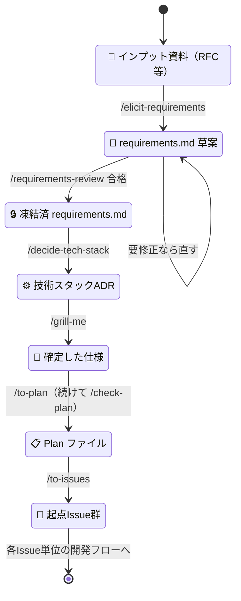

# 新規開発ガイド（グリーンフィールドの立ち上げ手順）

## 対象読者

新しいシステム・モジュールを 0 から立ち上げる人 / AIエージェントが、最初の `requirements.md` から起点Issue までを**どの順で・どのスキルで**作るか知りたいとき。

## 目的

立ち上げフェーズ（input資料 → 起点Issue）の手順を、使用スキルとともに一本の流れで示す。

進め方は次の立場に倒す。入口から出口まで動く薄い縦スライス（曳光弾）を最初に1本、本番品質で通す。着手はドメイン／コアからで、FW・DBスキーマ・画面から書き始めない。ディレクトリ構成の方針だけは、後から変えるほど高くつくため立ち上げ時に先を見越して決める。根拠と例外は [new-development-policy](../policy/new-development-policy.md) にある。

決定そのもの（何を選びなぜそうしたか）は **ADR（`docs/adr/`）＋プロジェクト設計書** に記録する。

> [!IMPORTANT]
> **（AI・必須）** 各スキルの教科書的な使い方の書き写しはしない（限界費用が高く負債になる）。本ガイドは「立ち上げの段取りを一本に通す」ことに絞る。

## 立ち上げの流れ

プロジェクト開始時に1回だけ、上から順に**手動で**実行する（オーケストレーションSkillは無い）。各ステップの output が次の input になる。

図に出ない具体（input・output・プロンプト例）は次のとおり。

| #   | ステップ                 | input                              | output                                     | プロンプト例                                                               |
| --- | ------------------------ | ---------------------------------- | ------------------------------------------ | -------------------------------------------------------------------------- |
| 1   | 要求を引き出す           | 顧客からのインプット資料（RFC等）  | `requirements.md`（PRD）                   | `/elicit-requirements input.md`                                            |
| 2   | 要件定義書をレビューする | `requirements.md`                  | 合否判定（凍結可 / 要修正）                | `/requirements-review`                                                     |
| 3   | 基盤技術を決める         | `requirements.md`                  | 初期技術スタックADR（`docs/adr/NNN-*.md`） | `/decide-tech-stack docs/requirements.md`                                  |
| 4   | 計画を詰める             | `requirements.md`＋技術スタックADR | 確定した仕様（対話）                       | `/grill-me 新規開発ガイドの「計画で最低限詰めること」を論点に計画を詰めて` |
| 5   | Plan 化する              | 確定した仕様                       | Plan ファイル（`~/.claude/plans/*.md`）    | `/to-plan`                                                                 |
| 6   | 起点Issue を作る         | Plan ファイル                      | 起点Issue群（GitHub・依存順つき）          | `/to-issues <Planパス>`                                                    |

- **レビューで要修正なら**：要求の引き出しに戻って `requirements.md` を直し、凍結可になってから基盤技術の決定へ進む（判定基準は [requirements-doc-policy](../policy/requirements-doc-policy.md)）。
- **基盤技術を決める／保留する判定基準**：「決めないと足場（静的解析・CI・デプロイ）と最初の曳光弾が組めないか」で決める/保留を分ける。足場に効くもの（言語・クラウド・IaC・CI/CD・ディレクトリ方針 等）は決め、曳光弾でスタブできる詳細（FW・ORM・DBスキーマ・外部サービス）はあえて保留する——コアから着手し、詳細は境界の外に置いて決定を遅らせるためである。決める基盤項目の全リストは `/decide-tech-stack` が網羅する。決定は ADR（＝設計書の一種）に一本化。構成の絞り込みは [directory-structure-guide](directory-structure-guide.md)。
- **実装の置き場**：`app/`・`infra/` は空の状態から始める。構造・命名・テストの粒度は [`samples/`](../../samples/README.md) の参照実装を手本にする（構成そのものの方針は [directory-structure-guide](directory-structure-guide.md)）。
- **Plan 化の後**：`/check-plan` が自動で走り、Plan の必須セクション充足を監査する。

**計画で最低限詰めること**（new-development-policy の立場を計画に織り込む）：

| 決めること                     | なぜ                                                        |
| ------------------------------ | ----------------------------------------------------------- |
| 曳光弾の1本目の経路            | 最初に入口→出口まで通す薄い縦スライス                       |
| ドメインの核                   | 最初に実装するコアロジック（何のためのシステムか）          |
| 縦スライスの分割と依存順序     | 起点Issueの単位と前後関係。Blocked by の素になる            |
| 保留した詳細の実体化タイミング | スタブした FW/DB/外部サービスを、どのスライスで本物にするか |

作った起点Issueは、以降 [開発フローガイド](development-flow.md) に沿って**各Issue単位**で回す（`/grill-me` → sub-issue 化 → `/design` → 実装 …）。

## 既存フローとの関係

立ち上げと各Issueの開発は、`grill-me → to-plan → to-issues` という**同じスキル列を共有**する。同じ営みが2つの高度で自己相似に回っているだけと捉えれば全体像がすっきりする。

|                  | 立ち上げ（プロダクト全体）                                             | 各起点Issue（開発フローガイド）   |
| ---------------- | ---------------------------------------------------------------------- | --------------------------------- |
| 対象             | プロダクト全体                                                         | 1つの起点Issue                    |
| 粒度             | 粗い                                                                   | 細かい                            |
| 前段             | `/elicit-requirements` → `/requirements-review` → `/decide-tech-stack` | なし                              |
| 共有するスキル列 | `grill-me → to-plan → to-issues`                                       | `grill-me → to-plan → to-issues`  |
| その後           | 起点Issue群を産む                                                      | `/design` → 実装 → … → `/sre-prr` |

立ち上げ固有の差分は、対象がプロダクト全体で粒度が粗いことと、前段に `/elicit-requirements`・`/requirements-review`・`/decide-tech-stack` が付くことだけ。つまり立ち上げは「requirements.md と技術スタックを決め、既存フローを粗い粒度で1回回す」ことに等しい。

## 関連

- [architecture-selection-guide](architecture-selection-guide.md)：アーキテクチャスタイルの選定
