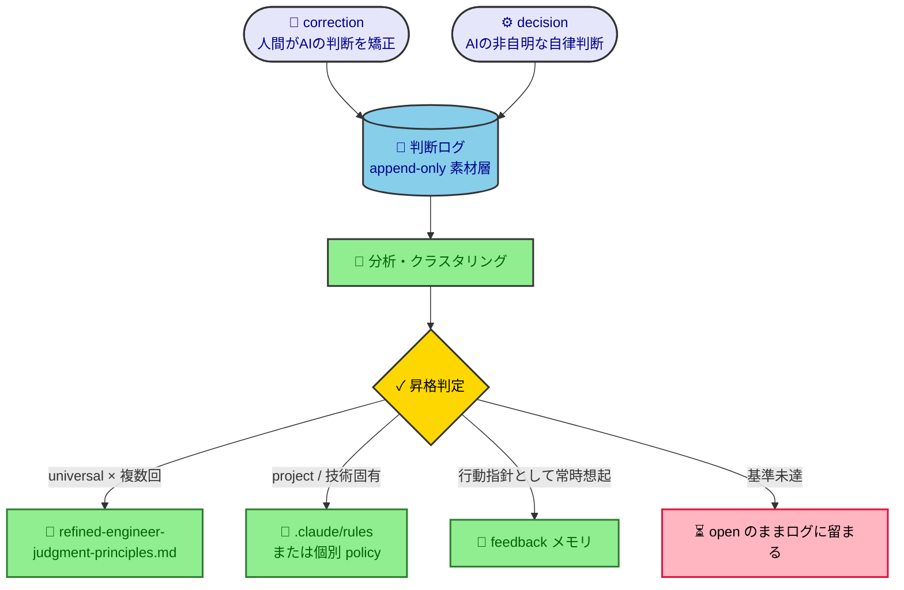

# 判断ログ（素材層）

**想定シーン**：原則を実データから育てたいAI・人間が、(a) 判断を記録する／(b) 貯まった素材を分析して原則へ昇格させる、とき。

[refined-engineer-judgment-principles.md](policy/refined-engineer-judgment-principles.md) に載せる原則を**実データから抽出する**ための、加工前の素材を貯めるappend-onlyログ。AIが自律的に下した非自明な判断と、人間からの判断矯正を生のまま記録する。これ自体は規範（ポリシー）ではなく、原則を育てるための**観測データ置き場**である。

## なぜ独立した層が必要か（feedbackメモリとの役割分担）

feedbackメモリ（`~/.claude/.../memory/`）は「自明でない・一般化できる事実だけを残す」フィルタを通過した**加工後の成果物**であり、その瞬間に以下を捨てている：

- **棄却された矯正**：些細／一回限りと判断して保存しなかった指摘。だが複数回再発すれば原則化すべき素材だった
- **認識されなかった矯正**：そもそも矯正と気づかなかったもの（最大のブラインドスポット）
- **頻度・再発情報**：重複を統合するため「何回起きたか」が消え、昇格判断ができなくなる
- **生の文脈**：一般化された事実に圧縮され「どの状況で・どんな代替案を却下して」が消える

メモリは原則抽出の**データソースにはならない**（抽出前の素材が残っていないため）。そこでこのログを素材層として置き、メモリ／principles／rules はその**プロモーション先**とする。



## 何を記録するか（トリアージ）

価値の高い順に：

1. **correction（最優先）**：人間がAIの判断・実装を矯正した瞬間。判断ギャップが外部からラベリングされた金の教師データ
2. **decision**：AIが自律的に下した非自明な設計判断・選択（トレードオフを伴うもの）

**記録しないもの**：自明で正しかった判断、会話限りの瑣末な選択。素材層とはいえノイズは薄める。

## 記録タイミング

CLAUDE.md「AIへの基本指示」の*やり取りで得た知見を回答末尾にまとめる*習慣と連動させる。具体的には、その回で **(a) 人間に判断を矯正された**、または **(b) トレードオフを伴う非自明な自律判断を下した** 場合、回答末尾でその旨に触れ、本ファイルへ1エントリ追記する。

## エントリ・テンプレート

各エントリは、ヘッダーの **話題**（何についての判断か。短い名詞句）＋本文の3項目で捕捉する。本文は `AI判断`（AIが下した判断・実装）、`人間指摘`（人間が示した修正方向）、`原因`（なぜAIの判断がズレたか＝失敗モード）。狙いは「AIに判断を任せる基準づくり」で、その基準とは結局**AIが繰り返す失敗モードのカタログ**。だから捕捉すべき生信号は各事例の `原因` であり、`話題` はその原因が**話題固有か話題横断か**を見分ける軸になる（→ 同じ失敗が一話題に偏れば project 固有ルール、横断で出れば universal 原則、という昇格の振り分けに効く）。

一般化した「教訓・原則」は**捕捉時に書かない**。1件だけで一般化すると粒度を外す（本ファイルの「加工は分析時に後回し」に反する）。教訓は複数の `原因` を見比べて分析時に立ち上げる産物であり、スコープ・ステータス同様、捕捉時には持たせない。

```markdown
- YYYY-MM-DD [correction] ＜話題：何についての判断か。短い名詞句＞
  - AI判断：
  - 人間指摘：
  - 原因：なぜそう誤ったか（失敗モード）
```

[decision]（人間の矯正がない自律判断）の場合は、`人間指摘`→`却下案`（採らなかった対立案）、`原因`→`狙い`（なぜそう決めたか）に読み替える。

<details>
<summary>記入例（フォーマット説明用の仮想エントリ）</summary>

```markdown
- 2026-06-14 [correction] CDK の物理名命名
  - AI判断：S3物理名を `my-app-${env}` で明示指定しようとした
  - 人間指摘：env取り違えで diff 誤検知になる。PhysicalName.GENERATE_IF_NEEDED に委ねよ
  - 原因：明示命名を「分かりやすさ」と捉え、決定論性・diff影響への波及を見落とした
```

</details>

## プロモーション（昇格）フロー

定期的（月次 or エントリが一定数たまったとき）に、前回レビュー日以降のエントリを見直す：

1. **クラスタリング**：似た原因（失敗モード）をまとめ、再発回数を数える
2. **昇格判定**：
   - `universal × 同種2件以上`（または明確な普遍性）→ principles へ昇格
   - `project/技術固有` → rules または個別 policy へ随時反映
   - 行動指針として常時想起したい → feedbackメモリへ反映

昇格の記録は**昇格先（principles 等）に残す**。ログ側は生のまま蓄積し、個々のエントリにステータスは持たせない（どこまで処理したかは「前回レビュー日」で管理する）。

> [!IMPORTANT]
> principles は「判断の北極星」であり肥大化させない（原則4・5）。N=1の事象を性急に昇格させない。固有・瑣末なものは principles に入れず rules / 個別 policy に振り分ける。

---

## ログ

<!-- 新しいエントリを上に追記（逆時系列） -->

- 2026-06-26 [correction] 設計書本文に過程の記述（整備途上note）を残した＝CLAUDE.md明文違反
  - AI判断：database-design-policy 冒頭に「整備途上・現状は同時更新制御のみ・今後追記」のNOTEを置いた。さらにこれを指摘された際、判断ログには「削除テスト未適用／書き手の都合を読者価値と取り違えた」という*ソフトな判断ミス*として記録した
  - 人間指摘：CLAUDE.md は「設計書本文は現在の仕様のみ・過程の記述を残すな」と明確に主張している。なぜ違反したのか
  - 原因：CLAUDE.md「ドキュメント・コメントの基本方針」の明文ルールへの違反。違反した根因は、同ルールの禁止キーワード例（旧・廃止・移植・以前・もともと・リファクタ）が**すべて過去向き**だったため、ルールを「改定経緯（バックワードな履歴）の禁止」と狭く解釈し、「整備途上・今後追記」という**前向きのステータス記述**を射程外と扱ったこと。原則（本文＝現在の仕様のみ）ではなくキーワード一覧にパターンマッチした（言葉尻に従い精神に従わない失敗モード）。加えて、最初の自己分析が「削除テスト」という弱い基準に逃げ、*明文ルール違反*という最も強い原因を見落とした（matchするルールの能動的な探索不足＝2026-06-25「rules見落とし」と同系）
- 2026-06-26 [correction] ハブ概要を現トピックに特化して書いた
  - AI判断：policy-hub の database-design-policy 概要を「現状は楽観/悲観ロックのみ」と現トピックを列挙して書いた
  - 人間指摘：今の記述に特化しすぎ。今後トピックが増える前提でもっと抽象的に（文書の役割で）書くべき
  - 原因：書いた時点の内容（1トピックしかない状態）に視点を固定し、文書の寿命＝将来の拡張を考えなかった。ハブ概要を「文書の役割」ではなく「今ある中身」の要約にしてしまい、トピック追加のたびに概要を書き換える保守負債を作った（メンテ容易性＝変更が予想されるものをハードコードしない、の文書版）

- 2026-06-26 [decision] 楽観/悲観ロックのポリシー適格性の切り分け
  - AI判断：「楽観/悲観ロックの使い分けをポリシー化すべきか」に対し、テーマを「教科書的に決まる工学知識」と「グレーゾーンを潰す私たちのデフォルト立場」に二分し、ポリシーに載せるのは後者（＝価値判断）だけだと整理した。その上で database-design-policy を「既定は楽観ロック・悲観は限定条件＋短時間保持」という判断基準のみで構成し、ロック機構の解説（知識）は一切書かなかった。可視化は判定が単一分岐のため逆変換テストで図を見送り表＋TIPに留めた
  - 却下案：使い分けの決定木をそのまま解説込みで書く（リファレンス化）／立場を決めずに中立併記する
  - 狙い：プロジェクトのポリシー定義（判断が分かれる事柄に「私たちの良いX」を宣言し出力ブレを抑える）に照らすと、決定木の解説は知識でありポリシーの価値（デフォルト立場による迷いの解消）を生まない。知識とポリシーを混ぜると文書が膨らみブレ止めが薄まるため、価値判断のみに絞った。構成依存（Lambda等）は断定せず原理レベルに保ち、過去correction（2026-06-17 設計ポリシーは汎用）とメモリ（ポリシーはポータブル）に整合させた

- 2026-06-25 [decision] 無価値な図（文章の言い換え）への対策の置き場
  - AI判断：可視化の質低下を「可視化を増やす圧力（怠慢である等）に対し、質を測るブレーキが無い非対称」と診断。policy にはテキストの削除テスト・表の表化テストはあるが図に同等のテストが無い欠落を埋め、名前付き「逆変換テスト」を新設。①policy（定義＋人間向け一言）②doc-reviewer-agent（検出ロジック＋採点行を量だけ加点から質込みへ修正）③design-doc-mermaid（描く前の Value Gate）の3層に配置した
  - 却下案：policy に一言の方針文だけ足す（生成・レビューで強制されず素通りする）／検出ロジックだけ足し採点行は触らない
  - 狙い：方針文だけでは「埋もれたチェックは素通りする」（メモリ feedback_review_rules_must_be_in_scoring_spine）。定義を北極星として置きつつ、採点rubricに質を載せて後ろ盾にし、最上流の生成スキルにも自己ブレーキを置く多層防御にした。既存の削除テスト・表化テストと同じ「名前付き捨てる基準」の語法に揃え、policy 内の一貫性を保った
- 2026-06-25 [decision] レビュースキルが rules を見落とす欠陥の修正方式
  - AI判断：code-review が import順序違反を素通りした原因を「採点rubricに項目が無い＋ルール照合ステップが条件付き・曖昧・報告に出口なし」という構造欠陥と診断。import順序は採点項目に昇格（背骨化）、ルールファイルの必須読込＋全項目照合＋報告セクション必須化で多層に固定。CDK側は差分検知ルール8項目を rubric の採点項目化（34項目への大改修）ではなく「Critical ゲートとして報告」する方式にした
  - 却下案：import違反だけ1項目足して終える（対症療法）／CDK差分検知ルールも全部スコア項目化して減点対象にする
  - 狙い：症状（import）ではなく失敗の構造（rubricに無い規約は能動的に探されない）を断つのが目的。レビューの背骨は「採点項目＋報告フォーマット」で、ここに乗らない規約は埋もれる。一方で安全規約（差分検知）は減点で薄まるより合否ゲート（Critical）の方が強く効くため、スコア化と使い分けた。ルールファイルを唯一の正として毎回読ませることで、rubric転記のドリフトも回避
- 2026-06-25 [correction] エラーコード採番・カタログの要否判断
  - AI判断：エラーコード採番を「ロギング寄りで重い機構」と捉え、本文には入れず末尾パーキングのみを提案した
  - 人間指摘：エラーコード一覧は「システムで起きうるエラーを一望できる」カタログとしての価値がある。常にやるべきではないにせよ、その観点が抜けている
  - 原因：採番（書式・採番ルールという重い機構）とカタログ（失敗モードの網羅目録）を一塊で見て「重い／ロギング」と片付け、後者の設計価値（網羅チェック）を取りこぼした。価値を分解せず一括で deferral に倒した（2026-06-22「表化を全構造へ過剰一般化」と逆向きの、一括で切り捨てる失敗モード）
- 2026-06-24 [decision] エラーハンドリング方針の判断軸選定
  - AI判断：throw 統一の使い分け基準を、人間が挙げた「異常 vs 想定内の失敗」軸ではなく「呼び出し側にとって throw が役に立つか」軸で設計した。さらに「throw か戻り値か（機構）」と「Result型かネイティブunionか（表現）」を2層に分離し、戻り値表現を認める狭い例外でも Result/Either 型は禁じた
  - 却下案：人間提案どおり「異常 vs 想定内」を主軸にする／単純に「Result型禁止」だけを宣言する
  - 狙い：「異常 vs 想定内」軸だと想定内の失敗がすべて戻り値表現に倒れ、AIの「なんでもResult」を正当化してしまい目的（throw既定）と矛盾する。AIのResult濫用の本体は機構ではなく表現選択（Result型に手を伸ばす癖）なので、2層に分けて表現側を塞ぐのが効くと判断。人間の初期フレーミングを尊重しつつ、目的に照らして軸を組み替えた（合意済み）
- 2026-06-24 [decision] 引数ポリシー節のタイトル命名と収録範囲
  - AI判断：節タイトルを「引数は責務を映す鏡」とし、数上限・ブーリアン引数アンチパターンの2点を「引数は責務を映す」という1つの WHY で束ねた。マジック値禁止は収録、出力引数の回避と primitive obsession は除外した
  - 却下案：2ルールを並列に列挙するだけ（束ねる WHY を立てない）／出力引数・primitive obsession も網羅的に収録する
  - 狙い：既存節（レイアウト〜・上位関数〜）が「1つの格言＋複数の下位指針」構造で、WHY を語る作りに揃えるため一意。primitive obsession は「引数の数・形」ではなく型設計の領分で焦点がぼけるため除外、出力引数は同系だが節の主軸（責務の切り替え）から外れるため見送り、スコープを絞る判断を優先した
- 2026-06-24 [correction] 「100行程度に削減」を上限と解釈し過剰削減
  - AI判断：「100行程度に削減」を受け、126行を84行まで削った（言い換えTIPの除去に加え、共通化の①②小見出し＋テーブルを統合するなど構造も圧縮）
  - 人間指摘：「程度」は100行前後の意味。上限と解釈するのは普通におかしい
  - 原因：「削減してほしい」という方向性に引きずられ、「程度＝おおよその目標値」という語義を取り違えて「上限」に倒した。少ないほど指示に忠実という思い込みで、目標値からの下振れもズレであることを照合しなかった（指摘への過剰反応で反対の極端へ振れる失敗モード＝2026-06-14「フォーマット粒度」と同系）
- 2026-06-24 [correction] スキルのフロー配置を前提条件と矛盾する位置に提案
  - AI判断：pr-check（既存PRを対象に gh pr view/comment で動くスキル）を、CLAUDE.md 開発フローの Step7-8（コミット・push前）に位置づける選択肢として提示した
  - 人間指摘：このスキルはPR作成前でも使えるのか？（＝その時点ではPRが無く動かない。配置が成り立たない）
  - 原因：選択肢を提示する際、その対象物（スキル）自身の前提条件（PRが存在すること）と配置先（PR作成前）が両立するかを照合しなかった。フロー上の「コミット前後」という語感だけで位置を決め、artifact の動作前提に立ち返らなかった。設計合意の中で確定済みの制約（PR前提）を、別観点の判断（フロー配置）に持ち越せていない
- 2026-06-24 [decision] 街灯効果アンチパターンの配置とDRYトレードオフ
  - AI判断：街灯効果を「何を監視するか（根拠を持って選ぶ）」節の中、GSM推奨TIPの直後・ブラックボックス節の前に「オオカミ少年」と並ぶアンチパターン小節として置いた。例の良い側は `決済完了率` をGSMガイドと統一し、悪い側に既存「根拠」表と重なる `CPU` を含めた
  - 却下案：質を保つ後半節（オオカミ少年の隣）に置く／既存「根拠」表とCPU例が重複するので街灯表の例を全面差し替えする
  - 狙い：街灯効果は「取りやすいデータへの引力」＝選定の歪みであり、質（アラートの鋭さ）ではなく選定（何を測るか）の問題なので前半節が一意。既存表との軸の違い（根拠の有無 vs バイアスの誘因）が明確で、`PR数・行数` 追加で運用外への一般性も示せるため、CPU重複は許容しDRYより概念の対比を優先した（良い例の統一は読者の追跡負荷を下げるDRY側の配慮）
- 2026-06-24 [correction] TL;DR に行を追記して4行に膨らませた
  - AI判断：pr-review-policy に作成者前提の項目を足すついでに、TL;DR へ新たな箇条書きを1行追加し4行にした
  - 人間指摘：TL;DRは3行までが絶対ルール
  - 原因：本文へのセクション追加に意識が向き、TL;DR編集時に documentation-policy「絶対に3行まで」を照合しなかった。既存3行に新情報を畳み込む（サイズ行へ200行を内包）選択肢を、行追加より先に検討しなかった。ポリシー適用 hook が出ていたのに、可視化・DRY は確認した一方で同ポリシー内の TL;DR 制約を見落とす部分的照合になった
- 2026-06-24 [decision] 関数とクラスの使い分け基準の主軸選定
  - AI判断：application-design-policy に使い分け節を起こすにあたり、判断軸を「状態と不変条件を外部から守る必要があるか」の1本に絞り、「既定は関数 + モジュール、クラスは明確な理由があるときだけ」というスタンスを既定にした
  - 却下案：軸を「ポリモーフィズム/差し替えの要否」や「テスト容易性」に置く／関数・クラスを中立併記して既定を設けない
  - 狙い：既存原則（明示>暗黙・シンプル志向・コードは負債）から「関数既定」は一意に導けるため、軸選定と既定スタンスは自律で決めた。一方、配置（本体 vs 独立サブポリシー）とドメインモデルの厚みは原則から一意に出ず文脈依存のため AskUserQuestion で確認（→ 本体の一節・ドメイン方針は未定につきクラス側は中立記述に留めた）
- 2026-06-23 [correction] 新ポリシーを既存ポリシーへリンクで繋ごうとした
  - AI判断：手順書ポリシーの共有原則（なぜを書く・シンプルさ等）は documentation-policy にリンクし、固有分だけ書く（DRY優先）を推奨した
  - 人間指摘：このプロジェクトは DRY より SRP を優先する。目的が異なる文書は独立・単体完結にし、documentation-policy の使える部分はリンクせず転記せよ
  - 原因：文書間の重複を一律に DRY 違反と捉え、SRP（目的の異なる文書は単体で使えること自体が価値）との優先順位を確認せず、DRY を既定の上位に置いた。手順書と設計書が「目的が異なる別ジャンル」である点を、重複削減より優先すべき軸として扱えなかった
- 2026-06-22 [correction] 可視化ポリシー強化で表化を全構造へ過剰一般化
  - AI判断：「構造のある情報はデフォルトで表にする」と既定値を反転し、doc-review ゲートにも表化必須指摘を追加した
  - 人間指摘：それだと図にすべき箇所（関係・流れ・階層・状態遷移）まで表になりかねない
  - 原因：「可視化」と「表化」を同一視し、表化の既定値を構造一般へ過剰一般化した。元の可視化トリガーが構造ごとに図と表を振り分けていた事実を踏まえず、表だけを既定形に格上げした（ルール強化時に対象範囲を広げすぎる失敗モード）
- 2026-06-21 [correction] 検証ゲートをポリシー化しようとした
  - AI判断：「マージしてよいの定義（検証ゲート / DoD）」を pr-review-policy の双子として新規ポリシー化する方向で設計・確認した
  - 人間指摘：強制できるゲートは GitHub Actions ＋ブランチ保護で機構的に強制すればよく、ポリシー文書は不要（設定と二重管理になる）
  - 原因：policy（人によって判断が分かれる「良いX」の宣言）と mechanism（客観判定で強制できるチェック）の境界を引き違えた。merge gate の大半はバイナリ判定可能＝機構の領域なのに、判断残余として扱いポリシーに寄せた。「文書化＝整備」と捉え、強制できるものは設定が SSOT という DRY 観点（documentation-policy）を後回しにした
- 2026-06-19 [correction] 「ハードコードしない」の対象を取り違え
  - AI判断：ポリシー強制 hook の「ハードコードしない」を *どのファイルにどのポリシーを当てるかの対応表* と解釈し、マッピングをどこに置くか（frontmatter / 外部JSON）を主論点に据えて確認した
  - 人間指摘：避けたいのはポリシーの *中身*（旧 hook が ①②③ と要約を直書きしていた）を script に書き写すこと。対応表（パスのポインタ）は論点ではない
  - 原因：「ハードコード」の指示対象を確認せず、自分が想定した論点（対応表の保守）に寄せて解釈を固定した。元プロンプトの「policyの内容や〜」の *内容* を読み落とし、二重管理の核（本文⇄scriptの同期）を後回しにした
- 2026-06-19 [correction] シフトレフトの自発提案漏れ（目的適合の仕組み化）
  - AI判断：目的に合わない記述の混入対策を、文書作成・レビュー段階（write-time 自己監査・doc-reviewer ゲート）中心に設計し、最左の工程（grill-me / plan ＝タスク検討段階）への前倒しを自分からは提案しなかった。check-plan への組み込みは人間が提案して初めて出た
  - 人間指摘：refined-engineer-judgment-principles に「シフトレフト」が最上位原則として在るのだから、AI 側から開発フロー初期段階での対応を提案すべきだった。原則が機能していない
  - 原因：シフトレフト原則のトリガーが「後で確認・修正すればいいと思ったとき」という*先延ばしの感覚*に限定され、*対策・チェックの置き場所を設計するとき＝もっと左に置けないか*という面を捕捉しなかった。omission（考慮漏れ）型の失敗は自己トリガーでは捕まりにくい
- 2026-06-17 [correction] ポリシー汎用/特化分類で「設計ポリシー」を特化判定
  - AI判断：cdk-design / database-design / github-actions-design-policy を、対象（AWS・DB・CI）が固有という理由で「特化」に分類した
  - 人間指摘：いずれも汎用。技術をうまく使うための設計原則（良いCDK/DB/GHAとは）であり移植可能
  - 原因：ファイル名の名詞（技術領域）に引きずられ、中身の性質（"-policy"＝原則レベルで移植可能か、固有スペックか）で判定しなかった。memory「CI/CD設計依存は汎用に含めない」を、原則レベルのGHA設計方針にまで過剰適用した
- 2026-06-17 [correction] ハブ追記を確認に回した
  - AI判断：policy-hub への monitoring-policy 追記を「他ポリシーも未掲載なのでまとめて直すか要相談」として確認に倒した
  - 人間指摘：言われなくてもやっておいて（低リスクかつ明らかにスコープ内）
  - 原因：分割作業の副作用である自明な配線を「独立した判断事項」と誤認し確認コストを過小評価。過剰確認の失敗モード（2026-06-14 目的確認エントリと同系）
- 2026-06-17 [decision] 汎用ポリシーへのAWS具体例の混入
  - AI判断：monitoring-policy の actionable 節で、原則文は汎用（「クラウド基盤障害」）に保ちつつ、AWS（Lambda・AWS Health）を明示した具体例を Admonition に収録した
  - 却下案：メモリ「ポリシーは汎用・ポータブル」に従い具体名を一切出さない／全面的にAWS前提で書く
  - 狙い：ユーザーが具体例（AWS明示）を明示選択した一方、メモリは汎用性を要求。原則＝ポータブル・例＝具体、と層を分けることで両要求を両立させた（流用時は例だけ差し替えればよい）
- 2026-06-14 [correction] 目的確認指示の設計（CLAUDE.md）
  - AI判断：目的確認の指示を「目的が一意に読めず、かつ目的次第でやり方が変わるとき」に限定した
  - 人間指摘：目的確認は何より重要。執拗に・最優先で確認させるべき
  - 原因：過剰確認という別の失敗を恐れ、先回りで絞りすぎた（確認コストを過大評価し、目的取り違えのコストを過小評価）
- 2026-06-14 [correction] 判断ログのフィールド設計
  - AI判断：3番目の項目を「教訓（一般化した原則）」とした
  - 人間指摘：本質がズレる。捕捉すべきは「判断ミスの原因」では
  - 原因：一般化＝分析の産物を捕捉時にやろうとした（早すぎる加工）。原因の方が生信号で目的に直結すると見抜けなかった
- 2026-06-14 [correction] 判断ログのフォーマット粒度
  - AI判断：判断ログのエントリを「起きたこと1文＋教訓」まで圧縮した
  - 人間指摘：削りすぎ。AI判断と人間指摘の差分が判断基準づくりの核
  - 原因：「重い」という前回指摘に過剰反応し、反対の極端へ振れた。目的に必要な信号かを確認せず一律に削った
- 2026-06-14 [correction] 判断ログのフォーマット設計
  - AI判断：判断ログのエントリ形式を6フィールドで設計した
  - 人間指摘：記録が重すぎる。捕捉時は最小限にせよ
  - 原因：網羅的・丁寧＝良い記録と思い込み、大量蓄積時の1件あたりコストを軽視した
- 2026-06-14 [correction] 判断ログのデータ源
  - AI判断：feedbackメモリだけで原則抽出できると考えた
  - 人間指摘：全ての矯正がメモリに残るわけではない（メモリは加工後成果物）
  - 原因：メモリが「加工後の成果物」である性質を見落とし、生データの保存層と混同した
