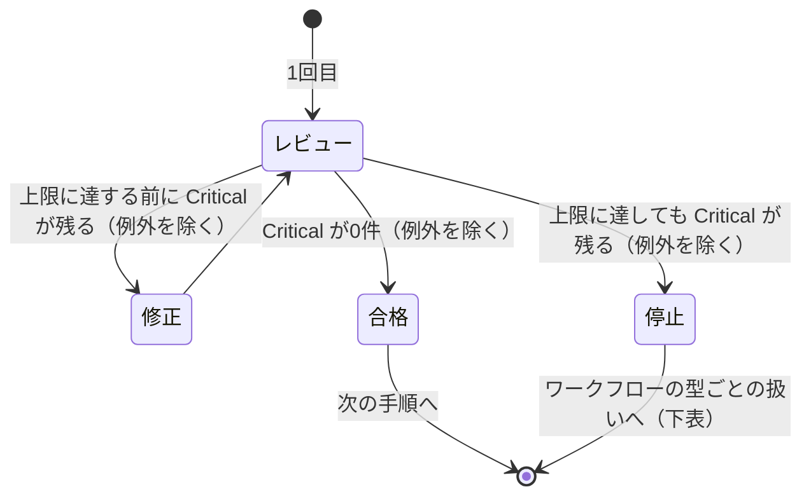

---
hook:
  applies-to:
    [
      '.claude/agents/*-reviewer-agent/*.md',
      '.claude/skills/*-review/**/*.md',
      '.claude/skills/check-plan/**/*.md',
      '.claude/skills/code-dev/SKILL.md',
      '.claude/skills/cdk-dev/SKILL.md',
      '.claude/skills/design/SKILL.md'
    ]
---

# AIレビュー合否ゲートポリシー

AIエージェントが、レビュー系 agent・Skill の指摘に重大度を付ける前、レビュー結果で合否を決める前、レビューと修正を繰り返すワークフロー（`/check-plan`・`/code-dev`・`/cdk-dev`・`/design` 等）を新設・編集する前に参照する。重大度の呼び方（Critical/Recommended/Suggested、[必須]/[推奨]/[提案]、✅/⚠️/❌ など）と、合否・再レビューの回数がレビューごとにばらばらに決められ、同じ重大度の指摘がレビューの種類によって通ったり止まったりする状態を防ぐ。

> [!IMPORTANT]
> **TL;DR（このポリシーの決定事項）**
>
> - **重大度は Critical / High / Medium の3段階で統一する（対象外のレビュー・まだ移行していないレビューを除く。下の「適用範囲」参照）。** 呼び方は各レビューの既存の分類ではなく、この3段階に揃える
> - **合格条件は「残してよい2種類以外の Critical が0件」。点数は付けない**
> - **レビューは最大2回（初回を含む）。毎回すべての重大度を直す（例外は本文参照）**
> - **上限に達しても（例外を除く）Critical が残ったら、自律型ワークフローは Issue にして止め、対話型ワークフローはユーザーに報告して次の手順へ進ませない**

## 重大度は3段階——Critical / High / Medium

| 重大度       | 基準                                                                                                                     |
| ------------ | ------------------------------------------------------------------------------------------------------------------------ |
| **Critical** | 放置すると成果物が役目を果たせない。または、誤動作・セキュリティ事故・データ損失・読み手の誤った判断など、実害に直結する |
| **High**     | いまは役目を果たせるが、変更や保守のときに壊れる、または内容が食い違う（設計原則やポリシーの違反など）                   |
| **Medium**   | 読みやすさ・分かりやすさの改善                                                                                           |

2つの行に同時に当たる指摘は、上の行（重い方）を取る。

領域ごとの具体例（「〇〇レビューでの Critical の例」など）は、このポリシーには書かない。各レビューがいま観点を定めている場所——`review-criteria.md` があるレビューはそのファイル、無いレビューは観点を持つ reviewer agent の定義（例：`/check-plan` なら `plan-reviewer-agent`）——に置く。具体例を置くためだけにファイルを新設しない（下の「上位原則との関係」参照）。

## 直す範囲は毎回すべて、例外は重大度によらず2種類だけ

修正のたびに、重大度にかかわらず指摘をすべて直す（上限に達して不合格になった回を除く。下の「レビューは最大2回まで」参照）。ただし次の2種類だけは、重大度にかかわらず直さずに Issue にしてよい。**この2つ以外は、重大度にかかわらず直す。**

- 統合で人間に回した食い違い（`issue:needs-human-decision`）
- `/design` の「Issue の意図に反する指摘はスキップする」で落とした指摘

この2種類は Issue にしたうえで、統合レポートにその Issue 番号を書く。**「Issue 番号がある」だけでは2種類と認めない**——次の記録があって初めて2種類のどちらかと判定する。

- 統合で人間に回した食い違い：その Issue に `issue:needs-human-decision` ラベルが付いている
- `/design` のスキップ：`/design` が報告するスキップ一覧に、その指摘が載っている

外から確かめられるこの記録で判定するのは、修正役が自分の判断で「これは残してよい」と決めることを防ぐためである（下の「上位原則との関係」参照）。この2種類として Issue にした指摘が次のレビューでも同じ指摘として出たら、新しく Issue を作らず、既存の Issue 番号のまま数える（再レビューは前回の指摘を受け取らないため、同じ欠陥をここで見分ける）。

- ❌ 直せない指摘をとりあえず Issue にして直さずに済ませる → ✅ 残してよいのは上の2種類だけ。それ以外は重大度にかかわらず直す
- ❌ Critical だけ直し、High は次の機会に回す → ✅ 上の2種類を除き、重大度にかかわらずすべて直す

再レビューへ回すかどうかは、上の2種類を除いた Critical の有無だけで決める。High・Medium のために再レビューを重ねてループが終わらなくなるのを防ぐためであり、直さなくてよいという意味ではない。上の2種類を除いた Critical が0件で High・Medium だけが残った回も、次の手順に進む前にその回のうちに直す（再レビューには回さない）。

再レビューには前回の指摘を渡さない。まっさらな状態で再レビューし、直っていない・新たに生まれた指摘だけを拾う。

## 合格条件は「残してよい2種類以外の Critical が0件」

合否は Critical の有無だけで決める（High・Medium は合否を左右しない。ただし上の「直す範囲」の対象ではある）。点数（合計点・平均点・得点率）は出さない。

上の2種類として Issue にした Critical は、合格条件の対象から外れる。**それ以外の Critical が1件でも残っていれば不合格とする——Issue にしてあっても数える。**

## レビューは最大2回まで（初回を含む）

図は Critical の扱いだけを示す。合格の回に出た High・Medium も、次の手順に進む前にその場で直す。

上限に達しても（例外を除く）Critical が残ったときの扱いは、ワークフローの型で分かれる。**この判定は、下表の対応を取る前の指摘そのものに対して行う。** 自律型ワークフローが残った Critical を Issue にするのは、不合格と決まった後の停止処理であり、合格条件を満たすための手段ではない。**この回は「直す範囲は毎回すべて」を求めない**——その回に出た指摘は重大度にかかわらず直さず、下表の対応へ進む。

| ワークフローの型                         | 上限に達しても不合格のときの扱い                                                 | 例                      |
| ---------------------------------------- | -------------------------------------------------------------------------------- | ----------------------- |
| 自律型（人間の確認なしに最後まで進む）   | 残った Critical を `/quick-issue` の書式で1件ずつ Issue にし、不合格として止める | `/code-dev`・`/cdk-dev` |
| 対話型（会話の中で都度確認しながら進む） | 残った Critical をユーザーに報告し、次の手順へは進ませない（Issue にはしない）   | `/check-plan`           |

## 適用範囲

このポリシーは、frontmatter 冒頭の `hook.applies-to` が指す agent 定義・Skill 定義を編集するときに自動で差し込まれる——具体的な一覧は `hook.applies-to` を見る（ここには書き写さない）。**差し込まれることと、このポリシーに従うべきこと（適用対象）は同じではない。** 適用対象は、差し込まれた先から次を除いたものである。

- severity と合否の形がこのポリシーと本質的に異なるレビュー：`sre-prr-reviewer-agent` の go／条件付きgo／no-go 判定、`doc-consistency-reviewer-agent` の重複・矛盾検出、`quick-doc-review` の OK/NG チェックリスト

これらは対象外とし、このポリシーを読んでも表記を変えない。

上の対象外を除き、まだ3段階に揃えていないレビューを、対応する移行 sub-issue の外で編集するときは、既存の重大度表記を書き換えない。新しく重大度を持つ観点・指摘を足すときだけ Critical / High / Medium で書く（表記が混ざる状態は、そのレビューの移行 sub-issue で解消する）。`hook.applies-to` に移行前のレビューも含めているのは、この場面でこのポリシーを読ませ、実装が既存の重大度表記のまま新設・拡張されるのを防ぐためである（下の「上位原則との関係」の「シフトレフト」）。

## 上位原則との関係

本ポリシーは横断原則の具体化である。判断に迷ったら [refined-engineer-judgment-principles](refined-engineer-judgment-principles.md) に立ち返る。

- **判断軸は「既定値＋反転条件」で与える**：合格条件を「`issue:needs-human-decision` ラベルの有無」「`/design` のスキップ一覧に載っているか」という外形的事実で決める。「軽微だから」「文脈上問題ない」といった AI の内心の評価では合否を動かさない
- **シフトレフト**：`hook.applies-to` に移行前のレビューも含め、まだ合わせていないレビューを編集する時点からこのポリシーを読ませる
- **YAGNI**：具体例の置き場をこのポリシーに新設せず、各レビューが既に持つ観点の正典（`review-criteria.md` または reviewer agent 定義）に置く
- **Less is more**：重大度は3段階にとどめ、レビューごとの呼び方の違いを吸収する
