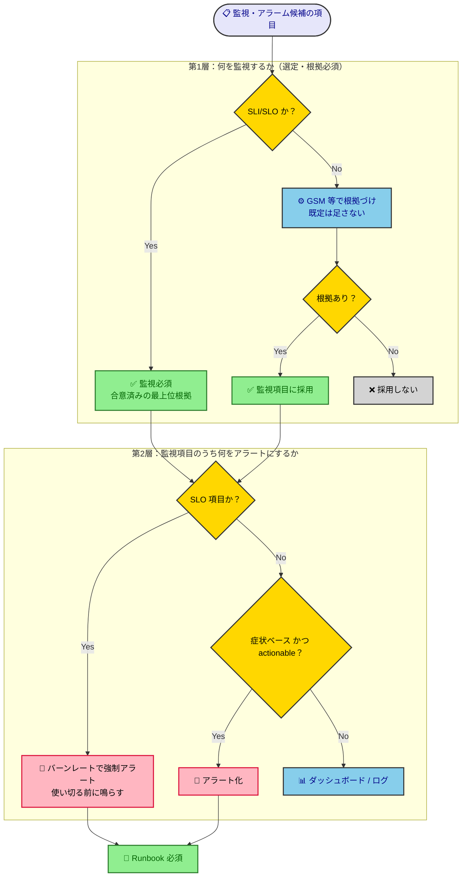

# モニタリング・アラームポリシー

監視・アラームの「良い／悪い」を判断するためのレビュー基準を示すドキュメント。**監視・アラームを設計する／作られた監視設定をレビューする開発者・運用者が、何をどう監視・アラート化すべきかの統一基準を知りたいとき**に参照する。

> [!IMPORTANT]
> **TL;DR（このポリシーの決定事項）**
> - 監視・アラーム項目は **根拠を持って選び、その根拠を文書化** する（設計書、またはCDK等のコード内）。根拠の有無と妥当性がレビュー対象（GSMは根拠を作る推奨手法の一つ。必須ではない）。ただし **外形監視（Synthetics）だけは例外で、根拠が自明なため個別の正当化なしに必須のベースライン**。
> - アラートは **ユーザー影響の症状** で上げ、原因は調査で辿る。鳴ったら **人間が取る対応**（復旧に限らず連絡・縮退・待機も含む）が必ずあり、**Runbook** を紐づけること。
> - **RUM は根拠次第の任意項目**。ビジネス成果への直結度やユーザー環境の多様性を根拠に採否を判断する。

---

## 全体像：選定 → アラート化の2層

このポリシーは2つの層でできている。**第1層＝何を監視するか（選定）**、**第2層＝監視項目のうち何をアラートにするか**。混同すると「監視項目は全部アラートにするのか？」という取り違えが起きるので、選定とアラート化を分けて捉える。

---

## 外形監視（Synthetics）は選定フローと独立した必須ベースライン

上記の2層フレームは「根拠が要る監視項目」が対象である。**外形監視（Synthetics）だけは例外で、根拠が自明なため個別の正当化なしに必須**。エンドポイントを外部提供するシステムなら、SLI/SLO の定義有無に関係なく死活・可用性の合成監視を入れる。

- 能動的にプローブを打つ仕組みなので、実トラフィックが無い時間帯でも異常を検知できる（実アクセスに依存する RUM 等の受動計測では検知できない領域）
- 「サービスが応答するか」はあらゆるシステムの大前提であり、目的から逆算するまでもない自明の根拠を持つ
- 可用性 SLI/SLO を定義している場合、Synthetics はその**計装手段の一つ**としても機能する

[RUM（後述）](#rumリアルユーザーモニタリングは根拠次第で採否を決める任意項目)とは位置づけが異なる。

| | 外形監視（Synthetics） | RUM |
|---|---|---|
| 位置づけ | 選定フローの外（無条件で必須のベースライン） | 選定フローの中（根拠次第の任意項目） |
| 根拠の要否 | 自明なため個別の正当化は不要 | GSM等での根拠づけが必要 |
| 適用条件 | エンドポイントを外部提供するシステムなら常に | ビジネス成果への直結度・環境多様性等の根拠があるとき |

> [!NOTE]
> RUM を含む他の監視・アラーム項目は、引き続き次節以降の「根拠を持って選ぶ」フレームに従う。

---

## 何を監視するか — 根拠を持って選ぶ

### 監視・アラーム項目は根拠を持って選定し、根拠を文書化する

現場では監視・アラーム項目が統一された考えなしに「その場のノリ」で決められがちである。これを防ぐため、**各項目には「なぜそれを監視／アラート化するのか」の根拠が要る**。そして根拠は頭の中ではなく**文書化された形で残す**。残す場所は設計書が基本だが、CDK等のコードでアラームを定義していて設計書を作らない場合は、**コード内（コメント等）に書く形でもよい**。レビュアーが見るのは「根拠が（場所を問わず）書かれているか」と「その根拠が妥当か（目的に紐づくか）」である。

| | 例 |
|---|---|
| ❌ 弱い | とりあえずCPU・メモリ・ディスクにアラームを張った（なぜそれかの根拠なし） |
| ✅ 強い | 「決済完了率」を監視する。根拠：本システムの目的は決済完了であり、その失敗を最も直接的に示す指標だから |

> [!TIP]
> **（AI・推奨）** 根拠を目的から逆算して作る推奨手法として **GSMフレームワーク** がある（[GSMによるモニタリング項目選定ガイド](../guide/gsm-monitoring-guide.md)）。GSMの使用は必須ではないが、「何のために測るか」を起点に根拠を残せるため推奨する。

### 要件定義で決めた SLI/SLO は、監視項目の「必須の根拠」

要件定義（requirements.md）で定義した **SLI/SLO は、監視項目選定の根拠の中でも最上位**にある。GSM が根拠を「作る」手法なのに対し、SLI/SLO は**すでに合意された根拠**であり、監視するかどうかは任意ではなく**必須**。SLI の代表例（リクエスト成功率・p95 レイテンシ）は、次節以降で言う**症状＝ブラックボックス指標**そのものなので、症状ベースアラートとも相性がよい。

- **SLI は必ず測定できる状態にし（計装）、監視する（必須）。** 「リクエスト成功率」を測るにはリクエスト数・エラー数の集計が要る。集計・メトリクス化の仕組みが無ければ SLI は絵に描いた餅になる。計装さえあれば監視はダッシュボードに依存せず成立する——**ダッシュボードが無くても監視できる状態にすることが必須**。
- **ダッシュボードで現在値を一目でわかるようにするのは推奨（必須ではない）。** ダッシュボードは理解を助ける補助で、監視の成立要件ではない（必須要件は計装＋アラート）。
- **アラートは「エラーバジェットの消費速度（バーンレート）」で鳴らす（すべての SLI で必須）。** SLI/SLO はユーザーに約束したサービスレベルなので、逸脱＝ユーザー影響であり、種別で絞らず全て対象にする。鳴らす対象を SLO のしきい値そのものにしないのは、SLO（例：30日で 99.9%）を直接監視すると割れた時点で期間を使い切った後＝手遅れだから。バーンレートなら使い切る前に予兆を掴め、消費の速さで緊急度を分けられる（速い消費＝即ページ／遅い消費＝チケット。具体的なしきい値・ウィンドウ設計は実装の責務）。オオカミ少年は「アラートを絞る」のではなく次の2点で防ぐ——① 原因系メトリクス（CPU・キュー長等）は SLI にせずホワイトボックス＝ダッシュボードに置く、② 瞬間値のブレでなくバーンレートで鳴らす。

> [!NOTE]
> 計装の実装方法（ログ集計・メトリクス抽出をどう作るか）は設計・実装フェーズの責務で、本ポリシーの対象外。ここで定めるのは「SLI/SLO は必ず監視項目にする」という**選定の必須性**である。

### RUM（リアルユーザーモニタリング）は根拠次第で採否を決める任意項目

[外形監視（Synthetics）](#外形監視syntheticsは選定フローと独立した必須ベースライン)と違い、**RUM は全システム一律で導入するものではなく**、根拠（GSM 等）に基づいて採否を判断する。RUM は実ユーザーの実行環境（ブラウザ・デバイス・ネットワーク）から体感速度やエラーを収集する手段であり、次のような根拠があるときに効果を発揮する。

| 判断軸 | 根拠あり（採用） | 根拠が弱い（見送り） |
|---|---|---|
| ビジネス成果との関係 | 体感速度・エラーが売上やコンバージョンに直結する（例：ECのチェックアウト画面） | 体感速度のブレが成果に響かない社内向け管理画面 |
| ユーザー環境の多様性 | 多様な端末・ネットワークからアクセスされ、サーバー側では再現できない体感差がある | 環境が統制されており多様性が乏しい |
| 利用規模 | 統計的に意味のあるサンプルが集まる程度のアクセス数がある | アクセス数が極端に少なく、ROI が見合わない |

### アンチパターン：「街灯効果」── 取りやすいデータを目的とすり替える

夜道で鍵を落とした人が、暗い落とした場所ではなく明るい街灯の下を探す——これが**街灯効果**（streetlight effect）と呼ばれる認知バイアスである。「本当に見るべき所」ではなく「**見やすい所**」を探してしまう。

計測設計でも同じ歪みが起きる。**Lambda の実行回数（Invocations）・実行時間（Duration）・同時実行数・CPU使用率**のように、CloudWatch が標準で出してくれる「**取りやすいデータ**」を優先し、本来見るべき目的に紐づく指標（例：決済完了率、ユーザー体感の成否）を後回しにする。取りやすさは「鍵がそこにある理由」にはならないのに、データの入手容易性が選定理由にすり替わる。

| | 例 |
|---|---|
| ❌ 街灯の下 | 標準で取れるからLambdaのInvocations・Duration・同時実行数・CPU使用率を測る（目的との関係は問わない） |
| ✅ 鍵のある場所 | 目的＝決済完了。だから取りにくくても「決済完了率」を測る |

> [!TIP]
> **（AI・推奨）** 街灯効果の根本原因は **「測れるもの（Metric）から考える」順序** にある。GSMが強制するのは **Goal → Signal → Metric**、つまり「起点を目的に置く」という**順序の逆転**である。この順序を守るだけで、大半の街灯問題は構造的に防げる（個々の指標を叩くより、選ぶ順序を直す方が効く）。

### 監視にはブラックボックスとホワイトボックスの2種類があり、役割が違う

監視を「ブラックボックス」と「ホワイトボックス」の2つのレンズで捉えると、項目の役割が整理できる。混同すると、原因系メトリクスを片っ端からアラート化して破綻する。

| 種類 | 見るもの | 視点 | 主な用途 |
|---|---|---|---|
| ブラックボックス監視 | 外形・ユーザーから見える結果（成功/失敗・遅延） | ユーザー視点＝**症状** | **アラート**（ユーザー影響の検知） |
| ホワイトボックス監視 | 内部のメトリクス（CPU・キュー長・エラー種別） | システム内部＝**原因** | **原因究明・ダッシュボード** |

> [!TIP]
> **（AI・推奨）** ホワイトボックスのメトリクスを直接ページ通知にしていないか確認する。原因系は「アラートが鳴った後、原因を辿るための材料」であって、それ自体を起こす理由にはしない（次節「症状ベース」を参照）。

---

## どう良いアラートにするか — 質を保つ検証観点

### アンチパターン：「オオカミ少年」── 何でもアラート化して誰も見なくなる

何でもかんでもアラームにすると、ノイズに埋もれて重要な通知まで無視されるようになる。鳴っても誰も動かないアラートは、有害な「オオカミ少年」である。アラートは**少なく・鋭く**保つ。

> [!TIP]
> **（AI・推奨）** 判断基準は次節以降の「症状ベース」「actionable」。これらを満たさない項目は、アラートではなくダッシュボード／ログに格下げする。

### 症状で警告し、原因は調査で辿る（Symptom-based alerting）

「CPU 80%超」のような **原因系で即ページしない**。「ユーザーが遅い／エラーが返る」という **症状（ブラックボックス）でアラートを上げ**、原因系メトリクス（ホワイトボックス）は鳴った後の原因究明に使う。原因系を全部アラート化することが、オオカミ少年の主因である。

| | 例 |
|---|---|
| ❌ NG | CPU使用率・メモリ・キュー長それぞれに即ページのアラームを張る |
| ✅ OK | 「APIエラー率」「p95レイテンシ」（症状）でページし、CPU等はダッシュボードで原因を辿る |

### すべてのアラートは「アクション可能（actionable）」であること

`actionable` とは「鳴ったときに **人間が取るべき意味のある対応があるか**」であって、「自分で根本原因を直せるか」ではない。取るべき対応が何も無いなら、それはアラートではなくダッシュボード／ログに格下げする。

ここで言う「対応」は復旧に限らない。**直せない基盤障害でも、対応は存在する**：

- **コミュニケーション**：ステータスページ更新、顧客・社内・上長への連絡
- **デグレード／フェイルオーバー**：別リージョン切替、サーキットブレーカー、縮退運転
- **下流アラートの抑制**：既知障害中のノイズを止める
- **「意識的に待つ」判断**：適切な人が状況を把握した上で「待つ」と決める（＝放置とは違う）

> [!IMPORTANT]
> **（AI・必須）** **「自分で根本原因を直せないこと」は、アラートを作らない理由にはならない。**
> 例：サーバレス（AWS Lambda 等）で AWS 側の障害が起きると、こちら側に復旧手段はない。だが「エラー率上昇」という同じ症状は**自分のバグでも同じ形で現れる**。「どうせAWSだろう」とアラームを外すと、自分由来の障害を取り逃がす。さらに AWS Health（PHD／ステータスページ）は通知が遅く、たいてい自分の症状アラートの方が先に鳴る。
> → **症状（ユーザー影響）でアラートを張り**、Runbookで「自分起因か基盤起因か」を切り分け、基盤起因なら**連絡・縮退・意識的な待機**に倒す。AWS Health はその切り分けと顧客連絡の補助入力として併用する（症状アラートの代替にはしない）。

### すべてのアラートに Runbook を紐づける

アラート定義に「鳴った時に見る場所・取る手順」へのリンクを必須化する。属人化と、深夜の判断ミスを防ぐ。基盤障害のケースでは、Runbook の最初の手順を「**自分起因か基盤起因かの切り分け**」にし、その先を枝分かれさせる。

---

## レビューチェックリスト

監視・アラーム設定をレビューするとき、次の問いで確認する。

| 観点 | レビューで確認する問い |
|---|---|
| 根拠 | 各監視・アラーム項目の選定根拠が文書化されているか（設計書またはコード内）。根拠は目的（Goal）に紐づくか |
| SLI/SLO由来 | 要件定義で決めた SLI/SLO がすべて監視項目になっているか。SLI は計装済みで、ダッシュボードの有無に関わらず監視できるか。すべての SLI について、SLO しきい値の直接監視でなくエラーバジェットの消費（バーンレート）でアラートしているか |
| 外形監視 | エンドポイントを外部提供するシステムで、SLI/SLO の有無によらず Synthetics（死活・可用性の外形監視）が入っているか |
| RUM | RUM の採否が、ビジネス成果への直結度やユーザー環境の多様性を根拠に判断されているか（過剰導入・見送りどちらも根拠あり） |
| ブラックボックス/ホワイトボックス | アラートはブラックボックス（ユーザー影響）で張られているか。ホワイトボックスのメトリクスを直接ページにしていないか |
| オオカミ少年 | 鳴っても誰も動かないアラートになっていないか（過剰なアラート化をしていないか） |
| 症状ベース | 原因系メトリクスで即ページしていないか。症状で検知し原因は調査に回す設計か |
| actionable | 各アラートに人間の取るべき対応があるか。直せない基盤障害でも連絡・縮退・待機の対応が定義されているか |
| Runbook | すべてのアラートに Runbook が紐づいているか |

---

> [!IMPORTANT]
> 本ポリシーで最も重要な原則は次の3つ。
> - 項目は **根拠を持って選び、文書化する**（設計書またはコード内。根拠こそがレビュー対象）
> - アラートは **症状で上げ、actionable なものだけ** に絞る（オオカミ少年を避ける）
> - **直せない基盤障害でもアラートは作る**（対応＝復旧に限らない）
