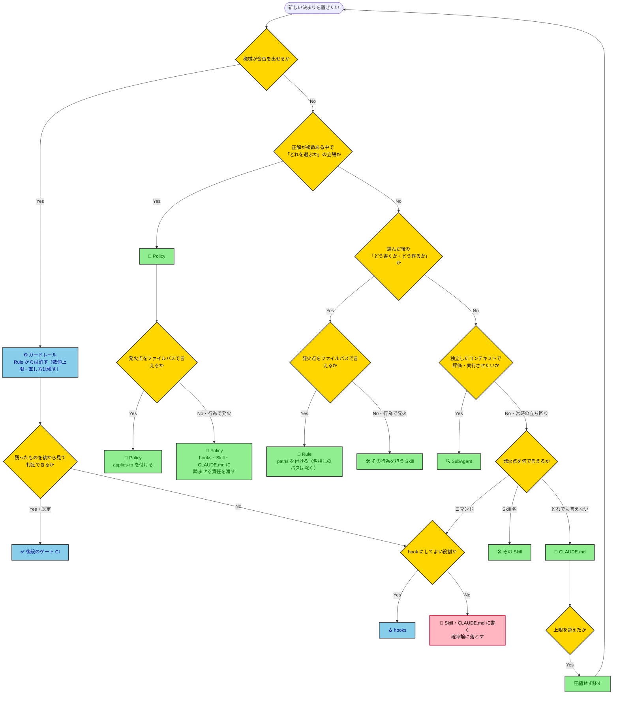

---
hook:
  applies-to:
    [
      'docs/policy/**/*.md',
      '.claude/rules/*.md',
      'eslint.config.mjs',
      '**/CLAUDE.md',
      '.claude/agents/**/*.md'
    ]
---

# ポリシー駆動開発ポリシー

AIエージェントが、新しい決まりや仕組みを作ろうとして、それを CLAUDE.md・Policy・Rule・Skill・SubAgent・hooks・ガードレールのどこに置くべきか迷ったときに参照する。既存の規定が守られていない状態を見つけ、それを防ぐ仕組みを新設すべきか迷ったとき、Policy の本文に何を書くか迷ったとき、Rule の `paths` を書くとき、SubAgent を新設・編集するときも参照する。

> [!IMPORTANT]
> **TL;DR（このポリシーの決定事項）**
>
> - **置き場所は振り分け順で決める。** 機械が合否を出せるならガードレール、「どれを選ぶか」の立場なら Policy、選んだ後の How は発火点をファイルパスで言えれば Rule・行為で発火するなら Skill、独立したコンテキストで評価・実行させたいなら SubAgent、どれでもない常時の立ち回りだけ CLAUDE.md（文字数上限あり）
> - **Rule は既定で `paths` による標準ロードで届ける。** ただし `paths` を名指しのパス（`docs/policy/**`・`docs/` 直下のハブ）に掛けない
> - **Rule に書いた決まりが自動検知できるなら、その場でガードレールも実装する。実装したら Rule から消す（数値上限と直し方は残す）。** 実装先の既定は後段のゲート（CI）で、hook にするのは後段では届かないときだけ

## ポリシー駆動開発とは、判断の基準を文書に固め、品質を機械に確かめさせる開発である

仕様駆動開発が「何を作るか」を文書で固めるのに対し、ポリシー駆動開発は「**どう判断するか**」を文書で固める。ねらいは、AI が人間に逐一確認せず自分で判断し、それでも品質が落ちない状態をつくること（Human-on-the-Loop）。人間は成果物を1つずつ検品する側ではなく、AI が走るレールを設計・改善する側に回る。

このねらいから、決まりや仕組みの置き場所がハーネスの7つの部品に分かれる。

| 部品                                             | 目的                                                               | 役割                                                                               | 効き方                                                                                  | 書くものの例                                                     |
| ------------------------------------------------ | ------------------------------------------------------------------ | ---------------------------------------------------------------------------------- | --------------------------------------------------------------------------------------- | ---------------------------------------------------------------- |
| **CLAUDE.md**（行動規範）                        | どのタスクでも外せない立ち回りを、毎回確実に効かせる               | 常時効く立ち回り。ハブへの入口                                                     | 毎回全文を読む（文字数上限あり）                                                        | 回答は日本語／着手前に目的を一文で出す                           |
| **Policy**（憲法・`docs/policy/`）               | 判断を AI に委ね、出力のぶれを抑える                               | 「どれを選ぶか」の立場と理由                                                       | 編集時に注入。行為で発火するものは hooks・Skill・CLAUDE.md が読ませる                   | 単体テストはモックを避ける古典学派で書く／環境差分は設定へ寄せる |
| **Rule**（法律・`.claude/rules/`）               | 書き方をそろえ、レビューで直す手間をなくす                         | 選んだ後の How。機械で判定できるものはガードレールへ移す（数値上限と直し方は残す） | 対象ファイルを読むと読み込まれる。無いときは hooks が指し示す。名指しのパスには掛けない | AAA の Act は必ず1行／見出しに連番を振らない                     |
| **Skill**（手順・`.claude/skills/`）             | 繰り返す作業を、毎回同じ段取りで進める                             | 名前で呼ぶ段取り。パスで言えない How                                               | 呼ばれたら従う（確率論）                                                                | `/code-dev` の実装→レビュー→CI／Issue 本文の書き方               |
| **SubAgent**（監査・`.claude/agents/`）          | 書き手と切り離した目で評価させる。大量の出力で本体の文脈を埋めない | 独立したコンテキストで行う評価（判定型）と検査の実行（実行型）                     | 呼ばれたときだけ                                                                        | コードレビュー／テストを回して報告                               |
| **hooks**（検問・`.claude/hooks/`）              | CI では届かない瞬間に確実に介入する                                | 注入・阻止・ターン末ゲートの3役                                                    | ツール実行の直前・ターン末に必ず走る（壊れると黙って素通り）                            | 編集対象の Policy を差し出す／禁止コマンドを止める               |
| **ガードレール**（静的解析・メトリクス・テスト） | 機械で判定できることを AI の注意力に頼らない                       | 機械が合否を出す検査                                                               | 既定は CI。ターン末ゲートがローカルでも走らせる                                         | 関数は50行まで（ESLint）／CLAUDE.md の文字数検査                 |

人間は Policy と Rule の書き手であって、読者ではない。人間向けの解説は `docs/guide/` に置き、Policy には書かない。

## 規定違反に自分で気づいたときは、仕組みを新設しない

既存の規定（CLAUDE.md・Policy・Rule）が守られていない状態を見つけたら、直せるものは2つある——**壊れている成果物そのもの**と、**それを今後防ぐ仕組み**（hook・検査スクリプト・CI ジョブ・レビュー項目）である。後者を見つけるたびに起票すると、ハーネスを100点にすることは原理的にできないので起票が際限なく増える。人間が棚卸しに疲弊し、本当に直す価値のある成果物の欠陥が仕組み新設の山に埋もれる。

判定は「**誰が違反に気づいたか**」に置く。これは外から観測できる事実なので、判定が AI の内心の重要度評価に戻らない（後述の「AI に『重要か』を評価させる関門はガードレールではない」）。

| 誰が違反に気づいたか | 起票してよいもの                                 | 起票しないもの                                                              |
| -------------------- | ------------------------------------------------ | --------------------------------------------------------------------------- |
| AI が自分で気づいた  | 壊れている成果物そのものの修正だけ               | それを今後防ぐ仕組み（hook・検査スクリプト・CI ジョブ・レビュー項目）の新設 |
| 人間に指摘された     | 成果物の修正に加えて、仕組みの新設も検討してよい | —                                                                           |

AI が自分で気づけたなら、確率的な検知はその場で働いている。そこへ決定論的なゲートを新設して得られる追加の利得は、恒久的な保守コストに見合わない（原則集の「すべてはトレードオフ」「コードは負債」）。逆に人間に指摘された違反は、AI の検知が働かなかったと観測できた唯一のケースなので、新設の費用対効果が立つ。

> [!IMPORTANT]
> **（AI・必須）** 「今後これを防ぐには hook・検査スクリプト・CI ジョブ・レビュー項目が要る」と自分で気づいても、その新設を起票しない。起票してよいのは、人間に指摘されたときだけである。

**発火場面の境界**：本節は**既存の規定の違反を見つけたとき**に効き、原則集の「確率論より決定論」と後述の「自動検知できる Rule は、その場でガードレールにする」は**決まりを新しく作ろうとしたとき**に効く（どちらも、作る決まりが機械で解けるならその場で機械に落とせという規定である）。

## 置き場所は、上から順に問いを通して決める

新しい決まりを上から問い、最初に Yes になった部品に置く。置き場所を扱う以降の節は、この手順の1つの問いを担う。

1. 機械が合否を出せるか → ガードレール。既定は CI で、CI で届かず hook にしてよい役割なら hooks、どちらでもなければ Skill・CLAUDE.md に書く（数値上限と直し方は Rule にも残す）
2. 正解が複数ある中で「どれを選ぶか」の立場か → Policy
3. 選んだ後の「どう書くか・どう作るか」か → 発火点をファイルパスで言えれば Rule（名指しのパスを除く）、行為で発火するなら Skill
4. 独立したコンテキストで評価・実行させたいか → SubAgent
5. どれでもない常時の立ち回りか → CLAUDE.md

## 「なぜ」は自前で作らず、上位原則から引く

Policy の価値は立場そのものより、それを支える「なぜ」にある。ところが書いている最中は、その場でもっともらしい理由を作文できてしまう——作文した理由は一見通っているので、**より強い根拠が既にあることに気づけない**。

[refined-engineer-judgment-principles](refined-engineer-judgment-principles.md) は全 Policy の上位に立つ。下位の Policy が原則集を引かずに書かれると、①原則集が持つより強い根拠を取り逃がす ②Policy ごとに根拠がばらけ、原則集との対応が切れて全体の一貫性が崩れる。

> [!IMPORTANT]
> **（AI・必須）** Policy に「なぜ」を書く前に、**先に原則集を開き、同じ論点の答えが無いか確かめる**。あればそれを根拠に使い、原則名を明記してリンクする。無いと確かめてから初めて自分で書く。「無さそうだ」と読まずに判断してはならない。

原則集の各原則には**トリガー**（その状況に入った瞬間に思い出すための発火条件）が付いている。自分がいま書いている論点をトリガーに引き当てれば、どの原則が効くかが分かる。

- ❌ 数値上限を Rule に残すのは、両者の読者が違うから（人と機械） → ✅ 数値上限を後から知ると関数の作り直しになる。書く前に読めば避けられる（シフトレフト）

## Policy と Rule を分ける線は「どれを選ぶか」か「選んだ後の How」かである

Policy も Rule も、**判断が割れる問題に「私たちはこう考える」と立場を宣言する**点では同じである。import の並び順のように、書き方にも判断の割れはある。だから「判断の余地があるか」では分けられない。

分けるのは、その決まりが答える問いである。

| その決まりが答える問い                             | 置き場所 |
| -------------------------------------------------- | -------- |
| 正解が複数ある中で、どれを選ぶか（流派・優先順位） | Policy   |
| 選んだ後に、どう書くか・どう作るか                 | Rule     |

「選んだ後」とは、流派・優先順位を決めた後に残る書式・命名・手順の細かい点を指す。見出しの連番のように二択に見えても、価値の優先順位を決めていないものは Rule に置く。線は「コードの書き方か」には引かない。そこに引くと、文書やテストの How が Policy に残り、Policy が膨らむ。

| 記述                                                    | 置き場所                                 | なぜ                 |
| ------------------------------------------------------- | ---------------------------------------- | -------------------- |
| モックを避ける古典学派で書く                            | Policy                                   | 流派の選択           |
| テストは DRY より DAMP を優先                           | Policy                                   | 価値の優先順位       |
| 環境差分は Stack 内で分岐させず、値の差分は設定へ寄せる | Policy                                   | 構造の寄せ先の選択   |
| 対象読者と目的が内容を決める                            | Policy                                   | 何を優先するかの立場 |
| AAA の Act は必ず1行                                    | Rule                                     | 選んだ後の書き方     |
| テストケース名の命名形式                                | Rule                                     | 選んだ後の書き方     |
| 見出しに連番を振らない                                  | Rule                                     | 選んだ後の書き方     |
| import の並び順                                         | Rule（機械が判定できるならガードレール） | 選んだ後の書き方     |

## Policy はプログラミング言語に依存させない

**理由は、別の言語で開発するときに Policy をそのまま流用したいから。** Policy に特定言語の文法や機能が混ざると、その言語を使わないプロジェクトへ持ち出した瞬間に使えなくなる。判断の中身は言語をまたいで通用するのに、書き方の都合でそれを捨てることになる。

> [!IMPORTANT]
> **（AI・必須）** **流用テスト**：この Policy を別の言語のプロジェクトにコピーしたら、そのまま使えるか。使えない部分があれば、そこは Policy ではなく Rule に置く。

### 「言語」が指すのはプログラミング言語だけである

AWS CDK・React のような技術やフレームワークへの依存は、Policy に書いてよい。同じ技術を使うなら別の言語でもそのまま通用するからである（CDK の構造方針は Python の CDK でも成り立つ）。

サンプルコードも、説明の手段として書いてよい。禁じるのは**方針そのものが特定言語の文法・機能に依存すること**であって、説明に使う道具ではない。

- **「振る舞い（出力・状態変化）を検証し、実装の詳細を検証しない」＋サンプルコード**：✅ 方針は言語非依存。コードは説明の手段
- **「環境差分は Stack 内で分岐させず設定へ寄せる」**：✅ 技術依存だが言語非依存。別言語の CDK でも通用する
- **「型は `interface` ではなく `type` で書く」**：❌ その言語の文法に依存。Rule へ移す

> [!NOTE]
> 流用テストの対象は本文である。frontmatter の `applies-to` はこのリポジトリのディレクトリ構成に合わせた配線なので、対象外。

## Policy には、AI が一般知識として既に知っていることを書かない

Policy の読者は、一般的なソフトウェア工学の知識を持つ AI である。知っていることを読ませても、判断は変わらない。それでいて Policy は毎回ファイル全体が読み込まれるので、書いた分だけ毎回の文脈を食う。

- **消すもの**：概念の定義、一般論、教科書の要約
- **残すもの**：判断が割れる事柄へのこのプロジェクトの立場、線引き（数値・例外）、その理由、立場を示す ✅/❌ の例、引用・比喩

引用・比喩は、一般知識と重なっても残す。一般知識の解説ではなく、立場を短く言い表す手段だからである。

- ❌ テストダブルの使用方針に、スタブ・モックの一般的な定義（教科書の説明）を書く → ✅ このプロジェクトの線引き（「置き換えてよいのはプロセス外依存と速度・決定性を壊す依存だけ」）だけを書く

## applies-to は、発火点をファイルパスで言える Policy すべてに付ける

Policy は読まれて初めて効く。hook は編集の直前に該当 Policy を差し込むので、`applies-to` があるかどうかがそのまま「読まれるか」を決める（シフトレフト）。

判定は1つの問いで済む——**その Policy が効き始める瞬間を、編集するファイルのパスで言えるか。**

| 発火点         | 例                                            | applies-to |
| -------------- | --------------------------------------------- | ---------- |
| ファイルの編集 | 設計書を書く・テストを書く・依存を足す        | 付ける     |
| 行為           | commit する・レビューする・起票する・判断する | 付けない   |

行為で発火する Policy に `applies-to` が無いのは付け忘れではない。読ませる責任は、次節の表に従って hook・Skill・CLAUDE.md のどれかが持つ。逆に、パスで言えるのに無ければそれは付け忘れである。

> [!IMPORTANT]
> **（AI・必須）**
>
> - 対象ファイルがまだ1つも存在しなくても、置き場と命名を決めて `applies-to` を先に書く。glob は最初のファイルが生まれた瞬間に効く。空欄のまま置くと「対象がまだ無い」と「付け忘れ」を後から区別できなくなる
> - 同じ対象を別の粒度で扱う姉妹 Policy は `applies-to` を揃える。片方だけ発火する状態は、読む側から見れば片方が存在しないのと同じである

## CLAUDE.md には、発火点を機械が判定できない指示だけを置く

CLAUDE.md は毎回全文が読み込まれる。書けば必ず読まれるので万能に見えるが、書いた分だけ全セッションの文脈を恒久的に食う。だから置き場所の判定は、ほかの置き場所より厳しくする。

判定は `applies-to` と同じ問いを広げたものである——**その指示が効き始める瞬間を、ファイルパス・コマンド・Skill 名のどれかで言えるか。**

| 発火点を言えるか     | 置き場所                                | 例                                 |
| -------------------- | --------------------------------------- | ---------------------------------- |
| ファイルパスで言える | Policy の `applies-to`・Rule の `paths` | テストを書く・依存を足す           |
| コマンドで言える     | hook（後述の役割に限る）                | ブランチを作る・本文を上書きする   |
| Skill 名で言える     | その Skill                              | Plan を書く・レビューする          |
| どれでも言えない     | CLAUDE.md                               | 回答は日本語・目的を先に一文で言う |

「重要だから CLAUDE.md に書く」は理由にならない。重要度は書き手が自分で評価するもので、評価はいくらでも甘くできる。パス・コマンド・Skill 名で言えるなら、そこへ置いた方が必要なときだけ確実に読まれる（シフトレフト）。そもそも機械が合否を出せる決まりなら、文章に置かず機械に落とす——原則集の「確率論より決定論」がこの節の上位にある。

### 文字数に上限を置き、超えたら圧縮ではなく移す

日本語は1文字がほぼ1トークンなので、文字数がそのまま毎回の消費コストになる。上限は CLAUDE.md 1つにつき **5,000文字**とし、`@` 記法で import するファイルの文字数を合算する（import に逃がしても消費量は変わらないため）。数え方は `wc -m` とし、frontmatter もコードブロックも含めた全文を数える。日本語で書く前提の値なので、他の自然言語で書くなら同等のトークン数に換算する。

値は、いま書かれている指示がちょうど収まる程度に置く。CLAUDE.md をゼロサムに近づければ、**足すには何かを出すしかなくなる**。上限が無ければ「常時効く指示だから要る」といくらでも自己弁護できてしまう。枠の一部は、clone 先が自分のシステムを説明する `docs/project-context/project-claude.md` のために空けてある。ハーネス側の指示を足す余地ではない。

> [!IMPORTANT]
> **（AI・必須）** 上限を超えたら、文章を圧縮して詰め込んではならない。上の表に従って Policy・Rule・hooks・Skill のどれかへ**移す**。移し先が無ければ自分で決めず、`AskUserQuestion` で人間に問う（既存の指示を出すか／今回の追加をやめるか／上限を見直すか）。上限の判定は決定論的だが、どれを捨てるかは重要度の比較であり、機械にも AI にも裁定できないためである。

## Rule は既定で paths による標準ロードで届ける

Rule も読まれて初めて効く。届き方は frontmatter の `paths` で決まる。

| Rule の状態                                                            | どう読み込まれるか                                       | 扱い                                                                                  |
| ---------------------------------------------------------------------- | -------------------------------------------------------- | ------------------------------------------------------------------------------------- |
| `paths` が名指しのパス以外に掛かる                                     | 対象ファイルを Read した時点で読み込まれる（標準ロード） | 既定                                                                                  |
| 対象ファイルがまだ存在しない（新規作成）                               | 標準ロードが発生しない（Read が起きないため）            | `.claude/hooks/policy-loader.mjs` が `paths` の合う Rule を代わりに指し示す           |
| `paths` が名指しのパス（`docs/policy/**`・`docs/` 直下のハブ）に掛かる | 指示として読むだけのセッションでも読み込まれる           | 標準ロードに乗せない                                                                  |
| `.claude/rules/` に `paths` 無しで置く                                 | 毎回全文が読み込まれ、CLAUDE.md と同じ扱いになる         | 置かない。常に効かせたいなら CLAUDE.md に書く（文字数上限を回避する抜け道になるため） |

新規ファイルだけ policy-loader が肩代わりするのは、既存ファイルは Edit・Write の前に Read しており標準ロードが既に効いているため。二重に指すと文脈を無駄に食う。

名指しのパスを分けるのは、読むだけのセッションが多いからである。過去176セッションの実測で、`docs/policy/` を読んだ35セッションのうち24（69%）は編集していなかった。`docs/design/` では14のうち2だった。

Skill などから直接リンクで読ませる Rule は、`paths` を持たなくてよい。ただし `.claude/rules/` の外の `.claude/rule-bodies/` に置く。中に置くと、リンクとは無関係に毎回全文が読み込まれる。

パスで言えない How（commit・PR・Issue 本文の書き方など）は、その行為を担う Skill に置くか、Skill から直接リンクで読ませる Rule にする。

### 文字数に上限を置き、超えたら圧縮ではなく分ける

Rule も対象ファイルを Read するたびに全文が読み込まれるため、CLAUDE.md と同じ理由で文字数がそのままコンテキスト消費になる。上限は Rule 1ファイルにつき **6,000文字**とする。数え方は CLAUDE.md の上限と同じく `wc -m` とし、frontmatter もコードブロックも含めた全文を数える。

> [!IMPORTANT]
> **（AI・必須）** 上限を超えたら、文章を圧縮して詰め込んではならない。`paths` を狭めて Rule を分ける。**分けるときは `paths` を狭め、同じファイルを読んだときに一緒に読み込まれないようにする。** 同じ `paths` のまま分けても読み込まれる文字数は変わらず、上限の抜け道になる。

対象が1ファイルなどで `paths` を狭められないときだけ、Rule をスタブ（中身を持たず本体へのリンクだけを書いた Rule）にし、本体を `.claude/rule-bodies/` に置く。読むだけで編集しないセッションにかかるのはリンク1行分だけになり、6,000文字という代理指標が守ろうとする目的（そうしたセッションの読み込み量を抑えること）を崩さない。小さい Rule はスタブにしない。スタブにすると、本体を開くかどうかが AI 次第になるためである。

- **スタブ**：`paths` は通常の Rule と同じにする。本文は「このファイルを書く・直す前に、本体を読む」という指示と、本体への普通の Markdown リンクだけにする。`@path` の import は使わない。公式ドキュメントは `.claude/rules/` の import を読み込むと書いており、本体が丸ごと読み込まれて上限の意味がなくなる
- **本体**（`.claude/rule-bodies/*.md`）：文字数上限を置かない。Policy と同じく、書く・直すときにだけ読まれるためである。`paths` は持たせない

## 自動検知できる Rule は、その場でガードレールにする

Rule は読んで守るものなので、読み落とせば守られない。機械が合否を出せる決まりなら、機械に任せた方が確実である（原則集の「確率論より決定論」）。別作業として切り出すと未整備のまま残り、Rule は目視頼りに戻る。

> [!IMPORTANT]
> **（AI・必須）** Rule を書いていて「これは自動検知できる」と気づいたら、起票して後回しにせず、その Rule の追加・編集と同じ作業の中でガードレールの実装まで終わらせる。

ガードレールになる条件は**決定論的であること**——同じ入力に必ず同じ判定を返すこと。AI に「重要か」「妥当か」を評価させる関門はガードレールではない。原則集の「判断軸は『既定値＋反転条件』で与える」が言うとおり、AI の内心の評価を条件にしたゲートは、AI が自分の作文で満たせてしまうので働かない。

### ガードレール化したら Rule から消す

機械が落とす決まりを文章でも持ち続けると、Rule を読むたびに効き目の無い文脈を払うことになる。機械が解ける決まりは文章で守らせない（原則集の「確率論より決定論」）。

消しても手戻りは小さい。ターン末ゲート（後述）が同じターンのうちに差し戻すので、書式違反ならその場で数行直せば済む。

残すのは次の2種類だけである。AI に重要度を判定させず、この一覧で決める。

1. **数値上限**（関数長・引数の数・複雑度・ネスト深さなど）：後から知ると関数の作り直しになる。しかもターン末ゲートは1ターンに1回しか走らないので、作り直しで出た新しい違反は CI まで届く。書く前に読ませる（シフトレフト）
2. **機械が落とせても、正しい直し方を示さない知識**（上限を超えたときの対処、見た目だけ減らす回避の禁止など）：ガードレールは「違反した」としか言わない

正の置き場所も分かれる。残したものは Rule が正で、数値を変えるときはまず Rule を直す。消したものは設定ファイル（ESLint・Prettier の設定など）が正である。

## ガードレールは既定で後段のゲートに置き、hook は3つの役割に限る

ガードレールの実装先は2つある——変更を出したときに走る**後段のゲート**（CI）と、AI のツール実行に割り込む **hook** である。**既定は後段のゲートとする。**

hook は魅力的に見える。その場で止めて、書いた本人にすぐ差し戻せるからだ（シフトレフト）。だが hook には後段のゲートに無い代償がある。

- **静かに壊れる**：hook は落ちても作業を止めない設計にするほかない（止めれば些細な不具合で全作業が止まる）。壊れた hook は無言で素通りし、守られているつもりだけが残る
- **対象を絞れない**：発火条件はツール単位でしか書けない。コマンドを検査する hook は、無関係なコマンドの実行にも全部乗る
- **積み上がる**：増えても誰も困らないので減らない。1本ずつは軽くても、全ツール実行に課される固定費として積み上がる

後段のゲートにこれは無い。変更したときに1回走り、落ちれば必ず見える。**だから hook にするのは、後段のゲートでは原理的に届かないときだけにする。** 後段が見られるのは残ったものだけである。残らないもの、その瞬間にしか無いものは、後段からは判定できない。これが「届かない」の中身である。シフトレフトの利得は、上の代償を常には上回らない（「すべてはトレードオフ」）。

### hook にしてよい役割

これ以外は作らない。

| 役割               | 何をするか                                                     | なぜ後段では届かないか                                                            |
| ------------------ | -------------------------------------------------------------- | --------------------------------------------------------------------------------- |
| **注入**           | 編集の直前に、その時だけ必要な判断基準を読ませる               | 「編集の直前」という瞬間が後段に存在しない                                        |
| **阻止**           | 明文で禁じた操作と、実行すると情報が消える操作を実行前に止める | 実行した時点で成果物に痕跡が残らないか、失われる。後段は残ったものしか見られない  |
| **ターン末ゲート** | 既にあるゲートを、AI がターンを終える前に走らせる              | 後段に着くのはターンが終わった後。AI が自力で直せる最後の機会がターン末にしか無い |

> [!IMPORTANT]
> **（AI・必須）** **ターン末ゲートは1本に統合する。** 検査を足したくなったら hook を増やさず、その1本が呼ぶゲートを増やす。hook が増えない形なら、何個足しても代償は増えない（「Less is more」）。

### 既定から外れる言い訳を名指しで塞ぐ

- **後段にも同じ検査があるが、hook の方が早く気づける**：早さの利得は hook を1本増やす代償を上回らない。早く見せたいならターン末ゲートに足す
- **成果物の出来映え（文字数・命名・書式）を編集のたびに測りたい**：リポジトリに残るものは後段から見える。上の役割のどれでもない
- **この決まりを守らせる手段が他に無い**：守らせたい気持ちは理由にならない。次項の基準で確率論に落とす

### どの役割にも後段にも乗らない決まりは、確率論に落とす

守らせる手段が文章しか残らない決まりはある（例：課題管理システムに起票するときのラベルの付け方）。ここで無理に hook を作れば、上の代償だけを払うことになる。

判定は損害で決める。**守られなかったときに後から直せるなら、文章（Skill・CLAUDE.md）に置き、守られない回があることを受け入れる。** 直せないなら、それは「阻止」に当たるので hook にする。ただし、hook にできないことは、どこにも書かない理由にはならない。

## SubAgent 定義には model と effort を両方書く

SubAgent の定義でモデルや思考量を書かないと、その値は呼び出したセッションから受け継がれる。つまりレビュー系 SubAgent の判定の厳しさが、人間がそのとき何気なく選んだセッション設定で変わる。**同じ成果物がその日の設定しだいで通ったり落ちたりするレビューは、レビューとして働かない。**

SubAgent の判定は確率論の側にあり、ガードレールではない。それでも入力が同じなら判定の前提は揃っていなければならない。

> [!IMPORTANT]
> **（AI・必須）** SubAgent を新設・編集するときは、`model` と `effort` を両方書く。片方だけ書いた状態を残さない。

`model` は SubAgent の役割で決める。判定は出力の形で行う——出力が実行結果の転記で足りるなら実行型、成果物の良し悪しを自分の言葉で判断するなら判定型である。`effort` の値は定義ごとに選んでよい。

| 役割       | 何をするか                                 | model                                  |
| ---------- | ------------------------------------------ | -------------------------------------- |
| **実行型** | 決まったコマンドを回し、結果を報告する     | 選べる中で最も安いモデル               |
| **判定型** | 成果物を読み、合否や指摘を自分の判断で返す | 最上位のモデル（下げてよい条件は下記） |

実行型のモデルを上げても、出力はコマンドの結果のままで変わらない。判定型は逆で、モデルの差がそのまま指摘の深さに出る。

判定型のモデルを既定から下げてよいのは、次の両方に当たるときだけである（原則集の「判断軸は「既定値＋反転条件」で与える」）。**「この判定は失敗コストが低い」という書き手の見積もりは条件にしない**——見積もりは作文でいくらでも甘くできる。

- 読む対象が単一のファイルに閉じている
- 返す出力が、あらかじめ決まった書式の項目を埋めるだけで済む
