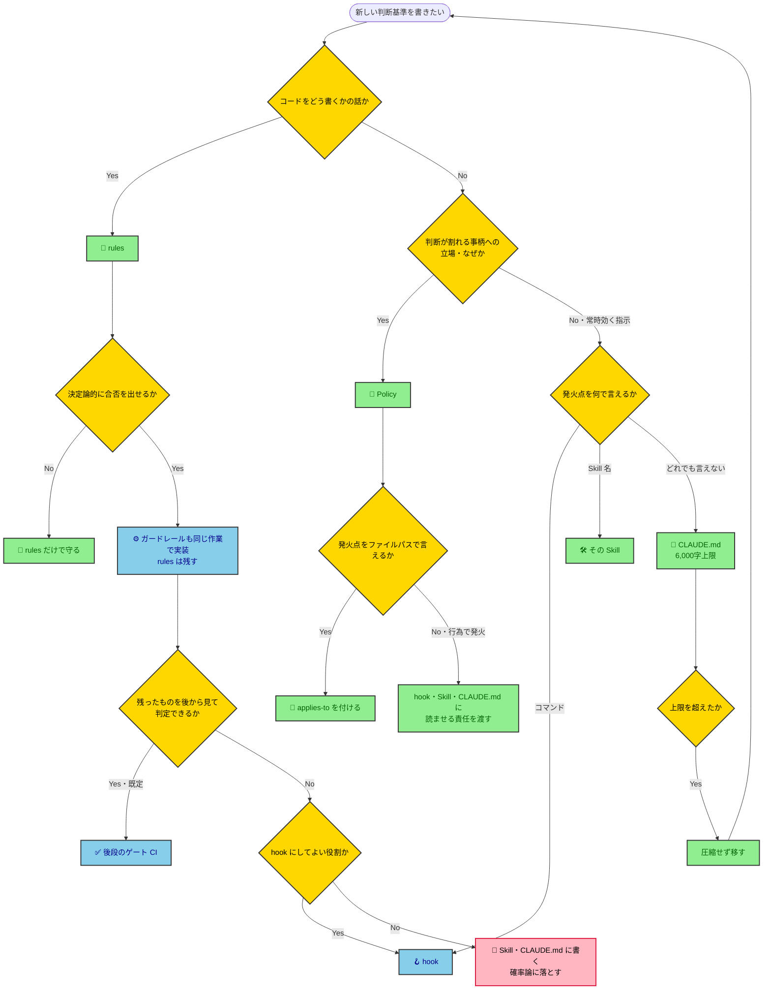

---
hook:
  applies-to: ['docs/policy/**/*.md', '.claude/rules/*.md', 'eslint.config.mjs', '**/CLAUDE.md']
---

# ポリシー駆動開発ポリシー

新しい判断基準を書こうとしている人 / AIエージェントが、それを Policy・rules・ガードレール・CLAUDE.md のどこに置くべきか迷ったときに参照する。既存の規定が守られていない状態を見つけ、それを防ぐ仕組みを新設すべきか迷ったときも参照する。

> [!IMPORTANT]
> **TL;DR（このポリシーの決定事項）**
>
> - **置き場所は抽象度で決める。** 実装の書き方なら rules、それ以外の本質寄りなら Policy、機械が合否を出せるならガードレール、発火点をパス・コマンド・Skill 名で言えないものだけ CLAUDE.md（6,000文字以内）。Policy はプログラミング言語に依存させない（別言語のプロジェクトへコピーしてそのまま使えることが条件）
> - **rules に書いた決まりが自動検知できるなら、その場でガードレールも実装する。** 実装先の既定は後段のゲート（CI）で、hook にするのは後段では届かないときだけ。ただし**既存の規定の違反に自分で気づいた**ときは仕組みを新設せず、壊れている成果物の修正だけを起票する（新設を起票してよいのは人間に指摘されたときだけ）
> - **「なぜ」は自前で作らず、先に上位原則を開いて同じ論点の答えを探す**

## ポリシー駆動開発とは、判断の基準を文書に固め、品質を機械に確かめさせる開発である

仕様駆動開発が「何を作るか」を文書で固めるのに対し、ポリシー駆動開発は「**どう判断するか**」を文書で固める。ねらいは、AI が人間に逐一確認せず自分で判断し、それでも品質が落ちない状態をつくること（Human-on-the-Loop）。人間は成果物を1つずつ検品する側ではなく、AI が走るレールを設計・改善する側に回る。

このねらいから、判断基準の置き場所が分かれる。

| 置き場所                                               | 何を書くか                                   | 誰が守らせるか        |
| ------------------------------------------------------ | -------------------------------------------- | --------------------- |
| **Policy**（`docs/policy/`）                           | 判断が割れる事柄への立場。本質寄りの「なぜ」 | AI と人間が読んで従う |
| **rules**（`.claude/rules/`）                          | 実装の書き方。コーディング規約               | AI と人間が読んで従う |
| **ガードレール**（静的解析・メトリクス・テスト・hook） | rules のうち、機械が合否を出せるもの         | 機械が落とす          |
| **CLAUDE.md**（リポジトリ内の各ディレクトリ）          | 発火点を機械が判定できない、常時効く指示     | AI が毎回読む         |

## 規定違反に自分で気づいたときは、仕組みを新設しない

既存の規定（CLAUDE.md・Policy・rules）が守られていない状態を見つけたら、直せるものは2つある——**壊れている成果物そのもの**と、**それを今後防ぐ仕組み**（hook・検査スクリプト・CI ジョブ・レビュー項目）である。後者を見つけるたびに起票すると、ハーネスを100点にすることは原理的にできないので起票が際限なく増える。人間が棚卸しに疲弊し、本当に直す価値のある成果物の欠陥が仕組み新設の山に埋もれる。

判定は「**誰が違反に気づいたか**」に置く。これは外から観測できる事実なので、判定が AI の内心の重要度評価に戻らない（後述の「AI に『重要か』を評価させる関門はガードレールではない」）。

| 誰が違反に気づいたか | 起票してよいもの                                 | 起票しないもの                                                              |
| -------------------- | ------------------------------------------------ | --------------------------------------------------------------------------- |
| AI が自分で気づいた  | 壊れている成果物そのものの修正だけ               | それを今後防ぐ仕組み（hook・検査スクリプト・CI ジョブ・レビュー項目）の新設 |
| 人間に指摘された     | 成果物の修正に加えて、仕組みの新設も検討してよい | —                                                                           |

AI が自分で気づけたなら、確率的な検知はその場で働いている。そこへ決定論的なゲートを新設して得られる追加の利得は、恒久的な保守コストに見合わない（原則集の「すべてはトレードオフ」「コードは負債」）。逆に人間に指摘された違反は、AI の検知が働かなかったと観測できた唯一のケースなので、新設の費用対効果が立つ。

> [!IMPORTANT]
> **（AI・必須）** 「今後これを防ぐには hook・検査スクリプト・CI ジョブ・レビュー項目が要る」と自分で気づいても、その新設を起票しない。起票してよいのは、人間に指摘されたときだけである。

**発火場面の境界**：本節は**既存の規定の違反を見つけたとき**に効き、原則集の「確率論より決定論」と後述の「自動検知できる rules は、その場でガードレールにする」は**決まりを新しく作ろうとしたとき**に効く（どちらも、作る決まりが機械で解けるならその場で機械に落とせという規定である）。

## 置き場所は、上から順に問いを通して決める

以降の各節は、この手順の1つの問いを担う。

## 「なぜ」は自前で作らず、上位原則から引く

Policy の価値は立場そのものより、それを支える「なぜ」にある。ところが書いている最中は、その場でもっともらしい理由を作文できてしまう——作文した理由は一見通っているので、**より強い根拠が既にあることに気づけない**。

[refined-engineer-judgment-principles](refined-engineer-judgment-principles.md) は全 Policy の上位に立つ。下位の Policy が原則集を引かずに書かれると、①原則集が持つより強い根拠を取り逃がす ②Policy ごとに根拠がばらけ、原則集との対応が切れて全体の一貫性が崩れる。

> [!IMPORTANT]
> **（AI・必須）** Policy に「なぜ」を書く前に、**先に原則集を開き、同じ論点の答えが無いか確かめる**。あればそれを根拠に使い、原則名を明記してリンクする。無いと確かめてから初めて自分で書く。「無さそうだ」と読まずに判断してはならない。

原則集の各原則には**トリガー**（その状況に入った瞬間に思い出すための発火条件）が付いている。自分がいま書いている論点をトリガーに引き当てれば、どの原則が効くかが分かる。

| ❌ 自前ででっち上げた「なぜ」                                           | ✅ 原則から引いた「なぜ」                                                          |
| ----------------------------------------------------------------------- | ---------------------------------------------------------------------------------- |
| ガードレール化しても rules を残すのは、両者の読者が違うから（人と機械） | ガードレールは実装後に動くので手戻りになる。rules は書く前に読める（シフトレフト） |

## Policy と rules を分ける線は「実装の書き方か」である

Policy も rules も、**判断が割れる問題に「私たちはこう考える」と立場を宣言する**点では同じである。import の並び順のように、実装の書き方にも判断の割れはある。だから「判断の余地があるか」では分けられない。

分けるのは抽象度である。

| 問い                                     | Yes   | No     |
| ---------------------------------------- | ----- | ------ |
| その決まりは「コードをどう書くか」の話か | rules | Policy |

| 例                                                      | 置き場所 | なぜ                                 |
| ------------------------------------------------------- | -------- | ------------------------------------ |
| 環境差分は Stack 内で分岐させず、値の差分は設定へ寄せる | Policy   | 構造の寄せ先＝本質寄りの判断         |
| import は標準ライブラリ→外部→自作の順に並べる           | rules    | コードの書き方そのもの               |
| 依存を足す前に、自前実装で済まないか問う                | Policy   | 何を足すかの判断であって書式ではない |

## Policy はプログラミング言語に依存させない

**理由は、別の言語で開発するときに Policy をそのまま流用したいから。** Policy に特定言語の文法や機能が混ざると、その言語を使わないプロジェクトへ持ち出した瞬間に使えなくなる。判断の中身は言語をまたいで通用するのに、書き方の都合でそれを捨てることになる。

> [!IMPORTANT]
> **（AI・必須）** **流用テスト**：この Policy を別の言語のプロジェクトにコピーしたら、そのまま使えるか。使えない部分があれば、そこは Policy ではなく rules に置く。

### 「言語」が指すのはプログラミング言語だけである

AWS CDK・React のような技術やフレームワークへの依存は、Policy に書いてよい。同じ技術を使うなら別の言語でもそのまま通用するからである（CDK の構造方針は Python の CDK でも成り立つ）。

サンプルコードも、説明の手段として書いてよい。禁じるのは**方針そのものが特定言語の文法・機能に依存すること**であって、説明に使う道具ではない。

| 例                                                         | 評価                                                 |
| ---------------------------------------------------------- | ---------------------------------------------------- |
| 「テストは Arrange-Act-Assert の順で書く」＋サンプルコード | ✅ 方針は言語非依存。コードは説明の手段              |
| 「環境差分は Stack 内で分岐させず設定へ寄せる」            | ✅ 技術依存だが言語非依存。別言語の CDK でも通用する |
| 「型は `interface` ではなく `type` で書く」                | ❌ その言語の文法に依存。rules へ移す                |

> [!NOTE]
> 流用テストの対象は本文である。frontmatter の `applies-to` はこのリポジトリのディレクトリ構成に合わせた配線なので、対象外。

## applies-to は、発火点をファイルパスで言える Policy すべてに付ける

Policy は読まれて初めて効く。hook は編集の直前に該当 Policy を差し込むので、`applies-to` があるかどうかがそのまま「読まれるか」を決める（シフトレフト）。

判定は1つの問いで済む——**その Policy が効き始める瞬間を、編集するファイルのパスで言えるか。**

| 発火点         | 例                                            | applies-to |
| -------------- | --------------------------------------------- | ---------- |
| ファイルの編集 | 設計書を書く・テストを書く・依存を足す        | 付ける     |
| 行為           | commit する・レビューする・起票する・判断する | 付けない   |

行為で発火する Policy に `applies-to` が無いのは付け忘れではない。読ませる責任は、次節の表に従って hook・Skill・CLAUDE.md のどれかが持つ。逆に、パスで言えるのに無ければそれは付け忘れである。

> [!IMPORTANT]
> **（AI・必須）**
>
> - 対象ファイルがまだ1つも存在しなくても、置き場と命名を決めて `applies-to` を先に書く。glob は最初のファイルが生まれた瞬間に効く。空欄のまま置くと「対象がまだ無い」と「付け忘れ」を後から区別できなくなる
> - 同じ対象を別の粒度で扱う姉妹 Policy は `applies-to` を揃える。片方だけ発火する状態は、読む側から見れば片方が存在しないのと同じである

## CLAUDE.md には、発火点を機械が判定できない指示だけを置く

CLAUDE.md は毎回全文が読み込まれる。書けば必ず読まれるので万能に見えるが、書いた分だけ全セッションの文脈を恒久的に食う。だから置き場所の判定は、ほかの置き場所より厳しくする。

判定は `applies-to` と同じ問いを広げたものである——**その指示が効き始める瞬間を、ファイルパス・コマンド・Skill 名のどれかで言えるか。**

| 発火点を言えるか     | 置き場所                      | 例                                 |
| -------------------- | ----------------------------- | ---------------------------------- |
| ファイルパスで言える | Policy の `applies-to`・rules | テストを書く・依存を足す           |
| コマンドで言える     | hook（後述の役割に限る）      | ブランチを作る・本文を上書きする   |
| Skill 名で言える     | その Skill                    | Plan を書く・レビューする          |
| どれでも言えない     | CLAUDE.md                     | 回答は日本語・目的を先に一文で言う |

「重要だから CLAUDE.md に書く」は理由にならない。重要度は書き手が自分で評価するもので、評価はいくらでも甘くできる。パス・コマンド・Skill 名で言えるなら、そこへ置いた方が必要なときだけ確実に読まれる（シフトレフト）。そもそも機械が合否を出せる決まりなら、文章に置かず機械に落とす——原則集の「確率論より決定論」がこの節の上位にある。

### 上限は 6,000文字とし、超えたら圧縮ではなく移す

日本語は1文字がほぼ1トークンなので、文字数がそのまま毎回の消費コストになる。上限は CLAUDE.md 1つにつき **6,000文字**とし、`@` 記法で import するファイルの文字数を合算する（import に逃がしても消費量は変わらないため）。数え方は `wc -m` とし、frontmatter もコードブロックも含めた全文を数える。日本語で書く前提の値なので、他の自然言語で書くなら同等のトークン数に換算する。

余白をほとんど残さない値にするのは意図的である。CLAUDE.md をゼロサムにすれば、**足すには何かを出すしかなくなる**。上限が無ければ「常時効く指示だから要る」といくらでも自己弁護できてしまう。

> [!IMPORTANT]
> **（AI・必須）** 上限を超えたら、文章を圧縮して詰め込んではならない。上の表に従って Policy・rules・hook・Skill のどれかへ**移す**。移し先が無ければ自分で決めず、`AskUserQuestion` で人間に問う（既存の指示を出すか／今回の追加をやめるか／上限を見直すか）。上限の判定は決定論的だが、どれを捨てるかは重要度の比較であり、機械にも AI にも裁定できないためである。

## 自動検知できる rules は、その場でガードレールにする

rules は読んで守るものなので、読み落とせば守られない。機械が合否を出せる決まりなら、機械に任せた方が確実である（原則集の「確率論より決定論」）。別作業として切り出すと未整備のまま残り、rules は目視頼りに戻る。

> [!IMPORTANT]
> **（AI・必須）** rules を書いていて「これは自動検知できる」と気づいたら、起票して後回しにせず、その rules の追加・編集と同じ作業の中でガードレールの実装まで終わらせる。

ガードレールになる条件は**決定論的であること**——同じ入力に必ず同じ判定を返すこと。AI に「重要か」「妥当か」を評価させる関門はガードレールではない。原則集の「判断軸は『既定値＋反転条件』で与える」が言うとおり、AI の内心の評価を条件にしたゲートは、AI が自分の作文で満たせてしまうので働かない。

### ガードレール化しても rules からは消さない

**ガードレールが動くのは実装した後だからである。** 書き上げてから落とされれば、そのぶん手戻りになる。rules は書く前に読むものなので、同じ違反を書く時点で防げる（シフトレフト）。

ただし判定そのものはガードレールが持つので、**rules 側の記述は簡素にし、なぜその決まりなのかを書く**。守り方を細かく書くと、ガードレールの設定と二重管理になる。

しきい値やルールの正は rules 側にあり、ガードレールの設定はそこからの写しである。数値を変えるときは、まず rules を直す。

## ガードレールは既定で後段のゲートに置き、hook は3つの役割に限る

ガードレールの実装先は2つある——変更を出したときに走る**後段のゲート**（CI）と、AI のツール実行に割り込む **hook** である。**既定は後段のゲートとする。**

hook は魅力的に見える。その場で止めて、書いた本人にすぐ差し戻せるからだ（シフトレフト）。だが hook には後段のゲートに無い代償がある。

| 代償           | 何が起きるか                                                                                                                                        |
| -------------- | --------------------------------------------------------------------------------------------------------------------------------------------------- |
| 静かに壊れる   | hook は落ちても作業を止めない設計にするほかない（止めれば些細な不具合で全作業が止まる）。壊れた hook は無言で素通りし、守られているつもりだけが残る |
| 対象を絞れない | 発火条件はツール単位でしか書けない。コマンドを検査する hook は、無関係なコマンドの実行にも全部乗る                                                  |
| 積み上がる     | 増えても誰も困らないので減らない。1本ずつは軽くても、全ツール実行に課される固定費として積み上がる                                                   |

後段のゲートにこれは無い。変更したときに1回走り、落ちれば必ず見える。**だから hook にするのは、後段のゲートでは原理的に届かないときだけにする。** 後段が見られるのは残ったものだけである。残らないもの、その瞬間にしか無いものは、後段からは判定できない。これが「届かない」の中身である。 シフトレフトの利得は、上の代償を常には上回らない（「すべてはトレードオフ」）。

### hook にしてよい役割

これ以外は作らない。

| 役割               | 何をするか                                                     | なぜ後段では届かないか                                                            |
| ------------------ | -------------------------------------------------------------- | --------------------------------------------------------------------------------- |
| **注入**           | 編集の直前に、その時だけ必要な判断基準を読ませる               | 「編集の直前」という瞬間が後段に存在しない                                        |
| **阻止**           | 明文で禁じた操作と、実行すると情報が消える操作を実行前に止める | 実行した時点で成果物に痕跡が残らないか、失われる。後段は残ったものしか見られない  |
| **ターン末ゲート** | 既にあるゲートを、AI がターンを終える前に走らせる              | 後段に着くのはターンが終わった後。AI が自力で直せる最後の機会がターン末にしか無い |

> [!IMPORTANT]
> **（AI・必須）** **ターン末ゲートは1本に統合する。** 検査を足したくなったら hook を増やさず、その1本が呼ぶゲートを増やす。hook が増えない形なら、何個足しても代償は増えない（「Less is more」）。

### 既定から外れる言い訳を名指しで塞ぐ

| 言い訳                                                       | なぜ通らないか                                                                      |
| ------------------------------------------------------------ | ----------------------------------------------------------------------------------- |
| 後段にも同じ検査があるが、hook の方が早く気づける            | 早さの利得は hook を1本増やす代償を上回らない。早く見せたいならターン末ゲートに足す |
| 成果物の出来映え（文字数・命名・書式）を編集のたびに測りたい | リポジトリに残るものは後段から見える。上の役割のどれでもない                        |
| この決まりを守らせる手段が他に無い                           | 守らせたい気持ちは理由にならない。次項の基準で確率論に落とす                        |

### どの役割にも後段にも乗らない決まりは、確率論に落とす

守らせる手段が文章しか残らない決まりはある（例：課題管理システムに起票するときのラベルの付け方）。ここで無理に hook を作れば、上の代償だけを払うことになる。

判定は損害で決める。**守られなかったときに後から直せるなら、文章（Skill・CLAUDE.md）に置き、守られない回があることを受け入れる。** 直せないなら、それは「阻止」に当たるので hook にする。ただし、hook にできないことは、どこにも書かない理由にはならない。
