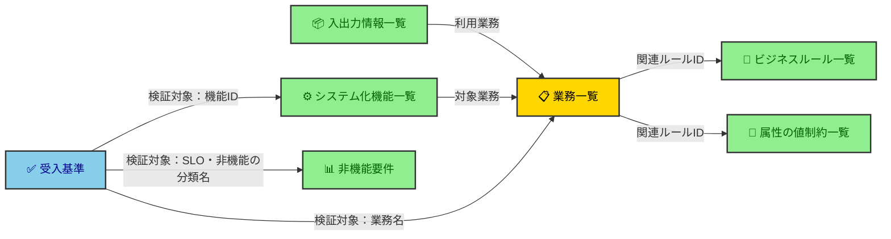

---
hook:
  applies-to: ['docs/requirements.md']
---

# 要件定義書ポリシー

要件定義書（`docs/requirements.md`）を書く・レビューする開発者／AIが、**良い要件定義書とは何かを知りたいとき**に参照するドキュメント。`/elicit-requirements` での作成時、および要件定義書レビュー Skill（`/requirements-review`）での判定基準として使う。

## 目次

| 節                                                                                                                                                              | 決めていること                                                                                |
| --------------------------------------------------------------------------------------------------------------------------------------------------------------- | --------------------------------------------------------------------------------------------- |
| [記述すべきは「ビジネスの基準（What）」であり、「実装の手段（How）」ではない](#記述すべきはビジネスの基準whatであり実装の手段howではない)                       | 満たすべき基準・限界値だけを書く。製品名・アーキテクチャ・DB／UI の決め打ちは書かない         |
| [変動リスクのある「実現コスト」や「技術予測」は書かない](#変動リスクのある実現コストや技術予測は書かない)                                                       | 金額・設計前に確定できない予測は、見積書・契約・基本設計書が持つ                              |
| [顧客の「要望」を「測定可能な前提条件」に翻訳して明記する](#顧客の要望を測定可能な前提条件に翻訳して明記する)                                                   | 抽象語は数値・境界線に翻訳する。その前提条件が再交渉の防衛線になる                            |
| [出所ラベル：入力資料にない記述、および入力資料からの削減・変更には出所を明示する](#出所ラベル入力資料にない記述および入力資料からの削減変更には出所を明示する) | 補完・削減・変更した記述に `合意済み` / `提案・叩き台` を `出所` 列で添える                   |
| [メンテナンス性より理解しやすさを優先する](#メンテナンス性より理解しやすさを優先する)                                                                           | 凍結する文書なので、同じ事実を表・図・文章で重ねてよい（documentation-policy の一部を上書き） |
| [表は幅で潰さない](#表は幅で潰さない)                                                                                                                           | 表から出す項目を表ごとに名指しし、詳細の置き場を `<details>` に固定する                       |
| [要件定義書の構成（必須項目と記述基準）](#要件定義書の構成必須項目と記述基準)                                                                                   | 要件定義書に含める項目と、各項目に何を書くか。構成の唯一の正典                                |
| [レビューチェックリスト](#レビューチェックリスト)                                                                                                               | 記述ごとの NG サイン。判定基準は本文の該当節が正典                                            |

> [!IMPORTANT]
> **TL;DR（このポリシーの決定事項）**
>
> - **書くのはビジネスの基準（What）だけ**——実装の手段（How）も、変動リスクのある実現コスト・技術予測も書かない。設計の自由度を縛り、手戻りリスクを自ら高める
> - **顧客の抽象的な要望は、測定可能な前提条件に翻訳して明記する**——この前提条件が、あとから出る過大な要求・技術的地雷に対する再交渉の防衛線になる
> - **メンテナンス性より理解しやすさを優先する**——凍結する文書なので保守の心配がない。同じ事実を表・図・文章で重ねて見せてよい

## 記述すべきは「ビジネスの基準（What）」であり、「実装の手段（How）」ではない

**方針**：顧客が達成したい目標、業務ルール、データ量、パフォーマンスなど、**満たすべき基準・限界値（前提条件）だけ**を書く。特定の製品名やアーキテクチャ（例：「サーバーレスで構築する」）は書かない。

**理由**：実装の手段を要件定義書に明記すると、設計段階での最適な技術選定を縛る原因になる。あとから技術的制約やコスト爆発が判明しても、明記した手段が足かせとなり、手戻りリスク（契約違反）を自ら高めてしまう。

|                    | 例                                                                              |
| ------------------ | ------------------------------------------------------------------------------- |
| ❌ How（書かない） | 「AWS Lambda によるサーバーレス構成で実装する」                                 |
| ✅ What（書く）    | 「月間100万リクエストを処理でき、ピーク時もレイテンシp95が300ms以内であること」 |

### 設計で決まる「詳細」を要件で決め打ちしない

要件段階で、後の設計で決めるべき詳細——DB 種別・UI 構成・データモデル・コンポーネント間の処理フロー——を決め打ちしてはならない。これらは後から変わりうる「詳細」であり、要件で固定すると設計で差し替えられなくなる（＝「決定を遅らせる——境界を引いて選択肢を残す」[refined-engineer-judgment-principles](refined-engineer-judgment-principles.md) の違反）。例えば要件に「RDB に保存する」と書けば後から NoSQL へ、MPA 前提の画面一覧を作れば後から SPA へ、変更できなくなる。

要件に書くのは詳細そのものではなく、その詳細が満たすべき **What**（画面に依存しない業務フロー、データの業務ルール、計算式、締切）。

| 設計で決める詳細     | ❌ 要件で決め打ち（lock-in を生む）                              | ✅ 要件に書く What                                                                                            |
| -------------------- | ---------------------------------------------------------------- | ------------------------------------------------------------------------------------------------------------- |
| 永続化・データモデル | 「RDB に保存」「テーブル名・PK・カラム定義」                     | 扱うエンティティと関係・一意性の業務ルール・属性の業務制約（取りうる値・必須/任意・形式）・データ量・保持期間 |
| UI・出力表現         | 「MPA 前提の画面一覧」「画面遷移図」「帳票一覧・帳票レイアウト」 | ユーザー／外部ができること・扱う情報・出力すべき情報と受け手/目的・操作の業務ルール                           |
| 処理の実現           | 「コンポーネント間のシーケンス図」「バッチ実行時刻」             | 計算式・業務ルール・満たすべき締切/鮮度                                                                       |
| 外部連携             | 「REST/SOAP 等の IF 詳細仕様」                                   | 連携相手・授受するデータと目的（依存関係）                                                                    |

> [!TIP]
> **（AI・推奨 / 人間にも）** 判断に迷ったら適用テスト：**その How が変わっても記述が成り立つか。** 別の UI・DB・方式に替えても要るなら What＝要件に書く。その詳細でしか意味を持たないなら How＝設計に回す。

属性レベルの制約（桁・データ型・取りうる値・必須/任意・フォーマット）も同じテストで仕分ける。カギは**その制約の出所**を問うこと——業務・外部世界が課す制約（例：外部システムが発番する会員番号が10桁）は What なので、カラム仕様としてではなく**[属性の値制約一覧](#属性の値制約一覧)の行**として残す。単なる列幅の見積もり（実装都合）は書かず設計に委ねる。

ただし顧客提供のワイヤーフレームやたたき台の図を **参考資料**（設計の入力）として別に持つのは可。禁じるのは、それを拘束力のある要件へ昇格させること。

## 変動リスクのある「実現コスト」や「技術予測」は書かない

**方針**：インフラ費用などの見積もりに関わる具体的な金額や、設計・実装段階にならないと確定できない不確実な予測要素は、要件定義書に書かない。

**理由**：設計の深度によって変動するリスクのある要素は、要件定義書（What）ではなく、見積書・契約、あるいは基本設計書（How）のレイヤーで管理・コントロールすべきもの。要件定義書に書いてしまうと、不確実な数字があたかも確定事項であるかのように扱われ、実態と乖離したときの責任の所在が曖昧になる。

| 書かない要素                                   | 正しい置き場所    |
| ---------------------------------------------- | ----------------- |
| 実現コスト（インフラ費用の見積額）             | 見積書・契約      |
| 技術的な不確実要素（設計・実装で確定する予測） | 基本設計書（How） |

## 顧客の「要望」を「測定可能な前提条件」に翻訳して明記する

**方針**：顧客の抽象的な要望（例：「安全で落ちない、たくさんデータが入るシステム」）はそのまま書かず、必ず数値や明確な境界線（例：「目標月間稼働率99.5%」「最大データ量100万件/月」）に翻訳して書く。

**理由**：この限界値（前提条件）が明記されているからこそ、設計・実装段階で顧客側からそれを超える要求（仕様変更）が出た場合や、技術的な地雷が見つかった場合に、「前提条件の変更に伴う、正当な再見積もり・構成変更の交渉」をロジカルに行うための防衛線となる。

| 顧客の要望（抽象）   | 前提条件（測定可能）   |
| -------------------- | ---------------------- |
| 安全で落ちない       | 目標月間稼働率99.5%    |
| たくさんデータが入る | 最大データ量100万件/月 |

> [!TIP]
> **（AI・推奨）** `/elicit-requirements` で顧客の要望を聞き取るとき、抽象語（「安全」「速い」「たくさん」等）が出たら、その場で数値・境界線に翻訳する質問を返す。翻訳せずに要件定義書へ転記しない。

## 出所ラベル：入力資料にない記述、および入力資料からの削減・変更には出所を明示する

**方針**：入力資料（RFC・ヒアリング議事録等）に根拠のない記述、および入力資料からの削減・補完・変更は、機能・ビジネスルール・属性のどの粒度で起きても、**出所ラベル**（`合意済み` / `提案・叩き台`）を該当箇所に添える。

**理由**：削減・補完は機能一覧のようなセクション単位だけでなく、ビジネスルール単位・属性単位（例：ある属性を「任意」と断定する）でも起きる。出所を記録しないと、顧客と合意済みの決定か作成者の暫定案かを後から区別できず、無根拠な断定がそのまま要件として固定されてしまう。

| 記述の種類                                                   | ラベル                                                                   |
| ------------------------------------------------------------ | ------------------------------------------------------------------------ |
| 入力資料の記述をそのまま採用した                             | 不要（入力元は「背景・入力元」から辿れる）                               |
| 入力資料にない記述を補完した／入力資料の記述を削減・変更した | 相手と握れているなら `合意済み`、未合意なら `提案・叩き台`（作成者の案） |

ラベルは、補完・削減・変更が起きた表に `出所` 列として持たせる。

**`出所` 列に書けるのは、次の値だけである。** 値を足すことも、値に何かを添えることもしてはならない。

| 値             | 意味                             |
| -------------- | -------------------------------- |
| `合意済み`     | 相手と握れている                 |
| `提案・叩き台` | 未合意（作成者の案）             |
| `—`            | ラベルが不要（入力資料のとおり） |

値を縛るのは、**この列が経緯・理由の置き場になると幅が広がり、表全体が読めなくなる**からである。誰と合意したか・なぜそう判断したかを添えたくなるが、書いてはならない。合意の相手と経緯は git 履歴と Issue で追跡する（版数・作成者・承認ステータスを本文に持たないのと同じ理由）。

## メンテナンス性より理解しやすさを優先する

**方針**：要件定義書では、同じ事実を表・図・文章で重ねて見せてよい。読み手が一目で掴めることを、重複の排除より優先する。

**理由**：要件定義書は凍結する文書である。凍結後は更新されないので、重複が食い違っていく心配がない。一方で読み手（顧客・設計者・実装者）は、この文書だけを頼りに全体像を掴む。**払わずに済むコスト（保守）のために、払うべき価値（理解）を削ってはならない。**

この優先順位は要件定義書だけに効く。設計書（`docs/design/`）・手順書は更新され続けるので、[documentation-policy](documentation-policy.md) の DRY がそのまま効く。

### documentation-policy のどの規定を上書きするか

要件定義書に限り、次の規定を読み替える。ここで名指ししていない規定はそのまま効く。

| documentation-policy の規定                   | 要件定義書での扱い                                                                               |
| --------------------------------------------- | ------------------------------------------------------------------------------------------------ |
| 図にする前に「逆変換テスト」を通す            | 機能要件では適用しない。表のままで掴める内容でも図を描く                                         |
| DRY原則を遵守する、ただし最重要事項は繰り返す | 表現形式をまたぐ重複（表→図、表→文章）は許す                                                     |
| 行と列に収まる構造はデフォルトで表にする      | 表にする。そのうえで機能要件では図も添える（表の代わりに図にするのではない）                     |
| 見出しに連番を振らない                        | 非機能要件の分類だけは `A. 可用性` のように記号を振る                                            |
| 詳細な記載よりシンプルで短い方が良い          | 削除テストは1つの文章の中の冗長さにだけ当てる。表現形式をまたぐ重複には当てない                  |
| ドキュメントもメンテナンス性が重要である      | 適用しない。読み手の理解を優先すると本節が決めている                                             |
| 書き手の事情は本文に書かない                  | 上書きしない。重ねてよいのは事実そのものだけで、要素の役割分担・対応づけ・読み方の説明は書かない |

記号を許すのは、それが IPA「非機能要求グレード」の大項目 ID をそのまま借りたもので、こちらの都合で節が増減しないからである。連番を禁じる理由（節の増減で番号がずれ、参照が壊れる）が当てはまらない。同じ記号を非機能要件の項目カタログでも使う。参照するときは記号だけで指さず、`E. セキュリティ` のように見出し名まで書く（記号が読めない読者にも通じる）。

> [!IMPORTANT]
> **（AI・必須）** この上書き表を改訂したら、`.claude/skills/quick-doc-review/SKILL.md` の該当チェック項目に書かれた例外の追従要否を判断すること。同スキルは速度のため判定基準を書き下した派生コピーなので、追従しないと要件定義書が上書き前の基準で誤判定される。

### それでも許さない重複

許すのは**同じ事実を別の表現形式で見せる重複**だけである。**同じ事実を離れた場所に別々に書く重複**は、凍結後も NG のまま。理由は保守コストではなく、**書いた時点で食い違い、読み手がどちらを正とするか判断できなくなる**ことにある。

| 重複の種類                                                   | 判定 |
| ------------------------------------------------------------ | ---- |
| 機能仕様の表と、同じ内容のアクター×機能図                    | 許す |
| 業務フローの表と、同じ流れのアクティビティ図                 | 許す |
| SLO 目標値を SLO 表とオープンクエスチョンの両方に書く        | NG   |
| 外部連携の関係・境界をエコシステムマップと依存関係に詳述する | NG   |

判定の問い：**片方を書き換えたら、もう片方が「間違い」になるか。** なるなら別々の記述なので一本化する。ならない（＝同じ事実の別の見せ方）なら重ねてよい。

## 表は幅で潰さない

**方針**：表を俯瞰の道具に保つ規定（列数・セル文字数の上限、詳細を表の直下へ出すこと）は documentation-policy「表は俯瞰のためにある」に従う。要件定義書はそこに2つを上乗せする——**詳細の置き場を詳細トグル（`<details>`）に固定する**ことと、**表から出す項目を表ごとに名指しする**ことである。

**理由**：畳んで隠すのは、詳細が要るのは疑問を持った読み手だけで、表を追うだけの読み手には邪魔になるからである（documentation-policy「並んで繰り返す詳細はトグルに畳む」）。要件定義書は凍結する文書なので、隠した内容が更新されずに腐る心配もない。潰れた表は、読み手がこの文書だけを頼りに全体像を掴むのを妨げる（refined-engineer-judgment-principles の「理解は委譲できない」——理解を育てる形で渡す責務は AI にある）。

### 詳細トグルの記法

```markdown
<details>
<summary>BR-01 付与率</summary>

（詳細。表と同じ ID 順に並べる）

</details>
```

- `summary` は `ID 名前`。`ID` を持たない表では行の識別語（項目名・用語名）を書く。表には `ID`（または識別語）が残るので、読み手はそこから詳細を引ける。
- `<details>` の直後と `</details>` の直前に空行を置く。空行が無いと中の Markdown がレンダリングされない。
- 見出し（`####`）は使わない。トグルにできないため。

トグルは GitHub 等での閲覧を前提とする。要件定義書を PDF・印刷で渡す必要が生じたら、`<details>` を `<details open>` へ一括置換して全開で出力する。

### 詳細トグルは2種類ある

どの行に詳細を作るかは、次のどちらの型かで決まる。**「長くなりそうか」を書き手に判定させない**——refined-engineer-judgment-principles の「判断軸は『既定値＋反転条件』で与える」のとおり、内心の評価を条件にしたゲートは働かないからである。だから型ごとに、既定値と、それが反転する外形的な条件を決める。

| 型         | 中身                                           | どの行に付くか                                                 | 例                             |
| ---------- | ---------------------------------------------- | -------------------------------------------------------------- | ------------------------------ |
| **本文型** | 表から外した必須項目。下表が表ごとに名指しする | その表の**全行**（例外なし）                                   | ビジネスルール一覧のルール本文 |
| **補足型** | 列に書けない根拠・補足                         | 既定は付けない。**列の記述だけでは読み取れない**行にだけ付ける | 属性の値制約一覧の値制約の根拠 |

1行に両方あるなら、1つのトグルにまとめる。

### どの表のどの項目を詳細へ出すか

| 表                 | 詳細トグルへ出す項目（本文型）         |
| ------------------ | -------------------------------------- |
| 業務一覧           | `区分の理由`                           |
| ビジネスルール一覧 | ルール本文                             |
| 属性の値制約一覧   | なし（補足型だけを置く）               |
| 入出力情報一覧     | `内容`・`取扱量`・`頻度`・`利用目的`   |
| システム化機能一覧 | `優先度の理由`                         |
| 機能仕様           | `適用ルール`・`事後条件`・`主要な例外` |

ここに無い表は本文型を持たない（列が少なく各セルも短いため）。補足型はどの表にも置いてよい。

**追跡列は本文型に選ばない。**「相互参照（トレーサビリティ）」が名指しする追跡列——業務一覧の `関連ルールID`、入出力情報一覧の `利用業務`、システム化機能一覧の `対象業務`、受入基準の `検証対象`——は、上表の名指しから外す。表を索引として引くとき、どの業務・どのルールに紐づくかが表の上で完結している必要があるためである。

**属性の値制約一覧だけは列を外さない。** この表の各列は制約値そのもの（桁・形式・取りうる値）で短い。加えて1列1項目に割り当てておくと、書き手が全項目を1つずつ埋めることを強いられる（該当しなければ `なし` と書く）。1つのセルに畳むと、この強制が消えて考えなかった項目が自由文に埋もれる。

この表は8列だが、documentation-policy「歯止めとしての上限」が挙げる列を減らす手はどれも当たらないので、そのまま置く。1セル80文字の上限はこの表にも効く。

## 要件定義書の構成（必須項目と記述基準）

要件定義書（PRD）に含める項目と、各項目に何を書くかを定める。`/elicit-requirements` はこの構成に従って `docs/requirements.md` を書き、レビューはこの構成を基準に検証する。**構成の唯一の正典はこの節**であり、他の文書で再列挙しない。

版数・作成者・承認ステータスは本文に持たない。git 履歴と Issue で追跡する（documentation-policy：進捗・経過・状態は本文に書かない）。

各項目には区分を付す。

| 区分     | 意味                                                                 | 該当しないとき                     |
| -------- | -------------------------------------------------------------------- | ---------------------------------- |
| 必須     | 常に書く                                                             | —                                  |
| 条件付き | ある事実があるときだけ必須（例：外部連携があればエコシステムマップ） | 「該当なし・理由：〇〇」と明記する |
| 任意     | 書くかを書き手が判断する                                             | 書かなくてよい                     |

**条件付きの項目は、必須項目を書き終えたあとに該当有無を判定する。** 判定に使う入力——どの表のどの列を見るか——は各項目の節に書く。書き手の主観（重要そうか）で決めてはならない。必須項目を書き上げた時点で満足し、条件付きを黙って落とすからである。

### 項目一覧

| 項目                     | 区分                                                           | 何を書くか                                                                                                                    |
| ------------------------ | -------------------------------------------------------------- | ----------------------------------------------------------------------------------------------------------------------------- |
| 概要                     | 必須                                                           | —                                                                                                                             |
| 目的                     | 必須                                                           | 達成したいことを一文で言い切る。最重要。一文に「〜と〜」が並ぶなら目的が割れているサイン——分割を疑う                          |
| 背景・入力元             | 必須                                                           | もとにした RFC 等への参照（何を根拠にしたか）                                                                                 |
| 用語定義                 | 必須                                                           | この文書固有の用語だけ定義する。全社共通語は用語集（[../reference/glossary.md](../reference/glossary.md)）へリンクする（DRY） |
| ターゲットユーザー       | 必須                                                           | —                                                                                                                             |
| ステークホルダー／関係者 | 必須                                                           | 意思決定者・承認者・利用部門など。「使う人」と「決める人・責任を負う人」を区別する                                            |
| エコシステムマップ       | 条件付き：外部アクター・外部システムとの授受があるとき         | 開発対象を黒箱として置き、外部との関係と授受を1枚で俯瞰する概念図 → [詳細](#エコシステムマップ)                               |
| 解決する課題             | 必須                                                           | 「誰の」「どんな困りごと」を解くのか。具体的に書く                                                                            |
| 業務要件                 | 必須                                                           | 開発対象が支える業務を、システムに依存しない What として構造化する → [詳細](#業務要件)                                        |
| 機能要件                 | 必須                                                           | システムが担う機能と、その振る舞い → [詳細](#機能要件)                                                                        |
| 非機能要件               | 必須                                                           | 品質特性ごとの要求を What として書き、観測可能なものを指標にする → [詳細](#非機能要件)                                        |
| 優先順位                 | 必須                                                           | 各要件に優先度と、その理由を付ける → [詳細](#優先順位)                                                                        |
| 依存関係（Dependencies） | 条件付き：他システム・他チーム・外部サービスへの依存があるとき | 自分たちだけでは完了の可否・時期を決められない事項 → [詳細](#依存関係dependencies)                                            |
| 制約と前提               | 必須                                                           | 列は `制約内容` / `判定`（`真の制約` / `見直し可能` / `保留`）/ `判定理由`。制約を再判定した理由はここに書く                  |
| スコープ外（Non-Goals）  | 必須                                                           | やらないことを、区分と出所ラベル付きで列挙する → [詳細](#スコープ外non-goals)                                                 |
| 受入基準                 | 必須                                                           | 要件が満たせたと判断できる観測可能な条件 → [詳細](#受入基準)                                                                  |
| リスクと対応             | 必須                                                           | 想定されるリスクと緩和策 → [詳細](#リスクと対応)                                                                              |
| オープンクエスチョン     | 必須                                                           | 未決事項と、その解決の相手・解消期限 → [詳細](#オープンクエスチョン)                                                          |

全項目に共通するルール：

- 図はすべて `/design-doc-mermaid` で作成する（自前で Mermaid を書き起こさない）。どの項目に図が要るかは各項目の区分に従う。
- 対話の経緯は本文に持ち込まない。要件そのものに紐づく根拠——制約を再判定した理由など——だけを「制約と前提」の判定理由に残す。

### 相互参照（トレーサビリティ）

要件定義書のどの表にも課す横断ルールである。

- 各表を孤立させない。ただし**独立した相互参照表は作らず、各表に追跡列を持たせて担保する**。列で追えるものを別表に再掲すると二重管理になるため。
- 追跡列：業務一覧に「関連ルールID」、入出力情報一覧に「利用業務」、システム化機能一覧に「対象業務（または業務維持／基盤）」、受入基準に「検証対象」。
- これにより要件から後工程（Issue・テスト・データモデル）まで一貫してたどれる。



### エコシステムマップ

開発対象を1つの黒箱として中央に置き、取り巻く外部アクター（ユーザー・関係組織・外部サービス）との関係と授受（データ・価値）を1枚で俯瞰する。スコープ境界の明確化・影響範囲のモレ防止・非エンジニアとの共通言語を担う。

**該当の判定**：入出力情報一覧の `送り手` / `受け手` 列を1行ずつ見る。開発対象システム以外の名前が1つでもあれば該当する。

- **黒箱を守る** — 外部との関係だけを描く。内部構造・製品名・技術名は描かない（描き始めたら How なので設計側の責務）。
- **凡例を必ず添える**
  - ノードの色等で「開発範囲（内）／外部（外）」を示し、スコープ境界を可視化する。
  - 線種（実線・点線）を使うなら意味を定義する（使わないなら統一する）。
  - 凡例は図の直下に Note（テキスト）で添える（Mermaid に凡例構文がないため）。図中に `subgraph 凡例` を置く方式でもよいが、本文 Note を既定とする。
- **粒度は関係レベルで止める** — 「誰と誰が何をやり取りするか」まで。プロセス→データストアへ分解しない（DFD 化すると非エンジニア可読性が崩れる）。
- **属性は持たせない** — ターゲットユーザー／ステークホルダー／依存関係の各リストが持つ属性とは重複させず、マップは関係と境界だけを持つ（同じ事実を二重管理しない）。

### 業務要件

| サブ項目           | 区分 |
| ------------------ | ---- |
| 業務一覧           | 必須 |
| ビジネスルール一覧 | 必須 |
| 属性の値制約一覧   | 必須 |
| 入出力情報一覧     | 必須 |
| 業務フロー図       | 任意 |

全サブ項目に共通する線引きは **How に降りないこと**。業務用語で書き、画面・テーブル・処理方式・製品名は書かない（それらは設計側の責務）。

#### 業務一覧

- 支える業務を大分類／中分類／小分類で洗い出す。
- 列：`大分類` / `中分類` / `小分類` / `概要` / `システム化区分`（システム化／手動／一部）/ `関連ルールID`。**`区分の理由` は列に持たず、詳細トグルに書く**（「表は幅で潰さない」）。
- 手動業務も残す。どこまでをシステム化し、どれを手動で残すかがスコープ境界を定義するため。
- 理由（なぜシステム化するか／なぜ手動で残すか）は、スコープの線引きが妥当かを後から検証する根拠になる（documentation-policy「なぜを書く」）。
- 粒度は「人がやること」。画面一覧に化けさせない。

#### ビジネスルール一覧

- 業務が従う判断・計算・定義のルールを、ID を振って列挙する。
- 列：`ID`（`BR-01` 形式）/ `ルール名` / `タイプ` / `関連ルール` / `出所`（「出所ラベル」節）。
- **ルール本文は表に置かない。** 表は索引として ID・名前・タイプ・関連・出所だけを持ち、本文は1ルール1つの詳細トグル（`<summary>BR-01 付与率</summary>`）に書く（「表は幅で潰さない」）。トグルは表の直後に、表と同じ ID 順で並べる。
- **属性の値制約はこの表に書かない。**[属性の値制約一覧](#属性の値制約一覧)が持つ。
- タイプは `行動`（人の行動を義務・禁止・条件づける）と `定義づけ`（分類方法・計算式を定める）に限る。
- タイプごとに、**ルール本文へ**書く項目が決まっている。下表の項目が1つでも欠けていたら未完成とする。

`行動` の必須項目：

| 必ず書く項目         | 意味                                     |
| -------------------- | ---------------------------------------- |
| 主体                 | 誰（またはどのシステム）の行動を縛るか   |
| 条件                 | どんな場合に効くか                       |
| 義務／禁止と対象行為 | 何をしなければならない／してはならないか |

`定義づけ` の必須項目（種類ごとに決まる）：

| 定義づけの種類     | 必ず書く項目                                                               |
| ------------------ | -------------------------------------------------------------------------- |
| 計算式             | 式・端数処理・境界値（具体値まで）                                         |
| 分類・区分         | 取りうる値の一覧／多重度（0個を許すか・上限は1つか複数か）／排他か重複可か |
| 関係（AがBを持つ） | 多重度を両方向で（1対1／1対多／多対多）                                    |

- 具体値まで書くのは、そのままテスト・バリデーションの種になるため。
- **該当しない必須項目も省かず書き切る**（条件が無いなら「常に」、端数処理が生じないなら「なし」）。省くと、書き忘れたのか該当しないのかを読み手が区別できない。
- **多重度は、書かなくても文が成立してしまうので必ず名指しで確認する。** 「店舗は分類を持つ」は一読すると通ってしまうが、1つだけか複数かで作るものもテストも変わる。
- 違反したときの扱い（拒否・エラー返却・保留）はここに書かない。機能仕様の「主要な例外」が持つ（二重管理しない）。

**あるべきルールの不在の判定**：書かれたルールの不備と違い、**ルールが無いことは読んでも目に入らない**。書き手の「重要そうか」に任せず、[入出力情報一覧](#入出力情報一覧) の `内容` から次を1つずつ拾い、対応するルールを引く。無ければ違反。

| `内容` から拾うもの       | 引くルール       | 引く先             |
| ------------------------- | ---------------- | ------------------ |
| 属性                      | その属性の値制約 | 属性の値制約一覧   |
| 1件が別の情報を何件含むか | その関係の多重度 | ビジネスルール一覧 |

**制約が思いつかない属性も飛ばさない。** 必須/任意は必ず決まるので、ルールが1行も無い属性は「まだ検討していない」のと同じである。

#### 属性の値制約一覧

入出力情報一覧の `内容` に現れる属性1つにつき1行を立て、その値制約を書く。

- 列：`ID`（`AC-01` 形式）/ `属性名` / `取りうる値` / `必須・任意` / `桁` / `形式` / `関連ルール` / `出所`（「出所ラベル」節）。
- **必須項目を1列ずつに割り当てる。** 1つのセルに畳むと、行が属性の数だけ増えたときに読めなくなり、空欄＝書き忘れも自由文に埋もれて誰も検知できない。
- **該当しない列にも「なし」と書く**（桁の概念が無い区分値なら `なし`）。空欄にすると書き忘れと区別できない。
- `必須・任意` は「何1件につきいくつか」まで書く（例：`必須（購入確定1件につき1つ）`）。多重度は書かなくても文が成立してしまうため。
- ID は `AC-` 接頭辞で振り、ビジネスルール一覧の `BR-` と体系を分ける。表をまたいで採番を突き合わせずに済み、参照側は ID だけでどちらの表を引くか分かる。機能仕様の `適用ルール`・業務一覧の `関連ルールID` は、どちらの体系の ID も引ける。
- 業務・外部が課す制約だけを書く。カラム幅などの実装都合は書かない（設計側の責務）。
- 違反したときの扱いは書かない（ビジネスルール一覧と同じく、機能仕様の「主要な例外」が持つ）。
- **列に書けない補足は、表の直後の詳細トグルに書く。表に列を足してはならない。** 中身は根拠（なぜその値なのか）に限らない——他の属性との関係、外部仕様の引き写しであることなど、列の記述だけでは読み取れないことを書いてよい。補足型なので全属性には要らない（「表は幅で潰さない」）。

補足に場所を用意するのは、**用意しないと既存の列へ押し込まれる**からである。`取りうる値` に「〜だからこの上限にした」と理由が混ざると、列が横に伸びて表が読めなくなる。

なぜビジネスルール一覧と分けるか：この表の行数は**属性の数に比例して機械的に増える**（実案件では数百行）。判断・計算のルールと同居させると、人が読むべきルールが定型行の海に埋もれる。増え方の違う2つを1つの表に置かない。

#### 入出力情報一覧

- 業務が扱う情報を列挙する。列：`ID`（`IO-01` 形式）/ `情報名` / `入出力区分` / `送り手` / `受け手` / `利用業務` / `出所`（「出所ラベル」節）。`備考` は置かない——出所ラベルは `出所` 列が持ち、ほかに書くべきことは各列か詳細トグルが持つ。
- **`内容`・`取扱量`・`頻度`・`利用目的` は列に持たず、1情報1つの詳細トグルに書く**（「表は幅で潰さない」）。この4項目は情報1件あたりの記述量が最も膨らみ、列に置くと表が縦に潰れる。
- 入出力区分は開発対象システムを主語に判定する（システムが受け取る＝入力、システムが出す＝出力）。
- **送り手・受け手を必ず明記する**。区分だけでは主体が読み取れないため。
- `ID` は受入基準・機能仕様から参照する（トレーサビリティ）。
- 情報名は**業務用語**に留め、テーブル・カラム・物理名に降りない。
- **`内容` は属性名まで列挙する。**「購入情報」のような括りで止めない。ここが属性の唯一の入り口なので、粗く書くとビジネスルールの不在を誰も検知できなくなる。詳細トグルに置くので、属性が増えても表は潰れない。
- 属性の値制約（桁・型・取りうる値等）はカラム仕様として書かず、属性の値制約一覧へ回す。情報どうしの関係（1件が別の情報を何件含むか等）はビジネスルール一覧の `定義づけ` へ回し、多重度まで書く。
- 取扱量・頻度は数値で書く（「顧客の『要望』を『測定可能な前提条件』に翻訳して明記する」）。例外は、発生が事象に従属して読めないもの（障害通知・利用者の任意操作 等）だけで、このときは数値の代わりに発生契機（例：`異常時のみ`・`随時`）を書く。
- **例外は項目ごとに適用する。** 読める項目は数値で書き、読めない項目だけ発生契機にする（例：利用者の任意操作は件数が読めるので取扱量は数値、周期は読めないので頻度は `随時`）。両方をまとめて例外にすると、読める情報まで落として要件の測定可能性を下げる。
- 外部システムとの授受は、送り手／受け手にその相手を記すに留める。関係・境界はエコシステムマップ、外部依存の追跡は依存関係が持つ（二重管理しない）。
- **（可視化・推奨）** システム視点の IPO 図（入力→システム→出力）を添え、IO-ID で表と対応づける。表だけでは情報の流れが掴みにくいため。図＝流れ・表＝授受の相手・詳細トグル＝中身で分担し、エコシステムマップ（全体の関係・境界を放射状に描く）とは切り口を変えて同じ矢印を二重管理しない。

#### 業務フロー図

- 業務一覧だけでは流れが掴みにくいときに描く。
- 業務の流れ（誰が・何を判断し・次に何をするか）をアクター視点で描く。
- **システム内部の処理フロー／コンポーネント間シーケンスは描かない**（描いたら How）。

### 機能要件

**機能要件は表と図の両方で書く。** 機能要件はプロジェクト固有性が高く、読み手はそのシステムを知らない状態で読み始めるので、表だけでは頭に入らない。非機能要件はどのプロジェクトでも似た話なので表だけでよく、この決まりは機能要件にだけ効く。

表と図は役割を分ける。**表＝各機能の属性を正確に引く／図＝機能どうし・アクターとの関係を一目で掴む。** 同じ事実が両方に載ってよい（「メンテナンス性より理解しやすさを優先する」）。

サブ項目は下表の順に並べる。**「誰が何をできるか」を、機能ごとの詳細より先に見せる**ためである。

| サブ項目                     | 区分                                                 |
| ---------------------------- | ---------------------------------------------------- |
| システム化機能一覧           | 必須                                                 |
| アクター×機能図              | 必須                                                 |
| 機能仕様（ユースケース記述） | 必須                                                 |
| 機能×入出力×ルール図         | 必須                                                 |
| 機能ごとのアクティビティ図   | 条件付き：分岐・ループ・並行を持つ機能があるとき     |
| 状態遷移                     | 条件付き：対象エンティティにライフサイクルがあるとき |

#### システム化機能一覧

- システムが担う機能（capability）を列挙する。
- 列：`機能ID` / `機能名` / `対象業務` / `優先度`。**`優先度の理由`（「優先順位」節）は列に持たず、詳細トグルに書く**（「表は幅で潰さない」）。
- `機能ID` は機能仕様・受入基準から参照される識別子なので、他の列で代用しない。
- ユーザーが直接使う機能に加え、**直接は使わないが業務維持に必要な基盤機能（バックアップ・監視・データ連携など）も含める**。
- 各機能は、業務一覧のどの業務のためかを紐づける。
- 業務に1対1で紐づかない基盤機能は「業務維持／基盤」とし、対応する非機能要件（可用性・RPO/RTO 等）とセットにする。
- 機能名は capability に留め、製品名・実現方式は書かない（What/How の切り分け）。

#### アクター×機能図

**誰が何をできるか**を1枚で示す。機能仕様の表もアクター列を持つが、機能ごとに縦に並ぶので「このアクターは何ができるのか」を引けない。読み手が最初に知りたいのはそこなので、機能ごとの詳細に入る前にこの図を置く。

- アクターを外側、機能をシステム境界の内側に置き、線で結ぶ。
- **起動アクターと受益アクターを線種で区別する**。起動＝システムに要求を出す主体、受益＝結果を受け取る主体。区別しないと、外部システム（POS・EC）だけがアクターに見え、その裏にいる人間（会員など）が図から消える。
- 凡例を図の直下に Note で添える（線種の意味・システム境界の色）。
- 機能は ID と機能名で書く（`F-01 ポイント付与`）。振る舞いは書かない（表が持つ）。

#### 機能仕様（ユースケース記述）

- **システム化機能一覧の全機能について**、UI に依存しない振る舞いを書く。
- 重要な一部だけを抜き出さない。抜き出す基準は主観的でモレを生むため。機能ごとに変わるのは「アクティビティ図を添えるか否か」だけ。
- 列：`機能ID` / `アクター` / `トリガー`（ユーザー・他システム・スケジューラ）/ `入力` / `出力`。**`適用ルール`（その機能が従うビジネスルール）・`事後条件`・`主要な例外` は列に持たず、1機能1つの詳細トグルに書く**（「表は幅で潰さない」）。
- **「何を達成するか」を論理レベルで書き、画面・操作手順・帳票レイアウトは書かない**（How）。
- 入力／出力の中身は入出力情報一覧、判断／計算はビジネスルール一覧を ID で参照する。**`入力`・`出力` 列に書けるのは入出力情報一覧に実在する ID だけ**で、外部から来ない入力（内部データ・スケジューラ起動）も先に入出力情報一覧へ登録して ID を採る。一覧に載らない入力は、データ量・頻度・送り手／受け手が決まらないまま設計へ流れるためである。
- 画面のないシステム（バッチ・API）も同じ型で書ける（アクター＝スケジューラ／他システム、出力＝ファイル／レスポンス）。
- **表（＋詳細トグル）で書く**。機能一覧との対応・ID 参照を担うため、機能ごとに1行・1トグルを立てる。

#### 機能×入出力×ルール図

**何が入り、どのルールに従い、何が出るか**を1枚で示す。機能仕様は入力・適用ルール・出力を ID の羅列で持つため、ID を目で追わないと繋がりが見えない。その参照の網を図にする。

- 左＝入力（IO-ID）、中央＝機能（F-ID、`適用ルール` の ID を併記）、右＝出力（IO-ID）の3列に置く。
- 外部から来ない入力（内部データ・スケジューラ起動）も左端に置き、入力元を空欄にしない。
- 例外時の出力（異常通知など）も線を引く。機能仕様の「主要な例外」と対応させる。
- 入出力情報一覧の IPO 図とは切り口が違う（IPO 図＝システム全体の入出力、この図＝機能ごとの入出力とルール）。重なってよい。

#### 機能ごとのアクティビティ図

**該当の判定**：機能仕様を書き終えたら、「主要な例外」を1機能ずつ見て要否を判定する。

| 例外欄の中身                             | 判定     |
| ---------------------------------------- | -------- |
| 分岐が2つ以上ある                        | 描く     |
| 再送・リトライ・繰り返しがある（ループ） | 描く     |
| 並行して進む処理がある                   | 描く     |
| 例外が1つだけ（正常系と例外の2分岐）     | 描かない |

例外が1つだけなら「主要な例外」の文章で書き切れる。一直線の処理を箱に並べても、文章以上のことは分からない。逆に分岐が2つ以上あると、文章ではどの条件でどこへ進むか・どこへ戻るかが書けない。

- **図は1機能1つの詳細トグルに畳む**（`summary` は `F-01（ポイント付与）— 受付判定と付与` のように機能 ID と図の主題）。記法は「詳細トグルの記法」に従う。機能内部の手順は、その機能を追う読み手だけが要る詳細だからである。開いたまま全機能分を並べると、機能要件の他の記述が図に埋もれ、全体像を掴めなくなる。

#### 図に共通するルール

- **システム内部の構造に降りない**。描くのはアクター・機能・入出力・業務ルールという論理レベルまでで、コンポーネント・モジュール・テーブルは描かない（How）。
- シーケンス図を使う場合も論理アクター間に留める。

#### 状態遷移

**該当の判定**：機能仕様の `事後条件` を1機能ずつ見て、同じ対象（注文・会員など）の状態が2つ以上の機能で変わっているかを見る。変わっていれば、その対象にライフサイクルがあるので該当する。

- 状態と遷移条件を書く（例：注文＝受付→発送→完了）。

### 非機能要件

- 品質特性ごとの要求を What として書く。
- **[非機能要件の項目カタログ](../reference/non-functional-requirement-items.md)が挙げる分類を、IPA「非機能要求グレード」をたたき台にすべて項目（節）として立てる。要求が無い分類は「該当なし・理由：〇〇」と明記する（黙って省かない）。**
- 冒頭に「IPA 非機能要求グレードをもとに検討した」旨を一文で書く。
- 数行しかない非機能要件はレビューで不足扱いとする。非機能の抜けは本番で最も高くつくため。
- RPO/RTO・セキュリティ要件など、指標（SLI）にしないものもここに含める。
- 観測可能なサービスレベルは、SLI → SLO → SLA の順に指標化する（SLI＝何を測るか、SLO＝どこまでを目標とするか、SLA＝利用者と何を約束するか）。
- 全項目を最初から具体化しない。グレードを議論のたたき台に段階的に決める。埋まらない項目は黙って落とさず、凍結までに決めるか GitHub Issue で追跡する（オープンクエスチョンへ逃がしてよいのは名指し例外の SLO 目標値だけ）。

#### SLI（指標）

要件定義段階では**計算式とそのソースだけ**を決める（目標値＝SLO はここでは決めない）。SLI はユーザーから見えるサービスレベル（可用性・レイテンシ・正確性等）を測る。CPU・キュー長等の内部指標は SLI にしない（監視設計でダッシュボードに置く。[monitoring-policy.md](monitoring-policy.md)）。次の表の形で列挙する。

| 指標       | 計算式                                                                 | ソース                           |
| ---------- | ---------------------------------------------------------------------- | -------------------------------- |
| 可用性     | (エラーを返さなかった正常なリクエスト数) ÷ (全リクエスト数) × 100（%） | 例：ロードバランサのアクセスログ |
| レイテンシ | リクエスト処理時間の 95パーセンタイル値（ms）                          | 例：アプリメトリクス             |

カウントベースかタイムベースか（成功リクエスト数÷全数 か 正常時間÷全時間 か）は指標の意味を変えるので、計算式の一部として要件で確定する。

#### SLO（目標値＋評価期間）

- 列：`対象SLI` / `目標値` / `評価期間` / `ウィンドウ型`。
- 各 SLI に対する目標を**可能な限り定量化して決める**。
- 要件段階で顧客が目標値を握れないときだけ、無理に数値を置かず**オープンクエスチョンとして明示的に保留する**（黙って落とさない。[オープンクエスチョン](#オープンクエスチョン)が名指しする例外）。保留するときは**オープンクエスチョンを正とし、SLO 表の該当行には「未確定（OQ-n）」と参照だけを書く**（目標値そのものを両所に書かない＝二重管理しない）。
- 決めるときは**必ず評価期間（コンプライアンスウィンドウ）とセットにする**。目標値だけでは「何を分母にした値か」が未定義になるため。
- 評価期間は〈長さ〉と〈ウィンドウ型〉の両方を確定する（例：可用性 99.9% 以上／直近30日ローリング、レイテンシ p95 < 300ms／暦月）。型はエラーバジェットの挙動と SLA・請求の期間整合を変えるので、実装ではなく要件で決める。

| ウィンドウ型   | 起点・区切り                              | エラーバジェット       |
| -------------- | ----------------------------------------- | ---------------------- |
| ローリング     | 起点を固定せず、常に直近 N 日をさかのぼる | 連続的に消費・回復する |
| 固定カレンダー | 暦月・暦週など固定境界で区切る            | 境界でリセットする     |

#### SLA（合意）

利用者との合意事項と、SLO 未達時の対応を書く。合意対象がなければ「なし」と明記する。

#### 要件で決めることと、計装に回すこと

要件で決めるのは「何を測るか」と「どこまでを目標とするか」まで。「どう積むか」は計装＝設計・実装フェーズの責務なので書かない（monitoring-policy）。

| 要件定義で扱う（計装に回さない）               | 計装＝実装に回す（書かない）         |
| ---------------------------------------------- | ------------------------------------ |
| 計算式・ソース                                 | ロールアップ・累積・統計種別・解像度 |
| 目標値・評価期間（コンプライアンスウィンドウ） | メトリクス化の実装方法               |

### 優先順位

- 機能・業務・非機能の各要件に、重要度／価値で優先度を付ける（例：MoSCoW＝Must / Should / Could / Won't、または 高／中／低）。
- **各優先度には理由を必ず添える**（価値・リスク・依存のどれに基づくか）。理由なき優先度はスコープ交渉の武器にならない（documentation-policy「なぜを書く」）。
- 優先度はスコープの取捨と段階リリースの根拠になる（BABOK `prioritized`）。
- 優先度は要件 ID 単位で付け、機能一覧・業務一覧の各行に列として持たせてもよい。
- **列に持たせた場合、優先順位セクションでは行ごとの優先度を再掲せず、優先度を分けた判断基準と全体方針だけを書く**（二重管理を避ける）。
- **いつリリースするか（時期・スケジュール）は書かない**。見積・契約の領域（「変動リスクのある『実現コスト』や『技術予測』は書かない」）。

### 依存関係（Dependencies）

**該当の判定**：下表の「見る場所」を1つずつ当たり、1件でも当てはまれば該当する。

| 見る場所                       | 該当と判定する条件                                       |
| ------------------------------ | -------------------------------------------------------- |
| エコシステムマップの外部ノード | その相手の予定・成果物が遅れると、要件が実現できなくなる |
| ステークホルダー／関係者       | 開発チーム外の関係者が、成果物の提供・承認を担っている   |

- **要件の実現が、他システム・他チーム・外部サービスの予定や成果物に依存し、自分たちだけでは完了の可否・時期を決められない事項**を洗い出す。
- **なぜ書くか**：それが遅れる・変わると要件が実現できなくなるため、リスクとスケジュールの前提として早期に見える化する。
- 「動かせない枠＝制約」とは別物で、こちらは追跡して管理する外部要因。
- 授受するデータの量・頻度は入出力情報一覧に書き、ここは依存の有無・相手だけを追跡する（二重管理しない）。

### スコープ外（Non-Goals）

- 項目・除外理由に加え、**区分**（`延期候補` ／ `非対応`）と**出所ラベル**（「出所ラベル」節）を列に持たせる。
- 延期候補は次期以降の候補という位置づけに留め、時期・スケジュールを示唆する表現（「次回以降のリリースに回す」等）は書かない（「変動リスクのある『実現コスト』や『技術予測』は書かない」）。
- 機能一覧の Won't 注記はこの表への参照に留め、対象外の詳細情報はこの表に一本化する（二重管理しない）。

### 受入基準

- 要件が満たせたと判断できる観測可能な条件を書く。
- **機能一覧の Must・Should 機能を漏れなくカバーする**（機能仕様が全機能を扱うのと同じ理由——重要そうな一部だけを抜き出す基準は主観的でモレを生む）。
- **機能仕様の事後条件・非機能要件の SLO 目標値を再掲しない**。それらで判定できる基準は ID で参照する（二重管理しない）。
- `検証対象` に書ける値は、機能ID・業務名・SLO・非機能の分類名に限る。業務は ID を振らず**業務名**で参照する（業務一覧は大分類／中分類／小分類で識別するので、ID を足すと識別子が二重になる）。

### リスクと対応

- 想定されるリスクと緩和策を書く。
- オープンクエスチョン（まだ決まっていないこと）とは別に、決まってはいるが脅威になりうる事柄を扱う。
- 課金・収益・ランキングなど利害に直結するデータを扱う機能では、それを悪用する動機を持つアクターの観点（誰が・なぜ悪用するか）を必ず検討する。

### オープンクエスチョン

- 書いてよいのは、**設計以降でないと決定できない未決事項だけ**である（無ければ「なし」と明記する）。要件段階で決めるべき事項は、決めてから凍結する。
- 要件段階で決めるべき未決事項は、**要件定義書に書かず GitHub Issue を起票して追跡する**。オープンクエスチョンに書くと、未確定の要件を抱えたまま凍結できてしまうため。
- 名指しの例外は **SLI に対する SLO 目標値**だけである（[SLO](#slo目標値評価期間)）。実際に測るまで妥当な水準が決まらないことがあり、要件段階で必ず握れるとは限らないため、握れないなら保留してよい。この例外でも解決の相手と解消期限は省けない。書き手の判断で例外を増やしてはならない。
- 各項目に**解決の相手**（誰に聞けば決まるか：顧客・外部の関係者・社内の意思決定者 等）と**解消期限**（`該当機能の設計前` ／ `リリース前`）を列に持たせ、出口の無い未決事項を残さない。
- 期限は**日付ではなく工程で書く**（「3月末まで」は見積・契約の領域＝「変動リスクのある『実現コスト』や『技術予測』は書かない」）。

## レビューチェックリスト

要件定義書をレビューするときは、記述ごとに次の観点で判定する。1つでも NG サインに当たれば修正対象とする。各観点の判定基準は本文の該当節を正典とする。

| 観点                                 | NGサイン                                                                                                                                                               |
| ------------------------------------ | ---------------------------------------------------------------------------------------------------------------------------------------------------------------------- |
| What / How の切り分け                | 製品名・フレームワーク名・「〇〇で実装する」等の実装手段が書かれている                                                                                                 |
| 設計で決まる詳細の決め打ち           | RDB 前提・MPA 前提の画面一覧・テーブル/PK 定義・コンポーネント間シーケンス図がある（参考資料としての別置きは可）                                                       |
| 実現コスト・技術予測                 | 「月額◯円」「◯人日」等、設計前に確定できない見積もりが書かれている                                                                                                     |
| 抽象語の翻訳                         | 「安全」「速い」「たくさん」等の形容詞のままで、数値の裏付けがない                                                                                                     |
| 出所ラベル（欠落）                   | ラベルが無く、入力資料からの削減か作成者の補完かが区別できない                                                                                                         |
| 出所ラベル（値）                     | `出所` 列に「出所ラベル」節が定める値以外が書かれている（合意相手・経緯・理由の書き足しを含む）                                                                        |
| 表は幅で潰さない（詳細へ出す項目）   | 「どの表のどの項目を詳細へ出すか」が名指しする項目が列として残っている                                                                                                 |
| 表は幅で潰さない（詳細の記法）       | 詳細が `<details>` ではなく見出し（`#### BR-xx`）で書かれている                                                                                                        |
| 表は幅で潰さない（トグルの空行）     | `<details>` の直後・`</details>` の直前に空行が無い                                                                                                                    |
| 表は幅で潰さない（追跡列の位置）     | 追跡列が詳細トグルへ移されている                                                                                                                                       |
| 表は幅で潰さない（列の追加）         | 属性の値制約一覧に `根拠`・`理由` 等の列が足されている                                                                                                                 |
| 表は幅で潰さない（セル文字数）       | documentation-policy「表は俯瞰のためにある」が定めるセル文字数の上限を超えている                                                                                       |
| 表は幅で潰さない（列数）             | 7列以上の表で列を減らす手を試していない                                                                                                                                |
| 条件付き項目の判定                   | 区分が条件付きの項目に、本文も「該当なし・理由」も無い                                                                                                                 |
| 境界と外部依存（スコープ）           | 外部連携があるのに関係・境界が把握できない（エコシステムマップ相当が欠落／内外が判別不能）                                                                             |
| 業務一覧（システム化区分）           | システム化区分がない                                                                                                                                                   |
| 業務一覧（区分の理由）               | 区分はあるが理由がなく、なぜシステム化する・なぜ手動で残すかが不明                                                                                                     |
| ビジネスルール一覧（計算式）         | 「適切に計算する」等、計算式・境界値が曖昧なまま                                                                                                                       |
| ビジネスルール一覧（分類の多重度）   | 分類・区分を定めるルールに多重度・排他性が無い                                                                                                                         |
| ビジネスルール一覧（関係の多重度）   | 関係（AがBを持つ）を定めるルールに多重度が無い                                                                                                                         |
| ビジネスルール一覧（必須/任意）      | 属性の値制約を定めるルールに必須/任意が無い                                                                                                                            |
| ビジネスルール一覧（行動の要素）     | `行動` のルールに主体・条件・義務/禁止のいずれかが無い                                                                                                                 |
| ビジネスルール一覧（タイプ）         | タイプ（行動・定義づけ）が未分類                                                                                                                                       |
| ビジネスルール一覧（不在・値制約）   | 入出力情報一覧の `内容` にある属性に、値制約を定めるルールが無い                                                                                                       |
| ビジネスルール一覧（不在・多重度）   | 情報どうしの関係に多重度を定めるルールが無い                                                                                                                           |
| 入出力情報一覧（送り手・受け手）     | 送り手または受け手が無く主体が読み取れない                                                                                                                             |
| 入出力情報一覧（ID）                 | ID が無く参照できない                                                                                                                                                  |
| 入出力情報一覧（物理名）             | テーブル名・カラム等の物理名に降りている                                                                                                                               |
| 入出力情報一覧（内容の粒度）         | `内容` が「〜情報」の粒度で止まり属性名まで列挙されていない                                                                                                            |
| 業務フロー図（描く場合）             | システム内部の処理フロー・コンポーネント間シーケンス・画面遷移が描かれている（How）                                                                                    |
| トレーサビリティ（追跡列）           | 追跡列が無く各表が孤立している                                                                                                                                         |
| トレーサビリティ（相互参照表）       | 列で追える紐づけを独立した相互参照表に再掲している                                                                                                                     |
| トレーサビリティ（ID の実在）        | 機能仕様の `入力`・`出力` 列に、入出力情報一覧の `ID` として実在しない値が書かれている                                                                                 |
| システム化機能一覧（基盤機能）       | ユーザー機能のみで基盤機能（バックアップ・監視等）が欠落                                                                                                               |
| システム化機能一覧（How の混入）     | 製品名・実現方式（How）が書かれている                                                                                                                                  |
| 機能仕様（網羅）                     | 一部の機能だけ機能仕様がある                                                                                                                                           |
| 機能仕様（振る舞い）                 | 機能が名前だけで振る舞いが不明                                                                                                                                         |
| 機能仕様（How の混入）               | 画面操作手順・帳票レイアウトが書かれている（How）                                                                                                                      |
| 機能要件の可視化（必須図の欠落）     | 機能要件のサブ項目のうち区分が「必須」の図が欠けている                                                                                                                 |
| 機能要件の可視化（アクティビティ図） | 分岐・ループを持つ機能にアクティビティ図が無い                                                                                                                         |
| 機能要件の可視化（図の畳み方）       | 機能ごとのアクティビティ図が詳細トグルに畳まれず見出し（`####`）で並べられている                                                                                       |
| 機能要件の図の質（アクターの区別）   | アクター×機能図で起動アクターと受益アクターが区別されず、外部システムの裏にいる人間が図から消えている                                                                  |
| 機能要件の図の質（凡例）             | 図に凡例が無い                                                                                                                                                         |
| 非機能要件（分類の網羅）             | カタログの分類の一部が節として立たず黙って欠落                                                                                                                         |
| 非機能要件（記述量）                 | 非機能が数行しかない                                                                                                                                                   |
| 非機能要件（SLI の内部指標）         | CPU・キュー長等の内部指標が SLI に混入                                                                                                                                 |
| 非機能要件（SLI の計算式）           | 計算式のカウント・タイム種別が未確定                                                                                                                                   |
| 非機能要件（SLO の目標値）           | 目標値が未定義のまま黙って落とされている                                                                                                                               |
| 非機能要件（SLO の評価期間）         | 目標値だけで評価期間（ウィンドウ型）が無い                                                                                                                             |
| 優先順位（欠落）                     | 優先度がない                                                                                                                                                           |
| 優先順位（理由）                     | 理由がなくスコープ交渉の根拠がたどれない                                                                                                                               |
| 優先順位（見積・契約の混入）         | リリース時期など見積・契約の領域が混入している                                                                                                                         |
| スコープ外（区分）                   | 区分（延期候補／非対応）が無い                                                                                                                                         |
| スコープ外（出所ラベル）             | 出所ラベルが無い                                                                                                                                                       |
| スコープ外（スケジュール示唆）       | 「次回以降のリリースに回す」等スケジュールを示唆する表現がある                                                                                                         |
| 受入基準（検証対象）                 | `検証対象` が空、または許容値（機能ID／業務名／SLO／非機能の分類名）以外が書かれている                                                                                 |
| 受入基準（再掲）                     | 事後条件・SLO 目標値を再掲している                                                                                                                                     |
| 受入基準（網羅）                     | Must・Should 機能の一部が欠けている                                                                                                                                    |
| リスクと対応（悪用インセンティブ）   | 収益・課金に直結する仕組みなのに、不正利用・水増しのリスクが記載されていない                                                                                           |
| オープンクエスチョン（対象）         | 要件段階で決めるべき事項が書かれている（名指し例外の SLO 目標値を除く）                                                                                                |
| オープンクエスチョン（解決の相手）   | 解決の相手が書けない                                                                                                                                                   |
| オープンクエスチョン（解消期限）     | 解消期限が無い                                                                                                                                                         |
| オープンクエスチョン（期限の書き方） | 期限が工程でなく日付で書かれている                                                                                                                                     |
| オープンクエスチョン（OQ 化の乱用）  | その場で聞けば済む事項が OQ 化されている                                                                                                                               |
| 網羅性（要求の全数仕分け）           | 入力資料にある記述が要件定義書のどこにも反映されておらず、対応関係が追えない                                                                                           |
| 二重管理（SSOT）                     | 同じ事実（外部連携の関係・境界、データ量・頻度、SLO 目標値、事後条件）が離れた場所に別々に書かれている（表と図のように、同じ事実を別の形式で見せる重複は違反ではない） |

### 業務要件の品質検証（BABOK チェックリスト）

業務要件（特にビジネスルール・入出力情報など、個別要件の粒度が効くもの）を検証するとき、上の What/How・構造の観点に加え、要件1つひとつが次の品質を満たすかを確認する。出典：BABOK® V3.0。

| 検証の観点                          | 説明                                                                                                   |
| ----------------------------------- | ------------------------------------------------------------------------------------------------------ |
| アトミックである（atomic）          | 自己完結しており、他の要求やデザインがなくても理解できる                                               |
| 完全である（complete）              | さらに作業を進めるのに十分な詳細さを備えている                                                         |
| 一貫性がある（consistent）          | 特定されたステークホルダー・ニーズに沿い、他の要求と矛盾しない                                         |
| 簡潔である（concise）               | 無関係あるいは不要なものが含まれていない                                                               |
| 実現可能である（feasible）          | 合意したリスク・スケジュールの範囲内で実行可能。または実験・プロトタイプによる調査で実現可能と見込める |
| 曖昧さがない（unambiguous）         | ニーズを満たすか否かを判定できるよう明確に記述されている                                               |
| テストが容易である（testable）      | 要求が実現されたことを検証できる                                                                       |
| 優先順位が付いている（prioritized） | 重要性・価値の観点で他要求と比較し、格付け・分類・協議が済んでいる                                     |
| 理解が容易である（understandable）  | 受け手が普段使う用語で表現されている                                                                   |

`concise` は削除テスト（documentation-policy）、`understandable` は対象読者との整合（同）、`testable` は受入基準と同じ狙いであり、既存ルールを個別要件の粒度で当てる観点。

> [!IMPORTANT]
> **（AI・必須）** `feasible` は「実現可能かの見立て」までを検証する観点であり、**予算・金額そのものは要件定義書に書かない**（「変動リスクのある『実現コスト』や『技術予測』は書かない」）。コスト評価は見積書・契約側で行い、ここでは「実現可能／要調査（PoC）／実現困難」の別を確認するにとどめる。
