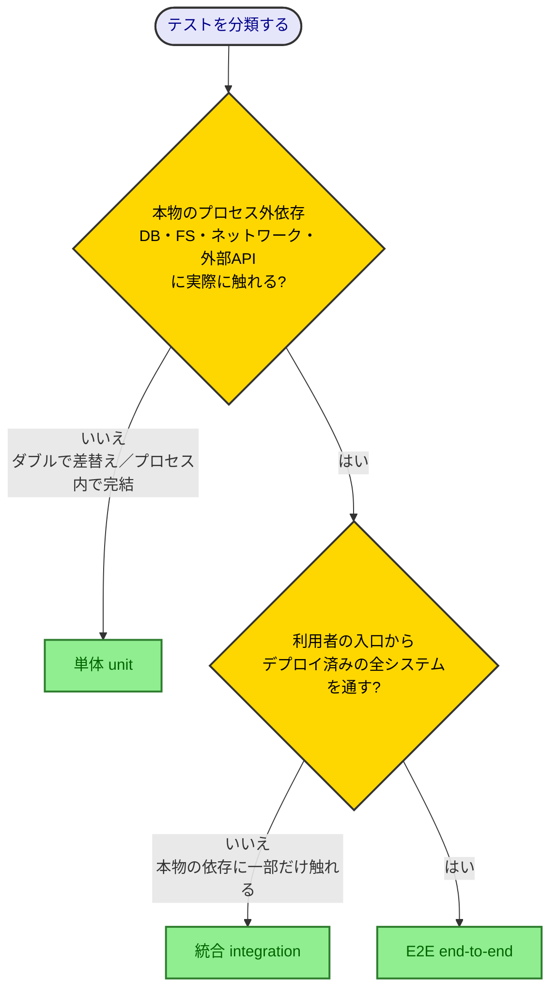

# テスト用語定義

テストを実装・レビュー・議論する開発者が、テストの種類（unit/integration/E2E）やテストダブルの呼称に迷ったとき・他者と認識を揃えたいときに引く、用語の単一の真実（Single Source of Truth）。各テストポリシー（[unit-test-policy.md](../policy/unit-test-policy.md) ほか）と[用語集](glossary.md)は、テスト用語の定義を本書にリンクし、再定義しない。

> [!NOTE]
> 本書は「定義」だけを扱う reference 文書である。各種類を**どう設計・配分するか**の指針は [test-strategy-policy.md](../policy/test-strategy-policy.md)、単体テストの**書き方**は [unit-test-policy.md](../policy/unit-test-policy.md) を参照。

## テストの種類（unit / integration / E2E）

3種類は **「どこまで本物の依存を通すか（スコープ）」** という1つの軸で区別する。スコープが広がるほど、本物の結合を検証できる代わりに、遅く・壊れやすく・原因特定が難しくなる。

| 種類                    | スコープ                                         | 共有依存・プロセス外依存              | 速度     | 決定性 | 主に守るリスク                                  |
| ----------------------- | ------------------------------------------------ | ------------------------------------- | -------- | ------ | ----------------------------------------------- |
| **単体（unit）**        | 1つの振る舞い単位（プロセス内で完結）            | 触れない（触れるならダブルに置換）    | 速い     | 高い   | ビジネスロジックの誤り                          |
| **統合（integration）** | 対象＋実際の依存、または複数コンポーネントの結合 | 本物に触れる（DB・キュー・外部API等） | 遅い     | 中     | 結合部の誤り（配線・SQL・シリアライズ・権限等） |
| **E2E（end-to-end）**   | デプロイ済みの全システム                         | すべて本物を、利用者の入口から通す    | 最も遅い | 低い   | 利用者視点での通し動作                          |

> **判断基準：** そのテストが**共有依存・プロセス外依存に実際に触れるか**で単体と統合を分ける。触れる、または遅い・非決定的なら、それは統合テストである。E2Eは統合の一種だが「最も外側・すべて本物・利用者の入口から」という最大スコープを指す。

なぜこの軸（スコープ）で定義するのか

本書はこの軸を **古典学派（Vladimir Khorikov『Unit Testing Principles, Practices, and Patterns』）の定義**に従って採る。これは [unit-test-policy.md](../policy/unit-test-policy.md) が採用する流儀と同じ系譜である。

### 単体と統合の境界：判断に迷うケース

境界は **「テストダブルを使うか」ではなく「本物のプロセス外依存に実際に触れるか」** で決まる。依存をダブル（mock/spy/stub/fake）で差し替えたテストは、本物に触れていないので**単体テスト**である。**モックやスパイで呼び出しを検証しても単体テスト**であり、これは古典学派・モック主義どちらの定義とも一致する。

次の決定木で判定する。

判定が分かれやすい具体例を示す。

| ケース                                                       | 判定             | 理由                                                                  |
| ------------------------------------------------------------ | ---------------- | --------------------------------------------------------------------- |
| 外部APIをモック/スパイで差し替え、呼び出しを検証する         | 単体             | 本物のAPIに触れていない。検証にモックを使うかは種類を変えない         |
| 複数のクラス・関数をまたいで結合検証する（すべてプロセス内） | 単体             | 古典学派の「単体」は振る舞いの単位。プロセス外依存が無ければ単体      |
| システム時刻・乱数をダブルで固定して検証する                 | 単体             | 非決定要素をプロセス内で固定しているだけ                              |
| インメモリDB・SQLite等のフェイクでDBを差し替える             | 単体寄り（注意） | 本物のDBに触れていない。ただし本物のSQL方言・制約・権限は検証できない |
| testcontainers・実Aurora等、本物のDBに接続して検証する       | 統合             | 本物の共有依存に触れ、遅く・環境依存になる                            |
| 実ファイルシステムに読み書きする                             | 統合寄り         | プロセス外依存に触れ、遅く・環境依存になりやすい                      |
| デプロイ済み環境を画面/公開APIから本物で通す                 | E2E              | 全システムを利用者の入口からすべて本物で通す                          |

## テストダブル（dummy / stub / spy / mock / fake）

「テストダブル」は依存を置き換える代用品の総称。xUnit Test Patterns（Gerard Meszaros）の5分類で呼び分ける。**「何でもモック」と呼ぶのをやめ**、役割で正確に区別すること。

| 用語                 | 役割               | 説明                                                             | 例                              |
| -------------------- | ------------------ | ---------------------------------------------------------------- | ------------------------------- |
| **ダミー（dummy）**  | 提供も検証もしない | 引数を埋めるためだけに渡され、実際には使われない                 | 未使用の `null`・空オブジェクト |
| **スタブ（stub）**   | 提供（入力側）     | 事前に決めた固定応答を返す。呼び出しは検証しない                 | `findById` が固定userを返す     |
| **スパイ（spy）**    | 提供＋記録         | スタブに「呼び出し履歴の記録」を足したもの。後で履歴を検証できる | 呼び出し引数を保持するstub      |
| **モック（mock）**   | 検証（出力側）     | 期待する呼び出しを事前設定し、その通り呼ばれたかを検証する       | `toHaveBeenCalledWith(...)`     |
| **フェイク（fake）** | 提供（本物の代替） | 軽量だが実際に動作する実装。本物の代わりに使える                 | インメモリDB、SQLite            |

> **混同しやすい点：** 区別の鍵は **「データを提供するだけ（stub/dummy/fake）」か「呼び出しを検証する（mock/spy）」か**。`toHaveBeenCalled*` で**検証するなら mock 系**、固定値を**返すだけなら stub**。fake は「動く実装」である点で stub と異なる（stub は固定値、fake はロジックを持つ）。

なぜ厳密に呼び分けるのか

一番の理由は、テスト用語が世の中で統一されておらず、人によって違う定義で同じ言葉を使うため、**コミュニケーション齟齬**が起きるからである。「モック」と言っても、ある人は検証付きのダブルを、別の人は単なるスタブを指している、ということが頻繁に起こる。本書で語彙を1つに固定すれば、レビューや設計の議論で同じ言葉が同じものを指すようになる。これが用語を整理する本来の目的である。

副次的な効果として、「提供系（stub/dummy/fake）」と「検証系（mock/spy）」を言葉の上で分けておくと、データ提供のために置いたダブルにまで呼び出し検証を足す過剰検証（over specification）を防ぎやすくなる（[unit-test-policy.md](../policy/unit-test-policy.md) の「スタブとのやりとりを検証してはならない」参照）。

