# Mermaid 描画プローブ

GitHub がどの Mermaid 図種を描画するかを観測するための一時ファイル。確認後に削除する。

## 01 flowchart

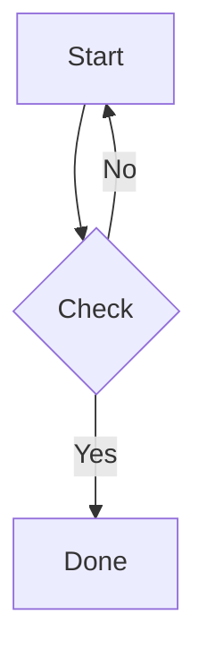

## 02 sequenceDiagram

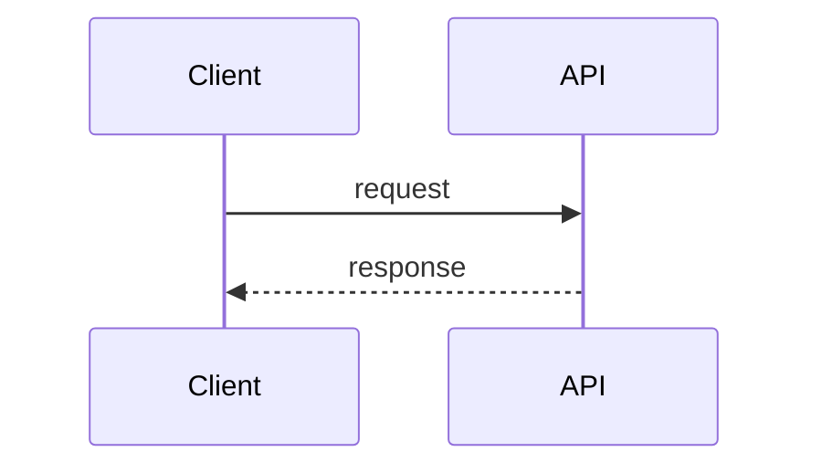

## 03 classDiagram

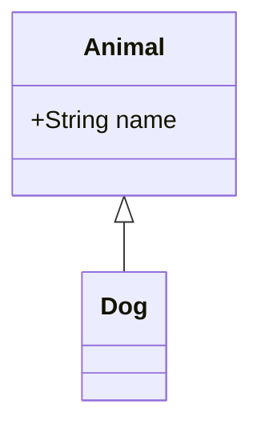

## 04 stateDiagram-v2

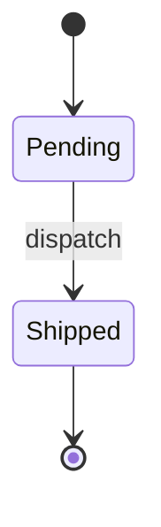

## 05 erDiagram

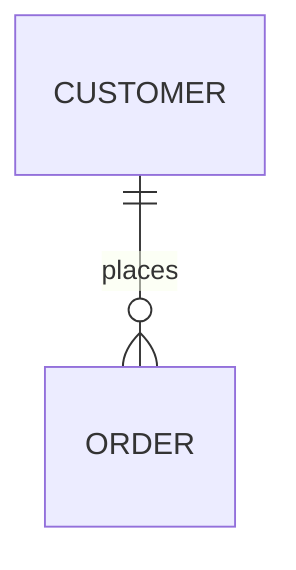

## 06 journey

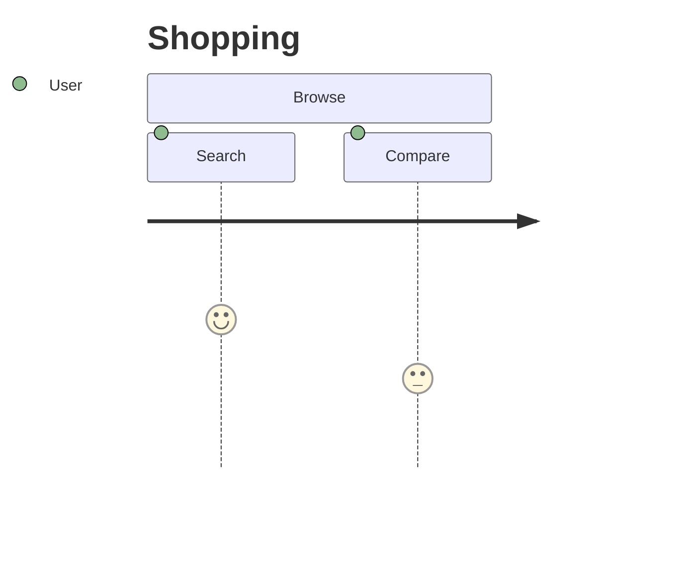

## 07 gantt

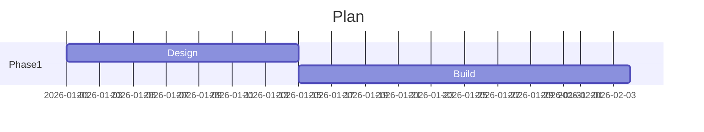

## 08 pie

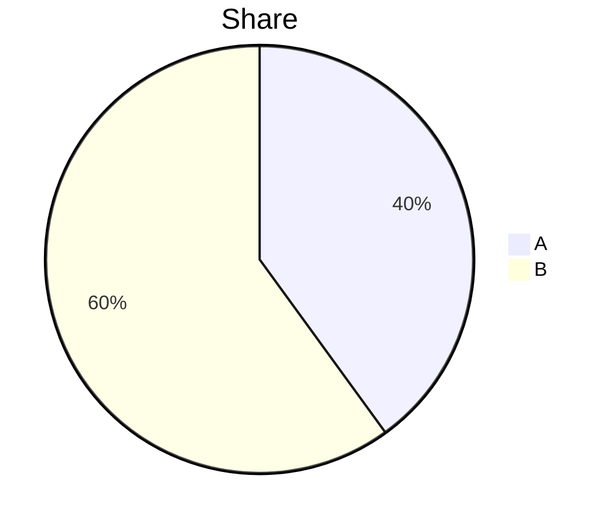

## 09 quadrantChart

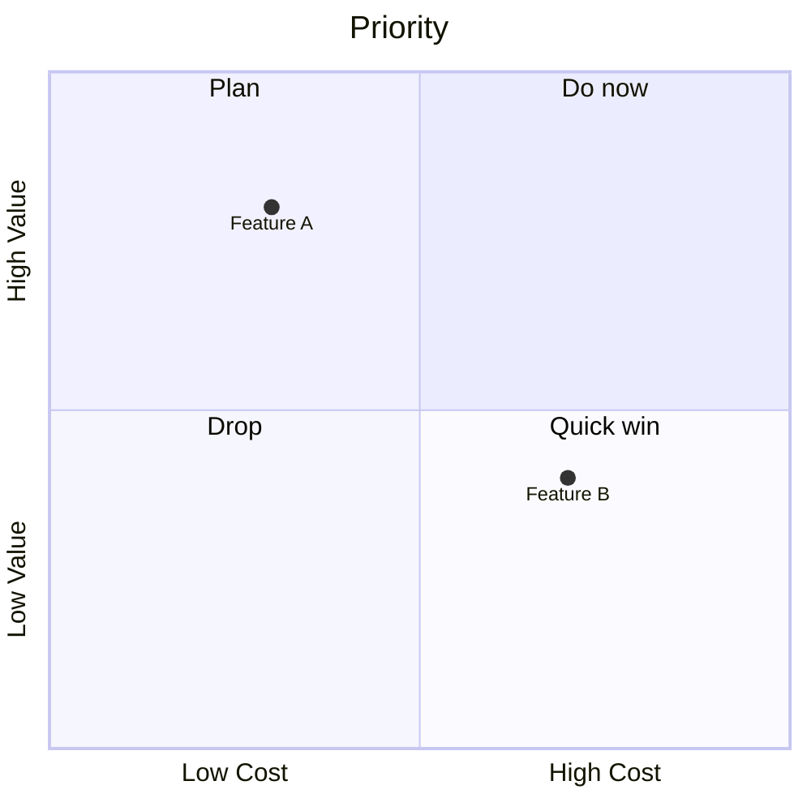

## 10 requirementDiagram

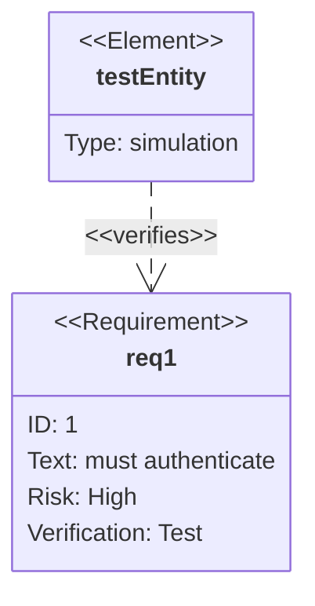

## 11 gitGraph

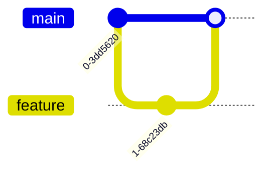

## 12 C4Context

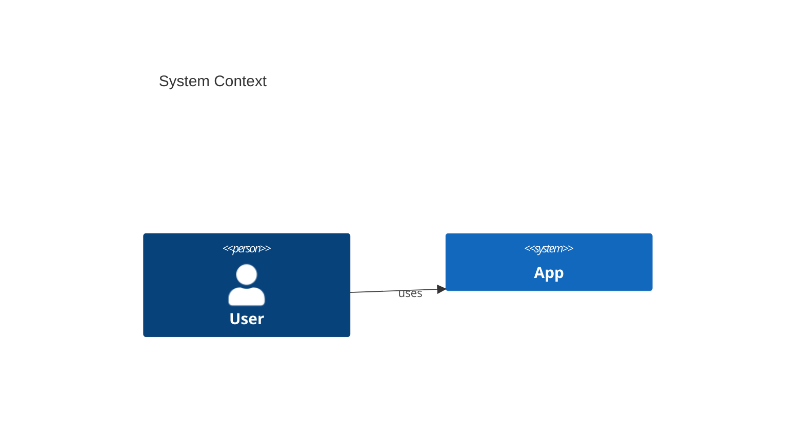

## 13 mindmap

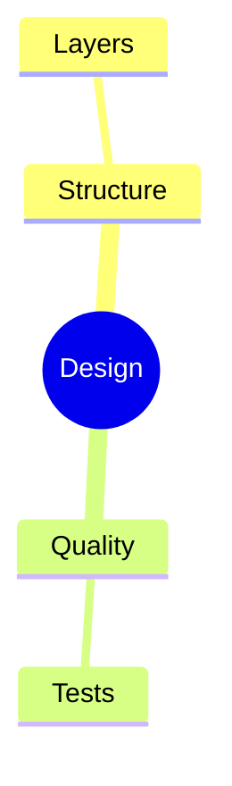

## 14 timeline

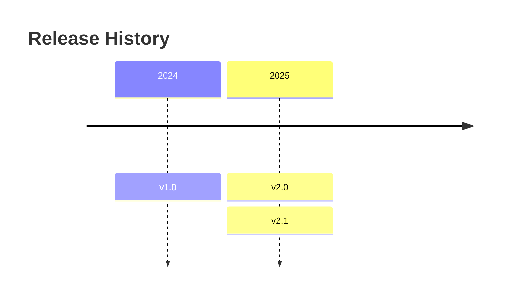

## 15 sankey-beta

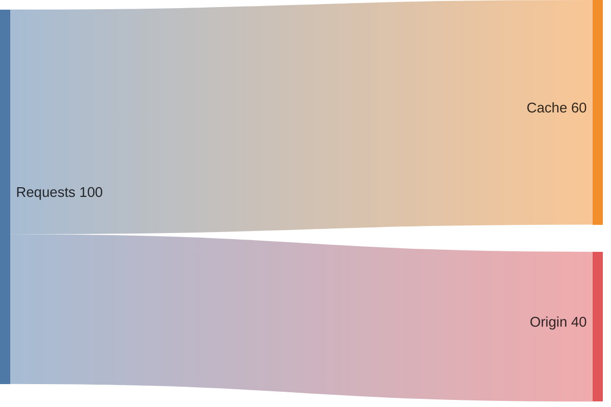

## 16 xychart

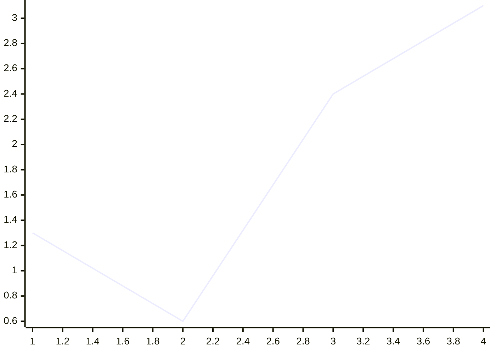

## 17 block-beta

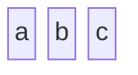

## 18 packet-beta

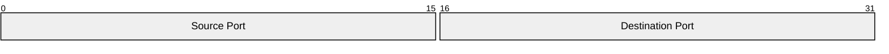

## 19 kanban

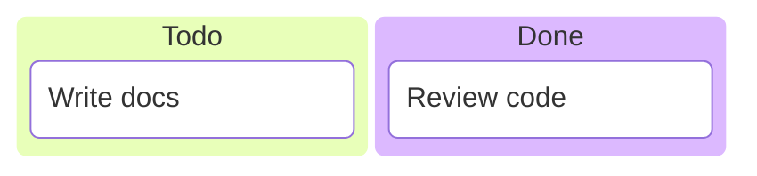

## 20 architecture-beta

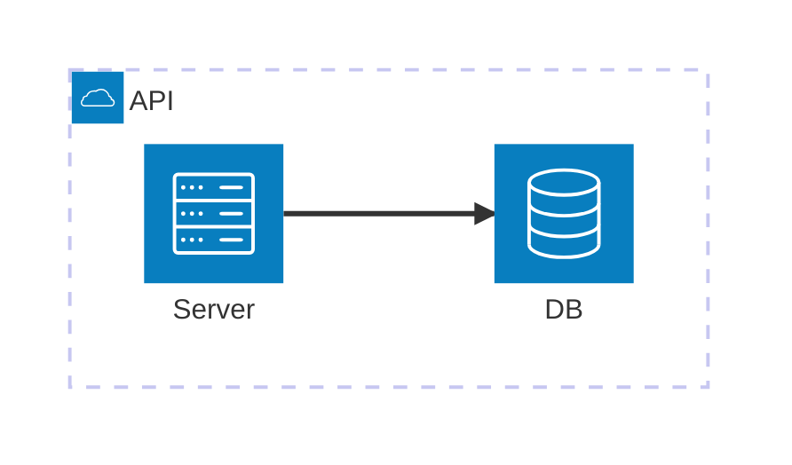

## 21 radar-beta

```mermaid
radar-beta
axis A, B, C, D, E
curve c1{1,2,3,4,5}
curve c2{5,4,3,2,1}
```

## 22 treemap-beta

```mermaid
treemap-beta
"Section 1"
    "Leaf 1.1": 12
    "Section 1.2"
      "Leaf 1.2.1": 12
"Section 2"
    "Leaf 2.1": 20
    "Leaf 2.2": 25
```

## 23 venn-beta

```mermaid
venn-beta
  set A
  set B
  union A,B
```

## 24 treeView-beta

```mermaid
treeView-beta
    my-project/
        src/
            index.js
        package.json
        README.md
```

## 25 ishikawa

```mermaid
ishikawa
  Deploy failed
    Config drift
    Missing secret
```

## 26 zenuml

```mermaid
zenuml
    Client->API: request
```
