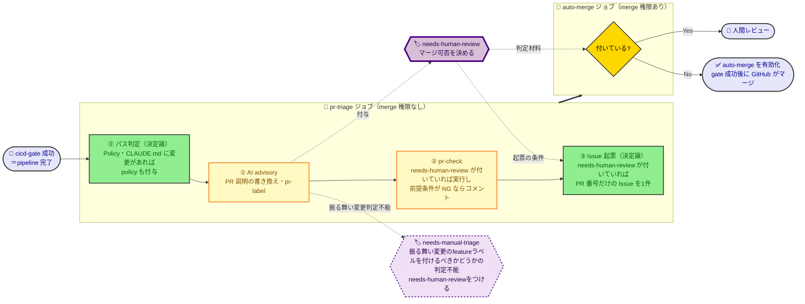

# CI/CD パイプライン設計

このリポジトリの CI/CD を変更・レビューする開発者／AI が、**なぜこの構成なのか**を知りたいときに参照する。  
何がどの条件で実行されるかは `.github/` 配下のワークフロー定義が正であり、本書はそこから読み取れない全体像と理由を書く。

## 基本方針：トランクベースで開発を高速に回す

**小さい変更を頻繁に main へ入れられること**を優先し、それが成り立つように CI/CD を設計した。

| 設計ポイント                                                       | 方針                                                                                                                                                                                                                                 | なぜ                                                                                                                                                                                                                       |
| ------------------------------------------------------------------ | ------------------------------------------------------------------------------------------------------------------------------------------------------------------------------------------------------------------------------------ | -------------------------------------------------------------------------------------------------------------------------------------------------------------------------------------------------------------------------- |
| 実環境へのデプロイをいつやるか                                     | 最も時間のかかる AWS 環境へのデプロイ工程——deploy と結合テスト——を、main へマージした**後**に回す（[ADR-001](adr/001-post-merge-dev-deploy.md)）                                                                                     | マージまでの経路から最も遅い工程が消え、main に入れるまでのサイクルが大きく縮む。デプロイ失敗が起きても、修正の PR を即座に出せる                                                                                          |
| CI を充実させつつ、実行時間をどう短くするか                        | job の並列実行と、変更種別判定（変更されたファイルの種別に応じた job 実行。例：docs のみの変更）で両立を図る                                                                                                                         | AI 駆動開発では静的解析やテストを充実させ、機械的な仕組みで品質を担保することが重要である。一方でこれらの増加は、開発スピードを重視するトランクベース開発の思想と衝突してしまう                                            |
| コーディングエージェント開発のレビューボトルネックにどう対応するか | 2つ打つ。PR の変更行数に上限を定めて超えたらレビューを拒否できるようにし、人間がレビューすべき PR と AI レビューのみで通す PR を AI に仕分けさせる（判定方針は [pr-review-policy](../../../docs/policy/pr-review-policy.md) に準拠） | AI は大量の変更を高速にできるが、AI 成果物の認知負荷は高く、レビュー者に負担が集中してボトルネックになる。変更行数の多い PR はレビュー精度も落ち、時間もかかる。すべてのコードを人間がレビューするのは、もう現実的ではない |
| 高速開発と安全性をどう両立するか                                   | 人間が手動で操作する工程を可能な限り排除する（PR 作成の自動化でマージ先の指定ミスを防ぎ、status check で CI がエラーのコードをマージできなくする）。マージ可否は1つのゲートに集約する                                                | 安全に高速開発するには、ヒューマンエラーを防止する仕組み作りが要る。人の注意力に頼ると、速く回すほど事故の機会が増え、手戻りが速さを打ち消す                                                                               |

## パイプラインの全体像

### CIからマージ可否判定まで

- `detect-changes`で変更対象を分類し、必要な検査だけを実施する
- 検査が１つでも失敗したらCI失敗判定

### AIによるレビューチェック処理と自動マージ

AIにより以下を実施する

- PRの説明を記載
- PRの変更ファイルを見て変更種別ラベルをつける
- [pr-review-policy](../../../docs/policy/pr-review-policy.md)をもとにPRの人間レビューが必要かを判定する（`needs-human-review` ラベルをつける）
- PRのサイズをチェックする（大きすぎる変更は拒否される）

### マージ後からデプロイ

- mainマージ後に自動でデプロイ -> 結合テスト実行
- デプロイやテストが失敗したら自動でIssueを起票

## 前提と制約

| 不便                       | 内容                                                                                                                                                  |
| -------------------------- | ----------------------------------------------------------------------------------------------------------------------------------------------------- |
| 待機中の実行が押し出される | dev の直列化は「実行中1つ＋待機中1つ」しか保持しない。main への push が続くと待機中の deploy がキャンセルされる（最新が deploy されるので実害は無い） |

## GitHubリポジトリ設定

| 項目                         | 設定内容                                                                                   | 壊すとどうなる                                                                                                                              |
| ---------------------------- | ------------------------------------------------------------------------------------------ | ------------------------------------------------------------------------------------------------------------------------------------------- |
| status-check                 | cicd-gate を required check として登録 cicd-gateが成功しないと仕組みとしてPRマージできない | マージ可否をゲート1つに集約した決定が効かなくなり、検査を通っていない PR がマージできる                                                     |
| ブランチの最新取り込み       | requiredに設定                                                                             | 検査したコードとマージされるコードがずれる。deploy がマージの後ろにある本設計では、マージ前に main の破損を防ぐのはこの設定だけになっている |
| auto-merge                   | 有効、status-checkが成功していれば自動でマージ可能                                         | 「人間レビュー不要」と判定された PR も自動マージされず、人手待ちで滞留する                                                                  |
| マージ済みブランチの自動削除 | 有効、PRをcloseすると自動でブランチ削除                                                    | topic ブランチが溜まり続ける。auto-merge はマージを予約して即返るため、ワークフロー側では消せない                                           |
| secret                       | AI 実行用の OAuth トークン を設定している                                                  | AI ジョブが失敗する（advisory なのでゲートは赤くならず、AI 機能だけが静かに止まる）                                                         |

## CI実施内容一覧

PR がゲートを通るまでに何を検査しているかの一覧。個々のルールと閾値は設定ファイルとスクリプトが正で、ここは概要だけを置く。

| ジョブ         | 検査（ツール）             | 何を見るか                                                                     |
| -------------- | -------------------------- | ------------------------------------------------------------------------------ |
| `ci-format`    | 整形（prettier）           | `.md` を含む全ファイルの整形崩れ                                               |
| `ci-hooks`     | policy hook（node:test）   | ポリシーを読み込む hook が、`applies-to` の宣言どおりに発火するか              |
| `ci-links`     | リンク切れ                 | Markdown の相対リンクの参照先が実在するか                                      |
| `ci-claude-md` | CLAUDE.md 文字数           | CLAUDE.md と `@` import 先の合計が上限内か                                     |
| `ci-common`    | コーディング規約（ESLint） | 規約違反・import の秩序・バグを生みやすい書き方                                |
| `ci-common`    | 未使用検出（knip）         | 使われていない export・ファイル・依存パッケージ                                |
| `ci-common`    | 依存の脆弱性               | npm 依存を全階層舐め、high 以上の脆弱性で落とす                                |
| `ci-app`       | 型検査（tsc）              | アプリの型エラー                                                               |
| `ci-app`       | 単体テスト（vitest）       | アプリの単体テストと、アーキテクチャ規約テスト（レイヤ依存・循環依存・凝集度） |
| `ci-cdk`       | スナップショット（vitest） | 合成した CloudFormation テンプレート全体の意図しない差分                       |
| `ci-cdk`       | 個別プロパティ（vitest）   | 暗号化設定・アラーム有無など、リソース単位の必須プロパティ                     |
| `cdk-diff`     | `cdk diff`                 | 既存リソースの意図しない置換・削除（ゲートには繋がない判断材料）               |

## 重要なポイント

| ポイント                                                          | なぜ                                                                                                                                                                                                                    |
| ----------------------------------------------------------------- | ----------------------------------------------------------------------------------------------------------------------------------------------------------------------------------------------------------------------- |
| マージ可否は `cicd-gate` 1つだけで決める                          | job を個別に required 登録すると、検査を増やしたときに登録漏れが起きる。ゲートが1つなら、増やした検査はそのゲートの中でまとめて確かめられる。Dependabot の PR も、同名の `cicd-gate` job を作れば同じ条件でマージできる |
| 変更対象を「常時実行・全体・アプリ・CDK」に分類し、検査対象を絞る | 静的解析はルールを1箇所で定義しているため、走らせるには全階層の依存が要る。だからスキップできない。条件で絞れるのは、対象の階層に閉じた検査だけ                                                                         |
| dev へのデプロイ経路を main の1本だけにする                       | デプロイ経路が2つ以上あると「dev にいま何があるか」が一意に決まらない                                                                                                                                                   |
| dev を触るものは、削除も含めて同じ直列化グループに入れる          | dev は1環境しかない。main への連続 push と dev の削除が並行すると CloudFormation スタックが壊れる                                                                                                                       |
| PR の時点では deploy せず、`cdk diff` だけを確認する              | 意図しない置換・削除を、レビューの時点で拾える                                                                                                                                                                          |
| main への deploy が失敗したら GitHub Issue を自動起票する         | 失敗が required check の外側で起きるため、放っておくと誰の担当にもならない。壊れた main はブランチ最新化の要求を通じて全ブランチへ配られる                                                                              |

### マージ可否は `cicd-gate` 1つだけで決める

ゲートは上流ジョブの結果を集めて自分で判定する。GitHub は「実行しなかった」を「成功」と同じものとして扱うため、`needs` で繋ぐだけでは検査が丸ごと走らなかったときに赤くならず静かに開いてしまう。

| 上流の結果                 | ゲートの扱い | なぜ                                                                                       |
| -------------------------- | ------------ | ------------------------------------------------------------------------------------------ |
| 成功                       | 通す         | —                                                                                          |
| 失敗・キャンセル           | 落とす       | 未実行は検証の不在であって、検証の成功ではない                                             |
| スキップ                   | 通す         | 変更対象外で意図的に飛ばした検査。上流が落ちた連鎖なら、落ちたジョブ自身が失敗として現れる |
| `cdk-diff`（繋いでいない） | 見ない       | 実 AWS 環境に触れる検査をマージ可否に持ち込むと、AWS 側の一時障害でマージが止まる          |

### 変更対象を「常時実行・全体・アプリ・CDK」に分類し、検査対象を絞る

各ジョブは変更されたパスで実行有無が決まる。yaml実装が多少複雑になるが、検査対象を絞ることによるスピード向上を優先した。

| 分類     | ジョブ         | 実行条件（変更パス）                     | なぜこの条件か                                                          |
| -------- | -------------- | ---------------------------------------- | ----------------------------------------------------------------------- |
| 常時実行 | `ci-format`    | 常に                                     | prettier は `.md` も検査対象。docs だけの変更でも整形崩れで落ちうる     |
| 常時実行 | `ci-hooks`     | 常に                                     | hook の発火対象は `docs/policy/*.md` の frontmatter が宣言する          |
| 常時実行 | `ci-links`     | 常に                                     | 相対リンクは参照先の移動・改名で壊れる                                  |
| 常時実行 | `ci-claude-md` | 常に                                     | CLAUDE.md 自体が docs と判定される                                      |
| 全体     | `ci-common`    | `docs/` と直下 `*.md` **以外**に変更あり | 静的解析はルールを1箇所で定義しており、全階層の依存が揃わないと動かない |
| アプリ   | `ci-app`       | `app/` に変更あり                        | 検査対象が `app/backend` に閉じている                                   |
| CDK      | `ci-cdk`       | `infra/` に変更あり                      | 検査対象が `infra/` に閉じている                                        |
| 検査外   | `cdk-diff`     | `app/` または `infra/` に変更あり        | アプリを CDK が deploy するため、app の変更も差分に出る                 |

### dev を触るものは、削除も含めて同じ直列化グループに入れる

直列化はグループ名の一致だけで成立する。dev に触れるジョブを1つでも別名にすると、そのジョブだけが並行して走る。

| ワークフロー      | ジョブ       | 直列化グループ   |
| ----------------- | ------------ | ---------------- |
| `deploy-dev.yml`  | `cdk-deploy` | `cdk-deploy-dev` |
| `dev-destroy.yml` | `destroy`    | `cdk-deploy-dev` |

### main への deploy が失敗したら GitHub Issue を自動起票する

| 場面                                  | 起票の動き                                  |
| ------------------------------------- | ------------------------------------------- |
| deploy または結合テストが失敗した     | `dev-deploy-failure` ラベルを付けて起票する |
| 同じラベルの open な Issue が既にある | 起票せず、その Issue にコメントを足す       |
| 直列化の押し出しでキャンセルされた    | 何もしない（後続の deploy が引き継ぐ）      |
