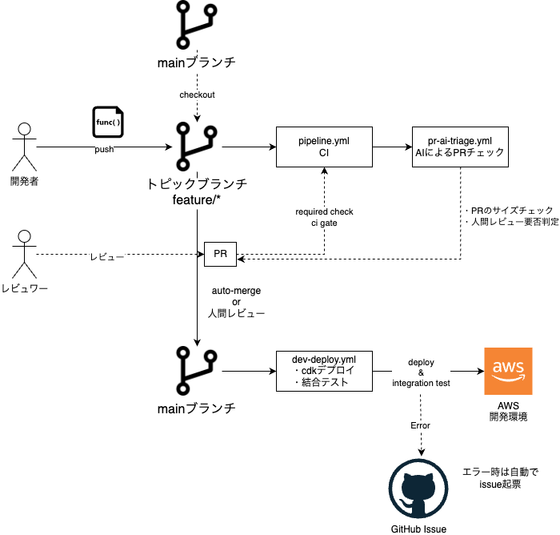
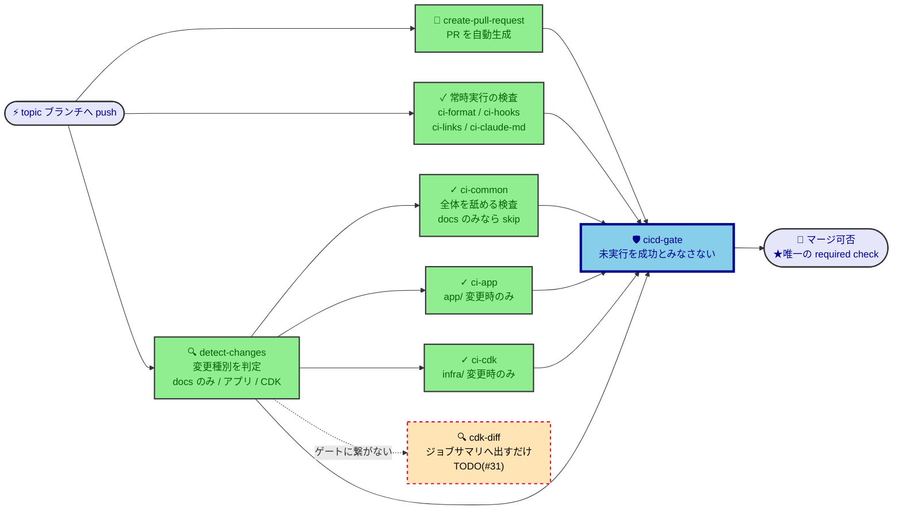
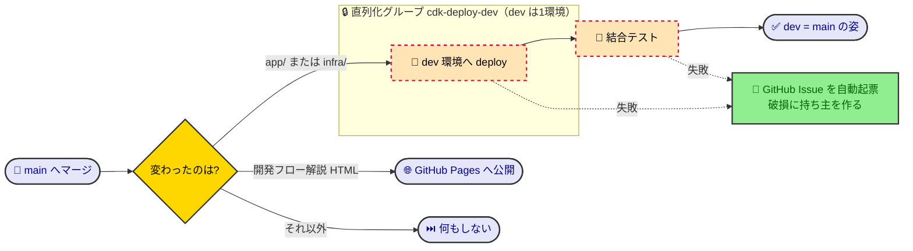
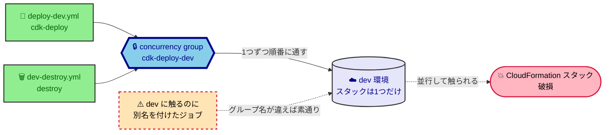

# CI/CD パイプライン設計

このリポジトリの CI/CD を変更・レビューする開発者／AI が、**現状の構成とその理由**を知りたいときに参照する。  
何がどの条件で実行されるかは `.github/` 配下のワークフロー定義が正であり、本書はそこから読み取れない全体像と理由を書く。

## 目次

- [基本方針：トランクベースで開発を高速に回す](#基本方針トランクベースで開発を高速に回す)
- [パイプラインの全体像](#パイプラインの全体像)
  - [開発フロー](#開発フロー)
  - [CIからマージ可否判定まで：pipeline.yml](#ciからマージ可否判定までpipelineyml)
  - [AIによるレビューチェック処理と自動マージ: pr-ai-triage.yml](#aiによるレビューチェック処理と自動マージ-pr-ai-triageyml)
  - [マージ後からデプロイ: dev-deploy.yml](#マージ後からデプロイ-dev-deployyml)
- [前提と制約](#前提と制約)
  - [技術的制約](#技術的制約)
  - [組織の制約](#組織の制約)
- [GitHubリポジトリ設定](#githubリポジトリ設定)
- [CI実施内容一覧](#ci実施内容一覧)
- [マージ可否は `cicd-gate` 1つだけで決める](#マージ可否は-cicd-gate-1つだけで決める)
- [検査対象を変更パスで絞る](#検査対象を変更パスで絞る)
- [dev を触るものは、削除も含めて同じ直列化グループに入れる](#dev-を触るものは削除も含めて同じ直列化グループに入れる)

## 基本方針：トランクベースで開発を高速に回す

**小さい変更を頻繁に main へ入れられること**を優先し、それが成り立つように CI/CD を設計した。

- デプロイはmainマージ後に行う
- CIでは変更ファイルに応じて必要な検査だけを実施
- PRのサイズ制限を設けて、一定以上の場合はレビューを拒否する
- 人間がレビューするべきPRと自動マージするものを判別する

## パイプラインの全体像

### 開発フロー

- トランクベースによる高速開発のためmain + 短命なtopicブランチのシンプルな構成
- GitHub Actionsの詳細は以降のmermaid図で示す

### CIからマージ可否判定まで：pipeline.yml

- 高速化のため、`detect-changes`で変更対象を分類し、必要な検査だけを実施する
- 検査が１つでも失敗したらCI失敗判定
- `cdk-diff`を実行し、デプロイ前にリソース差分を確認する

### AIによるレビューチェック処理と自動マージ: pr-ai-triage.yml

AIにより以下を実施する

- PRの説明を記載
- PRの変更ファイルを見て変更種別ラベルをつける
- pr-review-policy をもとにPRの人間レビューが必要かを判定する（`needs-human-review` ラベルをつける）
- PRのサイズをチェックする（大きすぎる変更は拒否される）

設計意図

- PRのサイズを小さく保ち、人間レビューの対象を絞ることで、開発スピードを犠牲にしないようにしている

### マージ後からデプロイ: dev-deploy.yml

- mainマージ後に自動でデプロイ -> 結合テスト実行
- デプロイやテストが失敗したら自動でIssueを起票

設計意図

- 実 AWS 環境への deploy を main マージにしたのは、開発のスピードを優先したからである。デプロイエラーの場合は自動でIssue起票され迅速に対応できる。トランクベースだからできる方法。
- 失敗を Issue に自動起票するのは、この失敗が required check の外側で起きるため、放っておくと誰の担当にもならないからである。

## 前提と制約

### 技術的制約

| 前提・制約                 | 内容                                                                                                                                                  |
| -------------------------- | ----------------------------------------------------------------------------------------------------------------------------------------------------- |
| 待機中の実行が押し出される | dev の直列化は「実行中1つ＋待機中1つ」しか保持しない。main への push が続くと待機中の deploy がキャンセルされる（最新が deploy されるので実害は無い） |

### 組織の制約

なし（ブランチ運用・CI の実行環境について組織から課されているルールは無い）。

## GitHubリポジトリ設定

| 項目                         | 設定内容                                                                                   | 壊すとどうなる                                                                                                                              |
| ---------------------------- | ------------------------------------------------------------------------------------------ | ------------------------------------------------------------------------------------------------------------------------------------------- |
| status-check                 | cicd-gate を required check として登録 cicd-gateが成功しないと仕組みとしてPRマージできない | マージ可否をゲート1つに集約した決定が効かなくなり、検査を通っていない PR がマージできる                                                     |
| ブランチの最新取り込み       | requiredに設定                                                                             | 検査したコードとマージされるコードがずれる。deploy がマージの後ろにある本設計では、マージ前に main の破損を防ぐのはこの設定だけになっている |
| auto-merge                   | 有効、status-checkが成功していれば自動でマージ可能                                         | 「人間レビュー不要」と判定された PR も自動マージされず、人手待ちで滞留する                                                                  |
| マージ済みブランチの自動削除 | 有効、PRをcloseすると自動でブランチ削除                                                    | topic ブランチが溜まり続ける。auto-merge はマージを予約して即返るため、ワークフロー側では消せない                                           |
| secret                       | AI 実行用の OAuth トークン を設定している                                                  | AI ジョブが失敗する（advisory なのでゲートは赤くならず、AI 機能だけが静かに止まる）                                                         |

## CI実施内容一覧

PR がゲートを通るまでに何を検査しているかの一覧。個々のルールと閾値は設定ファイルとスクリプトが正で、ここは概要だけを置く。

| 分類     | ジョブ         | 検査（ツール）             | 実行条件（変更パス）                             | 何を見るか                                                                     |
| -------- | -------------- | -------------------------- | ------------------------------------------------ | ------------------------------------------------------------------------------ |
| 常時実行 | `ci-format`    | 整形（prettier）           | 常に（`.md` も整形対象）                         | `.md` を含む全ファイルの整形崩れ                                               |
| 常時実行 | `ci-hooks`     | policy hook（node:test）   | 常に（発火対象を `docs/policy/*.md` が宣言する） | ポリシーを読み込む hook が、`applies-to` の宣言どおりに発火するか              |
| 常時実行 | `ci-links`     | リンク切れ                 | 常に（参照先の移動・改名で壊れる）               | Markdown の相対リンクの参照先が実在するか                                      |
| 常時実行 | `ci-claude-md` | CLAUDE.md 文字数           | 常に（CLAUDE.md 自体が docs と判定される）       | CLAUDE.md と `@` import 先の合計が上限内か                                     |
| 全体     | `ci-common`    | コーディング規約（ESLint） | `docs/` と直下 `*.md` **以外**に変更あり         | 規約違反・import の秩序・バグを生みやすい書き方                                |
| 全体     | `ci-common`    | 未使用検出（knip）         | `docs/` と直下 `*.md` **以外**に変更あり         | 使われていない export・ファイル・依存パッケージ                                |
| 全体     | `ci-common`    | 依存の脆弱性               | `docs/` と直下 `*.md` **以外**に変更あり         | npm 依存を全階層舐め、high 以上の脆弱性で落とす                                |
| アプリ   | `ci-app`       | 型検査（tsc）              | `app/` に変更あり                                | アプリの型エラー                                                               |
| アプリ   | `ci-app`       | 単体テスト（vitest）       | `app/` に変更あり                                | アプリの単体テストと、アーキテクチャ規約テスト（レイヤ依存・循環依存・凝集度） |
| CDK      | `ci-cdk`       | スナップショット（vitest） | `infra/` に変更あり                              | 合成した CloudFormation テンプレート全体の意図しない差分                       |
| CDK      | `ci-cdk`       | 個別プロパティ（vitest）   | `infra/` に変更あり                              | 暗号化設定・アラーム有無など、リソース単位の必須プロパティ                     |
| 検査外   | `cdk-diff`     | `cdk diff`                 | `app/` または `infra/` に変更あり                | 既存リソースの意図しない置換・削除（ゲートには繋がない判断材料）               |

## マージ可否は `cicd-gate` 1つだけで決める

job を個別に required 登録すると、検査を増やしたときに登録漏れが起きる。ゲートが1つなら、増やした検査はそのゲートの中でまとめて確かめられる。Dependabot の PR も、同名の `cicd-gate` job を作れば同じ条件でマージできる。

ゲートは上流ジョブの結果を集めて自分で判定する。GitHub は「実行しなかった」を「成功」と同じものとして扱うため、`needs` で繋ぐだけでは検査が丸ごと走らなかったときに赤くならず静かに開いてしまう。

| 上流の結果                 | ゲートの扱い | なぜ                                                                                       |
| -------------------------- | ------------ | ------------------------------------------------------------------------------------------ |
| 成功                       | 通す         | —                                                                                          |
| 失敗・キャンセル           | 落とす       | 未実行は検証の不在であって、検証の成功ではない                                             |
| スキップ                   | 通す         | 変更対象外で意図的に飛ばした検査。上流が落ちた連鎖なら、落ちたジョブ自身が失敗として現れる |
| `cdk-diff`（繋いでいない） | 見ない       | 実 AWS 環境に触れる検査をマージ可否に持ち込むと、AWS 側の一時障害でマージが止まる          |

## 検査対象を変更パスで絞る

各ジョブは変更されたパスで実行有無が決まる。yaml 実装が多少複雑になるが、検査対象を絞ることによるスピード向上を優先した。ジョブごとの実行条件は [CI実施内容一覧](#ci実施内容一覧) が持つ。

絞れるのは、対象の階層に閉じた検査だけである。静的解析（`ci-common`）はルールを1箇所で定義していて全階層の依存が要るため、docs だけの変更でもスキップできない。

## dev を触るものは、削除も含めて同じ直列化グループに入れる

dev は1環境しかない。main への連続 push と dev の削除が並行すると CloudFormation スタックが壊れる。直列化はグループ名の一致だけで成立する。

