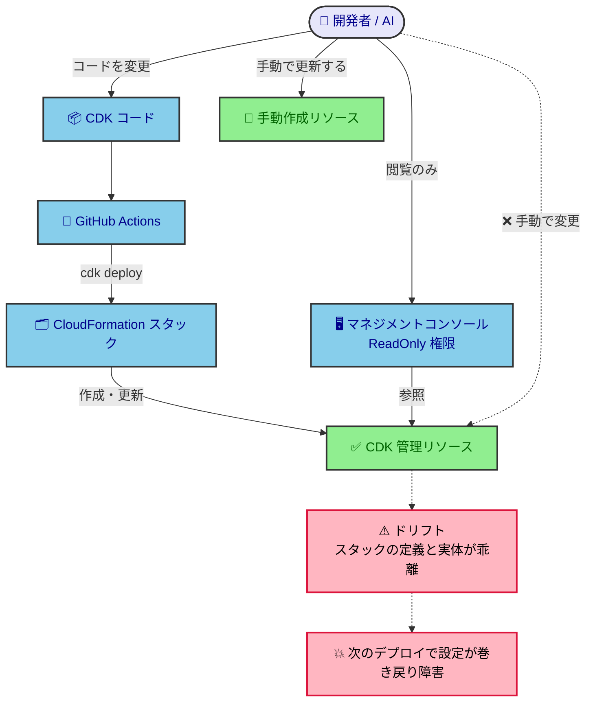
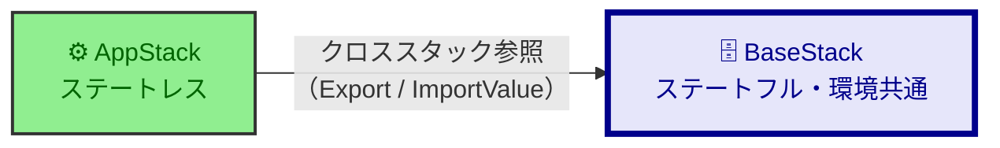
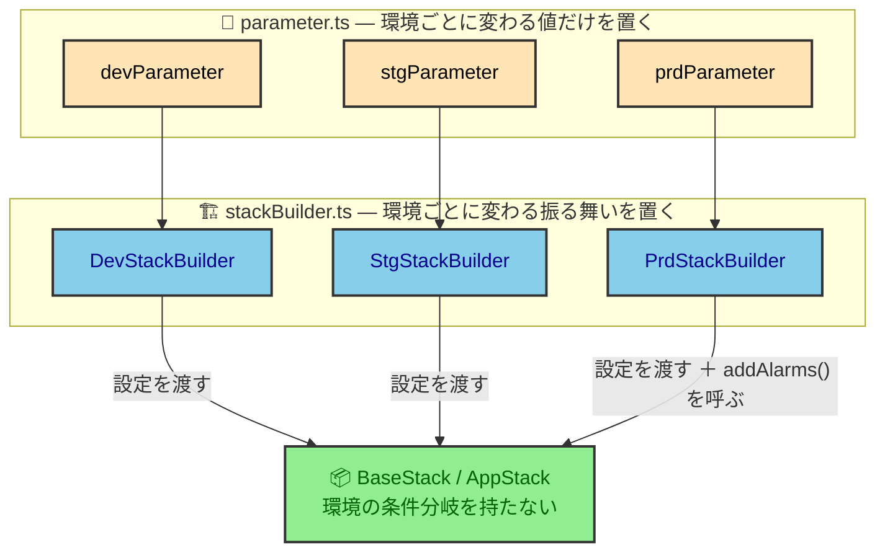

# IaC 設計

AWS リソースを CDK で構築・変更する開発者／AI が、IaC の管理方針（IaCスコープ・スタック分離方針・命名規則など）とその理由を知りたいときに参照する。  
リソースの個別設定・具体値は `infra/` 配下の CDK コードが正であり、本書はそこから読み取れない全体像と理由を書く。  
どんな AWS リソースをどう組んでいるか（構成図・ネットワーク・運用監視）は [infrastructure-design](infrastructure-design.md) が持つ。

## 目次

- [基本方針](#基本方針)
- [IaC 管理方針](#iac-管理方針)
  - [手動作成リソース一覧](#手動作成リソース一覧)
- [スタック設計](#スタック設計)
  - [スタック関係図](#スタック関係図)
  - [環境差分の実装設計](#環境差分の実装設計)
- [前提と制約](#前提と制約)
  - [技術的制約](#技術的制約)
  - [組織の制約](#組織の制約)
- [命名規約](#命名規約)
  - [リソース命名](#リソース命名)
  - [スタック命名](#スタック命名)

## 基本方針

すべてのリソースを CDK で構築・運用し、安全に管理できる仕組みを構築する。

- 手動でのリソース変更やデプロイの禁止（マネコンはReadOnly）
- データや状態を持つステートフルリソースをStack分離
- 設計ファイルを見れば環境差分がわかるようにして、Stack内部に条件分岐を持たない
- CI/CDによる自動デプロイでデプロイ先間違い防止

## IaC 管理方針

原則としてすべてのリソースを CDK で構築・運用する。手動で作成せざるを得なかったリソースだけが手動更新の対象で、それ以外の手動操作は禁止する。

**ドリフト**とは、CloudFormation スタックが持つ定義と、実際にプロビジョニングされた設定の乖離である。



<details>
<summary>設計意図</summary>

- マネジメントコンソールを ReadOnly に絞るのは、手で変えるとスタックの定義と実体が乖離し、次のデプロイで手を入れた設定が巻き戻って障害になるためである。

</details>

### 手動作成リソース一覧

| リソース        | 作成主体 | 手動作成の理由                                                                                                 |
| --------------- | -------- | -------------------------------------------------------------------------------------------------------------- |
| Secrets Manager | 自チーム | CDK コードに秘匿情報を書くと公開することになるため。手動で Secret を登録し、CDK からはキーを参照するだけにする |

## スタック設計

### スタック関係図

BaseStack はそれぞれの環境で共通のリソースとステートフルなリソースを、AppStack はアプリケーション実行のメインリソース（ステートレスなもののみ）を持つ。



依存の向きは AppStack → BaseStack の一方向である。BaseStack が公開した L2 オブジェクトを StackBuilder が AppStack へ props で渡し、CloudFormation 上はクロススタック参照（Export / ImportValue）になる。この向きがデプロイと削除の順序も決める——作るときは BaseStack が先、消すときは AppStack が先。

<details>
<summary>設計意図</summary>

- ライフサイクルの違うリソースを同居させると、作り直したいときに消せないものが巻き添えになる。だからステートフル・環境共通のものを BaseStack へ分け、依存を一方向に固定した。

</details>

### 環境差分の実装設計



値の差分は `parameter.ts` に、振る舞いの差分は Builder が呼ぶ Stack の public メソッドに置く。判断軸そのものは [cdk-design-policy](../../../docs/policy/cdk-design-policy.md) が持つ。

<details>
<summary>設計意図</summary>

- Stack 内に環境の条件分岐を作らないのは、分岐があると Stack を読んでも「どの環境で何ができるか」が分からないため。

</details>

## 前提と制約

### 技術的制約

なし（IaC の作り方について、触ると壊れる前提や受け入れた不便は無い）。

### 組織の制約

#### タグ規則

タグ機能を持つすべてのリソースに次のタグを付ける。

| タグkey | value |
| ------- | ----- |
| System  | pdd   |

#### その他の制約

なし（暗号化・リージョンについて組織から課されているルールは無い）。

## 命名規約

### リソース命名

- 組織が課す命名規約はなし
- CDK のベストプラクティスに従い、原則としてリソース名は指定せず CDK の生成に任せる
- ただし CLI から名前で呼び出したい場合など、名前があった方がよいリソースにだけ、スタック名を接頭辞にした名前を付ける
- スタック名を接頭辞にするのは、スタックを複製したときの名前衝突を避けるためである

### スタック命名

デプロイ時にスタック名で対象を選ぶため、命名は接頭辞から決める。

```
{システム識別子}-{環境名(dev / stg / prd)}-{スタック固有名称}-stack
```

例：`cdk deploy 'pdd-dev-*'` で dev 環境のスタックをまとめてデプロイする。
