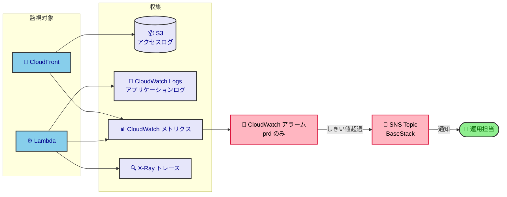

# インフラ設計

AWS/IaC で構築したインフラを変更・レビューする開発者／AI が、現在のインフラ構成概要と、なぜこの構成なのかを知りたいときに参照する。  
リソースの個別設定・具体値は `infra/` 配下の CDK コードが正であり、本書はそこから読み取れない全体像と理由を書く。  
そのリソースを CDK でどう作り・変えるか（IaC 管理方針・スタック設計・命名規約）は [iac-design](iac-design.md) が持つ。

## 目次

- [基本方針](#基本方針)
- [アーキテクチャ概要](#アーキテクチャ概要)
  - [全体インフラ構成図](#全体インフラ構成図)
  - [アカウントと環境構成](#アカウントと環境構成)
  - [ネットワーク構成図](#ネットワーク構成図)
- [前提と制約](#前提と制約)
  - [技術的制約](#技術的制約)
  - [組織の制約](#組織の制約)
- [運用監視](#運用監視)

## 基本方針

**運用に人手をかけないこと**を最優先し、常時稼働のサーバを持たないサーバレス構成で組む。

- CloudFrontやLambdaを中心とした構成でVPCを持たない
- DBはS3を使用し1レコード1 JSONで代用

## アーキテクチャ概要

### 全体インフラ構成図

設計意図

- ゲートウェイに API Gateway ではなく Lambda Function URLs を使うのは、API Gateway 特有の変換処理・APIキー管理・使用量プランがいずれも不要で、機能過剰と判断したためである。

- フロントエンドの配信に S3 と CloudFront を選んだのは、SPA構成であり、静的ファイルなら配信にサーバが要らないためである。  
  API も同じ CloudFront から返すので、画面と API が同一オリジンになり CORS の設定も要らない。

- SaaSのスタブをデプロイすることで自チーム内での内部結合テストを可能にする

### アカウントと環境構成

1つのアカウントには1つの環境だけを置く。

| アカウント名   | 環境名 | 主な用途                                 |
| -------------- | ------ | ---------------------------------------- |
| 開発アカウント | dev    | CDKデプロイ確認・チーム内部結合テスト    |
| 検証アカウント | stg    | 外部システムとの結合テスト・リリース判定 |
| 本番アカウント | prd    | プロダクション                           |

### ネットワーク構成図

VPC は作らない。エンドユーザーはすべてCloudFront経由でアクセスさせる。

設計意図

- 外部に公開するのは CloudFront だけにして、S3 と Function URL には CloudFront からのみ到達させる。入口が1つなら、アクセス制御・ログ・WAF をそこに集約できる。

## 前提と制約

### 技術的制約

| 前提・制約                   | 内容                                                                                             |
| ---------------------------- | ------------------------------------------------------------------------------------------------ |
| スタブと本物の SaaS がずれる | dev を通った変更が stg 以降で落ちうる。SaaS 側の仕様変更にスタブを追従させる責任はこちら側にある |
| dev でアラームが鳴らない     | 通知先を prd にしか置かないため、dev の異常はデプロイした本人が気づくしかない                    |

### 組織の制約

組織が課す制約は [iac-design](iac-design.md) が持つ。

## 運用監視

何を監視項目にし、どこにしきい値を置くかの考え方は [monitoring-policy](../../../docs/policy/monitoring-policy.md) が持つ。本書は全体像だけを示す。

設計意図

アラーム通知を prd だけで有効にするのは、行動につながらない通知を増やさないためである。

