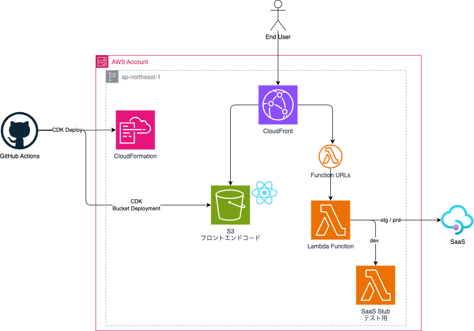
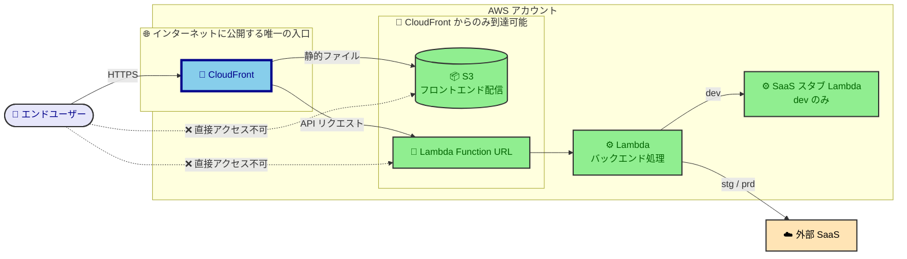
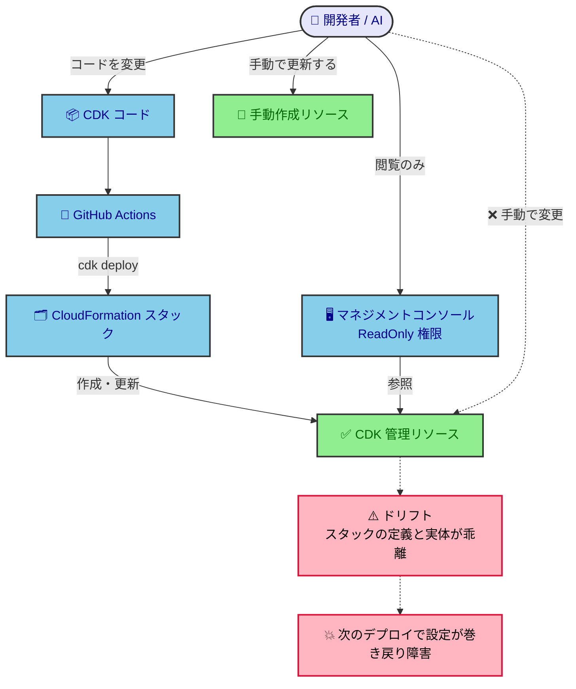
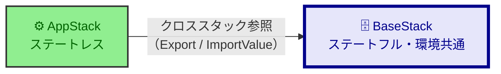
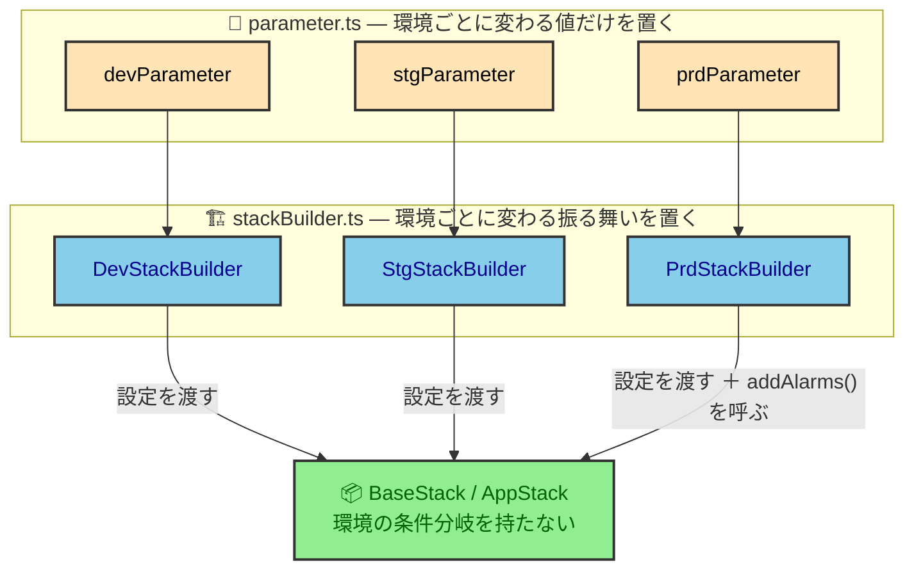

# インフラ設計

AWS/IaC で構築したインフラを変更・レビューする開発者／AI が、現在のインフラ構成概要と、なぜこの構成なのかを知りたいときに参照する。  
リソースの個別設定・具体値は `infra/` 配下の CDK コードが正であり、本書はそこから読み取れない全体像と理由を書く。

## 基本方針

### サーバレスなインフラアーキテクチャ

**運用に人手をかけないこと**を最優先し、常時稼働のサーバを持たないサーバレス構成で組む。

| 設計ポイント                         | 方針                                                      | なぜ                                                                                                 |
| ------------------------------------ | --------------------------------------------------------- | ---------------------------------------------------------------------------------------------------- |
| サーバとネットワークをどこまで持つか | 常時稼働のサーバと VPC を持たず、サーバレス中心で構成する | パッチ適用・キャパシティ管理・ネットワーク保守がまとめて不要になり、少人数で運用できる               |
| 外部 SaaS への依存をどう断つか       | dev では SaaS を自前のスタブに差し替える                  | 本物の SaaS はテストのたびに会社間の調整と検証環境の空き待ちが要る。人の手配待ちを開発の経路から外す |

### 壊さずに変え続けられる IaC

**壊さずに変え続けられること**を最優先し、すべてのリソースを CDK で構築・運用する。

| 設計ポイント                     | 方針                                                                   | なぜ                                                                                                        |
| -------------------------------- | ---------------------------------------------------------------------- | ----------------------------------------------------------------------------------------------------------- |
| 手動操作をどこまで許すか         | CDK 管理下のリソースは手で変えない。コンソールは閲覧のみにする         | 手で変えるとスタックの定義と実体が乖離（ドリフト）し、次のデプロイで手を入れた設定が巻き戻って障害になる    |
| 消してはならないものをどう守るか | ステートフル・環境共通のリソースを別スタックに分け、依存を一方向にする | ライフサイクルの違うものを同居させると、作り直したいときに消せないものが巻き添えになる                      |
| 環境差分をどこに置くか           | 差分は設定と Builder 層に集約し、Stack 内に環境の条件分岐を作らない    | 分岐があると Stack を読んでも「どの環境で何ができるか」が分からず、`cdk diff` の結果も予測できない          |
| デプロイ対象をどう選ぶか         | スタック名の接頭辞に環境名まで含める                                   | 接頭辞のワイルドカードで環境単位にまとめてデプロイできる。1つずつ指定すると指定漏れがそのまま取り残しになる |

## アーキテクチャ概要

### 全体インフラ構成図



### アカウントと環境構成

1つのアカウントには1つの環境だけを置く。

| アカウント名   | 環境名 | 主な用途                                 |
| -------------- | ------ | ---------------------------------------- |
| 開発アカウント | dev    | CDKデプロイ確認・チーム内部結合テスト    |
| 検証アカウント | stg    | 外部システムとの結合テスト・リリース判定 |
| 本番アカウント | prd    | プロダクション                           |

### ネットワーク構成図

VPC は作らない。エンドユーザーはすべてCloudFront経由でアクセスさせる。



### 設計判断とその理由

| タイトル           | 設計判断                                                                                      | 理由                                                                                                                              |
| ------------------ | --------------------------------------------------------------------------------------------- | --------------------------------------------------------------------------------------------------------------------------------- |
| バックエンド API   | ゲートウェイとして API Gateway ではなく Lambda Function URLs を使う                           | API Gateway 特有の変換処理・APIキー管理・使用量プランがいずれも不要で、機能過剰と判断した                                         |
| フロントエンド配信 | React のビルド成果物を S3 に置き、CloudFront から配信する                                     | 静的ファイルの配信にサーバは要らない。API も同じ CloudFront から返すため、画面と API が同一オリジンになり CORS の設定が不要になる |
| 公開する入口       | 外部に公開するのは CloudFront だけとし、S3 と Function URL には CloudFront からのみ到達させる | 入口が1つなら、アクセス制御・ログ・WAF をそこに集約できる。バケットの直参照や Function URL の直叩きという抜け道も塞げる           |

## 運用監視

何を監視項目にし、どこにしきい値を置くかの考え方は [monitoring-policy](../../../docs/policy/monitoring-policy.md) が持つ。本書は全体像だけを示す。


アラーム通知を prd だけで有効にするのは、行動につながらない通知を増やさないためである。dev / stg の異常はデプロイした本人が見ており、呼び出す相手がいない。

## 重要なポイント

| ポイント                                                               | なぜ                                                                                                                                              |
| ---------------------------------------------------------------------- | ------------------------------------------------------------------------------------------------------------------------------------------------- |
| dev では SaaS を呼ばず、同じインターフェースを返すスタブ Lambda を呼ぶ | インターフェースを本物と揃えるのは、アプリ側に環境ごとの分岐を持ち込まないため。揃っているので、CI/CD の自動結合テストを dev だけで完結させられる |

## IaC 管理方針

原則としてすべてのリソースを CDK で構築・運用する。手動で作成せざるを得なかったリソースだけが手動更新の対象で、それ以外の手動操作は禁止する。

**ドリフト**とは、CloudFormation スタックが持つ定義と、実際にプロビジョニングされた設定の乖離である。



### 手動作成リソース一覧

| リソース        | 作成主体 | 手動作成の理由                                                                                                 |
| --------------- | -------- | -------------------------------------------------------------------------------------------------------------- |
| Secrets Manager | 自チーム | CDK コードに秘匿情報を書くと公開することになるため。手動で Secret を登録し、CDK からはキーを参照するだけにする |

## スタック設計

### スタック関係図

BaseStack はそれぞれの環境で共通のリソースとステートフルなリソースを、AppStack はアプリケーション実行のメインリソース（ステートレスなもののみ）を持つ。



依存の向きは AppStack → BaseStack の一方向である。BaseStack が公開した L2 オブジェクトを StackBuilder が AppStack へ props で渡し、CloudFormation 上はクロススタック参照（Export / ImportValue）になる。この向きがデプロイと削除の順序も決める——作るときは BaseStack が先、消すときは AppStack が先。

### スタック命名規約

デプロイ時にスタック名で対象を選ぶため、命名は接頭辞から決める。

```plaintext
{システム識別子}-{環境名(dev / stg / prd)}-{スタック固有名称}-stack
```

例：`cdk deploy 'pdd-dev-*'` で dev 環境のスタックをまとめてデプロイする。

### 環境差分の実装設計



値の差分は `parameter.ts` に、振る舞いの差分は Builder が呼ぶ Stack の public メソッドに置く。判断軸そのものは [cdk-design-policy](../../../docs/policy/cdk-design-policy.md) が持つ。

## 組織の制約

### リソース命名

組織が課す命名規約はなし。CDK のベストプラクティスに従い、原則としてリソース名は指定せず CDK の生成に任せる。ただし CLI から名前で呼び出したい場合など、名前があった方がよいリソースにだけ、スタック名を接頭辞にした名前を付ける。スタック名を接頭辞にするのは、スタックを複製したときの名前衝突を避けるためである。

### タグ規則

タグ機能を持つすべてのリソースに次のタグを付ける。

| タグkey | value |
| ------- | ----- |
| System  | pdd   |

### その他の制約

なし（暗号化・リージョンについて組織から課されているルールは無い）。

## 前提と制約

| 前提・制約                     | 内容                                                                                             |
| ------------------------------ | ------------------------------------------------------------------------------------------------ |
| スタブと本物の SaaS がずれる   | dev を通った変更が stg 以降で落ちうる。SaaS 側の仕様変更にスタブを追従させる責任はこちら側にある |
| dev / stg でアラームが鳴らない | 通知先を prd にしか置かないため、dev / stg の異常はデプロイした本人が気づくしかない              |
